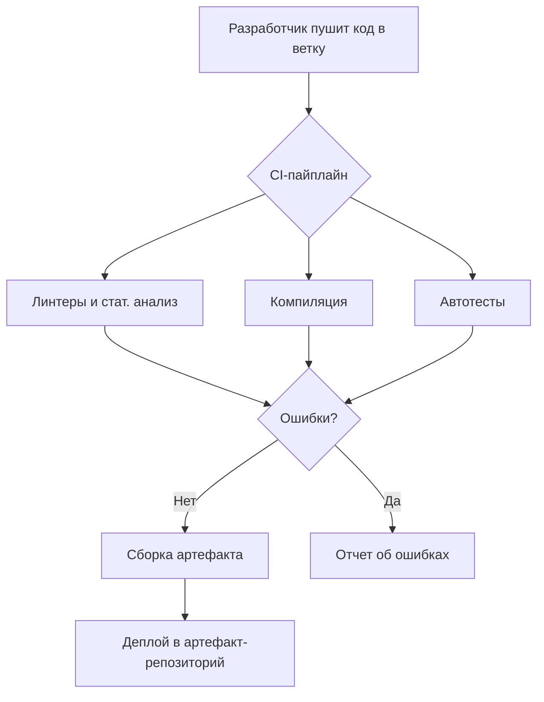

# CI (Continuous Integration) в разработке:

#### **1. Разработчик загружает код в отдельную ветку**
- Создается **feature-ветка** (например, `feature/auth-login`)    
- Код пушится в Git (GitHub/GitLab/Bitbucket)    
	
#### **2. Запускается CI-пайплайн**
Автоматически выполняются этапы:
1. **Линтеры и статический анализ кода**    
    - Проверка стиля (`Checkstyle`, `PMD`)        
    - Поиск уязвимостей (`SonarQube`, `SpotBugs`)        
    - Анализ зависимостей (`OWASP Dependency Check`)
    
2. **Компиляция кода**    
    - Сборка проекта (`Maven`/`Gradle`)        
    - Проверка на ошибки компиляции
    
3. **Запуск автотестов**    
    - Юнит-тесты (`JUnit`, `TestNG`)        
    - Интеграционные тесты (`Spring Boot Test`)        
    - Проверка покрытия кода (`JaCoCo` – минимум 80%)
    
4. **Сборка и загрузка артефакта**    
    - Создание **JAR/WAR-файла**        
    - Загрузка в **артефакт-репозиторий** (Nexus, Artifactory)        
    - Генерация **Docker-образа** (если используется контейнеризация)
    

---
### **📌 Схема CI-процесса**



---

### **🔧 Пример настройки CI (GitHub Actions)**

```yaml
name: Java CI
on: [push]
jobs:
  build:
    runs-on: ubuntu-latest
    steps:
      - uses: actions/checkout@v4
      - name: Set up JDK
        uses: actions/setup-java@v3
        with:
          distribution: 'temurin'
          java-version: '17'
      - name: Run Checkstyle
        run: mvn checkstyle:check
      - name: Build and test
        run: mvn package
      - name: Upload Artifact
        uses: actions/upload-artifact@v3
        with:
          name: app.jar
          path: target/*.jar
```

---
### **🚀 Что делать при ошибках?**

- **Линтеры/компиляция**: Исправить код согласно отчету.    
- **Тесты**: Локально запустить `mvn test` перед пул-реквестом.    
- **Артефакты**: Проверить логи сборки (`target/` или `build/`).    

Такой CI-процесс гарантирует, что в **main-ветку** попадает только проверенный код.


