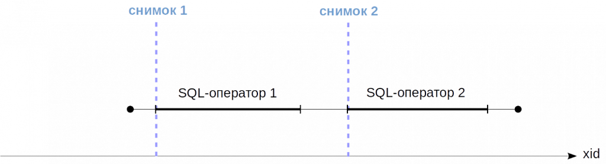
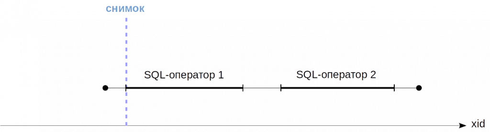
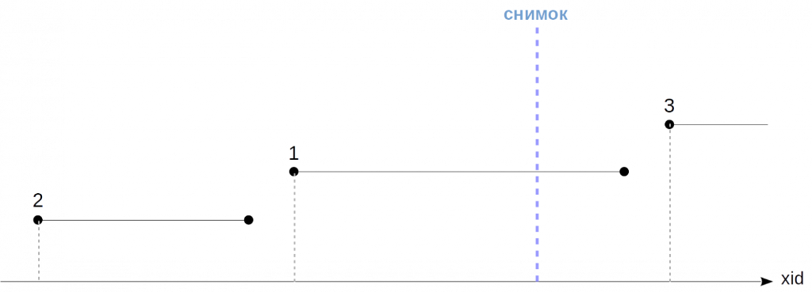

Конспект по материалам статьи: [ссылка]([https://habr.com/ru/companies/postgrespro/articles/445820/](https://habr.com/ru/companies/postgrespro/articles/446652/)

---
## 🎯 Введение: Что такое **Снимок** (*Snapshot*)?

**Главная мысль:** Это не физическая копия данных. Это **набор правил** (*3 числа*), который позволяет "*отсеять*" ненужные версии строк.

> 1. **`xmin` (Нижняя граница):** Самый старый ID активной транзакции в этот момент.
> 2. **`xmax` (Верхняя граница):** ID первой «будущей» транзакции, которой еще нет.
> 3. **`xip` (Черный список):** Список ID активных, еще не завершенных транзакций.

По сути, это "*очки*", через которые транзакция смотрит на таблицу.

> 1. **Смотрю на `xmin` (*Кто создал строку*):**    
>     - ❌ Если `xmin` **>= `xmax`** (*то есть ID создателя из будущего*) — 
> 	      **не вижу** (*этих данных еще не было в момент моего рождения*).
>     - ❌ Если `xmin` **лежит в списке `xip`** (*создатель еще активен*) — 
> 	      **не вижу** (*это чужой незавершенный черновик*).
>     - ✅ Если `xmin` **< `xmin`** (*старый, уже точно завершен*) — 
> 	      **иду дальше, строка потенциально видна.**
>        
> 2. **Смотрю на `xmax` (*Кто удалил строку*):**
>     - ✅ Если `xmax == 0` (*никто не удалял*) — 
> 	      **строка видна!**
>     - ✅ Если `xmax` **>= `xmax`** (*удалитель из будущего*) — 
> 	      удаление пока не видно, **строка видна!** (*я еще не знаю, что ее удалят*).
 >    - ❌ Если `xmax` **уже завершен и меньше текущего момента** — 
 > 	      удаление уже видно, **строку игнорирую.**

---
## ⏱ Время жизни снимка (*Очень важно*!)

Здесь кроется главное отличие уровней изоляции:

- **READ COMMITTED:** Снимок создается **заново для каждого запроса** (`SELECT`, `UPDATE`) внутри транзакции.
	    
    - _Как сказать:_ "Каждый раз, как ты моргаешь, ты видишь мир заново". Увидишь новые коммиты.

	
- **REPEATABLE READ / SERIALIZABLE:** Снимок создается **один раз** в начале **первого** запроса и живет до конца транзакции.
	    
    - _Как сказать:_ "Ты сделал фото в начале разговора и смотришь только на него, даже если вокруг все изменилось".

---
## 🧠 Как устроен Снимок внутри? (*3 цифры*)

Запомни эту структуру как формат записи: `xmin:xmax:xip`.

Снимок хранит всего **три** параметра (*источник: функция `txid_current_snapshot()`*):
	
1. **`snapshot.xmin`** (Старейший активный ID): Номер самой "старой" транзакции, которая **все еще активна** (не завершена) на момент создания снимка.
    
2. **`snapshot.xmax`** (Граница будущего): **Минимальный** номер транзакции, которой **еще не существует** в системе (то есть первый "будущий" ID).
    
3. **`snapshot.xip`** (Список активных): Массив ID всех транзакций, которые активны прямо сейчас, **кроме** `xmin` (если он там есть, для простоты считаем, что это список "плохих" ребят).

---
## 🚦 Правила видимости (*Самый сок!*)

Как транзакция решает, видеть строку или нет? Смотрит на `xmin` и `xmax` версии строки:

- **Строка видна**, если **ЕЕ `xmin`** попадает в "зеленую зону", а **ЕЕ `xmax`** не попадает:
	    
    - `xmin` должен быть **< `snapshot.xmax`** (транзакция не из будущего).
        
    - `xmin` **НЕ должен** быть в списке `xip` (она уже закоммитилась, а не активна).
        
    - `xmax` должен быть `= 0` (не удалена) **ИЛИ** `xmax` должен быть **> `snapshot.xmax`** или в списке `xip` (удалившая транзакция еще активна/из будущего, значит удаление не видно).

> Здесь:  
> - изменения транзакции `2` **будут** видны, потому что она завершились до создания снимка,
> - изменения транзакции `1` **НЕ будут** видны, потому что она была активна на момент создания снимка,
> - изменения транзакции `3` **НЕ будут** видны, потому что она начались позже создания снимка (не важно, закончилась она или нет).

**Лайфхак для запоминания на собесе:**  
_Транзакция видит только то, что было закоммичено **ДО** создания снимка, и не видит того, что началось **ПОСЛЕ** или еще не завершено._

---
## 📖 Живой пример из статьи (*Расскажи эту историю!*)

Представь, что мы создали снимок в момент, когда **TxID = 3696**:
	
1. **Строка 1 (xmin = 3695):** Добавлена до снимка, но **еще не закоммичена**. 
   При создании снимка она была в списке `xip` (*активных*).
	    
    - _Результат:_ **НЕ ВИДНА** (*мы не видим чужой грязный черновик*).
    
2. **Строка 2 (xmin = 3696):** Добавлена **до** снимка и уже **закоммичена**.
	    
    - _Результат:_ **ВИДНА** (*это нормальные данные*).
    
3. **Строка 3 (xmin = 3697):** Добавлена **после** создания снимка. 
   Её ID больше `snapshot.xmax`.
	    
    - _Результат:_ **НЕ ВИДНА** (*мы не видим будущего*).

---
## 🧩 Нюанс про собственные изменения (`cmin`/`cmax`)

Это важно для случаев, когда ты внутри одной транзакции вставил строку, открыл курсор, а потом вставил еще одну.  
Чтобы транзакция случайно не увидела вторую строку в курсоре, используется поле `cmin` (Command ID).  
Снимок запоминает не только ID транзакции, но и "порядковый номер команды". Строки с `cmin >= текущему_номеру_команды` внутри одной транзакции не видны.

---
## ⛔ Почему в PostgreSQL нет "Flashback Query"  (запроса в прошлое)?

Почему нельзя сделать `SELECT * FROM table AS OF 5 minutes ago`?  
**Потому что:** Мы не знаем, какие транзакции были активны 5 минут назад (`xip`). Мы запоминаем этот список только в момент создания текущего снимка. Обратно во времени мы не умеем.

---
## 🏔 "Горизонт событий" (*Transaction Horizon*)  — Твой главный враг

Это самый частый вопрос на собеседовании: _"Почему у меня таблица раздувается и не чистится VACUUMом?"_
	
- **Что это?** Это **самый старый** `xmin` из всех активных снимков/транзакций в базе.
    
- **Правило:** `VACUUM` **НЕ МОЖЕТ** удалить мертвые строки, чей `xmin` **старше** этого горизонта. Почему? Вдруг той старой транзакции, которая висит уже 2 часа, понадобится эта старая версия!
    
- **Последствие (Беда):** Если ты забыл закоммитить транзакцию в своем приложении (или держишь открытый курсор), горизонт событий не сдвигается. База данных перестает чистить мусор и начинает бесконтрольно расти (`Bloat`).

#### **Как бороться:**
- Настрой `idle_in_transaction_session_timeout` — чтобы сервер сам убивал "зависшие" транзакции.
    
- Настрой `old_snapshot_threshold` — чтобы сервер удалял строки даже под риском ошибки у старой транзакции (выдаст `snapshot too old`).

---
## 🤝 Экспорт снимков (*pg_export_snapshot*)

- **Зачем:** Чтобы две параллельные транзакции (например, в утилите `pg_dump`) видели **абсолютно одну и ту же** картину мира, даже если они стартовали в разное время.
    
- **Как:** Одна транзакция делает `SELECT pg_export_snapshot()` и передает эту строку (например, `00000004-00000E7B-1`) другой транзакции через канал связи. Вторая делает `SET TRANSACTION SNAPSHOT '...'`.

---
## 🔥 Шпаргалка для ответа  (*Структура твоего монолога*)

1. **Скажи:** "Снимок — это не копия данных, а набор чисел: `xmin` (самый старый активный), `xmax` (первый будущий) и `xip` (активные)".
    
2. **Покажи логику:** "Строка видна, если ее `xmin` закоммичен и меньше `xmax`, и не видна, если ее `xmin` в списке `xip` или больше `xmax`".
    
3. **Вспомни про время жизни:** "В `Read Committed` снимок живет один запрос, в `Repeatable Read` — всю транзакцию".
    
4. **Ударь в боль (Горизонт):** "И главное, что надо помнить: если я открою транзакцию и забуду ее закрыть, я сдвину `xmin` (горизонт) всей базы, и `VACUUM` не сможет чистить мертвые строки. Это приведет к раздутию таблиц".

---
