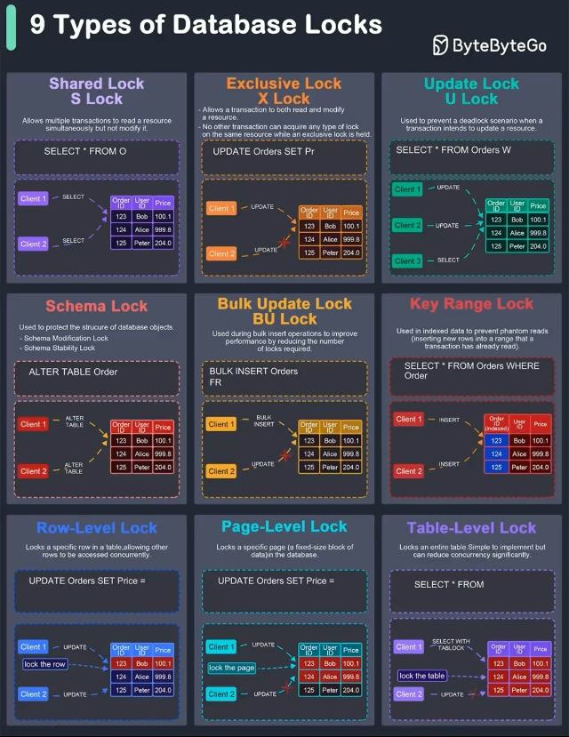

#  **Блокировки баз данных**: ключевые различия

**Блокировка** — временное ограничение на выполнение некоторых операций обработки данных. Она предотвращают одновременный доступ к данным для обеспечения целостности и консистентности данных.

  

###  Основные типы:
 **Shared Lock**: позволяет нескольким транзакциям одновременно читать ресурс, но не модифицировать его  
 **Exclusive Lock**: позволяет транзакции как читать, так и модифицировать ресурс  
 **Update Lock**: используется для предотвращения взаимоблокировки, когда транзакция намеревается обновить ресурс  
 **Schema Lock**: используется для защиты структуры объектов базы данных  
 **Bulk Update Lock**: используется во время массовых вставок  
 **Key-Range Lock**: используется в индексированных данных для предотвращения фантомных чтений  
 **Row-Level Lock**: блокирует конкретную строку в таблице  
 **Page-Level Lock**: блокирует конкретную страницу (фиксированный блок данных) в базе данных  
 **Table-Level Lock**: блокирует всю таблицу

---
