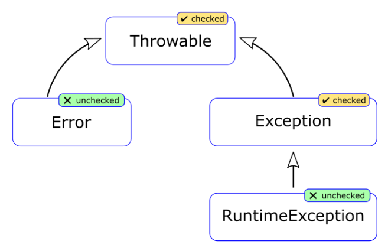

```
Throwable (checked) — базовый класс всех исключений и ошибок.
├── Error (unchecked) — критические ошибки JVM.
│ ├── OutOfMemoryError
│ ├── StackOverflowError
│ └── InternalError
└── Exception (checked) — ошибки, зависящие от программы.
├── RuntimeException (unchecked) — ошибки в логике программы.
│ ├── NullPointerException
│ ├── IndexOutOfBoundsException
│ ├── ArithmeticException
│ └── ClassCastException
└── Checked Exceptions (checked) — требуют обработки.
├── IOException
├── SQLException
└── ReflectiveOperationException
```