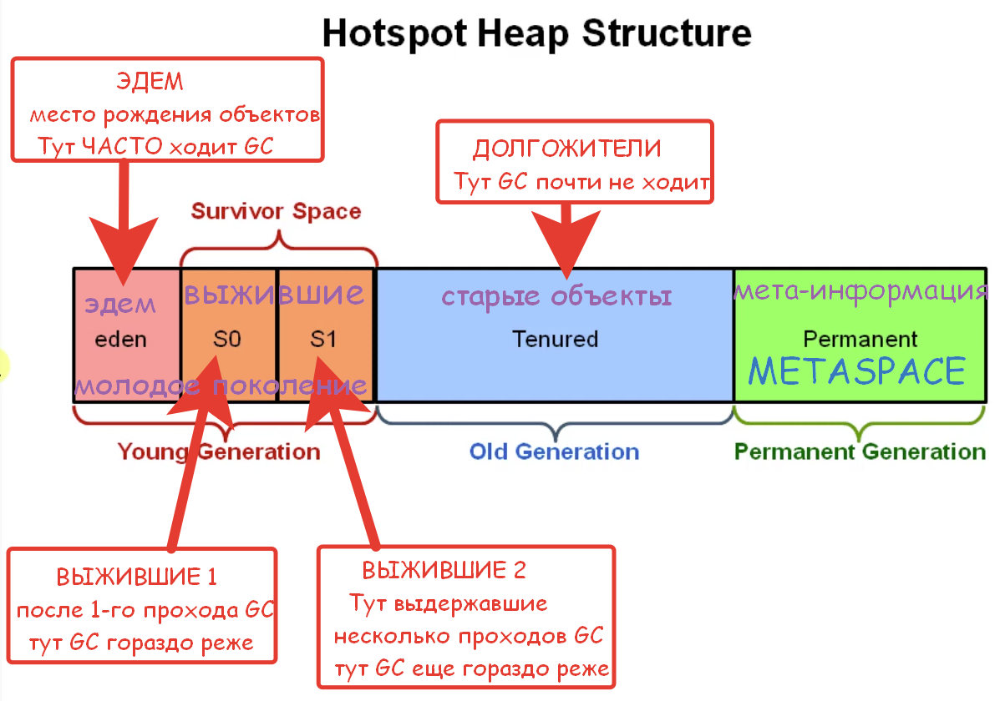

# Что такое **сборщик мусора**? (Garbage Collector)  
**Сборщик мусора (Garbage Collector, GC)** — это автоматический механизм управления памятью в Java, который определяет неиспользуемые объекты и освобождает занимаемую ими память.   
Сборка мусора в большинстве алгоритмов выполняется с кратковременной паузой **Stop-The-World (STW)**, временно останавливающей работу приложения для безопасной очистки памяти.  

### 🔹 Как GC определяет «мусор»?  
Существует **два основных** подхода к поиску неиспользуемых объектов:  
1. **Учет ссылок (*Reference Counting*)**    
    - **Суть:** Каждый объект имеет счетчик. Он увеличивается при создании новой ссылки на объект и уменьшается при её уничтожении. Если счетчик равен нулю — объект считается мусором.  
        
    - **❌ Минус:** Не решает проблему циклических ссылок, когда два объекта ссылаются друг на друга, но недоступны извне, что приводит к утечке памяти.
    
2. **Трассировка *(Tracing GC, используется в HotSpot JVM*)**    
    - **Суть:** GC ищет «живые» объекты, начиная от корневых точек (**GC Roots**). Всё, до чего невозможно добраться по цепочке ссылок от корня, считается мусором и удаляется.  
        
    - **Корневые точки (GC Roots) включают:**        
        - Объекты в статических полях классов.  
        - Объекты, доступные из стеков живых потоков.      
        - Объекты из JNI (*Java Native Interface*) ссылок в native-коде.  

### 🔹 Структура памяти (Heap Generations)
Куча (Heap) разделена на поколения по принципу «большинство объектов умирают молодыми»:  
	
1. **Young Generation (*Молодое поколение*)** — для короткоживущих объектов. Разделено на три области:    
    - **Eden Space (`Эдем`)** — здесь создаются абсолютно все новые объекты.
        
    - **Survivor Spaces (`S0`, `S1` или `From`, `To`)** — области, куда перемещаются объекты, выжившие после очистки Eden.
    
2. **Old Generation (Старое поколение / Tenured)** — содержит долгоживущие объекты, которые успешно перенесли несколько сборок мусора в *Young Generation*.
    
3. **Metaspace (*начиная с Java 8*)** — системная область для хранения метаданных классов, информации о загрузчиках и статических полях. 
   _Примечание: В Java 6–7 использовалась область PermGen (Permanent Generation), расположенная внутри кучи, но она была полностью удалена в Java 8._


### 🔹 Основные типы сборки мусора
- **Minor GC (*малый*)** — очищает только <u>молодое</u> поколение (`Eden` и `Survivor`).
    - Работает часто и быстро.
        
    - Приложение приостанавливается на время сборки (**Stop-the-World**).
        
    - «Живые» объекты из `Eden` и области `From` перемещаются в область `To` (или в `Old Gen`, если они достигли определенного возраста). `Eden` и `From` полностью очищаются, а `To` и `From` меняются местами.
    
- **Major GC (*старый*)** — чистит <u>старое</u> поколение (`Old Gen`).
    - Работает реже, но длится дольше, так как затрагивает старшие объекты.
        
    - Включает процедуру **уплотнения (*компактизации*) памяти**, при которой живые объекты сдвигаются в начало области, оставляя непрерывный кусок свободной памяти в конце.
    
- **Full GC (полный)** — очищает абсолютно всю кучу (`Young` + `Old Gen`).
    - Самая тяжелая, долгая и затратная операция, полностью останавливающая приложение (**Stop-the-World**).
        
    - Обычно запускается <u>при критической нехватке памяти</u> в куче.

### 🔹 Эволюция и виды сборщиков мусора (*GC*)
**Историческая цепочка:** 
`Serial` (*Java 1.3*) → `Parallel` (*Java 1.4*) → `CMS` (*Java 1.4.1*) → `G1` (*Java 7*)
	
- **Serial GC** — однопоточный сборщик с полной остановкой приложения (STW). Подходит для маленьких приложений со скромными требованиями. Может включаться по умолчанию на слабых машинах.
    
- **Parallel GC** — многопоточная версия Serial GC. Ориентирован на максимальную пропускную способность (Throughput) больших приложений, где задержки из-за пауз STW не критичны.
    
- **CMS (*Concurrent Mark Sweep*)** — нацелен на снижение задержек. Выполняет основную часть работы (*маркировку и очистку*) <u>параллельно</u> с выполнением приложения, минимизируя паузы.
    
- **G1 GC (*Garbage-First*)** — современный сборщик, созданный для замены CMS. Делит кучу на множество независимых регионов и в первую очередь очищает те из них, где скопилось больше всего мусора. Эффективно балансирует между высокой пропускной способностью и низкими задержками.

### 📊 Сводная таблица эволюции *Garbage Collectors*
_Данные актуализированы с учетом последних LTS-релизов Java на 2026 год (включая изменения в Java 9, 11, 17, 21)._

| **Версия Java** | **Название GC****                 | **Год ввода** | **Год устарения / удаления**                                     | **Краткое описание**                                                                                                                                                    |
| --------------- | --------------------------------- | ------------- | ---------------------------------------------------------------- | ----------------------------------------------------------------------------------------------------------------------------------------------------------------------- |
| **Java 1.3**    | **Serial GC**                     | 2000          | —                                                                | Однопоточный сборщик для малых систем. До сих пор используется для экономии ресурсов в CLI-утилитах и Docker-контейнерах с 1 CPU.                                       |
| **Java 1.4**    | **Parallel GC**                   | 2002          | —                                                                | Многопоточный сборщик для достижения максимальной пропускной способности. Был дефолтным в Java 7 и 8.                                                                   |
| **Java 1.4.1**  | **CMS** _(Concurrent Mark Sweep)_ | 2002          | Устарел в Java 9 (2017)<br><br>  <br><br>Удален в Java 14 (2020) | Первый сборщик с низкими задержками, работающий параллельно с приложением. Страдал от высокой фрагментации памяти.                                                      |
| **Java 7**      | **G1 GC** _(Garbage-First)_       | 2012          | —                                                                | Сборщик на основе регионов памяти. Сбалансирован по паузам и пропускной способности. Стал сборщиком по умолчанию, начиная с Java 9.                                     |
| **Java 11**     | **Epsilon GC**                    | 2018          | —                                                                | Пассивный («пустой») сборщик мусора. Выделяет память, но никогда её не чистит. Нужен для стресс-тестов производительности и ультра-коротких задач.                      |
| **Java 11**     | **ZGC** _(Z Garbage Collector)_   | 2018          | —                                                                | Масштабируемый сборщик ультра-низких задержек (паузы < 1 мс). Стал стабильным (production-ready) в Java 15, а в Java 21 получил поддержку поколений (Generational ZGC). |
| **Java 12**     | **Shenandoah GC**                 | 2019          | —                                                                | Альтернативный сборщик со сверхнизкими паузами. Выполняет уплотнение (компактизацию) памяти одновременно с работой потоков приложения. Развивается силами Red Hat.      |

---


---
Сборка мусора выполняется с кратковременной паузой **Stop-The-World** (_STW_), временно останавливающей приложение.

[Статья: **_"Garbage Collection и JVM"_** на `habr.com`](https://habr.com/ru/companies/otus/articles/776342/)

```
***** из методички *****
 
"Сборщик мусора выполняет две задачи:
- поиск мусора;
- очистка мусора.

Для обнаружения мусора есть два подхода:"
- Учет ссылок (Reference counting);
"Учет ссылок - если обьект не имеет ссылок, он считается мусором.
Проблема - не возможность выявить циклические ссылки, когда два обьекта не имеют внешних ссылок, 
но ссылаются друг на друга -> утечка памяти"
- Трассировка (Tracing). (используется в HotSpot)6
"Трассировка - до обьекта можно добраться из Корневых точке (GC root). 
До чего добраться нельзя - мусор.
Всё, что доступно из «живого» объекта, также является «живым»."
Типы корневых точек (GC Roots) java приложения:
- объекты в статических полях классов
- объекты, доступные из стека потоков
- объекты из JNI(java native interface) ссылок в native методах"
"Процессы сборки мусора разделяются несколько видов:
minor GC (малая) - частый и быстрый, работает только с областью памяти ""young generation"";
- приложение приостанавливается на начало сборки мусора (такие остановки называются stop-the-world);
- «живые» объекты из Eden перемещаются в область памяти «To»;
- «живые» объекты из «From» перемещаются в «To» или в «old generation», если они достаточно «старые»;
- Eden и «From» очищаются от мусора;
- «To» и «From» меняются местами;
- приложение возобновляет работу.
major GC (старшая) - редкий и более длительный, затрагивает объекты старшего поколения.
В принцип работы «major GC» добавляется процедура «уплотнения», 
позволяющая более эффективно использовать память. 
В процедуре живые объекты перемещаются в начало. Таким образом, мусор остается в конце памяти.
full GC (полная) -  полный сборщик мусора сначала запускает Minor, 
а затем Major (хотя порядок может быть изменен, 
если старое поколение заполнено, и в этом случае он освобождается первым, 
чтобы позволить ему получать объекты от молодого поколения).
```
