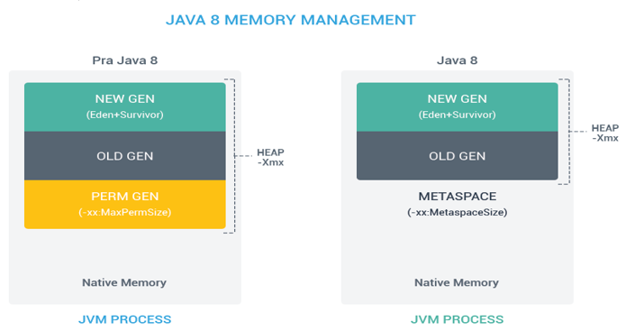

# **Stack** и **Heap**

---
## 🔹 **Stack** (*Стек*)
Используется для хранения фреймов потока (*stack frames*), работает по схеме **LIFO** (*Last In, First Out*). <u>Каждому потоку выделяется свой собственный стек</u>.
	
- **Содержит:** 
	- параметры вызываемых методов, 
	- локальные переменные и 
	- указатели на фреймы.
    
- **Особенности:** 
	- Размер стека значительно меньше кучи, но доступ к нему осуществляется намного быстрее. 
	- Управляется флагом `-Xss`.
    
- **Ошибка памяти:** `StackOverflowError` (*например, при бесконечной рекурсии*).

---
## 🔹 **Heap** (*Куча*)
Область для динамического выделения памяти под объекты во время выполнения приложения. Хранится, как и стек, в оперативной памяти (RAM).
	
- **Содержит:** Все создаваемые объекты (*их переменные экземпляра и массивы*). При этом <u>ссылки</u> на эти объекты хранятся <u>в стеке</u>.
    
- **Особенности:** 
	- Объекты в куче имеют глобальный доступ и могут быть получены из любого места программы (*если есть ссылка*). 
	- Структура и логика очистки Heap напрямую зависят от выбранного сборщика мусора (`Serial`, `Parallel`, `G1`, `ZGC`).
    
- **Размеры кучи по умолчанию:** * Начальный размер (`-Xms`) $\approx$ 1/64 от физической памяти машины.    
    - Максимальный размер (`-Xmx`) $\approx$ 1/4 от физической памяти машины.
    
- **Ошибка памяти:** `OutOfMemoryError: Java heap space` (*когда куча переполнена и GC не может освободить место*).    

## 💡 Разделение кучи на поколения (*Heap Generations*)
	
- **Young Generation (Молодое поколение)** — область, где размещаются недавно созданные объекты. Когда она заполняется, происходит быстрая и частая сборка мусора — **Minor GC**.
    
- **Old (*Tenured*) Generation (*Старое поколение*)** — здесь хранятся долгоживущие объекты. Когда объекты из *Young Generation* переживают определенное количество сборок мусора (*порог «возраста»*), они перемещаются сюда. Очищается с помощью **Major GC / Full GC**.

## 🏛 Эволюция областей метаданных: <br>**PermGen** vs **Metaspace**

### ✅ **PermGen** (*Permanent Generation*) — _до Java 8_  
Специальная область памяти, которая являлась частью кучи (*Heap*), но была отделена от её основной 'жилой' части.
- **Что хранила:** 
	- Метаданные загруженных классов, 
	- данные о байткоде, 
	- JIT-информацию, 
	- статические переменные и 
	- интернированные строки (`String Pool`).
    
- **Размеры по умолчанию:** 
	- Для 32-битной JVM — 64 Мб, 
	- для 64-битной — 82 Мб. 
		  Настраивалась флагами `-XX:PermSize` и `-XX:MaxPermSize`.
    
- **❌ Минус:** Из-за фиксированного ограниченного размера *PermGen* часто переполнялась, вызывая критическую ошибку `java.lang.OutOfMemoryError: PermGen space`.

### ✅ **Metaspace** — _начиная с Java 8_  
Новая область памяти, которая полностью заменила собой устаревшую *PermGen*.

- **Главное отличие:** Она была вынесена из Java Heap и теперь выделяется напрямую из **native memory** (*основной системной памяти ОС*).
    
- **Что хранит:** 
	- Метаданные классов, 
	- аннотации, 
	- метод-данные и 
	- байткод.
    
>    - _Важно знать для собеседования:_ **Статические поля классов** и **`String Pool`** при этом переехали **в основную кучу** (*Heap*), а не в *Metaspace*.
    
- **Преимущества и управление:**
    - По умолчанию *Metaspace* динамически расширяется **автоматически**, ограничиваясь лишь объемом всей доступной оперативной памяти машины.
        
    - Верхние и нижние границы можно жестко задать вручную при помощи флагов `-XX:MetaspaceSize` и `-XX:MaxMetaspaceSize`.
        
    - Процесс очистки памяти улучшился: GC автоматически инициирует выгрузку неиспользуемых классов и очистку метаданных, когда заполняются установленные пороги пространства.


---
## Что и куда переехало в **Java 8**+?
Раньше в **PermGen** (который был частью Heap) хранилось вообще всё: и метаданные, и статика, и пулы строк. В Java 8 разделение произошло следующим образом:
1. **В Metaspace (Native Memory) ушли ТОЛЬКО метаданные:**    
    - Структура классов (методы, поля, константы класса).        
    - Информация о загрузчиках классов (`ClassLoaders`).        
    - Аннотации и байткод методов.
    
2. **В обычную Кучу (Heap) переехали:**    
    - **Статические переменные** 
	      (*точнее, сам объект `java.lang.Class`, который их содержит*).
        
    - **String Pool** (пул интернированных строк). _На самом деле, пул строк переехал в Heap еще в Java 7, но в Java 8 это закрепилось окончательно._

### Почему статика лежит в Heap? (*Техническое объяснение*)
В Java всё является объектом. Когда JVM загружает класс (например, `User`), она создает в куче специальный объект типа `java.lang.Class<User>`.
	
- **Метаданные** (как устроен класс `User`, какие у него есть методы) — это чисто системная информация для самой JVM, она лежит в **Metaspace**.
    
- **Статические поля** класса `User` — это, по сути, **поля самого объекта `java.lang.Class<User>`**, который живет в **Heap**.

Если статический примитив (`static int count = 10`) или статическая ссылка (`static User instance = new User()`) привязаны к объекту `Class`, то они обязаны лежать там же, где и сам этот объект — то есть в куче (Heap).

### Почему это было сделано?
Основная причина — **упрощение сборки мусора (Garbage Collection)**. Статические объекты и строки могут создаваться и умирать в процессе работы приложения. Если бы они лежали в Metaspace, сборщику мусора приходилось бы постоянно сканировать системную native-память, что сильно усложняло и замедляло алгоритмы. Оставив в Metaspace только неизменяемые структуры классов, разработчики JVM сделали сборку мусора гораздо эффективнее.

---
```
***** из методички *****
Память процесса делится на Stack (стек) и Heap (куча) :
- Stack содержит staсk frame'ы, они делятся на три части: 
    * параметры метода,   
    * указатель на предыдущий фрейм    
    * и локальные переменные.

- Структура Heap зависит от выбранного 
    сборщика мусора. Читай про GC!

* MetaSpace - специальное пространство кучи, отделенное от кучи основной памяти. 
    JVM хранит здесь весь статический контент. 
    Это включает в себя все статические методы, 
    примитивные переменные и ссылки на статические объекты. 
    Кроме того, он содержит данные о байт-коде, 
    именах и JIT-информации. 
    До Java 7 String Pool также был частью этой памяти. 

Вкратце, при Serial/ Parallel/ CMS GC будет следующая структура:

А при G1 GC:
С помощью опций Xms и Xmx можно настроить 
начальный и максимально допустимый размер кучи. 
Существуют опции для настройки величины стека.

- Heap - используется всем приложением, 
    Stack - одним потоком исполняемой программы.
- Новый обьект создается в heap, 
    в stack размещается ссылка на него. 
    В стеке размещаются локальные переменные примитивных типов. 
- Обьекты в куче доступны из любого места программы, 
    стековая память не доступна для других потоков.
- Если память стека закончилась 
    JRE вызовет исключение StackOverflowError, 
    если куча заполнена OutOfMemoryError
- Размер памяти стека, меньше памяти кучи. 
    Стековая память быстрее памяти кучи.
- В куче есть ссылки между объектами и их классами. 
    На этом основана рефлексия.

Обе области хранятся в RAM.
```

---
