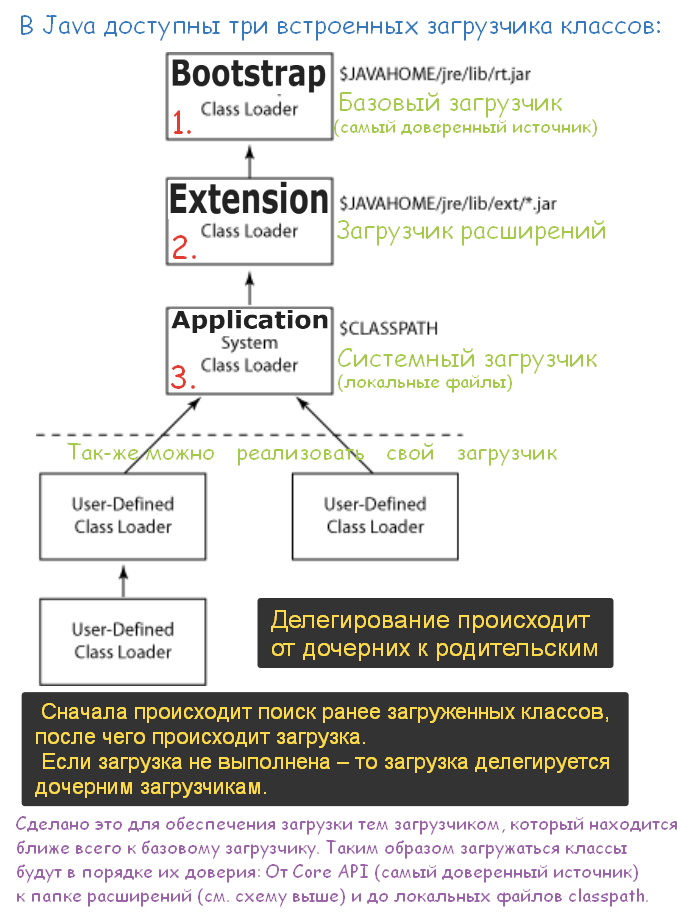

# Что такое загрузчик классов (classloader)?

- **Загрузчик классов начальной загрузки (Bootstrap Class Loader)** — корневой загрузчик классов. Это родительский загрузчик для загрузчика классов расширений, который загружает стандартные пакеты Java, такие как `java.lang`, `java.net`, `java.util`, `java.io` и так далее. Эти пакеты находятся внутри `rt.jar` и других основных библиотек, присутствующих в каталоге `$JAVA_HOME/jre/lib`.
    
- **Загрузчик классов расширений (Extension Class Loader)** — дочерний загрузчик для класса начальной загрузки и родительский для загрузчика классов приложений. Он загружает расширения стандартных библиотек Java, которые присутствуют в каталоге `$JAVA_HOME/jre/lib/ext`.
    
- **Загрузчик классов приложений (Application Class Loader)** — конечный загрузчик классов и дочерний для загрузчика классов расширений. Он загружает файлы, которые находятся в пути к классам (**classpath**). По умолчанию путь к классу устанавливается как текущий каталог приложения. Путь к классу также можно изменить, добавив параметр командной строки `-classpath` или `-cp`.

---
**ClassLoader** _(загрузчик классов)_ – компонент **JVM**, загружающий скомпилированный **байт-код** Java-классов в память.

**Основные загрузчики:**   
> - **Bootstrap ClassLoader** – загружает базовые классы JDK.   
> - **AppClassLoader** – загружает классы приложения из **CLASSPATH**.   
> - **Extension ClassLoader** _(до Java 9)_ – загружал классы расширений.   
   
**Этапы работы:**   
> 1. **Загрузка** – поиск и импорт байт-кода.   
> 2. **Связывание**:   
> > - **Проверка** – проверка корректности кода.   
> > - **Подготовка** – выделение памяти и инициализация значениями по умолчанию.   
> > - **Разрешение** – преобразование символических ссылок в реальные.   > 
> 3. **Инициализация** – выполнение кода для установки окончательных значений переменных.

`ClassLoader` использует **иерархическую модель** – каждый загрузчик передает загрузку родительскому, если не может обработать её сам.

---

Более подробно см. [_вопрос 56:_ "_классы-загрузчики и _динамическая загрузка классов."](https://github.com/yury-connect/ITM_task026_Java_Podgotovka_k_INTERVJU/blob/by_questions/ITM/ITM01_Core1/4_Core1_OOP_v_Java.md#%D0%B2%D0%BE%D0%BF%D1%80%D0%BE%D1%81-%D0%BF%D0%BE-%D0%B0%D1%80%D1%85%D0%B8%D1%82%D0%B5%D0%BA%D1%82%D1%83%D1%80%D0%B5-jvm-%D0%B7%D0%B0%D0%B3%D1%80%D1%83%D0%B7%D1%87%D0%B8%D0%BA%D0%B8)

```
***** из методички *****
Используется для передачи в JVM скомпилированного байт-кода, хранится в файлах с расширением .class

При запуске JVM, используются три загрузчика классов:
- Bootstrap ClassLoader - базовый загрузчик
- загружает платформенные классы JDK из архива rt.jar

- AppClassLoader - системный загрузчик
- загружает классы приложения, определенные в CLASSPATH 

- Extension ClassLoader - загрузчик расширений после В Java9 выпилили
- загружает классы расширений, которые по умолчанию находятся в каталоге jre/lib/ext.

ClassLoader выполняет три основных действия в строгом порядке:
• Загрузка: находит и импортирует двоичные данные для типа.
• Связывание: выполняет проверку, подготовку и (необязательно) разрешение.
 - Проверка: обеспечивает правильность импортируемого типа.
 - Подготовка: выделяет память для переменных класса и инициализация памяти значениями по умолчанию.
 - Разрешение: преобразует символические ссылки из типа в прямые ссылки.
• Инициализация: вызывает код Java, который инициализирует переменные класса 
их правильными начальными значениями.

Каждый загрузчик хранит указатель на родительский, чтобы суметь передать загрузку 
если сам будет не в состоянии этого сделать.
```
