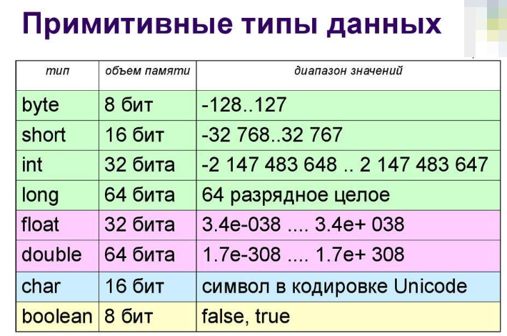

26. Какие примитивные типы данных есть в Java?

В Java есть 8 примитивных типов данных, они делятся на:

> 1. **Целочисленные**> 
> - **byte** (8 бит, от -128 до 127)>     
> - **short** (16 бит, от -32 768 до 32 767)>     
> - **int** (32 бита, от -2^31 до 2^31-1)>     
> - **long** (64 бита, от -2^63 до 2^63-1)>     

> 2. **Вещественные** (числа с плавающей запятой)> 
> - **float** (32 бита, 7 знаков после запятой)
> - **double** (64 бита, 15 знаков после запятой)

> 3. **Символьный**> 
> - **char** (16 бит, хранит один символ в формате UTF-16)

> 4. **Логический**> 
> - **boolean** (принимает только true или false)

**Важно**:
- Примитивные типы данных не являются объектами и хранятся в стеке.
- String не является примитивным типом, это ссылочный _(объектный)_ тип


---
```
дички *****
"Вещественные, целочисленные, логические и строковые.
byte
short
int
long
float
double
char
boolean"
```
