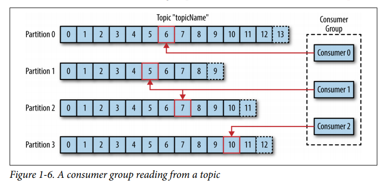
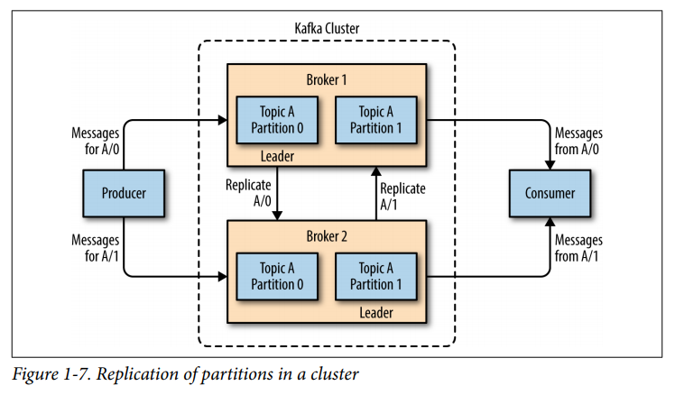

## 👥 Что такое **Consumer Group**?

**Consumer Group (*Группа потребителей*)** — это механизм масштабирования и обеспечения отказоустойчивости в Kafka. Это объединение нескольких инстансов консьюмеров (сервисов) под одним общим идентификатором `group.id` для **совместной параллельной обработки** данных из топика.

## 🛠️ Главное железное правило групп
> **Одна партиция топика в один момент времени может обрабатываться строго одним консьюмером из конкретной группы.**

При этом один консьюмер может обрабатывать несколько партиций сразу. Это правило защищает систему от двойной обработки сообщений (*например, от повторного списания денег за один заказ разными инстансами одного сервиса*).

## ⚖️ Сценарии масштабирования  *(На примере топика с 3 партициями)*
Количество консьюмеров в группе напрямую влияет на параллелизм:

### Сценарий 1: Консьюмеров **меньше**, чем партиций  *(2 сервиса на 3 партиции)*
Происходит ребалансировка. Один сервис берет на себя партицию `0`, а второй — партиции `1` и `2` одновременно (*вычитывая их параллельно*).

### Сценарий 2: Идеальный **баланс**  *(3 сервиса на 3 партиции)*
Каждый инстанс получает ровно по одной партиции.  
Достигается максимальная скорость работы и утилизация ресурсов.

### Сценарий 3: Консьюмеров **больше**, чем партиций  *(5 сервисов на 3 партиции)*
Kafka распределит 3 партиции между 3 сервисами. **2 оставшихся сервиса уйдут в режим ожидания (Idle / Standby).** Они не будут получать сообщения и будут «сидеть на скамейке запасных».

- **Зачем нужен простой?** Это обеспечивает **High Availability (Высокую доступность)**. Если один из трех работающих сервисов упадет (баг, OOM, сеть), Kafka мгновенно заметит это и передаст его партицию одному из простаивающих инстансов.
    

## 🔄 Модель Fan-out (Рассылка через разные группы)

Если одни и те же сообщения топика нужны разным бизнес-сервисам (например, сервису отправки SMS, сервису аналитики и бухгалтерии), им нужно дать **разные `group.id`**.

- Группа `sms-group` получит все 100% сообщений из топика.
    
- Группа `analytics-group` параллельно и независимо получит те же самые 100% сообщений.
    

Они будут читать данные со своей скоростью и коммитить свои независимые офсеты, никак не мешая друг другу.

## 📦 Как хранятся офсеты группы?

Офсет в Kafka всегда жестко привязан к связке: `group.id` + `topic` + `partition`.

Все смещения группы персистентно хранятся на брокере в специальном внутреннем системном топике **`__consumer_offsets`**. Если один из консьюмеров внутри группы падает, новый консьюмер, который заберет его партицию, пойдет в этот топик, прочитает последний закоммиченный офсет для своей группы и продолжит чтение без потери данных.

## 🔄 Что такое Ребалансировка (Rebalance)?

**Ребалансировка** — это процесс перераспределения партиций между консьюмерами внутри группы.

### Что триггерит ребаланс:

1. К группе подключился новый консьюмер.
    
2. Один из консьюмеров умер или был выключен.
    
3. Администратор добавил новые партиции в топик.
    

### Протоколы ребалансировки:

- **Eager Rebalance (Stop-the-world):** На время перераспределения все консьюмеры группы полностью останавливают чтение. Вызывает скачки лага.
    
- **Cooperative Rebalance (Инкрементальный):** Брокер забирает и переназначает только те партиции, которые реально должны сменить владельца. Остальные консьюмеры продолжают непрерывную работу. Современный стандарт.    

## 👑 Кто управляет группой «под капотом»?

За порядком в группе следят два компонента:

1. **Group Coordinator (Координатор группы):** Один из брокеров Kafka, который выбирается по формуле хэша от имени вашей группы. Консьюмеры регулярно шлют ему сигналы жизни (**Heartbeats**). Если сигналы пропадают на время длиннее `session.timeout.ms`, координатор объявляет консьюмера мертвым и запускает ребалансировку.
    
2. **Consumer Leader (Старший консьюмер):** Когда группа собирается, Координатор выбирает одного из консьюмеров «лидером». Именно код этого консьюмера рассчитывает финальный план деления партиций (на основе заданной стратегии: `Range`, `RoundRobin` или `Sticky`) и отдает его Координатору, а тот спускает инструкции остальным участникам группы.

---
