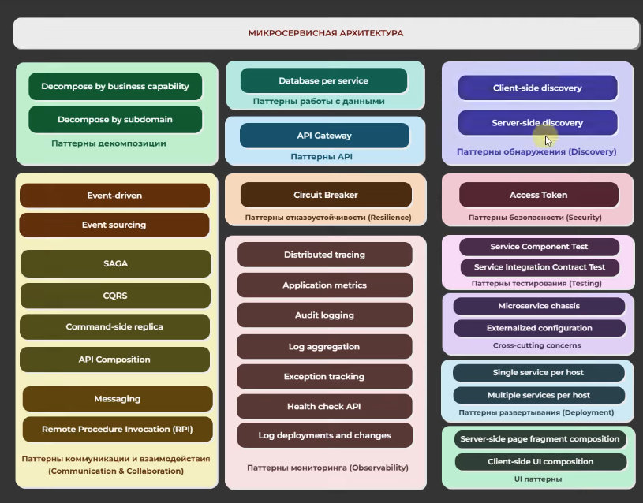

Сводная выжимка по всем паттернам микросервисной архитектуры, строго структурированная по категориям из твоей схемы. Коротко, емко и по существу.

## 1. Паттерны **декомпозиции**
_Как правильно разделить систему на независимые сервисы._
	
- **Decompose by business capability:** Нарезка сервисов на основе бизнес-возможностей организации (например, модуль оплаты, модуль доставки).
    
- **Decompose by subdomain:** Разделение сервисов по поддоменам (Bounded Contexts) на основе подходов предметно-ориентированного проектирования (DDD).    

## 2. Паттерны работы с данными
_Как управлять состоянием и базами данных в распределенной среде._
	
- [**Database per service:**](_Database_per_Service) Базовое правило, при котором каждый микросервис полностью владеет своей базой данных. Доступ извне к ней закрыт.    

## 3. Паттерны API
_Как клиенты общаются с системой._
	
- **API Gateway:** Единая точка входа для внешних запросов, которая занимается маршрутизацией, авторизацией и балансировкой.
    

## 4. Паттерны обнаружения (Discovery)
_Как сервисы находят динамические IP-адреса друг друга._
	
- **Client-side discovery:** Сервис-клиент сам обращается к реестру (Service Registry), забирает список доступных IP-адресов соседа и сам балансирует запрос.
    
- **Server-side discovery:** Клиент делает запрос на центральный балансировщик, который сам заглядывает в реестр адресов и перенаправляет трафик.    

## 5. Паттерны коммуникации и взаимодействия
_Способы организации синхронного и асинхронного общения между узлами._

- **Event-driven:** Архитектура, управляемая событиями (сервисы реагируют на факты изменений в системе).
    
- **Event sourcing:** Состояние сущности не перезаписывается, а хранится как лог («источник») всех когда-либо произошедших с ней событий.
    
- **SAGA:** Паттерн для распределенных транзакций; цепочка последовательных локальных транзакций с компенсирующими шагами в случае ошибки.
    
- **CQRS:** Разделение приложения на две независимые модели: одну для записи/изменения данных, другую — для быстрого чтения.
    
- **Command-side replica:** Создание readonly-реплики данных на стороне сервиса, которому эта информация нужна постоянно, чтобы не дергать соседа по сети.
    
- **API Composition:** Простой сборщик данных; один сервис делает параллельные запросы к другим сервисам и склеивает их ответы в один JSON для клиента.
    
- **Messaging:** Асинхронный обмен сообщениями через очереди/брокеры (Kafka, RabbitMQ) для снижения связанности систем.
    
- **Remote Procedure Invocation (RPI):** Классическое синхронное общение «запрос-ответ» по протоколам HTTP/REST или gRPC.
    

## 6. Паттерны отказоустойчивости (Resilience)
_Защита системы от каскадных падений._

- **Circuit Breaker:** Предохранитель, который временно изолирует сбоящий сервис, моментально отдавая заглушку (fallback) вместо ожидания таймаута.
    

## 7. Паттерны мониторинга (Observability)
_Понимание того, что происходит внутри распределенной системы._

- **Distributed tracing:** Присвоение каждому запросу уникального `Trace ID` для сквозного отслеживания его пути через все микросервисы.
    
- **Application metrics:** Сбор числовых показателей работы приложения (CPU, RAM, RPS, количество ошибок 5xx) для построения графиков.
    
- **Audit logging:** Запись критически важных бизнес-действий (кто, когда и что изменил) для целей безопасности и комплаенса.
    
- **Log aggregation:** Централизованный сбор и индексация текстовых логов со всех контейнеров в одном месте (ELK, Loki).
    
- **Exception tracking:** Автоматический перехват, группировка и уведомление разработчиков о критических ошибках в рантайме (Sentry).
    
- **Health check API:** Специальный эндпоинт (например, `/health`), по которому оркестратор (Kubernetes) проверяет, жив ли контейнер.
    
- **Log deployments and changes:** Фиксация моментов деплоя и изменений конфигурации на графиках мониторинга для сопоставления их со скачками ошибок.

## 8. Паттерны безопасности (Security)
_Контроль доступа к данным._

- **Access Token:** Использование токенов (JWT), в которых зашифрованы права пользователя, что позволяет сервисам проверять их без походов в общую БД.    

## 9. Паттерны тестирования (Testing)
_Проверка качества распределенного кода._

- **Service Component Test:** Тестирование отдельного микросервиса в полной изоляции, где все внешние зависимости заменяются заглушками (моками).
    
- **Service Integration Contract Test:** Проверка совместимости API на основе "контрактов", гарантирующая, что изменения в сервисе А не сломают интеграцию с сервисом Б.    

## 10. Сквозные задачи (Cross-cutting concerns)
_Управление инфраструктурной логикой._

- **Microservice chassis:** Готовый каркас/шаблон проекта (например, кастомный Spring Boot Starter), куда уже вшиты логирование, метрики и безопасность.
    
- **Externalized configuration:** Вынос всех настроек и паролей за пределы кодовой базы в централизованное внешнее хранилище (Vault, Сonfig Server).    

## 11. Паттерны развертывания (Deployment)
_Как физически запустить приложения._

- **Single service per host:** Запуск ровно одного инстанса сервиса на один хост/контейнер для обеспечения максимальной изоляции ресурсов.
    
- **Multiple services per host:** Совместное размещение нескольких разных сервисов на одном хосте (виртуалке) ради экономии ресурсов.    

## 12. UI паттерны
_Как собрать интерфейс для пользователя._

- **Server-side page fragment composition:** Сборка веб-страницы из готовых HTML-кусочков (компонентов), генерируемых разными сервисами, на стороне сервера.
    
- **Client-side UI composition:** Композиция интерфейса непосредственно в браузере пользователя, когда SPA-фронтенд сам забирает данные из разных API.

---
