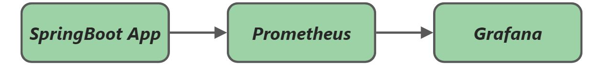

# 🔍 Уточнённая схема потока метрик

**Spring Boot App → Spring Boot Actuator (с встроенным Micrometer) → Prometheus → Grafana**

## 🧩 Разбор каждого компонента

1. **Spring Boot Actuator (внутри него — Micrometer)**  
    Actuator — это «шлюз» к внутренностям приложения. Он автоматически настраивает **Micrometer** для сбора технических метрик (*JVM, HTTP-запросы, пулы соединений*) . Тебе **не нужно** подключать *Micrometer* отдельно как «*внешнюю библиотеку*» для базовых метрик — он приходит транзитивно вместе с *Actuator*. Однако для того, чтобы Micrometer _умел_ отдавать данные в формате Prometheus, нужен дополнительный «*мостик*» — зависимость `micrometer-registry-prometheus` .
    
2. **Настройка в приложении (*то, что ты делаешь руками*)**
	    
    - **Maven/Gradle:** Ты добавляешь две зависимости: `spring-boot-starter-actuator` и `micrometer-registry-prometheus` .
        
    - **application.properties:** Ты включаешь эндпоинт: `management.endpoints.web.exposure.include=prometheus` .
        
    - **Результат:** В приложении появляется HTTP-эндпоинт `/actuator/prometheus`, который отдаёт все собранные метрики в текстовом формате, понятном Prometheus .
    
3. **Prometheus**  
    *Prometheus* работает по **pull-модели** (*модель «вытягивания»*). Он сам периодически (*например, раз в 15 секунд*) делает HTTP-запрос к эндпоинту `/actuator/prometheus` твоего приложения и забирает оттуда метрики . Он хранит их у себя как временные ряды.
    
4. **Grafana**  
    Grafana — это «*витрина*». Она не хранит данные, а запрашивает их у *Prometheus* через **PromQL**-запросы и рисует на дашбордах . Ты просто добавляешь *Prometheus* как источник данных и создаёшь графики.    

## 💡 Что стоит запомнить

Твоё понимание про «подключаем Actuator → он собирает данные → Prometheus их забирает → Grafana рисует» абсолютно верное. **Micrometer не нужно подключать отдельно для базовой работы**, он является частью *Actuator*. Но зависимость `micrometer-registry-prometheus` обязательна, чтобы *Actuator* «*заговорил*» на языке *Prometheus*.

---
