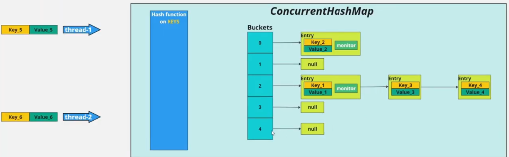

### 📖 Чтение из заблокированной корзины

**Все потоки могут одновременно читать из корзины, которая заблокирована на запись.**


|Операция|Можно одновременно?|
|---|---|
|**Чтение** + **Чтение**|✅ Да (сколько угодно)|
|**Чтение** + **Запись**|✅ Да (читают без блокировки)|
|**Запись** + **Запись**|❌ Нет (только один)|

### 🧠 Как это работает
Когда поток пишет в корзину, он **захватывает монитор** этой корзины (`synchronized` на головном узле). Но это **не мешает** другим потокам читать, потому что:
- Чтение (`get`) использует **volatile-поля**    
- Чтение **не требует** захвата монитора    
- Чтение видит данные **на момент чтения** (может увидеть старое значение, но не "битое")

---
## **ConcurrentHashMap** — как это работает (*краткий [конспект](https://habr.com/ru/articles/132884/)*)

### 📜 Предыстория

|Реализация|Проблема|
|---|---|
|**Hashtable** (Java 1.0)|Все методы `synchronized` → блокировка **всей таблицы** при любом доступе|
|**Collections.synchronizedMap(HashMap)** (Java 1.2)|Та же проблема — один лок на весь объект|

**Итог:** нужна была производительная потокобезопасная карта без полной блокировки.

### 🎯 ConcurrentHashMap (Java 1.5, Doug Lea)

**Ключевая идея:** разделить карту на **сегменты** и блокировать только нужный сегмент, а не всю карту.

### 🧱 Основные элементы

#### 1. `HashEntry` — элемент карты

```java
static final class HashEntry<K, V> {
    final K key;
    final int hash;
    volatile V value;        // ← volatile для видимости
    final HashEntry<K, V> next;
}
```

- `value` — **volatile**, чтобы чтение видело последнюю запись без блокировки    
- `key`, `hash`, `next` — **final** (неизменяемые)    

#### 2. Улучшенная хэш-функция

В `ConcurrentHashMap` используется более сложная хэш-функция, чем в `HashMap`, чтобы уменьшить коллизии и равномернее распределять элементы по сегментам и корзинам.

#### 3. Сегменты — главная фишка

```java
final Segment<K, V>[] segments;
```

- Карта делится на **N сегментов** (по умолчанию **16**)    
- Каждый сегмент — это **независимая маленькая хэш-таблица**    
- Каждый сегмент — наследник `ReentrantLock` → у каждого свой замок    

```text
ConcurrentHashMap
┌───────────────────────────────────────────┐
│  Сегмент 0 │ Сегмент 1 │ ... │ Сегмент 15 │
│  (замок 0) │ (замок 1) │     │ (замок 15) │
│  [таблица] │ [таблица] │     │ [таблица]  │
└───────────────────────────────────────────┘
```

#### 4. `concurrencyLevel` — уровень параллелизма

- Определяет **количество сегментов**    
- По умолчанию — **16**    
- Выбирается как **степень двойки**, ближайшая к `concurrencyLevel`    
- Максимум — **65 536** (`MAX_SEGMENTS = 1 << 16`)    

### 🔒 Как работают операции

|Операция|Блокировка|
|---|---|
|**Чтение** (`get`)|❌ **Нет блокировки** (читает через volatile)|
|**Запись** (`put`)|✅ Блокируется **только один сегмент**|
|**Удаление** (`remove`)|✅ Блокируется **только один сегмент**|
|**Resize**|✅ Блокируется **только один сегмент**|

### 📊 Производительность (из статьи)

```text
synchronizedMap    vs    ConcurrentHashMap
При 5-10 млн операций:
- synchronizedMap: производительность падает (все блокируются)
- ConcurrentHashMap: производительность остаётся высокой (блокируются только сегменты)
```

### 💡 Как выбрать `concurrencyLevel`

|Сценарий|Рекомендация|
|---|---|
|**Много чтения, мало записи**|`concurrencyLevel = 1`|
|**Много записи**|Выше (16, 32, ...)|
|**По умолчанию**|16 (хороший баланс)|

**Важно:**
- Занижение → больше блокировок → медленнее запись    
- Завышение → больше памяти на сегменты (неэффективно)    

### 📝 Итог

```text
ConcurrentHashMap — потокобезопасная HashMap
Ключевые особенности:
1. Сегменты (по умолчанию 16) → несколько замков
2. Чтение без блокировок (volatile)
3. Запись блокирует только один сегмент
4. concurrencyLevel определяет количество сегментов
5. Более производительная, чем Hashtable и synchronizedMap
6. Не разрешает null ключи и значения
```

---
- **В Java 7 и ранее:** `concurrencyLevel` жестко определял количество `Segment`-ов. Это число устанавливалось один раз при создании карты и **никогда не менялось** [](https://stackoverflow.com/feeds/question/42082693)[](https://raw.githubusercontent.com/Snailclimb/JavaGuide/main/docs/java/collection/concurrent-hash-map-source-code.md#1). Если вы задали `concurrencyLevel=16`, то 16 сегментов оставалось навсегда, даже если нагрузка была низкой.
    
- **В Java 8 и новее:** Концепция `Segment` была полностью переработана [](https://stackoverflow.com/posts/57239898/revisions#1)[](https://raw.githubusercontent.com/Snailclimb/JavaGuide/main/docs/java/collection/concurrent-hash-map-source-code.md#1). Теперь `concurrencyLevel` — это просто **подсказка** для начального размера таблицы. Во время инициализации он влияет на то, сколько примерно будет создано корзин (`bins`), но в дальнейшем структура данных (массив таблицы) может как **расширяться** (rehash), так и, в процессе реорганизации, **схлопываться** (уменьшаться) для оптимизации памяти [](https://android.googlesource.com/platform/libcore.git/+/75a06e56a4cc4599946e21422513e4bafa759509/luni/src/main/java/java/util/concurrent/ConcurrentHashMap.java#2)[](https://gee.cs.oswego.edu/cgi-bin/viewcvs.cgi/jsr166/jsr166/src/jsr166e/ConcurrentHashMapV8.java?r1=1.1&r2=1.21#1). Количество зон, которые можно заблокировать, становится динамичным и зависит от текущего размера таблицы и ее загруженности.

### 💎 Итог
`concurrencyLevel` **не может расти или схлопываться в смысле жестко заданного числа сегментов, потому что такого понятия больше нет**. В современных версиях он используется как стартовый размер, а управление параллелизмом и блокировками полностью делегировано самой структуре данных, которая адаптируется под текущую нагрузку.

---
