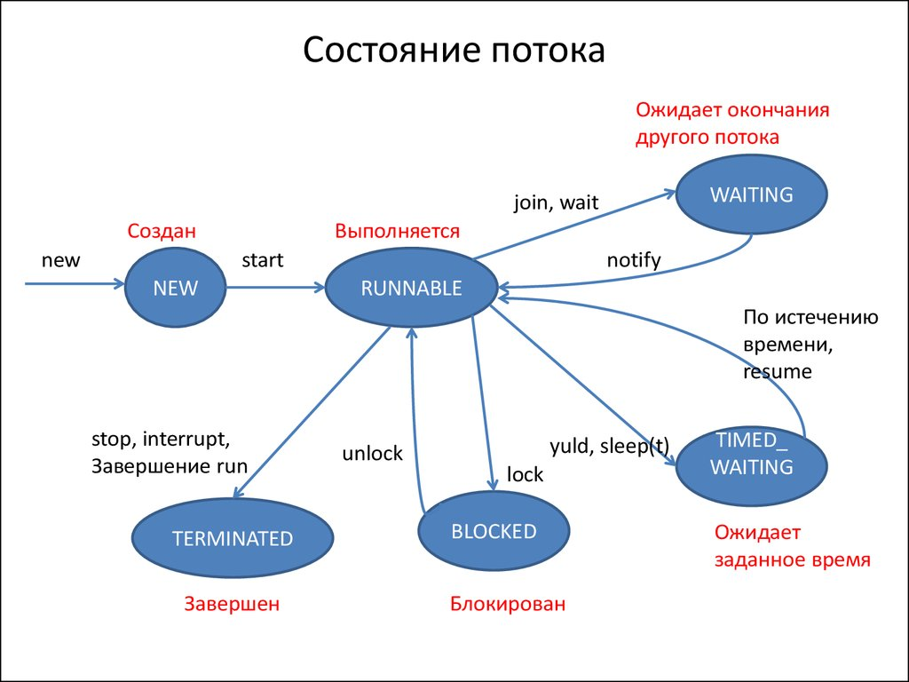

источник: [ссылка](https://habr.com/ru/articles/776914/)

| Состояние           | Описание                                                                                                       | Как попасть                                                                                              | Как выйти                                                                                                    |
| ------------------- | -------------------------------------------------------------------------------------------------------------- | -------------------------------------------------------------------------------------------------------- | ------------------------------------------------------------------------------------------------------------ |
| **`NEW`**           | Поток создан (`new Thread()`), но ещё не запущен (`start()` не вызван).                                        | Создание  объекта  Thread.                                                                         | Вызов `start()`.                                                                                             |
| **`RUNNABLE`**      | Поток **готов к выполнению** или **уже выполняется** на уровне JVM. Ожидает кванта времени от планировщика ОС. | Вызов `start()`.                                                                                         | Планировщик ОС  выделяет/забирает  CPU.                                                                |
| **`BLOCKED`**       | Поток **заблокирован** и ждёт освобождения монитора (чтобы войти в `synchronized`-блок).                       | Попытка войти в `synchronized`-блок, который занят  другим потоком.                                   | Монитор  освобождается.                                                                                   |
| **`WAITING`**       | Поток **ждёт бесконечно**, пока другой поток не выполнит определённое действие.                                | `Object.wait()` (без таймаута),  `Thread.join()` (без таймаута),  `LockSupport.park()`.            | `Object.notify()`/ `notifyAll()`,   `Thread.jo in()`  завершился,  `LockSupport.unpark()`. |
| **`TIMED_WAITING`** | Поток **ждёт ограниченное время**.                                                                             | `Thread.sleep()`,  `Object.wait(timeout)`,  `Thread.join(timeout)`,  `LockSupport.parkNanos()`. | Таймаут истек или  получено уведомление.                                                                  |
| **`TERMINATED`**    | Поток завершил выполнение (метод `run()` закончился или выбросил исключение).                                  | Метод `run()`  завершился.                                                                            | Невозможно выйти  — поток мёртв.                                                                          |

---
## 🔥 Важные нюансы (обязательно сказать на собеседовании)

### 1. **`RUNNABLE` объединяет два состояния**
> _«В Java нет отдельного состояния `RUNNING`. Поток в состоянии `RUNNABLE` может либо **выполняться** на CPU, либо **быть готовым** к выполнению и ждать кванта времени от планировщика ОС. Различие между ними делает ОС, а не JVM.»_

### 2. **Разница между `BLOCKED`, `WAITING` и `TIMED_WAITING`**
Этот вопрос **очень любят** задавать!

| Состояние           | Причина                                                         | Освобождается                                       |
| :------------------ | :-------------------------------------------------------------- | :-------------------------------------------------- |
| **`BLOCKED`**       | Ждёт **монитор**  (`synchronized`)                           | Когда монитор  освобождается                     |
| **`WAITING`**       | Ждёт **уведомления**  (`wait()`, `join()`, `park()`)         | Когда приходит  `notify()`/`unpark()`            |
| **`TIMED_WAITING`** | Ждёт **с таймаутом** (`sleep()`,  `wait(ms)`, `parkNanos()`) | Когда истекает таймаут  или приходит уведомление |
> **Ключевое отличие:** `BLOCKED` — пассивное ожидание из-за конкуренции за монитор.  
> `WAITING`/`TIMED_WAITING` — активное ожидание по желанию потока.

### 3. **Нельзя перезапустить `TERMINATED` поток**

> _«Если попытаться вызвать `start()` на потоке в состоянии `TERMINATED` — JVM бросит `IllegalThreadStateException`. Поток нельзя перезапустить, нужно создавать новый объект.»_

### 4. **Поток может сам себя прервать**

> _«Вызов `thread.interrupt()` не переводит поток в какое-то специальное состояние. Он просто устанавливает флаг прерывания. Поток должен сам проверить этот флаг (`Thread.interrupted()` или `isInterrupted()`) и корректно завершиться. Но если поток находится в `WAITING`/`TIMED_WAITING`, `interrupt()` вызовет `InterruptedException`.»_

---

## 🎤 Скрипт для собеседования (короткая версия)

> _«В Java поток может находиться в шести состояниях, описанных в `Thread.State`: `NEW`, `RUNNABLE`, `BLOCKED`, `WAITING`, `TIMED_WAITING`, `TERMINATED`._
> 
> _Состояние `NEW` — поток создан, но не запущен. `RUNNABLE` — поток готов к выполнению или уже выполняется (зависит от планировщика ОС). `BLOCKED` — поток ждёт освобождения монитора, чтобы войти в `synchronized`-блок. `WAITING` и `TIMED_WAITING` — поток ждёт уведомления (с таймаутом или без). `TERMINATED` — поток завершил выполнение._
> 
> _Главное отличие `BLOCKED` от `WAITING`: `BLOCKED` — это пассивное ожидание из-за конкуренции за монитор, а `WAITING` — это когда поток сам «уснул» через `wait()` или `join()` и ждёт явного пробуждения. После завершения поток перезапустить нельзя — только создать новый.»_

