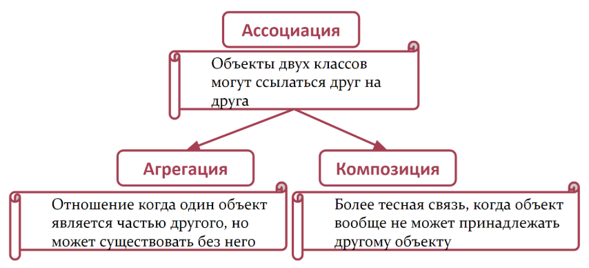
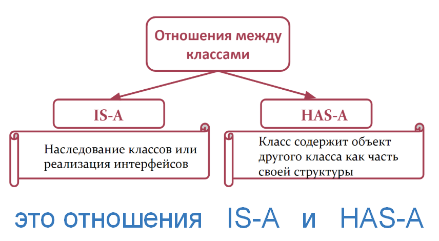

# Что такое ассоциация

**Ассоциация** – это связь между объектами двух классов, позволяющая им взаимодействовать друг с другом. Объекты могут **ссылаться** друг на друга, но при этом остаются **независимыми**.

**Разновидности ассоциации**:

- **Агрегация** – слабая связь, где один объект **может** существовать без другого (_например, команда и игрок_).
- **Композиция** – сильная связь, где один объект **не может** существовать без другого (_например, дом и комнаты_).




**Отношения между классами** 


```
***** из методички *****
Есть два типа связи между объектами: ассоциация, которая делится на композицию и агрегацию, и наследование.
Ассоциация - обозначает связь между объектами. Например, игрок играет в определенной команде.

Ассоциация означает, что объекты двух классов могут ссылаться один на другой, 
иметь некоторую связь между друг другом. Например Менеджер может выписать Счет. 
Соответственно возникает ассоциация между Менеджером и Счетом. 
Еще пример — Преподаватель и Студент — т.е. какой-то Студент учится у какого-то Преподавателя. 
Ассоциация и есть описание связи между двумя объектами. Студент учится у Преподавателя. 
Идея достаточно простая — два объекта могут быть связаны между собой и это надо как-то описать.

http://java-course.ru/begin/relations/
```

```
[ссылка](http://java-course.ru/begin/relations/")
```

---
