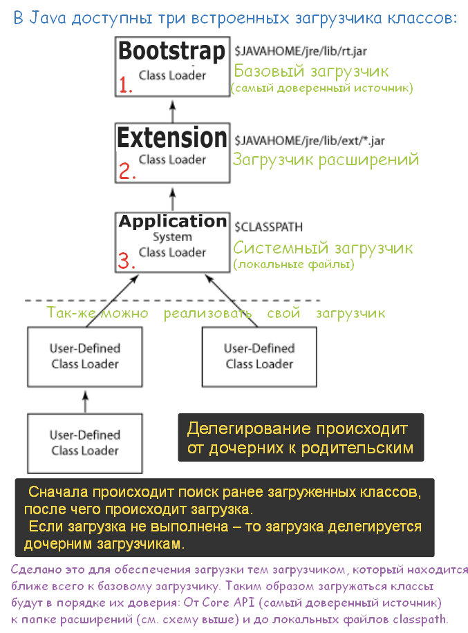

# Что такое загрузчик классов (classloader)?

**ClassLoader** _(загрузчик классов)_ – компонент **JVM**, загружающий скомпилированный **байт-код** Java-классов в память.

**Основные загрузчики:**

> - **Bootstrap ClassLoader** – загружает базовые классы JDK.     
> - **AppClassLoader** – загружает классы приложения из **CLASSPATH**.     
> - **Extension ClassLoader** _(до Java 9)_ – загружал классы расширений.     

**Этапы работы:**

> 1. **Загрузка** – поиск и импорт байт-кода.
>    
> 2. **Связывание**: 
> > - **Проверка** – проверка корректности кода.
> > - **Подготовка** – выделение памяти и инициализация значениями по умолчанию.
> > - **Разрешение** – преобразование символических ссылок в реальные.
> 
> 3. **Инициализация** – выполнение кода для установки окончательных значений переменных.

ClassLoader использует **иерархическую модель** – каждый загрузчик передает загрузку родительскому, если не может обработать её сам.

---

Более подробно см. [_вопрос 56:_ "_классы-загрузчики и _динамическая загрузка классов."](https://github.com/yury-connect/ITM_task026_Java_Podgotovka_k_INTERVJU/blob/by_questions/ITM/ITM01_Core1/4_Core1_OOP_v_Java.md#%D0%B2%D0%BE%D0%BF%D1%80%D0%BE%D1%81-%D0%BF%D0%BE-%D0%B0%D1%80%D1%85%D0%B8%D1%82%D0%B5%D0%BA%D1%82%D1%83%D1%80%D0%B5-jvm-%D0%B7%D0%B0%D0%B3%D1%80%D1%83%D0%B7%D1%87%D0%B8%D0%BA%D0%B8)
## 

### [**Ссылка** на источник](https://nuancesprog.ru/p/15245/) // [**Скрин** всей страницы источника](https://github.com/yury-connect/ITM_task026_Java_Podgotovka_k_INTERVJU/blob/by_questions/ITM/ITM01_Core1/files/%D0%90%D1%80%D1%85%D0%B8%D1%82%D0%B5%D0%BA%D1%82%D1%83%D1%80%D0%B0%20%D0%B2%D0%B8%D1%80%D1%82%D1%83%D0%B0%D0%BB%D1%8C%D0%BD%D0%BE%D0%B9%20%D0%BC%D0%B0%D1%88%D0%B8%D0%BD%D1%8B%20Java_.html)  

[](https://nuancesprog.ru/p/15245/)

[](https://github.com/yury-connect/ITM_task026_Java_Podgotovka_k_INTERVJU/blob/by_questions/ITM/ITM01_Core1/2_Core1_Java.md#%D1%81%D1%81%D1%8B%D0%BB%D0%BA%D0%B0-%D0%BD%D0%B0-%D0%B8%D1%81%D1%82%D0%BE%D1%87%D0%BD%D0%B8%D0%BA------%D1%81%D0%BA%D1%80%D0%B8%D0%BD-%D0%B2%D1%81%D0%B5%D0%B9-%D1%81%D1%82%D1%80%D0%B0%D0%BD%D0%B8%D1%86%D1%8B-%D0%B8%D1%81%D1%82%D0%BE%D1%87%D0%BD%D0%B8%D0%BA%D0%B0)

```
***** из методички *****
Используется для передачи в JVM скомпилированного байт-кода, хранится в файлах с расширением .class

При запуске JVM, используются три загрузчика классов:
- Bootstrap ClassLoader - базовый загрузчик
- загружает платформенные классы JDK из архива rt.jar

- AppClassLoader - системный загрузчик
- загружает классы приложения, определенные в CLASSPATH 

- Extension ClassLoader - загрузчик расширений после В Java9 выпилили
- загружает классы расширений, которые по умолчанию находятся в каталоге jre/lib/ext.

ClassLoader выполняет три основных действия в строгом порядке:
•        Загрузка: находит и импортирует двоичные данные для типа.
•        Связывание: выполняет проверку, подготовку и (необязательно) разрешение.
 -        Проверка: обеспечивает правильность импортируемого типа.
 -        Подготовка: выделяет память для переменных класса и инициализация памяти значениями по умолчанию.
 -        Разрешение: преобразует символические ссылки из типа в прямые ссылки.
•        Инициализация: вызывает код Java, который инициализирует переменные класса 
их правильными начальными значениями.

Каждый загрузчик хранит указатель на родительский, чтобы суметь передать загрузку 
если сам будет не в состоянии этого сделать.
```

---
