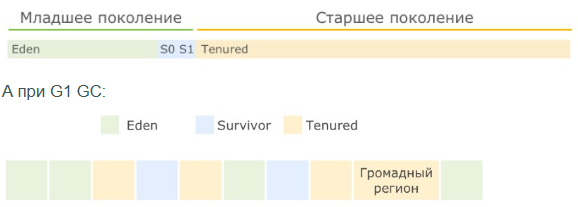
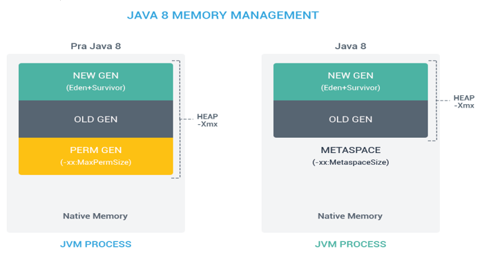

# Stack и Heap

- 🔹**Stack** _(стек)_ – исп. для хранения _stack frame'ов_, работает по схеме `LIFO`.

> Содержит:  
> - параметры метода,
> - указатель на предыдущий фрейм и
> - локальные переменные.

- 🔹**Heap** _(куча)_ – Эта область для динамического выделения памяти для объектов и классов _JRE_ во время выполнения.  
    / Новые объекты всегда создаются в **куче**, а ссылки на них хранятся в **стеке**.  
    / Эти объекты имеют **глобальный** доступ и могут быть получены из **любого** места программы.  
    / Структура **Heap** зависит от выбранного `GC` (_Serial, Parallel, CMS, G1_).  
    / Размер стека **меньше**, но он **быстрее** кучи.

_**Начальный** размер (Xms) = **1/64** физической памяти машины (или нек-го разумного минимума).  
**Максимальный** размер (Xmx): **1/4** физической памяти машины (или 1 Гб. До версии 1.5 = 64 Мб)._

**Обе** области хранятся в **RAM**.  
**Ошибки** памяти: `StackOverflowError` (_переполнение **стека**_), `OutOfMemoryError` (_переполнение **кучи**_).

💡 **Heap** разбит на части (поколения _Generation_):



- **Young Generation** — область где размещаются **недавно** созданные объекты.  
    Когда она заполняется, происходит быстрая _сборка мусора_ Old (Tenured)
- **Old Generation** — здесь хранятся долгоживущие объекты.  
    Когда объекты из **Young Generation** достигают определенного порога «_возраста_», они перемещаются в **Old Generation**
- **Permanent Generation** — эта область содержит метаинформацию о классах и методах приложения, но начиная с `Java 8` данная область памяти была **упразднена** (_классы и методы_). ~~Подробности ниже:~~

> - ✅**PermGen** (_Permanent Generation_) — это специальное место **в куче**, **отделенное** от основной памяти.  
>     В **PermGen** виртуальная машина хранит **метаданные загруженных классов**.  
>     Также здесь находятся:
> 
> > - всё статическое содержимое приложения,
> > - переменные примитивных типов и
> > - ссылки на статические объекты,
> > - хранит данные о **байткоде** и **JIT информацию**.
> 
> По умолчанию, максимальный размер этой области памяти:
> 
> > для **32**-х битной JVM равен **64 Мб**, а  
> > для **64**-х битной версии — **82 Мб**.
> 
> `-XX:PermSize=[размер]` для установки **минимального** размера **PermGen** области,  
> `-XX:MaxPermSize=[размер]` для установки **максимального** размера
> 
> Из-за своего ограниченного размера, **PermGen** является причиной возникновения ошибки `java.lang.OutOfMemoryError: PermGen space`.
> 
> - ✅**Metaspace** – новая область памяти, появившаяся в `Java 8` и заменившая устаревшую **PermGen**.  
>     Основное их отличие заключается в **способе распределения памяти**.  
>     / По умолчанию, **Metaspace** увеличивается **автоматически**.  
>     / Есть возможность **управления памятью**: границы можно задать при помощи `MetaspaceSize` и `MaxMetaspaceSize`.  
>     / Процесс очистки памяти получил преимущества: `GC` автоматически удаляет ненужные классы, когда пространство под метаданные заканчивается.



```
***** из методички *****
Память процесса делится на Stack (стек) и Heap (куча) :
- Stack содержит staсk frame'ы, они делятся на три части: 
    * параметры метода,   
    * указатель на предыдущий фрейм    
    * и локальные переменные.

- Структура Heap зависит от выбранного 
    сборщика мусора. Читай про GC!

* MetaSpace - специальное пространство кучи, отделенное от кучи основной памяти. 
    JVM хранит здесь весь статический контент. 
    Это включает в себя все статические методы, 
    примитивные переменные и ссылки на статические объекты. 
    Кроме того, он содержит данные о байт-коде, 
    именах и JIT-информации. 
    До Java 7 String Pool также был частью этой памяти. 

Вкратце, при Serial/ Parallel/ CMS GC будет следующая структура:

А при G1 GC:
С помощью опций Xms и Xmx можно настроить 
начальный и максимально допустимый размер кучи. 
Существуют опции для настройки величины стека.

- Heap - используется всем приложением, 
    Stack - одним потоком исполняемой программы.
- Новый обьект создается в heap, 
    в stack размещается ссылка на него. 
    В стеке размещаются локальные переменные примитивных типов. 
- Обьекты в куче доступны из любого места программы, 
    стековая память не доступна для других потоков.
- Если память стека закончилась 
    JRE вызовет исключение StackOverflowError, 
    если куча заполнена OutOfMemoryError
- Размер памяти стека, меньше памяти кучи. 
    Стековая память быстрее памяти кучи.
- В куче есть ссылки между объектами и их классами. 
    На этом основана рефлексия.

Обе области хранятся в RAM.
```

---
