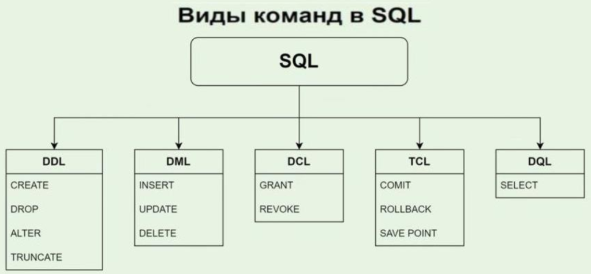
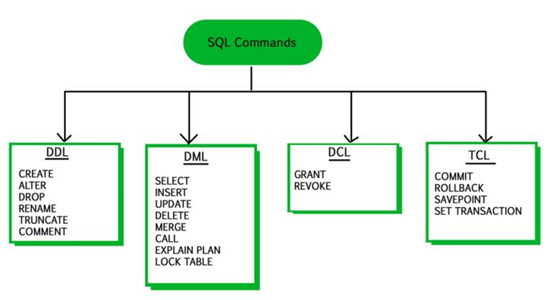

# Что такое _DDL_? Какие операции в него входят? Рассказать про них.

---
## DDL (_Data Definition Language_) — язык для определения структуры базы данных. Основные команды:

- ✅ **CREATE**: создание новых объектов (_таблиц, индексов и т.д._).    
- ✅ **ALTER**: изменение структуры существующих объектов.    
- ✅ **DROP**: удаление объектов и всех данных в них.    
- ✅ **TRUNCATE**: очистка таблиц (_быстрое удаление данных без удаления структуры_).
- ✅ **RENAME**: переименование объектов.    

---
## Виды команд в SQL (основные)


---
### Виды команд в SQL (укрупненно)


---
```
***** из методички *****
DDL (Data Definition Language) -  операторы определения данных :
    CREATE создает объект БД (базу, таблицу, представление, пользователя и т. д.),
    ALTER изменяет объект (структуру),
    DROP удаляет объект;
    TRUNCATE удаляет таблицу и создает её пустую заново, 
но если в таблице были foreigh key, 
то создать таблицу не получится. 
rollback после TRUNCATE невозможен
```

---
