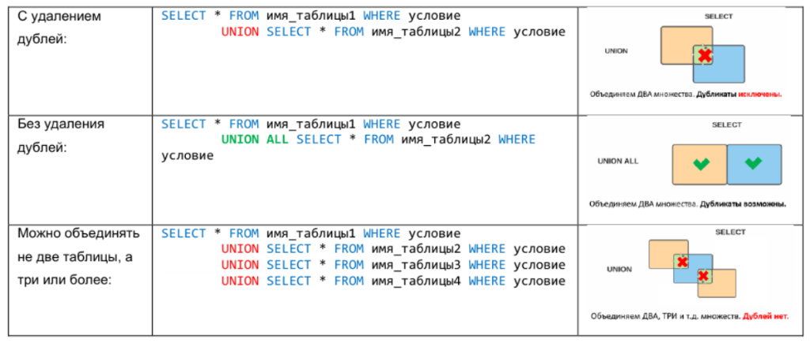

## Что делает `UNION`?

---
**Основная суть**: `UNION` объединяет результаты двух или более SQL-запросов в один итоговый набор строк, при условии, что:
- Каждый запрос возвращает **одинаковое** количество столбцов.
- Типы данных соответствующих столбцов **совместимы**.

**Порядок строк**: Результирующий набор <u>не гарантирует</u> определённый порядок строк.  
Для получения отсортированного результата используйте конструкцию `ORDER BY`.



---

```
***** из методички *****
В языке SQL ключевое слово UNION применяется для объединения результатов двух SQL-запросов в единую таблицу, состоящую из схожих записей. 

Оба запроса должны возвращать одинаковое число столбцов и совместимые типы данных в соответствующих столбцах. 

Необходимо отметить, что UNION сам по себе не гарантирует порядок записей. 
Записи из второго запроса могут оказаться в начале, в конце или вообще перемешаться с записями из первого запроса. 
В случаях, когда требуется определенный порядок, необходимо использовать ORDER BY.

Разница между UNION и UNION ALL заключается в том, что UNION будет пропускать дубликаты записей, тогда как UNION ALL будет включать дубликаты записей.
```

---
