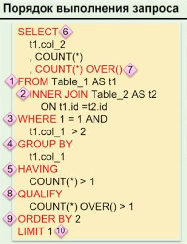

# Чем `WHERE` отличается от `HAVING` _(ответа про то что используются в разных частях запроса - недостаточно)_?

---
### 🔍 Отличия _SQL_ `WHERE` vs `HAVING`

1. ✔️ **Порядок выполнения**

- **WHERE**: Применяется **до** выполнения группировки (`GROUP BY`).  
    Фильтрует отдельные строки, уменьшая объем данных для последующей агрегации. 🚀  
    **Преимущество**: Позволяет оптимизировать запрос, исключая ненужные данные.
    
- **HAVING**: Применяется **после** группировки (`GROUP BY`), фильтруя уже сформированные группы. 🚀  
    **Преимущество**: Позволяет использовать агрегатные функции (например, `SUM()`, `COUNT()`) для условия фильтрации.    

---
2. ✔️ **Использование агрегатных функций и псевдонимов**

- **WHERE**: Не допускает использования агрегатных функций. 👍  
    Можно использовать псевдонимы всегда.
    
- **HAVING**: Позволяет использовать агрегатные функции, что делает его незаменимым для фильтрации агрегированных данных. 👍  
    Псевдонимы можно применять, если они относятся к результату агрегатных функций.    

---

3. ✔️ **Таблица сравнения**
    
    |Критерий|WHERE|HAVING|
    |---|---|---|
    |**Порядок выполнения**|До группировки (`GROUP BY`)|После группировки (`GROUP BY`)|
    |**Агрегатные функции**|Не разрешены|Разрешены|
    |**Фильтрация**|Отдельных строк|Групп или агрегатов|
    |**Оптимизация**|Сокращает объем данных заранее|Применяется к уже сгруппированным данным|
    

---

📝 **Пример:**

|**Оператор**|**Пример SQL-запроса**|**Описание**|
|---|---|---|
|`WHERE`|`SELECT name, age FROM Users WHERE age > 18;`|Фильтрует строки по условию (_например, только пользователи старше 18 лет_).|
|`HAVING`|`SELECT department, COUNT(*) FROM Employees GROUP BY department HAVING COUNT(*) > 5;`|Фильтрует результаты после группировки (`GROUP BY`), например, отделы с более чем 5 сотрудниками.|

---

🎯 **Итог**

- **WHERE**: Используется для предварительной фильтрации строки до агрегации, что улучшает производительность.
    
- **HAVING**: Применяется для фильтрации сгруппированных данных с использованием агрегатных функций, позволяя работать с итоговыми значениями.
    

---

**Порядок выполнения запроса:**



---

```
***** из методички *****
WHERE нельзя использовать с агрегатными функциями, HAVING можно (предикаты тоже).

В HAVING можно использовать псевдонимы только если они используются для наименования результата агрегатной функции, в WHERE можно всегда.
HAVING стоит после GROUP BY, но может использоваться и без него. 

При отсутствии предложения GROUP BY агрегатные функции применяются ко всему 
выходному набору строк запроса, т.е. в результате мы получим всего 
одну строку, если выходной набор не пуст.

Во-первых, в HAVING и только в нём можно писать условия по агрегатным функциям (SUM, COUNT, MAX, MIN и т. д.). То есть если вы хотите сделать что-то вроде COUNT(*) > 10, то это возможно сделать только в HAVING. 

"Почему бы не оставить только HAVING?" - спросите вы. 
Всё кроется в том, как SQL Server выполняет запрос, в каком порядке происходит его разбор и работа с данными. 
 WHERE выполняется до формирования групп GROUP BY.  Это нужно для того, чтобы можно было оперировать как можно меньшим количеством данных и сэкономить ресурсы сервера и время пользователя. 
 Следующим этапом формируются группы, которые указаны в GROUP BY. 
 После того как сформированы группы, можно накладывать условия на результаты агрегатных функций. И тут как раз наступает очередь HAVING: выполняются условия, которые вы задали.
```

---
