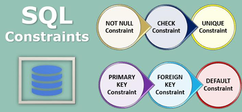

# Что такое ограничения (`constraints`)? Какие вы знаете?

---
### 🔐 Ограничения (_Constraints_)

- `NOT NULL`  
    📝 Гарантирует, что поле **не может быть пустым** (`NULL`).
    
- `UNIQUE`  
    📝 Обеспечивает **уникальность** значения в столбце.  
    ℹ️ Может допускать ограниченное количество `NULL` (_например, одна запись в некоторых СУБД_).
    
- `PRIMARY KEY` (_pkey_)  
    📝 Комбинация `NOT NULL` + `UNIQUE`. 🚀  
    Создает **кластерный индекс** и однозначно идентифицирует запись.  
    ℹ️ Таблица может иметь только один `PRIMARY KEY`.
    
- `FOREIGN KEY` (fkey)  
    📝 Создает **связь** между таблицами, ссылаясь на `PRIMARY KEY` другой таблицы.  
    ℹ️ Значение может быть `NULL`, если не наложено ограничение `NOT NULL`.
    
- `CHECK`  
    📝 Проверяет, удовлетворяет ли значение **заданному условию** или диапазону.
    
- `DEFAULT`  
    📝 Задает **значение по умолчанию** для столбца, если иное не указано.

---
### ❓ Отличия `PRIMARY KEY` от `UNIQUE`

`PRIMARY KEY`

> ✔️ Создает кластерный индекс  
> ✔️ Не допускает `NULL`  
> ✔️ Только один на таблицу

`UNIQUE`

> ✔️ Обычно создает некластерный индекс  
> ✔️ Может допускать `NULL` (_одну или несколько, в зависимости от СУБД_)



---

```
***** из методички *****
Ограничения - это ключевае слова, которые помогают 
установить правила размещения данных в базе. 
Используются при создании БД.

NOT NULL указывает, что значение не может быть пустым.
UNIQUE обеспечивает отсутствие дубликатов.
PRIMARY KEY - комбинация NOT NULL и UNIQUE. 
    Помечает каждую запись в базе данных уникальным значением.
CHECK проверяет вписывается ли значение 
    в заданный диапазон ( s_id int CHECK(s_id > 0) )
FOREIGN KEY создает связь между двумя таблицами и защищает 
    от действий, которые могут нарушить связи между таблицами. 
    FOREIGN KEY в одной таблице указывает на PRIMARY KEY в другой.
DEFAULT устанавливает значение по умолчанию, 
    если значения не предоствлено (name VARCHAR(20) DEFAULT 'noname').

Какие отличия между PRIMARY и UNIQUE?
По умолчанию PRIMARY создает кластерный индекс 
на столбце, а UNIQUE - некластерный. 
PRIMARY не разрешает NULL записей, в то время 
как UNIQUE разрешает одну (а в некоторых СУБД несколько) NULL запись.
Таблица может иметь один PRIMARY KEY и много UNIQUE.

Может ли значение в столбце, 
на который наложено ограничение FOREIGN KEY, равняться NULL?
Может, если на данный столбец не наложено ограничение NOT NULL.
```

---
