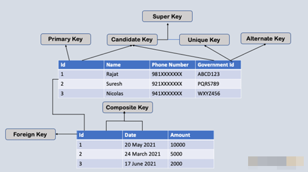

# Что такое суррогатные ключи?

---
**Определение**: Искусственно созданное, автоинкрементное _(дополнительное)_ поле для уникальной идентификации записи.

**Назначение**: Заменяет естественный ключ, не связанный с бизнес-данными.  
Служит первичным ключом `Primary Key`.

**Преимущества**:
- Простота и стабильность _(не меняется при обновлении содержательных данных)_.
- Удобство при создании связей между таблицами.

\* В таблице может быть **только один** первичный ключ.  
Если используется **суррогатный ключ**, то его следует назначить как **основной**, а **прежний** _естественный_ ключ можно определить как _уникальное ограничение (уникальный ключ)_,

---
**Пример**:

```sql
CREATE TABLE Employees (
    EmployeeID INT AUTO_INCREMENT PRIMARY KEY, -- Суррогатный ключ
    FirstName VARCHAR(50),
    LastName VARCHAR(50)
);
```

В этом примере поле `EmployeeID` автоматически генерируется и служит уникальным идентификатором каждой записи.



---

```
***** из методички *****
    Суррога́тный ключ — это дополнительное служебное поле, автоматически добавленное к уже имеющимся информационным полям таблицы, предназначение которого — служить первичным ключом. 
 
В качестве первичного ключа может использоваться:
* Естественный Ключ (ЕК) – набор атрибутов описываемой записью сущности, 
    уникально её идентифицирующий (например, номер паспорта для человека) или
* Суррогатный Ключ (СК) – автоматически сгенерированное поле, 
    никак не связанное с информационным содержанием записи. 
    
Обычно в роли СК выступает автоинкрементное поле типа INTEGER.
```

---
