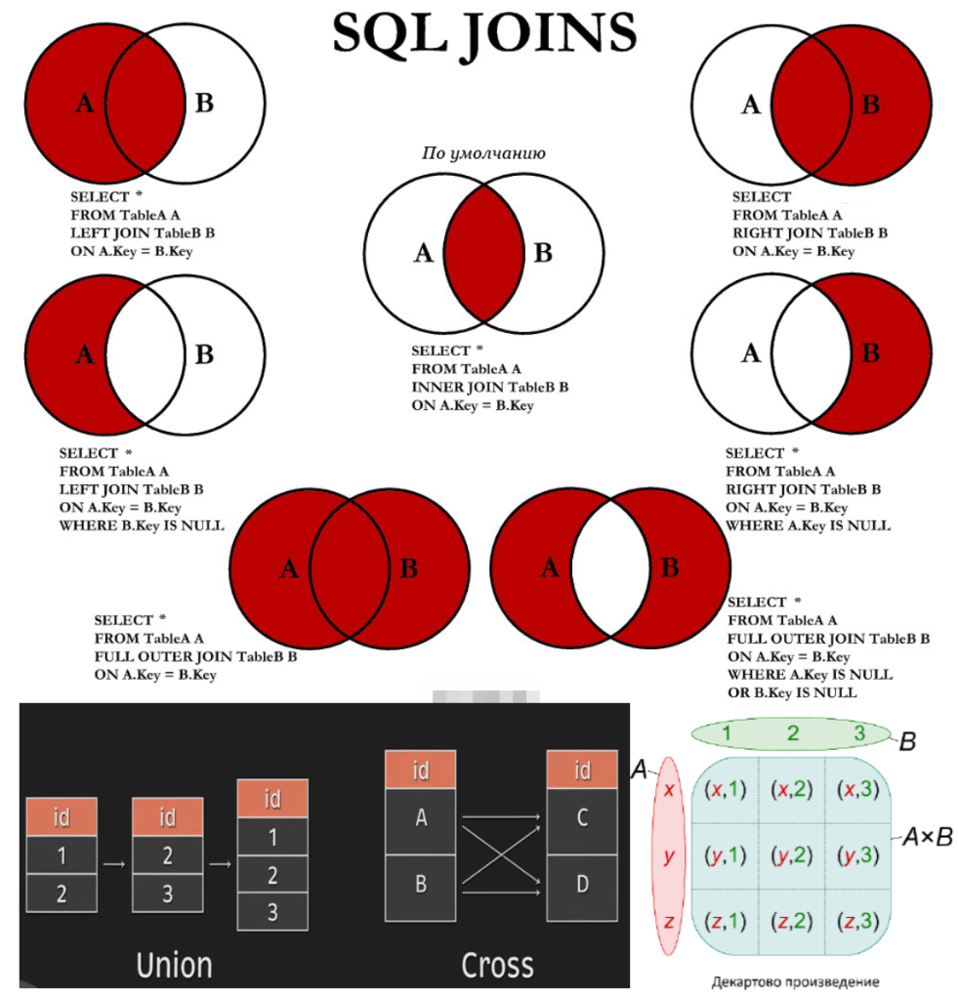
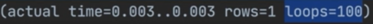
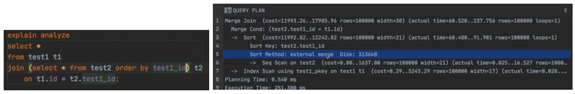

## Виды `Join`’ов?

---
**JOIN** позволяет объединять строки из двух и более таблиц на основе логической связи между их столбцами. Объединение происходит по заданному условию (обычно через конструкцию ON), что обеспечивает "склеивание" данных из разных источников в единое представление.

---
### Виды `JOIN`:
1️⃣ **Внутренний** (`INNER JOIN`)  
2️⃣ **Внешние** (`OUTER JOIN` → `LEFT`, `RIGHT`, `FULL`)  
3️⃣ **Перекрестный** (`CROSS JOIN`)  
4️⃣ **Самосоединение** (`SELF JOIN`)

---
**Особенности**:

- Порядок таблиц не играет принципиальной роли для `INNER` и `CROSS JOIN`.
- Для внешних соединений (`LEFT`, `RIGHT`) порядок определяет, какая таблица является базовой (_откуда берутся все строки_), а отсутствующие значения заменяются на `NULL`.

### 🎯 Типы JOIN и их особенности

|Тип JOIN|Возвращаемые данные|Ключевая особенность|Пример|
|---|---|---|---|
|**INNER JOIN**|Только строки, удовлетворяющие условию соединения во всех таблицах|Только те строки, где есть совпадения|`SELECT * FROM A INNER JOIN B ON A.id = B.a_id;`|
|**LEFT (OUTER) JOIN**|Все строки **левой** таблицы; правые – только при совпадении|Если совпадений нет – правые столбцы заполняются `NULL`|`SELECT * FROM A LEFT JOIN B ON A.id = B.a_id;`|
|**RIGHT (OUTER) JOIN**|Все строки **правой** таблицы; левые – только при совпадении|Если совпадений нет – левые столбцы заполняются `NULL`|`SELECT * FROM A RIGHT JOIN B ON A.id = B.a_id;`|
|**FULL (OUTER) JOIN**|Все строки **обеих** таблиц; отсутствующие значения – `NULL`|Полное объединение данных независимо от совпадений|`SELECT * FROM A FULL JOIN B ON A.id = B.a_id;`|
|**CROSS JOIN**|Декартово произведение обеих таблиц (**все возможные комбинации**)|Соединение **без условия** – итоговый набор может быть **очень большим**|`SELECT * FROM A CROSS JOIN B;`|
|**SELF JOIN**|Соединение таблицы **самой с собой**.|Полезно для иерархий (**начальник-подчиненный**).|`SELECT a.name, b.name AS manager FROM Employees a LEFT JOIN Employees b ON a.manager_id = b.id;`|

### 📌 Итог

- **`INNER JOIN`**: Возвращает **только совпадающие строки** из обеих таблиц.
- **`LEFT/RIGHT JOIN`**: Обеспечивают включение **всех строк одной из таблиц** с заполнением отсутствующих данных значениями `NULL`.
- **`FULL JOIN`**: Объединяет **все строки из обеих таблиц**, компенсируя несоответствия с помощью `NULL`.
- **`CROSS JOIN`**: Создает **все возможные комбинации**, что полезно для генерации **декартова произведения**, но требует осторожности из‑за потенциального **большого объема** результатов.
- **`SELF JOIN`**: Используется для соединения таблицы **самой с собой**, часто применяется для **иерархических структур** (_например, начальник-подчиненный_).

---




Мы говорили про логическое связывание. Поговорим про **ФИЗИЧЕСКОЕ**, т.е.

**Физическое связывание таблиц** — это конкретные **способы** выполнения операций JOIN.

- 💎 `Nested Loop` — это когда для каждой строки из одной таблицы ищется соответствующая строка в другой таблице.
    
    - Работает на **маленькой** выборке.
    - Считывает **одну** таблицу, чтобы обратиться по индексу второй.
- 💎 `Hash Join` — это когда создаётся хэш-таблица для одной из таблиц, и потом по ней происходит поиск соответствующих строк.
    
    - Работает на **больших** выборках.
    - Считывает **обе** таблицы полностью, а потом на основе второй таблицы создаёт хэш-таблицу.
    - Операция считывания которой происходит за **константное** время `О(1)` – очень быстро.
- 💎 `Merge Join` предполагает, что обе таблицы **отсортированы по ключу**, и соединение происходит путём одновременного прохода по ним.
    
    - Работает на основании отсортированных ключей.
    - Сканирует обе таблицы, сортирует, а затем быстро сравнивает элементы попарно.

Способ связывания выбирает планировщик на основании статистических и кэшированных данных (_после предыдущих запросов_).


Здесь `Nested Loop` занимался связыванием двух таблиц (_снизу-вверх: в первой поиск по индексу `p_key`, во второй использовался `full scan`, время выполнения соответствующее_). `Nested Loop` используется, когда записей не очень много, а тут есть ограничение `limit`.  
Как устроено? Идёт обычным циклом по просканированной таблице test_2, а дальше Index Condition связывает индекс из таблицы test_2 с индексом первой таблицы (id=t.test_1_id); loops=100 – это значит, что 100 раз выполняли это действие по 1 строке за указанные время и стоимость для одной записи:




Тут используется `Hash Join`. Он также состоит из двух частей. Сканирует первую таблицу, а на основании просканированной второй таблицы создаёт хэш-таблицу.

Сначала происходит **full scan** одной таблицы, но в случае второй мы уже используем не индекс. Элемент **Hash** полностью просканировал таблицу и на основании полного считывания информации создал структуру данных **Hash Table** (_хэш таблицу_). Поиск по ней происходит за константное время `О(1)`. Можно увидеть, сколько бакетов создано.

Batches: `2`, а значение `>1` означает, что оперативной памяти не хватило и часть инфо была сохранена на диск. То, что попало в **Memory** заняло около `3 мб`.

**Hash Condition** (_синяя заливка строки_) показывает, что данные довольно быстро получены. Условия связывания указаны в скобках.



Также быстрый вариант `Merge Join`. Состоит из трёх основных частей, использует **отсортированную** последовательность.

Для сканирования таблицы `test_1` использовали индекс `p_key`. Для таблицы `test_2` сначала использовали `full scan`, далее отсортировали по ключу `test_1_id`

Указан метод сортировки и количество выделенной памяти около 3 мб. Далее Merge Join обходит обычным циклом обе отсортированных последовательности (как если бы циклом for мы обходили два отсортированных массива и попарно сравнивали значения).

---

```
***** из методички *****
JOIN - оператор языка SQL, который является реализацией операции соединения реляционной алгебры. 
        Предназначен для обеспечения выборки данных из двух таблиц и включения этих данных в один 
        результирующий набор.

        Особенностями операции соединения являются следующее:

        - в схему таблицы-результата входят столбцы обеих исходных таблиц (таблиц-операндов), 
        то есть схема результата является «сцеплением» схем операндов;
        - каждая строка таблицы-результата является «сцеплением» строки из одной таблицы-операнда со 
        строкой второй таблицы-операнда;
        - при необходимости соединения не двух, а нескольких таблиц, операция соединения применяется 
        несколько раз (последовательно).
        
Какие существуют типы JOIN?
(INNER) JOIN Предполагает что в результриующий запрос попадают только те строки 
которые являются пересичением двух таблиц, которые по условию прописаны в дерективе ON 
Результатом объединения таблиц являются записи, общие для левой и правой таблиц. 
        Порядок таблиц для оператора не важен, поскольку оператор является симметричным. Дефолт - INNER

        LEFT (OUTER) JOIN Объединение которое предполагает что в результирующий запрос 
        попадают все строки из таблицы A(левой таблицы) и те строки из таблицы B у которых 
        есть пресечения с А недостоищие строки заполняются NULL.Кортежи из внутреннего соединения, 
        и не вошедшие во внутреннее соединение 
        кортежи из левого источника. Атрибуты в кортежах, которые не имеют совпадений по общим столбцам
        заполняются неопределенными значениями. Порядок таблиц для оператора важен, поскольку оператор 
        не является симметричным.

        RIGHT (OUTER) JOIN Объединение которое предполагает что в результирующий запрос попадают 
        все строки из таблицы B(правой таблицы) и те строки из таблицы А у которых есть пресечения 
        с B недостоищие строки заполняются NULL

        FULL (OUTER) JOIN Результатом объединения таблиц являются все записи, которые присутствуют в
        таблицах. Порядок таблиц для оператора не важен, поскольку оператор является симметричным. 
        Сочетание IINER - LEFT - RIGHT

        CROSS JOIN (декартово произведение) - полное соединение двух таблиц (Все - Со всем) 
        Перекрестное соединение создает декартовое произведение между двумя таблицами, 
        возвращая все возможные комбинации всех строк. Он не имеет предложения on, 
        потому что вы просто соединяете все со всем. 
        A full outer join представляет собой комбинацию a left outer и right outer join. 
        Он возвращает все строки в обеих таблицах, которые соответствуют запросу where, и в тех случаях, 
        когда условие on не может быть выполнено для этих строк, 
        оно помещает значения null для незапущенных полей.
        NATURAL JOIN  - может работать без ON
      
        Обратите внимание, в этом запросе нет необходимости указывать какие-либо критерии объединения,
        поскольку предложение NATURAL JOIN автоматически определяет столбцы, имеющие одинаковые имена 
        в обеих объединяемых таблицах, и помещает их в «скрытое» предложение USING. Если  первичные и 
        внешние ключи имеют одинаковые имена, этот подход может показаться полезным, однако это не так.     
```

---
