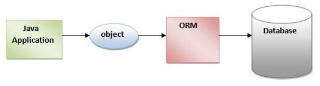
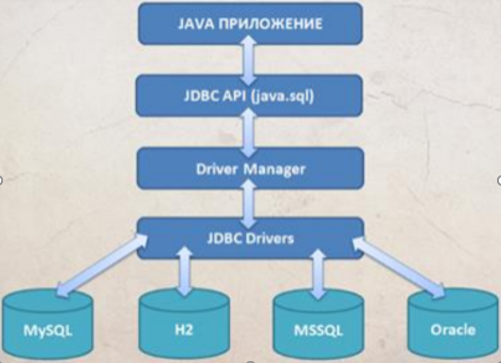
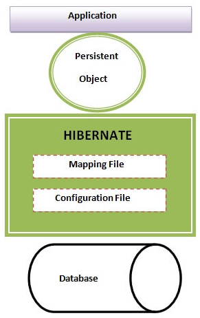
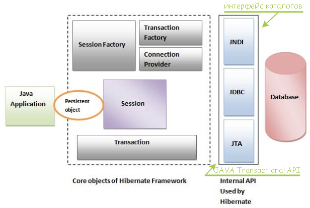
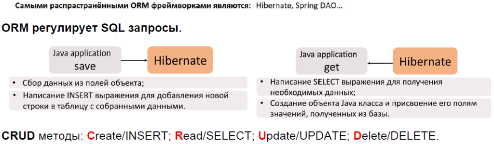

## Что такое **ORM**? Что такое **JPA**? Что такое **Hibernate**?

---
## 🔹 [Что такое `ORM`, `JPA` и `Hibernate`?](https://habr.com/ru/articles/265061/)
- 📌 [**ORM**](https://javarush.com/quests/lectures/questhibernate.level09.lecture00) (_Object Relational Mapping_) – концепция преобразования данных между **объектно-ориентированным языком** (_Java_) и **реляционной БД**.
- 📌 **JPA** (_Java Persistence API_) – спецификация ORM в _Java_, определяющая стандарты работы с БД, но не содержащая собственной реализации.  
  Реализация JPA возможна через **провайдеры**, такие как `Hibernate`, `EclipseLink`.
- 📌 **Hibernate** – популярная ORM-библиотека, реализующая JPA и предоставляющая удобные API для работы с БД.


---
### 🔹 JDBC (_Java DataBase Connectivity_)
🔗 **JDBC** – низкоуровневый API для взаимодействия с реляционными БД, входящий в стандартную библиотеку Java (_java.sql_).  
Позволяет выполнять _SQL_-запросы и обновлять данные.

### Основные сущности JDBC

#### 🔗 `Наш код` → `JDBC` → `Драйвер БД` → `База данных` → `Ответ от БД`

#### Три ключевых объекта JDBC:
1. **Connection** – отвечает за соединение с базой данных и режим работы.    
2. **Statement** – отправляет SQL-запросы на сервер.   
	>**Варианты использования:**
    > - **`Statement`** – обычный (`UPDATE`, `QUERY`).
    > - **`PreparedStatement`** – шаблон запроса с параметрами.
    > - **`CallableStatement`** – вызов хранимых процедур.
3. **ResultSet** – содержит результаты запроса в виде таблицы.

---
## Архитектура **Hibernate** _(сжато)_


### 🔹 Основные интерфейсы Hibernate
✔ **SessionFactory** – потокобезопасная фабрика `Session`, создается **один раз** при **запуске** приложения.  
✔ **Session** – обеспечивает соединение с БД, выполняет **DML**-операции, НЕ потокобезопасна, должна использоваться в пределах одного потока. [_docs.jboss.org_](https://docs.jboss.org/hibernate/orm/3.5/api/org/hibernate/Session.html?utm_source=chatgpt.com)  
✔ **TransactionFactory** – Создает объекты `Transaction`, определяя стратегию управления транзакциями.  
✔ **Transaction** – управление атомарными операциями, **абстрагирует** приложение от JDBC или JTA-транзакций.  
✔ **Query** – интерфейс для выполнения `HQL`/`SQL`-запросов.  
✔ **ConnectionProvider** – Абстракция для получения JDBC-соединений, позволяющая Hibernate взаимодействовать с различными источниками данных.


---
### 🔹 Вывод:
`Hibernate` упрощает работу с БД, предоставляя удобный **ORM-инструмент**, а  
`JPA` **стандартизирует** этот процесс.  
`JDBC` же является **низкоуровневым API**, требующим написания SQL-кода вручную.


---

```
***** из методички *****
ORM(Object Relational Mapping) - это концепция преобразования данных 
из объектно-ориентированного языка в реляционные БД и наоборот.

JPA(Java Persistence API) - это стандартная для Java спецификация, 
описывающая принципы ORM. JPA не умеет работать с объектами, 
а только определяет правила как должен действовать каждый провайдер 
(Hibernate, EclipseLink), реализующий стандарт JPA (Plain Old Java Object - POJO)
 
Hibernate - библиотека, являющаяся реализацией этой спецификации, 
в которой можно использовать стандартные API-интерфейсы JPA.

Важные интерфейсы Hibernate:
Session - обеспечивает физическое соединение между приложением и БД. 
Основная функция - предлагать DML-операции для экземпляров сущностей.

SessionFactory - это фабрика для объектов Session. 
Обычно создается во время запуска приложения и сохраняется 
для последующего использования. 
Является потокобезопасным объектом и используется всеми потоками приложения.

Transaction - однопоточный короткоживущий объект, используемый для атомарных операций. 
Это абстракция приложения от основных JDBC транзакций. 
Session может занимать несколько Transaction 
в определенных случаях, является необязательным API.

Query - интерфейс позволяет выполнять запросы к БД. 
Запросы написаны на HQL или на SQL.       

JDBC - Java DataBase Connectivity — API для работы с реляционными (зависимыми) БД. 
Платформенно независимый промышленный стандарт взаимодействия Java приложений 
с различными СУБД, реализованный в виде пакета java.sql, входящего в состав Java SE. 
Предоставляет методы для получения и обновления данных. 
Не зависит от конкретного типа базы. 
Библиотека, которая входит в стандартную библиотеу, содержит: 
набор классов и интерфейсов для работы с БД (для нас разработчиков api) 
+ интерфейсы баз данных.                     
```

---
