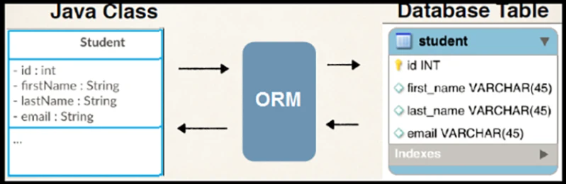

# Каким условиям должен удовлетворять класс чтобы являться Entity?

---
- [**Entity**](https://javarush.com/groups/posts/2259-jpa--znakomstvo-s-tekhnologiey#%D0%A1%D1%83%D1%89%D0%BD%D0%BE%D1%81%D1%82%D0%B8-(Entities)) — это <u>легковесный</u> хранимый объект бизнес-логики (*persistent domain object*), связанный с БД. Он управляется JPA (_например,_ `Hibernate`) и участвует в персистентном контексте;
- **Entity Class** – это *Java* класс, который отображает информацию таблицы в базе данных. Это также *POJO* класс, в котором используются *Hibernate* аннотации для связи класса с таблицей из базы данных. // [*JPA*](https://javarush.com/groups/posts/2259-jpa--znakomstvo-s-tekhnologiey#%D0%A1%D1%83%D1%89%D0%BD%D0%BE%D1%81%D1%82%D0%B8-(Entities));


- **Персистентное поле** – это поле сущности, которое отражается в БД в виде <u>столбца</u> таблицы. // В JPA персистентные поля и свойства принято называть **атрибутами класса-сущности**/ Рекомендуется вместо *Персистентное свойство*;
- **Персистентное свойство** – это <u>методы класса-сущности</u>, которые аннотированы для доступа *JPA* провайдера (*Hibernate/EclipseLink*) к данным, вместо прямого взаимодействия с полями.  // Такие методы определяют **геттеры и сеттеры**, через которые ORM читает/записывает значения в БД. //*Различия - в таблице*:
> Используйте **персистентные свойства**, если нужна дополнительная логика при работе с БД. В остальных случаях — **поля** (*проще и нагляднее*).

| Характеристика     | Персистентное <u>поле</u>  | Персистентное <u>свойство</u> |
| :----------------- | :------------------------- | :---------------------------- |
| Аннотации          | На поля (`@Id`, `@Column`) | На геттеры/сеттеры            |
| Доступ ORM         | Прямой доступ к полю       | Через методы                  |
| Гибкость           | Нет логики в get/set       | Можно добавить логику         |
| Стандартный способ | ✅ Рекомендуется            | Используется реже             |
> ℹ️ Стратегия доступа **по умолчанию** зависит от места аннотации `@Id`  
> (*если `@Id` на **поле** — `AccessType.FIELD`, если на **геттере** — `AccessType.PROPERTY`*).

---
### ✅ Требования к `Entity`-классу <u>в JPA</u>

| №                                          | Требование                                                                                                                                                                                        |
|:---------------------------------------------- |:----------------------------------------------------------------------------------------------------------------------------------------------------------------------------------------------------- |
| **✔ @Entity <br>XML конфиг**                   | Класс должен быть помечен **аннотацией** `@Entity` или описан в `XML`-файле                                                                                                                           |
| **✔ NoArgsConstructor <br>AllArgsConstructor** | Должен иметь `public` или `protected` **конструктор без аргументов** (*может иметь конструкторы с аргументами*)                                                                                       |
| **✔ top-level class**                          | Должен быть **классом верхнего уровня** (_top-level class_)                                                                                                                                           |
| **❌ Enum**                                     | **Не может быть** `enum` или `interface`                                                                                                                                                              |
| **❌ Final class**                              | **Не может быть** `final class`                                                                                                                                                                       |
| **❌ final methods <br>final variables**        | **Не должен содержать** `final` поля или методы, участвующие в маппинге                                                                                                                               |
| **✔ implements <br>Serializable**              | Если объект передаётся удалённо – должен реализовывать `Serializable`                                                                                                                                 |
| **✔ getter/setter**                            | Поля должны быть **инкапсулированы**, доступны только через методы                                                                                                                                    |
| **✔ Primary key**                              | Обязательно должен содержать **первичный ключ** (`@Id`)                                                                                                                                               |
| **✔ extends**                                  | Как обычный, так и абстрактный класс может быть Entity. Entities могут наследоваться как от не Entity классов, так и от Entity классов. А не Entity классы могут наследоваться от Entity <br>классов. |

### ✅ Требования к Entity классу <u>в Hibernate</u> <br>МЯГЧЕ, т.е. *Hibernate* не так строг. 
#### Отличия от JPA:  
- Класс сущности должен иметь конструктор без аргументов, который может быть не только **public** или **protected**, но и **package visibility** (*default*), т.е. любой модификатор:
- Класс сущности не обязательно должен быть классом **верхнего уровня**, т.е. может быть вложенным классом;
- Технически *Hibernate* может сохранять финальные классы или классы с финальными методами (*getter/setter*). Однако, как правило, это не очень хорошая идея, так как это лишит *Hibernate* возможности генерировать прокси для отложенной загрузки сущности. Т.к. *final class* не может иметь наследников, то => Hibernate не сможет создавать PROXY объекты для LAZY загрузки. 
- Hibernate не запрещает разработчику приложения открывать прямой доступ к переменным экземпляра и ссылаться на них извне класса сущности, однако обоснованность такого подхода спорна.

---
## 💡 Подробнее:
- 🔖 **Аннотация `@Entity`** — обязательна для JPA.
- 🧱 **Конструктор без аргументов** — нужен для создю экземпляра <u>ч-з рефлексию</u>.
- 🧭 **Класс верхнего уровня** — вложенные (`static`) или анонимные классы <u>не допускаются</u>.
- 🚫 **Нет `final`, `enum`, `interface`** — *Entity* должна быть <u>изменяемой и полноценной</u>.
- 💾 **Serializable** — если объект будет <u>передаваться</u> через удалённые интерфейсы.
- 🛡️ **Инкапсуляция** — защита полей: прямой доступ из внешних классов <u>запрещён</u>.
- 🔑 **Первичный ключ** — без него *Entity* не сможет быть однозначно идентифицирована в БД.

---
### 📌 Коротко:
**Персистентность** (_Persistence_) — это способность данных **сохраняться** после **завершения** процесса, который их создал.

> **Persistence Context** — это <u>механизм JPA</u>, который:   
> - управляет состоянием сущностей,   
> - отслеживает изменения объектов (dirty checking),   
> - синхронизирует объекты с базой данных,   
> - работает как кэш первого уровня.   

> **Entity** — это <u>POJO-класс</u>, который:  
✔ Аннотирован `@Entity`   
✔ Содержит первичный ключ   
✔ Имеет конструктор без аргументов   
✔ Не финальный и не вложенный   
✔ Инкапсулирует поля   
✔ Может сериализоваться при необходимости   

---

```
***** из методички *****
Entity это легковесный хранимый объект бизнес логики. 
Основная программная сущность это entity-класс, который так же может использовать 
дополнительные классы, которые могут использоваться как вспомогательные классы 
или для сохранения состояния еntity.

1) Entity класс должен быть помечен аннотацией Entity или описан в XML файле
2) Entity класс должен содержать public или protected конструктор без аргументов 
    (он также может иметь конструкторы с аргументами) - при получении данных 
    из БД и формировании из них объекта сущности, 
    Hibernate должен создать этот самый объект сущности,
3) Entity класс должен быть классом верхнего уровня (top-level class),
4) Entity класс не может быть enum или интерфейсом,
5) Entity класс не может быть финальным классом (final class),
6) Entity класс не может содержать финальные поля или методы, если они участвуют 
    в маппинге (persistent final methods or persistent final instance variables),
7) Если объект Entity класса будет передаваться по значению как отдельный объект 
    (detached object), например через удаленный интерфейс (through a remote interface), 
    он так же должен реализовывать Serializable интерфейс (чтобы объекты которые достаются 
    из базы могли сохраняться в кэше).
8) Поля Entity класс должны быть напрямую доступны только методам самого Entity класса 
    и не должны быть напрямую доступны другим классам, использующим этот Entity. 
    Такие классы должны обращаться только к методам (getter/setter методам 
    или другим методам бизнес-логики в Entity классе),
9) Entity класс должен содержать первичный ключ, то есть атрибут или группу атрибутов 
    которые уникально определяют запись этого Entity класса в базе данных

Персистентность в программировании означает способность состояния существовать дольше, 
    чем процесс, создавший его. 

Persistence context — это среда в которой экземпляры сущностей синхронизируются 
    с аналогичными сущностями в базе данны

Entity (Сущность) — POJO-класс, связанный с БД ( не финальный класс верхнего уровня 
    помеченный аннотацией @Entity, содержащий первичный ключ, пустой public 
        или protected конструктор, и доступ к полям, должен быть доступен для других 
        классов только через getter/setter (или другим методам бизнес логики) 
```

---
