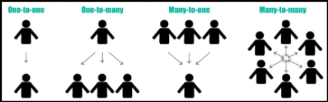

# Какие есть виды связей?

---


## 🔗 [Виды связей](https://javarush.com/groups/posts/2259-jpa--znakomstvo-s-tekhnologiey#Mapping) (_Relationships_) в _JPA_

|**Тип связи**|**Описание**|
|---|---|
|`@OneToOne`|**Один** объект связан с **одним** другим объектом|
|`@OneToMany`|**Один** объект связан с **множеством** других объектов|
|`@ManyToOne`|**Много** объектов ссылаются на **один** объект (обратная сторона `OneToMany`)|
|`@ManyToMany`|Объекты ссылаются **друг** на **друга** во множественном числе|
### 🔄 Направленность связей:

|**Вид**|**Описание**|
|---|---|
|**UniDirectional**|Связь **одно**сторонняя: только **одна** сущность содержит ссылку на другую|
|**BiDirectional**|Связь **дву**сторонняя: **обе** сущности ссылаются друг на друга, используется `mappedBy`|
> 🔧 **mappedBy** — указывается на _не-владеющей_ стороне  
> 	и ссылается на имя поля в _владеющей_ стороне связи.

- **Владеющая сторона** управляет внешним ключом и обновлением связи.
- Только **владеющая сторона** влияет на результат `persist()`, `merge()` и `remove()`.

---

```
***** из методички *****
Существуют 4 типа связей:
1. OneToOne - когда один экземпляр Entity может быть связан 
    не больше чем с одним экземпляром другого Entity.
2. OneToMany - когда один экземпляр Entity может быть связан 
    с несколькими экземплярами других Entity.
3. ManyToOne - обратная связь для OneToMany. Несколько экземпляров Entity 
    могут быть связаны с одним экземпляром другого Entity.
4. ManyToMany - экземпляры Entity могут быть связаны с несколькими экземплярами друг друга.

Каждую из которых можно разделить ещё на два вида:
1. Bidirectional Владеемая сторона в двунаправленных отношениях должна ссылаться 
    на владеющую сторону используя элемент mappedBy аннотаций 
    @OneToOne, @OneToMany, или @ManyToMany. 
    Элемент mappedBy определяет поле в объекте, который является владельцем отношения.
2. Undirectional В однонаправленных отношениях только одна сущность имеет поле, 
    которое ссылается на вторую сущность. Вторая сущность (сторона) 
    не имеет поля первой сущности и не знает об отношениях. 
    Элемент mappedBy определяет поле в объекте, который является владельцем отношения.

Bidirectional (Двунаправленные отношения) — ссылка на связь устанавливается у всех Entity, 
    то есть в случае OneToOne A-B в Entity A есть ссылка на Entity B, 
    в Entity B есть ссылка на Entity A. 
    Entity A считается владельцем этой связи (это важно для случаев 
    каскадного удаления данных, тогда при удалении A также будет удалено B, но не наоборот).
Undirectional- ссылка на связь устанавливается только с одной стороны, 
    то есть в случае OneToOne A-B только у Entity A будет ссылка на Entity B, 
    у Entity B ссылки на A не будет.
```

---
