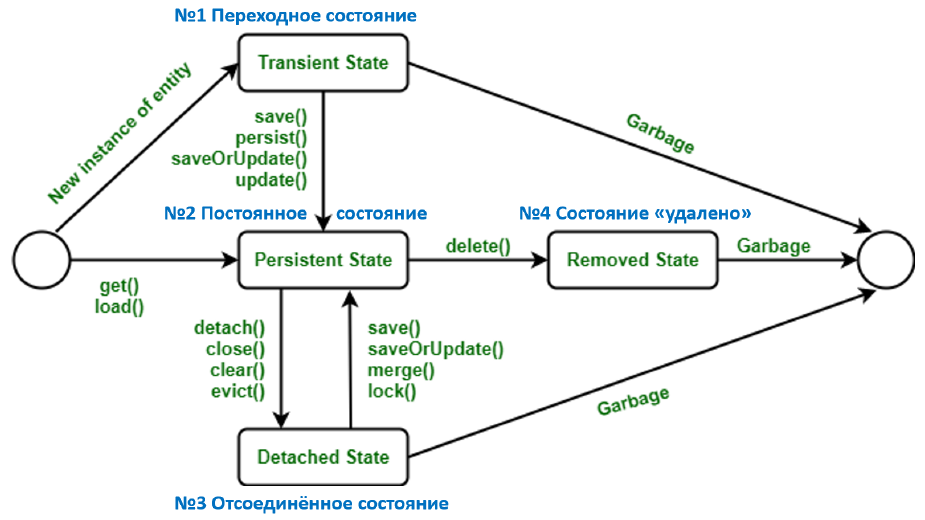
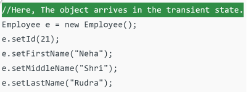
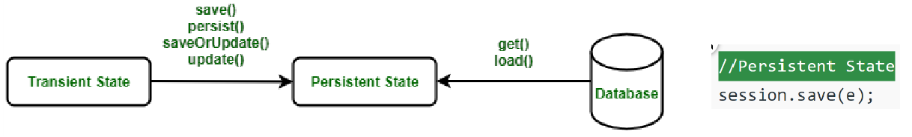
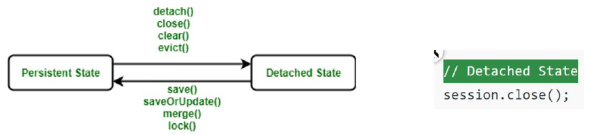
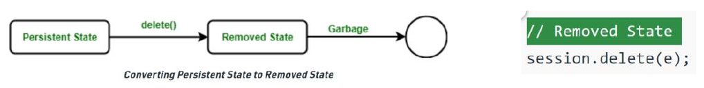

# Какие **четыре статуса жизненного цикла** `Entity` объекта (*Entity Instance’s Life Cycle*) вы можете перечислить?

---
## 🔄 Жизненный цикл `Entity` в *JPA*

| **Состояние**                                 | **Описание**                                                                                                                                                                                                                                                                                                                 |
| --------------------------------------------- | ---------------------------------------------------------------------------------------------------------------------------------------------------------------------------------------------------------------------------------------------------------------------------------------------------------------------------- |
| 🆕  <br>**`Transient`**  <br>_(Переходное)_   | — Сущность **только что создана** (`new`)  <br>— Не связана с БД/ `persistence context`  <br>— Не имеет `ID`  <br>**Возможен** переход в `Managed`:  <br>`persist()` -> **`Managed`** , если объект ранее **не имел** `ID`  <br>`merge()` -> **`Managed`**, но создаётся **новый объект, НЕ текущий** экземпляр!             |
| ✅  <br>**`Managed`**  <br>_(Управляемое)_     | — Сущность **связана** с `Persistence Context`  <br>— Управляется `EntityManager`  <br>— Будет автоматически сохранена **при коммите**.  <br>**Возможно**:  <br>* **удалить**: `remove()` → **`Removed`**  <br>* **отсоединить**: `close()` или `clear()` → **`Detached`**                                                   |
| 🔌  <br>**`Detached`**  <br>_(Отсоединённое)_ | — Сущность **имеет ID**, но **вне** `Persistence Context`  <br>— Изменения **не сохраняются автоматически**  <br>**Возможно**:  <br>* **подключить обратно** — `merge()` → создаётся управляемый экземпляр (_а **не текущий**!_)  <br>* **найти заново** — `find()` вернёт **новый** `Managed`, текущий останется `Detached` |
| 🗑  <br>**`Removed`**  <br>_(Удалённое)_      | — Сущность **помечена на удаление** (`em.remove(entity)`)  <br>— Всё ещё `Managed`**но** будет удалён из БД **при коммите**.                                                                                                                                                                                                 |
### 📝 Переходы между состояниями:
**`new`** → `persist()` → **`Managed`**
**`Managed`** → `detach()` → **`Detached`**
**`Managed`** → `remove()` → **`Removed`** → **`Detached`** (_после коммита_)

[](https://github.com/yury-connect/ITM_task026_Java_Podgotovka_k_INTERVJU/blob/by_questions/ITM/ITM05_Hibernate/imgs/2025-04-08_18-02-16.png)

> **Переходы между этими состояниями осуществляются с помощью методов `EntityManager`:**
> 
> - **`persist(entity)`**: Переводит сущность из состояния **Transient** в **Managed**.  
>     Если сущность уже **Managed**, метод игнорируется.  
>     Если сущность **Removed**, она снова становится **Managed**.
> - **`remove(entity)`**: Переводит сущность из состояния **Managed** в **Removed**.  
>     Если сущность **Detached** или **Transient**, выбрасывается исключение `IllegalArgumentException`.
> - **`merge(entity)`**: Объединяет состояние переданной сущности  
>     с существующей управляемой сущностью или создаёт новую управляемую копию.  
>     Возвращает управляемую сущность.  
>     Если исходная сущность была **Detached**, она остаётся в этом состоянии.
> - **`detach(entity)`**: Переводит сущность из состояния **Managed** в **Detached**, прекращая её отслеживание контекстом персистенции.
> - **`find(entityClass, primaryKey)`**: Если сущность с указанным ключом существует в контексте персистенции, возвращает её.  
>     В противном случае загружает сущность из базы данных и делает её **Managed**.
> - **`refresh(entity)`**: Обновляет состояние **Managed** сущности, перезагружая данные из базы данных.

---

| Операция    | New (новый)                                                                                                                                                      | Managed (управляемый)                                                                                                                                    | Detached (отсоединённый)                                                                                                                                              | Removed (удалённый)                                                        |
| :---------- | :--------------------------------------------------------------------------------------------------------------------------------------------------------------- | :------------------------------------------------------------------------------------------------------------------------------------------------------- | :-------------------------------------------------------------------------------------------------------------------------------------------------------------------- | :------------------------------------------------------------------------- |
| **persist** | `new` → `managed`, объект будет сохранен в базу при `commit`-е транзакции или в результате `flush`-операции.                                                     | `managed` → операция **игнорируется**, однако связанные `entity` могут поменять статус на `managed`, если аннотации каскадных изменений.                 | `detached` → **exception** сразу или на этапе `commit`-а транзакции (*так как у `detached` уже есть первичный ключ*).                                                 | `removed` → `managed` (*возврат в управляемый статус*)                     |
| **remove**  | new → операция игнорируется, однако связанные entity могут поменять статус на removed, если у них есть аннотации каскадных изменений и они имели статус managed. | managed → removed, и запись в базе данных будет удалена при commit-е транзакции (также произойдут операции remove для всех каскадно зависимых объектов). | ❌ **Exception** detached → exception сразу или на этапе commit-а транзакции.                                                                                          | removed → операция игнорируется                                            |
| **merge**   | new → будет создана новая managed entity, в которую будут скопированы данные объекта.                                                                            | managed → операция игнорируется, однако операция merge сработает на каскадно зависимых entity, если их статус не managed.                                | detached → либо данные будут скопированы в существующую БД managed entity с тем же первичным ключом, либо создана новая managed entity, в которую скопируются данные. | ❌ **Exception** removed → Ехception сразу или на этапе commit-а транзакции |
| **refresh** | ❌ **Exception**                                                                                                                                                  | managed → будут восстановлены все изменения из базы данных данного entity, также произойдет refresh всех каскадно зависимых объектов.                    | ❌ **Exception**                                                                                                                                                       | ❌ **Exception**                                                            |
| **detach**  | ❌ **Exception** (*не имеет смысла*) `new` → операция игнорируется                                                                                                | `managed` → `detached` (*больше не отслеживается*)                                                                                                       | `detached` → операция игнорируется. (уже `detached`)                                                                                                                  | `removed` → `detached` (прекращает отслеживание)                           |
### Пояснения:
1. **New** — объект создан, но ещё не привязан к контексту (`em.contains(entity) == false`).    
2. **Managed** — объект привязан к контексту (изменения отслеживаются).    
3. **Detached** — объект был `managed`, но контекст закрыт или вызван `detach()`.    
4. **Removed** — объект помечен на удаление (`em.remove()`), но ещё не удалён из БД.    
### Особенности:
- **Каскадные операции** — работают только если указано `cascade = CascadeType.ALL` (или конкретная операция) в аннотации `@OneToMany`/`@ManyToOne`.    
- **Исключения** — чаще всего `IllegalArgumentException` или `PersistenceException`.    
- **Refresh** — актуален только для `managed`-объектов (перезагружает данные из БД).    

---
# Подробно:
## ====Расскажи про жизненный цикл сущности Entity, перечисли четыре статуса ЖЦ Entity объекта (*Entity Instance’s Life Cycle*).====

## Этап №1 **New**, <br>переходное состояние (*Transient State*) 
### Объект создан, **не** имеет `primary key`, **не** является частью контекста персистентности (*не управляется JPA*);  
Переходное состояние — это **первое** состояние объекта сущности. Когда мы создаем объект *POJO* класса с помощью оператора `new`, объект находится в *переходном* 
состоянии. Этот объект <u>не связан</u> ни с одной сессией, следовательно это состояние не связано <u>ни с одной таблицей</u> БД. Итак, если мы внесем какие-либо изменения в данные класса *POJO*, таблица базы данных <u>не изменится</u>. Временные объекты не зависят от *Hibernate* и существуют в куче памяти.

## Этап №2 **Managed**, <br>постоянное состояние (*Persistent State*) 
### Объект создан, имеет `primary key`, является частью контекста персистентности (*управляется JPA*); 
Как только объект подключается к сессии, он переходит в **постоянное** состояние.  
Есть два способа преобразовать переходное состояние в постоянное состояние:  
- Используя сессию, **сохранить** объект сущности в таблице базы данных. 
- Используя сессию, **загрузить** объект сущности в таблицу базы данных. 
В этом состоянии. Каждый объект представляет собой одну строку в таблице БД. Следовательно, если внести какие-либо изменения в данные, то *hibernate* <u>обнаружит это и внесет изменения в таблицу</u> базы данных


## Этап №3 **Detached**, <br>отсоединённое состояние (*Detached State*) 
### Объект создан, имеет `primary key`, не является (*или больше не является*) частью контекста персистентности (н*е управляется JPA*);
Для преобразования объекта из постоянного в отсоединенное состояние нужно либо закрыть сессию, либо очистить кеш. Поскольку сессия будет закрыта или кеш очищен, любые изменения, внесенные в данные, не повлияют на таблицу  базы данных. При необходимости отсоединенный объект можно повторно подключить к новой сессии.


## Этап №4 **Removed**, <br>состояние «**удалено**» (*Removed State*) 
### Объект создан, является частью контекста персистентности (*управляется JPA*), будет удален при *commit*-е транзакции (*закрытии сессии или вызове метода `flush()`*). 
В жизненном цикле спящего режима это последнее состояние. Когда объект сущности удаляется из базы данных, объект сущности находится в удаленном состоянии. Это делается путем вызова операции `delete()`. Поскольку *Entity* объект находится в удаленном состоянии, любое изменение данных <u>не повлияет на таблицу</u> базы данных.


---
## Примеры кода:

```java
// Пример перехода Transient -> Managed
EntityManager em = emf.createEntityManager();
em.getTransaction().begin();
Person person = new Person();
person.setName("Иван");
em.persist(person); // Теперь person в состоянии Managed
em.getTransaction().commit();
em.close();
```

```java
// Пример перехода Managed -> Detached
EntityManager em = emf.createEntityManager();
em.getTransaction().begin();
Person person = em.find(Person.class, 1L); // person в состоянии Managed
em.detach(person); // Теперь person в состоянии Detached
em.getTransaction().commit();
em.close();
```

```java
// Пример перехода Detached -> Managed
EntityManager em = emf.createEntityManager();
em.getTransaction().begin();
Person detachedPerson = new Person();
detachedPerson.setId(1L);
detachedPerson.setName("Пётр");
Person managedPerson = em.merge(detachedPerson); // managedPerson в состоянии Managed
em.getTransaction().commit();
em.close();
```

---

```
***** из методички *****
Transient (New) — свежесозданная оператором new() сущность не имеет связи с базой данных, 
не имеет данных в базе данных и не имеет сгенерированных первичных ключей.

managed - объект создан, сохранён в бд, имеет primary key, управляется JPA
detached -объект создан, имеет primary key, не является (или больше не является) 
    частью контекста персистентности (не управляется JPA);
removed - объект создан, управляется JPA, будет удален при commit-е и статус станет опять detached
```

---
