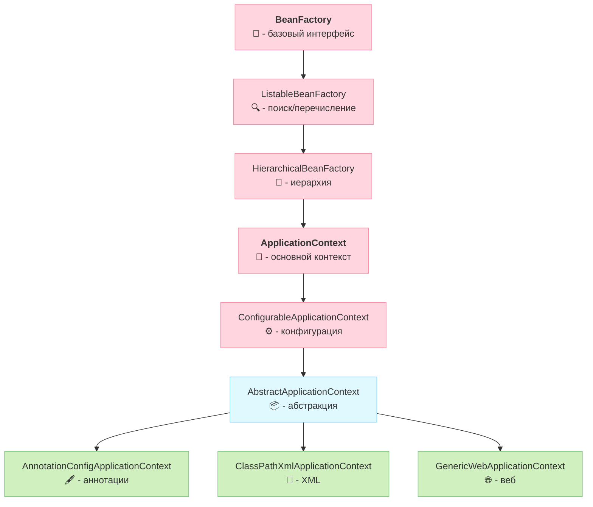

# Хранение бинов в **ApplicationContext**

**ApplicationContext** — это центральный интерфейс в Spring, 
который предоставляет <u>конфигурацию</u> и управление <u>жизненным циклом бинов</u>. 
По сути, это "умная" фабрика бинов.
[`ApplicationContext` *кратко*](/Documents/ITM_academy/itm06_Spring/additionally/ApplicationContext_кратко.md)
## **Как он хранит бины:**
1. **Контейнер Singleton-бинов (`DefaultSingletonBeanRegistry`):**    
    - Большинство бинов (по умолчанию) имеют скоуп `singleton`.        
    - Spring хранит их в `ConcurrentHashMap` (конкретно — `singletonObjects`).        
    - Ключ — это имя бина (String), значение — готовый объект (сам экземпляр вашего класса).
```java
// Упрощённый вид внутри Spring
public class DefaultSingletonBeanRegistry {

    // Основная мапа с готовыми singleton-бинaми
    private final Map<String, Object> singletonObjects = 
	    new ConcurrentHashMap<>(256);
    
    // Дополнительные мапы для решения циклических зависимостей:
    // ранние ссылки (объект уже создан, но ещё не полностью инициализирован)
    private final Map<String, Object> earlySingletonObjects = 
	    new ConcurrentHashMap<>(16);   
    private final Map<String, ObjectFactory<?>> singletonFactories = 
	    new ConcurrentHashMap<>(16); // фабрики для early exposure
}
```
      
2. **Контейнер Prototype-бинов:**    
    - Для скоупа **prototype** Spring **не хранит** бин после создания. Новый экземпляр создаётся при каждом запросе getBean() и сразу отдаётся клиенту.
    
3. **Дополнительные структуры:**    
    - `BeanDefinitionRegistry` — хранит `BeanDefinition` (*рецепт создания бина*).
    - Aliases Map        
    - Кэши для ускорения доступа, для типов, ResolvableDependencies и т.д..

**Процесс получения бина из контекста:**  
Когда вы пишете `context.getBean("myService")`, Spring выполняет `singletonObjects.get("myService")` (*для singleton*) и возвращает готовый объект..

---
## Что еще хранится в **ApplicationContext**
1. **`BeanDefinition`**’ы (класс, scope, зависимости, init/destroy методы и т.д.).  
2. **Aliases Map:** Хранит псевдонимы для бинов (если вы дали бину несколько имен).    
3. **ResolvableDependencies:** Информация для резолва/ внедрения зависимостей по типам.    
### Наглядный пример (как это выглядит в памяти)
Допустим, у вас есть класс:
```java
@Component
public class UserService {
    @Autowired
    private OrderService orderService;
}
```
В момент старта приложения в `ApplicationContext` (в `DefaultListableBeanFactory`) создаются/хранятся (внутри ApplicationContext):
1. **Ключ:** `"userService"` : **Значение:** `com.example.UserService@1234` (сам объект)    
2. **Ключ:** `"orderService"` : **Значение:** `com.example.OrderService@5678` (сам объект)    
3. **Отдельно в другом реестре:** `BeanDefinition` для UserService: `scope=singleton`, `beanClass=UserService`, `autowired=byType` и т.д. // Отдельный BeanDefinition для каждого бина (с метаданными)   
4. **В поле объекта UserService:** лежит ссылка на `orderService` (которую Spring туда положил через рефлексию).    

---
### Резюме для собеседования

Если спросят "Как хранятся бины?", можно ответить так:
> - Синглтон-бины хранятся в `ConcurrentHashMap` внутри `DefaultSingletonBeanRegistry`.
> - Ключом является имя бина, а значением — готовый объект (либо `ObjectFactory` для решения циклических зависимостей). 
> - `ApplicationContext` хранит не только сами бины, но и их метаданные (`BeanDefinition`) в отдельных реестрах. Это позволяет Spring управлять их жизненным циклом, применять постпроцессоры и внедрять зависимости. 
> - В отличие от `BeanFactory`, `ApplicationContext` по умолчанию преинициализирует все `singleton`-бины при старте приложения

---
## 🌈 Визуальная иерархия <br>интерфейсов `ApplicationContext`


## 🔑 Ключевые дополнения `ApplicationContext`
#### 1. 🔽 Упрощенная работа с конфигурацией 🔽
> - **Автоматическое сканирование компонентов**  
    Поддержка аннотаций (`@Component`, `@Service`, `@Repository`) через `@ComponentScan`.
>    
>- **Поддержка Java Config**  
    Работа с `@Configuration` и `@Bean` **без** XML.
>    
>- **Импорт конфигураций**  
    Возможность объединять конфиги через `@Import`.

#### 2. 🔽 Управление жизненным циклом 🔽
>- **Автоматическая регистрация `BeanPostProcessor` и `BeanFactoryPostProcessor`**  
    В `BeanFactory` их нужно регистрировать вручную.
>    
>- **Автоматический вызов `@PostConstruct` и `@PreDestroy`**  
    В `BeanFactory` эти аннотации не обрабатываются без дополнительной настройки.

#### 3. 🔽 Интеграция с AOP 🔽
>- **Автоматическое создание AOP-прокси**  
    Для `@Transactional`, `@Cacheable` и других аспектов.

#### 4. 🔽 Доступ к ресурсам и интернационализация 🔽
> - **Унифицированный API для ресурсов**  
    Методы `getResource()` для работы с _файлами, URL, classpath_:
```java
Resource resource = context.getResource("classpath:config.properties");
```
>
>- **Интернационализация (_i18n_)**  
    Поддержка MessageSource для локализованных сообщений:
```java
String msg = context.getMessage("greeting", null, Locale.ENGLISH);
```

#### 5. 🔽 Событийная модель (Event Publishing) 🔽
> - **Публикация и обработка событий**  
    Например, уведомления о старте/остановке контекста:
```java
// Публикация события
context.publishEvent(new MyCustomEvent());

// Обработчик
@EventListener
public void handleEvent(MyCustomEvent event) { ... }
```

#### 6. 🔽 Интеграция с веб-средой 🔽
> - **Поддержка веб-приложений**  
    Специальные реализации `WebApplicationContext` для:
	    - Доступа к `ServletContext`
	    - Scope `request` и `session`
	    - Загрузки ресурсов через `/WEB-INF`

#### 7. 🔽 Профили и окружение 🔽
> - **Управление профилями (`@Profile`)**  
    Активация бинов в зависимости от окружения:
```java
@Profile("prod")
@Service
public class ProdService { ... }
```
>
> - **Доступ к переменным окружения** Через `Environment` API:
```java
String dbUrl = context.getEnvironment().getProperty("db.url");
```

---
[`ApplicationContext` *кратко*](/Documents/ITM_academy/itm06_Spring/additionally/ApplicationContext_кратко.md)
