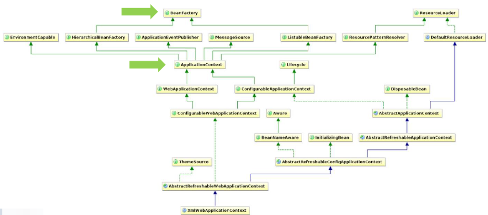

# Расскажите про [ApplicationContext](Documents/ITM_academy/itm06_Spring/additionally/ApplicationContext) и [BeanFactory](Documents/ITM_academy/itm06_Spring/additionally/BeanFactory), чем отличаются? В каких случаях что стоит использовать?

---
### 🔍 [`ApplicationContext`](Documents/ITM_academy/itm06_Spring/additionally/ApplicationContext) vs [`BeanFactory`](Documents/ITM_academy/itm06_Spring/additionally/BeanFactory)


### 🧠 Суть:

| Компонент            | Назначение                                                                                                                                          |
| :------------------- | :-------------------------------------------------------------------------------------------------------------------------------------------------- |
| `BeanFactory`        | 💡 Базовый `IoC`-контейнер (_легковесный_) — **управляет** бинами и **внедряет** зависимости.                                                       |
| `ApplicationContext` | 🚀 **Расширенный** контейнер — включает весь функционал `BeanFactory` + _enterprise_-фичи.  <br>**Доступен только для чтения во время выполнения.** |

---

> **🔍 ApplicationContext предоставляет:**> 
> - 🧩 Фабричные методы *бина* для доступа к компонентам приложения
> - 📁 Возможность загружать файловые ресурсы в общем виде
> - 📢 Публикацию событий и регистрацию слушателей
> - 🌐 Интернационализацию через *MessageSource*
> - 🧬 Наследование от родительского контекста

### 📊 Сравнительная таблица: `BeanFactory` vs `ApplicationContext`

| 🔧 Категория                             | 💚 `ApplicationContext`                                                                  | 🟢 `BeanFactory`                                                                |
| :--------------------------------------- | :--------------------------------------------------------------------------------------- | :------------------------------------------------------------------------------ |
| 📦 Загрузка бинов                        | 🚀 Проактивно — бины создаются<br> при старте контейнера                                 | 💤 Лениво — бин создаётся<br> при вызове `getBean()`                            |
| 📄 Загрузка конфигураций                 | ✅ Несколько `XML`-файлов<br> (_массив_)                                                  | ❌ Один XML-файл                                                                 |
| 🔄 Регистрация BeanPostProcessor         | ✅ Автоматическая                                                                         | ❌ Ручная                                                                        |
| 🔄 Регистрация BeanFactoryPostProcessor  | ✅ Автоматическая                                                                         | ❌ Ручная                                                                        |
| 🧬 Внедрение зависимостей по аннотациям  | ✅ `@Autowired`, <br>`@PreDestroy`, и др.                                                 | ❌ Не поддерживается                                                             |
| 🌐 Интернационализация (MessageSource)   | ✅ Да                                                                                     | ❌ Нет                                                                           |
| 📢 Публикация событий (ApplicationEvent) | ✅ Да                                                                                     | ❌ Нет                                                                           |
| 🏢 Корпоративные сервисы                 | ✅ Поддержка `JNDI`, `EJB`, `RMI` и др.                                                   | ❌ Нет                                                                           |
| 🧪 Поддержка всех скоупов                | ✅ Полная поддержка: <br>`singleton`, `prototype` и др.                                   | ❌ Ограниченно                                                                   |
| 💻 Пример инициализации                  | `ApplicationContext ctx = new ClassPathXmlApplicationContext("dao.xml", "service.xml");` | `BeanFactory factory = new XmlBeanFactory(new ClassPathResource("beans.xml"));` |

---
### 🤔 Когда использовать?

|Использовать...|Когда:|
|:--|:--|
|🪶 `BeanFactory`|➤ Нужен **минимальный overhead** (_например, в IoT/моб. среде_)|
|🚀 `ApplicationContext`|➤ Стандарт в **enterprise-приложениях**, почти всегда используется|

#### 📌 Рекомендации:

|Сценарий|Рекомендация|
|:--|:--|
|Простое приложение, без аннотаций|`BeanFactory`|
|Современное приложение на Spring|`ApplicationContext`|
|Нужно слушать события|`ApplicationContext`|
|Поддержка i18n|`ApplicationContext`|
|Масштабируемость и расширяемость|`ApplicationContext`|

---
### 💡 Вывод:
- **BeanFactory** — минимальный контейнер, полезен для тестов и простых задач, где важна ленивая инициализация.    
- **ApplicationContext** — полноценный фреймворк, используется везде, где нужно:    
    - события,
    - аннотации,
    - интернационализация,
    - интеграция с корпоративными сервисами,
    - удобство и расширяемость.

---
#### 🧠 лайфхак:
###### `BeanFactory` — как ручная коробка передач: работает, но требует усилий.
###### `ApplicationContext` — это автомат с круиз-контролем, подогревом сидений и кофе ☕💅

---
###### _"Переусложнённая конфигурация — это не гибкость, это отчаяние."_

---

```
***** из методички *****
* ApplicationContext является наследником BeanFactory и полностью реализует его функционал, добавляя больше специфических enterprise-функций. Может работать с бинами всех скоупов.
* BeanFactory - это фактический контейнер, который создает, настраивает и управляет рядом bean-компонентов. Эти бины обычно взаимодействуют друг с другом и, таким образом, имеют зависимости между собой. Эти зависимости отражены в данных конфигурации, используемых BeanFactory. Может работать с бинами singleton и prototype. BeanFactory обычно используется тогда, когда ресурсы ограничены (мобильные устройства), так как он легче по сравнению с ApplicationContext. Поэтому, если ресурсы не сильно ограничены, то лучше использовать ApplicationContext.
  
ApplicationContext загружает все бины при запуске, а BeanFactory по требованию. 
```

---
