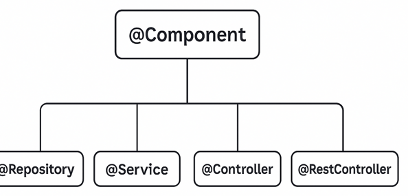
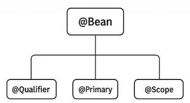

## Чем отличаются аннотации `@Bean` и `@Component`?

---
### 💥 `@Bean` vs `@Component` — в чём разница?

| 🔸 Характеристика   | `@Component`                             | `@Bean`                                                       |
| ------------------- | ---------------------------------------- | ------------------------------------------------------------- |
| 📌 Где используется | На **классе**                            | На **методе** в классе `@Configuration`                       |
| 🧠 Подход           | **Автоматическое** создание бина         | **Явное** создание и конфигурация вручную                     |
| 🔍 Обнаружение      | Через `@ComponentScan`                   | Через `@Configuration`                                        |
| 🧬 Гибкость         | Меньше контроля над созданием            | Полный контроль (_можно передать параметры, вызывать логику_) |
| 👪 Наследники       | `@Service`, `@Repository`, `@Controller` | Нет                                                           |



```
@Component  
├── @Repository      — слой DAO (работа с БД + обработка исключений)  
├── @Service         — бизнес-логика (сервисный слой)  
└── @Controller      — обработка HTTP-запросов (MVC слой)
     └── @RestController — REST API (возврат JSON/данных вместо представлений)
```
### 🔍 Объяснение аннотаций:

#### ✅ `@Component`
- Общая аннотация для любого _Spring Bean_.
- Используется, если нет более специфичной аннотации.
- Участвует в _component scanning_.

#### 🛢️ [`@Repository`](Documents/ITM_academy/itm06_Spring/additionally/@Repository)
- Для DAO-классов, работающих с базами данных.
- Автоматически оборачивает исключения в DataAccessException.

#### ⚙️ [`@Service`](Documents/ITM_academy/itm06_Spring/additionally/@Service)
- Обозначает бизнес-логику.
- Никакой "магии", только семантическое обозначение.

#### 🌐 [`@Controller`](Documents/ITM_academy/itm06_Spring/additionally/@Controller)
- Указывает, что класс — **веб-контроллер**.
- Обрабатывает HTTP-запросы.
- Используется в _Spring MVC_.

#### 🛰️ [`@RestController`](Documents/ITM_academy/itm06_Spring/additionally/@RestController)
- Расширяет `@Controller`.
- Автоматически добавляет `@ResponseBody` ко всем методам.
- Для построения **REST API**.

---

В центре `@Bean`. Она используется в классах, помеченных `@Configuration`, чтобы **вручную** определить `Bean` в контексте _Spring_.  
Вокруг неё — аннотации, которые модифицируют или уточняют поведение этих бинов:


#### 🏗️ Логическая иерархия вокруг `@Bean`
```css
@Bean  
├── @Qualifier  — уточняет, какой бин внедрить  
├── @Primary    — назначает бин "по умолчанию"  
└── @Scope      — задаёт область видимости бина
```

### 🔍 Объяснение:
#### ✅ `@Bean`
- Объявляет метод, создающий Spring-managed Bean.
- Используется в классах с `@Configuration`.

#### 🎯 `@Qualifier`
- Уточняет, **какой именно бин** внедрять, если есть несколько одного типа.
- Пример: `@Autowired` `@Qualifier("beanName")`.

#### 🥇 `@Primary`
- Делает бин приоритетным (**по умолчанию**), если не указан `@Qualifier`.

#### 📦 `@Scope`
- Управляет жизненным циклом бина:
- `singleton` (_по умолчанию_),
- `prototype`, `request`, `session` и т.д. — в Web-приложениях.

---
### 💎 Когда использовать?
- ✅ `@Component` — когда имеем **простой** класс, и его можно зарегистрировать **автоматически**.
- ✅ `@Bean` — когда нужна ручная конфигурация, передача параметров, создание объектов сторонних библиотек, на которые ты не можешь повесить `@Component`.

[🌟 `@Bean` и `@Configuration`: Как это работает? 🌟](Documents/ITM_academy/itm06_Spring/additionally/@Bean_with_@Configuration_vs_@Component)

---
###### _"С `@Component` ты – романтик, а с `@Bean` — стратег." 🎯_


---

```
***** из методички *****
Аннотация @Component (как и @Service и @Repository) используется для автоматического обнаружения и автоматической настройки бинов в ходе сканирования путей к классам.
 
Аннотация @Bean используется для явного объявления бина, а не для того, чтобы Spring делал это автоматически в ходе сканирования путей к классам
```

---
