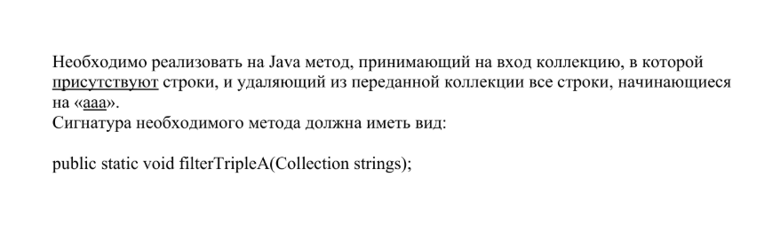

## Задача № 2:

---
Необходимо реализовать на Java метод, принимающий на вход коллекцию, 
в которой <u>присутствуют</u> строки, и удаляющий из переданной коллекции 
все строки, начинающиеся на «<u>aaa</u>».

Сигнатура необходимого метода должна иметь вид:

```java
public static void filterTripleA(Collection strings);
```

---
Скрин оригинального задания:


---
