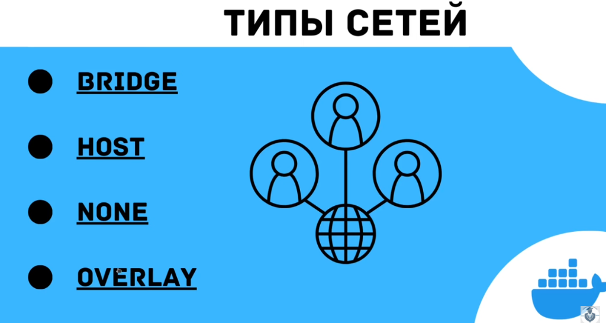
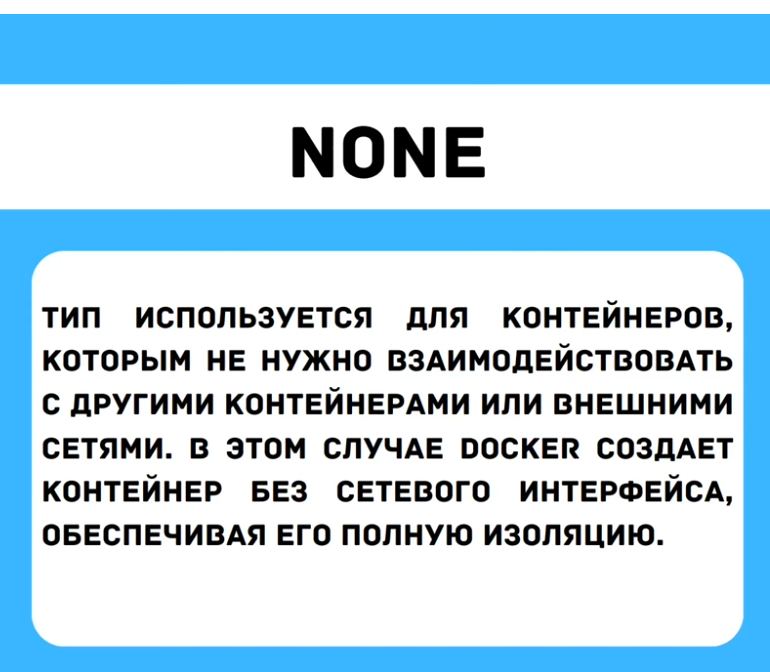
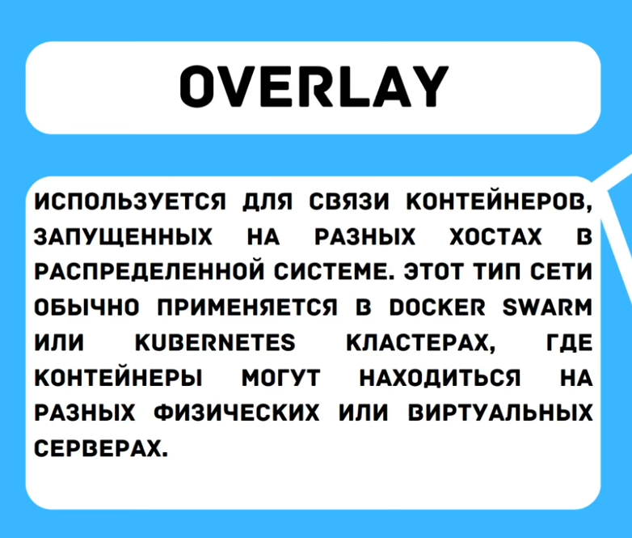
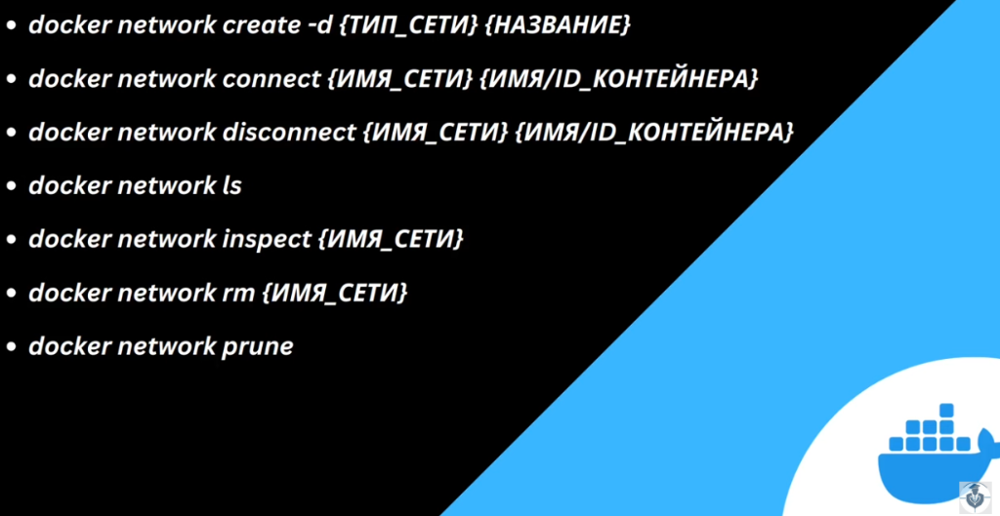

# О типах сетей в `Docker`:
видео ["Введение в Сети | Docker Network | Сетевые драйверы"](https://www.youtube.com/watch?v=kchOh_l_poY) (11мин.)


| Тип сети    | Назначение (Аннотация)                                                                                                                                                             |
| ----------- | ---------------------------------------------------------------------------------------------------------------------------------------------------------------------------------- |
| **bridge**  | **Сеть по умолчанию.** Виртуальный коммутатор внутри хоста. Контейнеры в одной bridge-сети видят друг друга по именам. Изолирована от внешнего мира, если не настроен порт (`-p`). |
| **host**    | **Убирает сетевую изоляцию.** Контейнер использует сетевой стек хоста (его сетевой интерфейс, порты). Нет собственного IP. Выше производительность, но меньше безопасности.        |
| **none**    | **Полное отключение сети.** У контейнера нет сетевых интерфейсов (кроме loopback). Для полностью изолированных workloads, где сеть не нужна.                                       |
| **overlay** | **Сеть для кластеров.** Позволяет контейнерам на разных физических хостах (в Swarm/Kubernetes) общаться так, как будто они в одной сети.                                           |

>**Дополнительно (по распространенности):**
>- **macvlan:** Позволяет назначить контейнеру собственный MAC-адрес, делая его видимым в физической сети как обычное устройство. Для легаси-приложений, требующих настоящий MAC.
>    
> - **ipvlan:** Аналогичен macvlan, но контейнеры используют MAC-адрес родительского интерфейса хоста. Более эффективен, когда уникальных MAC-адресов слишком много.

---
## 1. **Bridge** (*Мостовая*)

- **Применение:** Сеть по умолчанию. 
	  Для изолированного взаимодействия контейнеров на **одном хосте**.
- **Особенности:**    
    - Виртуальный внутренний коммутатор (демон Docker выступает как маршрутизатор).        
    - Контейнеры получают private IP-адреса.        
    - Доступ извне через проброс портов (`-p 8080:80`).        
    - Встроенный DNS позволяет контейнерам обращаться друг к другу по имени.
- **Плюсы:**
    - Изоляция по умолчанию.        
    - Удобство для разработки и запуска 
	      мультиконтейнерных приложений на одной машине.
- **Минусы:**    
    - Не подходит для контейнеров на разных хостах.        
    - Небольшой оверхед из-за NAT.

## 2. **Host** (*Хостовая*)

- **Применение:** Когда нужна максимальная 
	  сетевая производительность и нет требований к изоляции.
- **Особенности:**    
    - Контейнер использует сетевой стек хоста напрямую.        
    - Нет собственного IP-адреса, работает на портах хоста.        
    - Нет изоляции — контейнер видит все сетевые интерфейсы хоста.
- **Плюсы:**    
    - Максимальная производительность (нулевой оверхед).
- **Минусы:**    
    - Риск конфликтов портов (два контейнера не могут занять один порт).        
    - Отсутствие сетевой изоляции — уязвимость с точки зрения безопасности.

## 3. **None** (Отсутствие сети)

- **Применение:** Для полностью изолированных workloads, 
	  где сеть не нужна (*например, контейнеры* 
	  *для batch-обработки данных, тестирования кода без сети*).
- **Особенности:**    
    - У контейнера нет сетевых интерфейсов (кроме loopback `127.0.0.1`).
- **Плюсы:**    
    - Максимально возможная сетевая изоляция и безопасность.
- **Минусы:**    
    - Невозможность сетевого взаимодействия.

## 4. **Overlay** (Накладываемая)

- **Применение:** Для связи контейнеров, работающих 
	  на **разных физических хостах** в кластере (Docker Swarm, Kubernetes).
- **Особенности:**    
    - Создает распределенную виртуальную сеть поверх физических сетей хостов.  
    - Автоматическое шифрование трафика между хостами.
    - Встроенное управление состоянием и обнаружение сервисов.
- **Плюсы:**
    - Единое сетевое пространство для распределенного кластера.
    - Безопасность (шифрование).
- **Минусы:**
    - Сложность настройки и отладки.        
    - Требует orchestration-систему (Swarm, K8s).

---
### **Сводная таблица**

| **Тип**     | **Сценарий использования**          | **Плюсы**                           | **Минусы**                     |
| ----------- | ----------------------------------- | ----------------------------------- | ------------------------------ |
| **Bridge**  | Разработка, изоляция на одном хосте | Простота, изоляция, DNS             | Оверхед, нет межхостовой связи |
| **Host**    | Высокопроизводительные приложения   | Нулевой оверхед, производительность | Нет изоляции, конфликты портов |
| **None**    | Полная изоляция                     | Максимальная безопасность           | Нет сети                       |
| **Overlay** | Кластеры (Swarm, K8s)               | Межхостовая связь, шифрование       | Сложность, требует оркестратор |

---
## Краткий гайд по основным командам управления сетями в `Docker`:

**1. Создание сети**
```bash

```


docker network create -d <ТИП_СЕТИ> <НАЗВАНИЕ_СЕТИ>

- `-d` (`--driver`): Указывает драйвер (тип сети): `bridge`, `overlay`, `macvlan`.
    
- Пример: `docker network create -d bridge my_network`
    

**2. Подключение контейнера к сети**

bash

docker network connect <ИМЯ_СЕТИ> <ИМЯ/ID_КОНТЕЙНЕРА>

- Подключает уже запущенный контейнер к существующей сети.
    
- Пример: `docker network connect my_network my_app`
    

**3. Отключение контейнера от сети**

bash

docker network disconnect <ИМЯ_СЕТИ> <ИМЯ/ID_КОНТЕЙНЕРА>

- Отключает контейнер от сети.
    
- Пример: `docker network disconnect my_network my_app`
    

**4. Просмотр списка сетей**

bash

docker network ls

- Выводит список всех существующих сетей на хосте (как системных, так и пользовательских).
    

**5. Детальная информация о сети**

bash

docker network inspect <ИМЯ_СЕТИ>

- Показывает подробную информацию о сети: IP-адрес подсети, шлюз, список подключенных контейнеров и их IP-адреса.
    
- Основной инструмент для диагностики проблем с сетью.
    

**6. Удаление одной сети**

bash

docker network rm <ИМЯ_СЕТИ>

- Удаляет указанную сеть. Сеть должна быть неиспользуемой (к ней не должны быть подключены контейнеры).
    

**7. Очистка неиспользуемых сетей**

bash

docker network prune

- **Опасная команда.** Удаляет ВСЕ пользовательские сети, которые в данный момент не используются ни одним контейнером.
    
- Часто используется для очистки окружения от "мусора" после тестов.
    

---

**Ключевые моменты:**

- Контейнер может быть подключен к нескольким сетям одновременно.
    
- При создании контейнера флаг `--network` сразу подключает его к указанной сети: `docker run --network=my_network ...`
    
- `inspect` — ваша лучшая команда для отладки проблем "контейнеры не видят друг друга".


