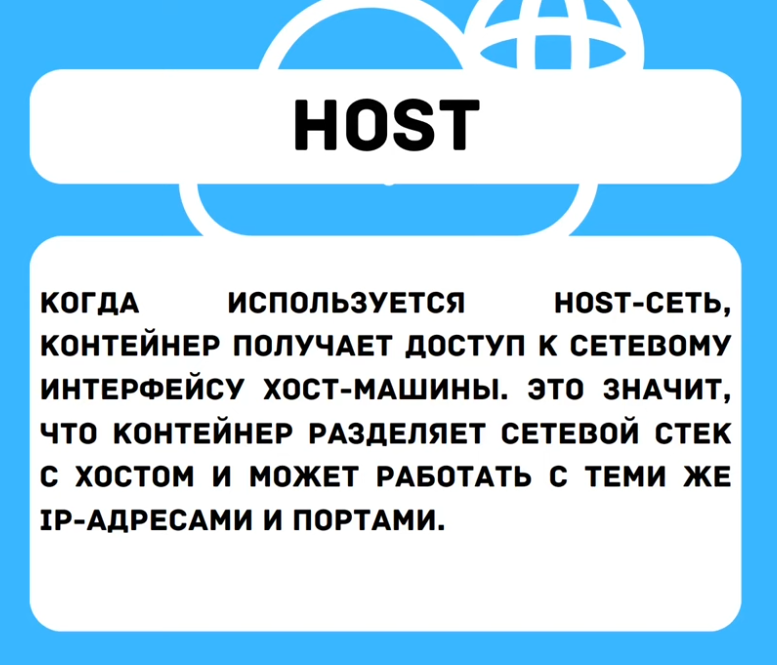
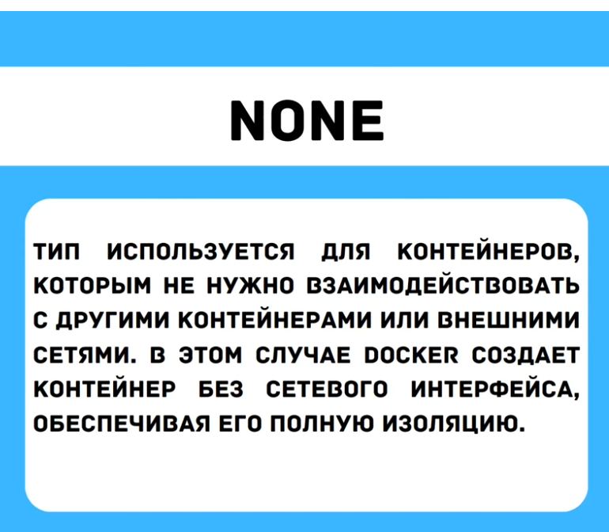
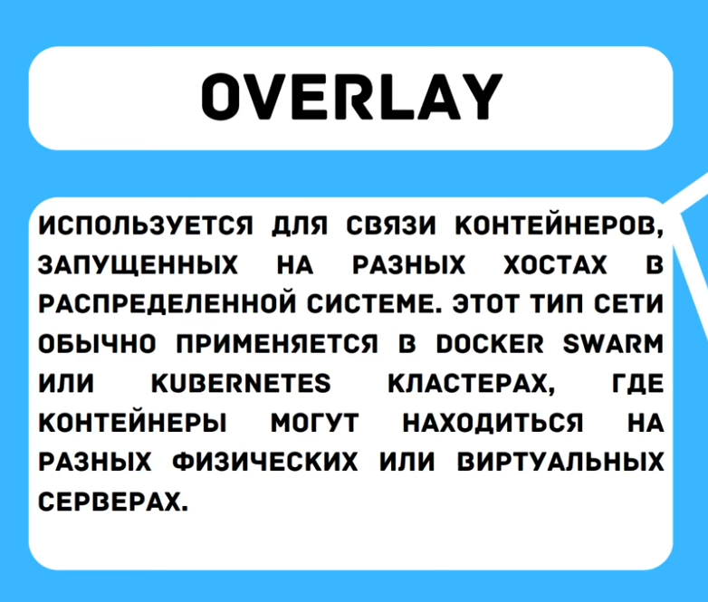

## О типах сетей в `Docker`:

| Тип сети    | Назначение (Аннотация)                                                                                                                                                             |
| ----------- | ---------------------------------------------------------------------------------------------------------------------------------------------------------------------------------- |
| **bridge**  | **Сеть по умолчанию.** Виртуальный коммутатор внутри хоста. Контейнеры в одной bridge-сети видят друг друга по именам. Изолирована от внешнего мира, если не настроен порт (`-p`). |
| **host**    | **Убирает сетевую изоляцию.** Контейнер использует сетевой стек хоста (его сетевой интерфейс, порты). Нет собственного IP. Выше производительность, но меньше безопасности.        |
| **none**    | **Полное отключение сети.** У контейнера нет сетевых интерфейсов (кроме loopback). Для полностью изолированных workloads, где сеть не нужна.                                       |
| **overlay** | **Сеть для кластеров.** Позволяет контейнерам на разных физических хостах (в Swarm/Kubernetes) общаться так, как будто они в одной сети.                                           |

>**Дополнительно (по распространенности):**
>- **macvlan:** Позволяет назначить контейнеру собственный MAC-адрес, делая его видимым в физической сети как обычное устройство. Для легаси-приложений, требующих настоящий MAC.
>    
> - **ipvlan:** Аналогичен macvlan, но контейнеры используют MAC-адрес родительского интерфейса хоста. Более эффективен, когда уникальных MAC-адресов слишком много.

---
## 1. **Bridge** (*Мостовая*)

## 2. **Host** (*Хостовая*)

- **Применение:** Когда нужна максимальная сетевая производительность и нет требований к изоляции.
    
- **Особенности:**    
    - Контейнер использует сетевой стек хоста напрямую.        
    - Нет собственного IP-адреса, работает на портах хоста.        
    - Нет изоляции — контейнер видит все сетевые интерфейсы хоста.
    
- **Плюсы:**    
    - Максимальная производительность (нулевой оверхед).
    
- **Минусы:**    
    - Риск конфликтов портов (два контейнера не могут занять один порт).        
    - Отсутствие сетевой изоляции — уязвимость с точки зрения безопасности.

## 3. **None** (Отсутствие сети)

- **Применение:** Для полностью изолированных workloads, где сеть не нужна (например, контейнеры для batch-обработки данных, тестирования кода без сети).
    
- **Особенности:**    
    - У контейнера нет сетевых интерфейсов (кроме loopback `127.0.0.1`).
    
- **Плюсы:**    
    - Максимально возможная сетевая изоляция и безопасность.
    
- **Минусы:**    
    - Невозможность сетевого взаимодействия.

## 4. **Overlay** (Накладываемая)

- **Применение:** Для связи контейнеров, работающих на **разных физических хостах** в кластере (Docker Swarm, Kubernetes).
    
- **Особенности:**    
    - Создает распределенную виртуальную сеть поверх физических сетей хостов.  
    - Автоматическое шифрование трафика между хостами.
    - Встроенное управление состоянием и обнаружение сервисов.
    
- **Плюсы:**
    - Единое сетевое пространство для распределенного кластера.
    - Безопасность (шифрование).
    
- **Минусы:**
    - Сложность настройки и отладки.        
    - Требует orchestration-систему (Swarm, K8s).

---
### **Сводная таблица**

| **Тип**     | **Сценарий использования**          | **Плюсы**                           | **Минусы**                     |
| ----------- | ----------------------------------- | ----------------------------------- | ------------------------------ |
| **Bridge**  | Разработка, изоляция на одном хосте | Простота, изоляция, DNS             | Оверхед, нет межхостовой связи |
| **Host**    | Высокопроизводительные приложения   | Нулевой оверхед, производительность | Нет изоляции, конфликты портов |
| **None**    | Полная изоляция                     | Максимальная безопасность           | Нет сети                       |
| **Overlay** | Кластеры (Swarm, K8s)               | Межхостовая связь, шифрование       | Сложность, требует оркестратор |

---
