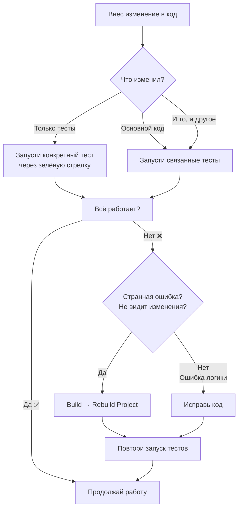

## `clean→compile` & `Rebuild Project`

---
Разница действительно есть, и она важна для понимания.

### В двух словах:
- **`clean` → `compile`** — это **два отдельных шага**, которые выполняются последовательно. Сначала полностью уничтожаются предыдущие результаты сборки, потом компилируются только исходные файлы.
    
- **`Rebuild Project`** в IntelliJ IDEA — это **одна интеллектуальная команда**, которая делает больше: она не только чистит и компилирует, но и пересоздает служебные файлы IDE и управляет зависимостями.

---
### Подробное сравнение
#### **1. `clean` → `compile` (Maven/Gradle)**
Это команды инструментов сборки, которые IDEA просто выполняет.
- **`clean` (Фаза/задача)**: Удаляет всю папку `target` (для Maven) или `build` (для Gradle), то есть **полностью уничтожает результаты предыдущей сборки** (скомпилированные классы, JAR-файлы, отчеты и т.д.).
    
- **`compile` (Фаза/задача)**: Берет **только исходный код** (`src/main/java`, `src/main/kotlin` и т.д.) и компилирует его в байт-код. При этом:    
    - Не трогает ресурсы (`src/main/resources`).        
    - Не выполняет тесты (`src/test`).        
    - Не создает артефакты (JAR, WAR).        

**Итог:** Получаем чистую папку со скомпилированными классами. Ничего лишнего.

#### **2. Rebuild Project (Команда IntelliJ IDEA)**
Это собственная команда IDE, которая _имитирует_ поведение `clean` + `compile`, но на более глубоком уровне системы проекта IDEA.
1. **Очистка (Clean)**: Удаляет выходные директории проекта и модулей (те, что указаны в `File` → `Project Structure` → `Project Settings` → `Modules` → `Paths` → `Output path`).    
2. **Инвалидация кешей**: Сбрасывает или пересоздает внутренние кеши IDEA, связанные с проектом.    
3. **Перестроение**: Выполняет **полную перекомпиляцию** всех исходников проекта (включая тесты и ресурсы, если они настроены), используя **встроенный компилятор IDEA** (по умолчанию), а не компилятор Maven/Gradle.    
4. **Работа с зависимостями**: Может переиндексировать библиотеки.    

**Итог:** Полностью перестраивает проект _внутри экосистемы IDEA_.

---
### Ключевые отличия в таблице

| Критерий               | `clean` → `compile` *(Maven/Gradle)*                                      | **Rebuild Project** *(IDEA)*                                                               |
| ---------------------- | ------------------------------------------------------------------------- | ------------------------------------------------------------------------------------------ |
| **Исполнитель**        | Инструмент сборки (Maven/Gradle).                                         | Встроенный компилятор IntelliJ IDEA.                                                       |
| **Что очищает**        | Папку `target/` или `build/`.                                             | Выходные директории IDEA + внутренние кеши.                                                |
| **Что компилирует**    | Только `src/main/java` (и аналоги).                                       | Все исходники, которые видит IDEA (включая тесты, сгенерированный код).                    |
| **Результат**          | Артефакты инструмента сборки.                                             | Артефакты для запуска и отладки **внутри IDEA**.                                           |
| **Зависимости**        | Загружаются/используются через Maven/Gradle.                              | Используются из кеша IDEA, может потребоваться переиндексация.                             |
| **Когда использовать** | Когда нужен "чистый" результат сборки инструментом (например, для CI/CD). | Когда **IDEA "глючит"**: не видит классы, подчеркивает корректный код, ошибки в навигации. |

---
### Практический совет: когда что использовать?

- **Используйте `Rebuild Project` в IDEA, когда:**    
    - Столкнулись с странными ошибками в редакторе ("красные" подчеркивания в заведомо правильном коде).        
    - После смены ветки Git или больших изменений в конфигурации.        
    - IDEA не видит вновь добавленные классы или методы.        
    - Нужно "освежить" состояние проекта внутри IDE. **Это первое средство "лечения" странного поведения IDEA.**
        
- **Используйте `clean` → `compile` (или `clean` → `build`), когда:**    
    - Хотите быть уверены, что сборка выполняется "с нуля" вашим инструментом (Maven/Gradle).        
    - Готовите артефакт для развертывания (через `package` или `install`).        
    - Подозреваете, что проблема связана именно с кэшированием Maven/Gradle, а не IDEA.        
    - Работаете из командной строки.        

**Важно:** После `Rebuild Project` в IDEA папки `target/` или `build/` могут остаться нетронутыми, и наоборот — после Maven `clean` IDEA может какое-то время "не знать" об изменениях, пока не обновит свой кеш.

Чаще всего команда **`File` → `Invalidate Caches and Restart...`** — это "тяжелая артиллерия" после того, как `Rebuild Project` не помог.

---
---
---
**Вопрос:** Если незначительно меняю код например тесты что лучше запускать?

**Короткий ответ:** Запускайте **только те тесты**, которые вы меняли или которые логически связаны с изменениями. НЕ нужно ни `Rebuild Project`, ни `clean compile` для мелких правок в тестах.

**Развернутый ответ с алгоритмом:**

### 1. Если вы меняете только код тестов (`.java` файлы в `src/test/`)
- **Что происходит:** IDEA **автоматически перекомпилирует только измененный тестовый класс** благодаря встроенной инкрементальной компиляции.    
- **Что запускать:** Просто **нажмите зеленую стрелку** рядом с тестовым классом или методом.    
    - 🟢 **Запуск одного тестового метода** — если меняли только его.        
    - 🟢 **Запуск одного тестового класса** — если меняли логику внутри этого класса.        
    - 🟢 **Запуск всех тестов в папке/пакете** — если изменения затрагивают несколько классов в одной области.        

**Никаких дополнительных действий не требуется.** IDEA сама определит, что нужно перекомпилировать только измененные тестовые файлы.

---
### 2. Если вы меняете основной код (`src/main/java`) И тесты
- **Сначала:** Просто **запустите ваши тесты**. IDEA снова перекомпилирует только измененные файлы в `main` и `test` автоматически. Этого достаточно в 99% случаев.    
- **Только если тесты начинают вести себя странно** (например, не видят изменения в основном коде), тогда сделайте **`Build` → `Rebuild Project`**.    

---
### Практический алгоритм для повседневной работы:

### 📌 Лайфхаки для IntelliJ IDEA:
1. **`Ctrl+Shift+F10`** — запуск теста, в котором сейчас находитесь.    
2. **`Ctrl+Shift+R`** — запуск теста с перезапуском предыдущего.    
3. **Правый клик на папке `test`** → `Run 'Tests in...'` — запуск всех тестов.    
4. **Правый клик на классе/методе** → `Run...` — самый частый способ.    
5. Если тест падает с `NoClassDefFoundError` или не видит изменения — используйте **`Build` → `Recompile 'YourTestClass.java'`** (`Ctrl+Shift+F9` на файле) вместо полного Rebuild.    

### Итог:
Для мелких правок, особенно в тестах, **используйте встроенную инкрементальную компиляцию IDEA**. Она работает мгновенно и пересобирает только то, что нужно. `Rebuild Project` — это "тяжелая" операция для решения проблем, а `clean compile` — для работы с инструментами сборки вне IDE.

---
