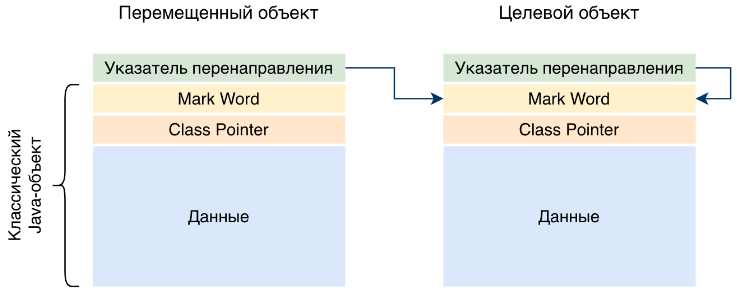
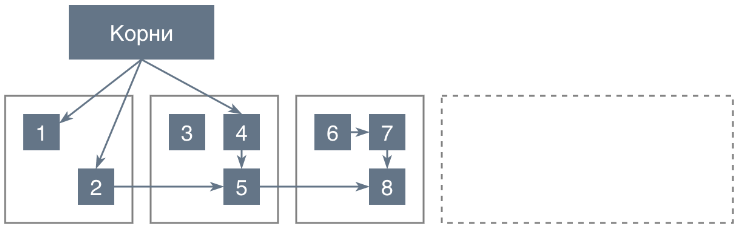
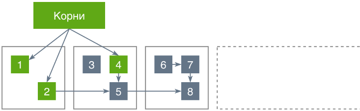
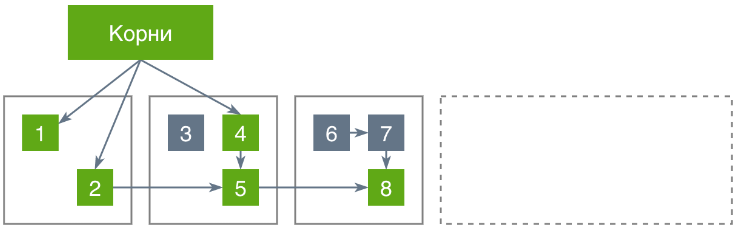
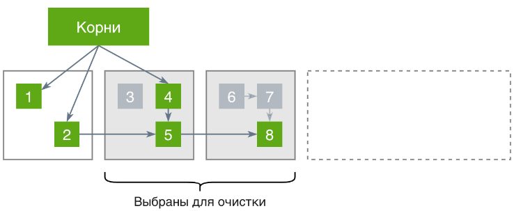
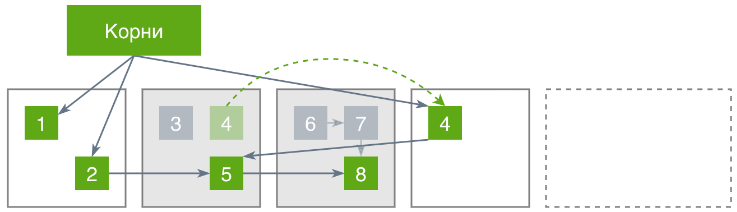
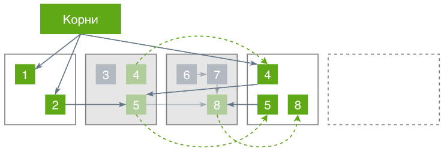
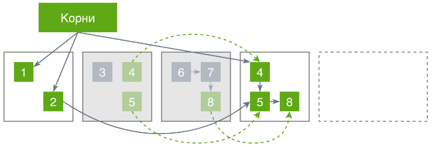
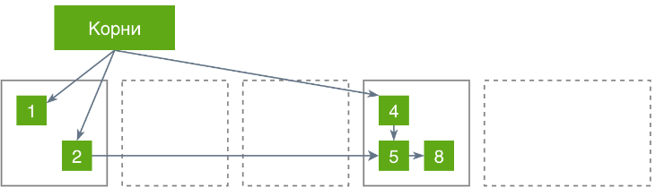

— еще один сборщик, нацеленный на **ультракороткие паузы** независимо от размера кучи.

**`Shenandoah GC`** позиционируется как сборщик, который стремится поддерживать короткие паузы даже на кучах большого объема, за счет выполнения как можно большего количества работы по сборке мусора в конкурентном режиме, то есть одновременно с работой основных потоков приложения.

Использование `Shenandoah` включается опцией **==`-XX:+UseShenandoahGC**`==.

## Указатели перенаправления Брукса

Как мы знаем, при размещении объекта в памяти JVM добавляет к нему заголовок, в котором хранятся метаданные, используемые при блокировках, хэшировании, работе других сборщиков (Mark Word), а также указатель на класс этого объекта (Class Pointer).

В случае использования Shenandoah накладные расходы на хранение каждого объекта немного увеличиваются и перед упомянутым заголовком добавляется еще так называемый _указатель перенаправления_ (_indirection pointer_). По сути, это указатель на базовый Java-объект, но при наличии копии этого объекта (появившейся в результате перемещения при сборке мусора) он указывает на целевую версию этого объекта:

Это значит, что при обращении к объекту по указателю в некоторых случаях необходимо совершить дополнительный переход в новое место его размещения.

Что такого особенного в этих указателях и кто такой Брукс, спросите вы?

В самих указателях ничего особенного нет, но есть нюансы работы с этими указателями в ситуациях, когда перемещение объектов на новое место осуществляется при работающей программе, которая в это же время может эти объекты читать и даже изменять.

Родни Брукс (Rodney A. Brooks) как раз описал в одной из своих работ по реалтаймным сборщикам мусора правила работы с такими указателями, позволяющие не поломать работу программы и при этом по возможности не сильно ее замедлить. В Shenandoah используются очень похожие подходы.

## Организация кучи

Shenandoah организует кучу, разбивая ее на большое количество регионов равных размеров. В каждый момент времени регион может:

- размещать живые объекты и не подлежать очистке,    
- размещать живые объекты и подлежать очистке,    
- быть забронированным под перемещение живых объектов из очищаемых регионов,    
- не использоваться.    

Для _громадных объектов_ (_humongous objects_), не помещающихся в один регион, как обычно, выделяется необходимое количество регионов и к ним больше никто не подселяется.

Это очень похоже на то, что мы видели в ZGC, просто используется другая терминология.

## Поиск живых объектов
Для рассмотрения процесса работы Shenandoah будет удобно взять тот же пример, который использовался при описании ZGC. Это позволит наглядно увидеть разницу в работе этих двух сборщиков.

Начинаем мы с такого состояния кучи:

#### Фаза Init Mark
Первая фаза, как обычно, посвящена поиску объектов, достижимых из корней, и выполняется в рамках паузы STW. После ее завершения имеем следующую картину:

#### Фаза Concurrent Marking
Эта фаза происходит в конкурентном режиме, при работающих основных потоках приложения. В рамках нее производится обход всей кучи, начиная с найденных на предыдущем шаге объектов, и сбор информации об остальных достижимых объектах.

И как это обычно бывает в конкурентных фазах, мы сталкиваемся с тем, что приложение продолжает создавать новые объекты одновременно с процессом сборки мусора. Чтобы в таких условиях ничего не потерять, во время этой фазы используются [функции-барьеры](https://habr.com/ru/post/680038/#barriers). В данном случае барьеры отслеживают изменения ссылок из одних объектов на другие, и запоминают "предыдущие" указатели в специальные коллекции. Это позволяет реализовывать режим SATB (вспоминаем из предыдущих статей, что этот режим означает возможность наличия плавающего мусора).

#### Фаза Final Mark
Как и Init Mark, эта фаза выполняется в рамках паузы STW. Она нужна для того, чтобы разобраться с появившимися новыми корнями, с коллекциями "предыдущих" указателей, со специальными кейсами вроде soft- и weak-references. После этого мы знаем про все достижимые объекты:

Но фаза на этом не завершается. В рамках нее производятся подготовительные работы к переносу объектов и высвобождению памяти.

В первую очередь выбираются регионы, которые будут очищаться в рамках данного цикла сборки. Для выбора Shenandoah использует различные эвристики, основываясь на информации о количестве мусора в разных регионах, о скорости расходования памяти приложением, о времени предыдущих сборок и прочих метриках.

Далее, в рамках этой же паузы производится перемещение достижимых из корней объектов в новые целевые регионы.

При перемещении изменяются указатели перенаправления у объектов на их старом месте. Мы будем обозначать такие указатели зелеными пунктирными стрелками:

## Перемещение

#### Фаза Concurrent Evacuation
В рамках данной конкурентной фазы происходит перенос оставшихся живых объектов из очищаемых регионов в целевые регионы.

Может оказаться, что к началу этой фазы в каких-то из очищаемых регионов вообще не осталось живых объектов. Такие регионы сразу же высвобождаются.

Из остальных очищаемых регионов живые объекты переносятся в целевые регионы с одновременным обновлением указателей перенаправления на них. При этом в рамках данной фазы активно используются барьеры. В Shenandoah на этой фазе они работают следующим образом:

- Если какой-либо поток хочет прочитать данные объекта, находящегося в высвобождаемой зоне, он может это сделать даже если объект к этому времени еще не перенесен, никаких дополнительных действий не требуется (это, например, отличает его от ZGC).
    
- Если какой-либо поток хочет поменять данные в объекте, находящемся в высвобождаемой зоне, он сначала должен самостоятельно перенести его на новое место, и только после этого производить изменения.    

Следует иметь в виду, что существуют неявные изменения объектов, при которых барьер работает по второму сценарию. Например, наложение блокировки на объект означает изменение данных в Mark Word, а значит расценивается как модификация объекта.

Еще одним отличием от ZGC является то, что на данной фазе не меняются указатели на переносимые объекты. В результате по ее завершении куча выглядит следующим образом:

#### Фаза Init Update Refs
Эта фаза представляет собой очень короткую STW-паузу, которая нужна для синхронизации потоков GC и подготовки к следующей фазе.

#### Фаза Concurrent Update Refs
На данной конкурентной фазе производится модификация указателей на живые объекты, перенесенные в целевые области.

#### Фаза Final Update Refs
Это еще одна, последняя в рамках одного цикла сборки, пауза STW. В ней, по аналогии с Final Mark, подчищаются хвосты в части обновления указателей на объекты, главным образом из новых корней.

И после того, как очищенные регионы возвращаются в список свободных, получаем итоговую картину:

## Failure Mode
Всё это работает отлично в условиях, когда у сборщика достаточно ресурсов и он поспевает за приложением, вовремя высвобождая память под новые объекты. Но на случай, когда он вдруг перестает справляться (Failure Mode), у Shenandoah есть план Б.

В первую очередь он задействует механизм Pacing — начинает чуть-чуть притормаживать самые активные в части аллоцирования памяти потоки приложения, чтобы они создавали новые объекты не так быстро.

Такой подход позволяет справляться с кратковременными пиками в потреблении памяти, но при сильной нагрузке очень долго на нем не продержишься.

Когда Pacing'а недостаточно, в дело вступает механизм Degenerated GC, в котором конкурентые фазы сборки на время перестают быть конкурентными и начинают выполняться в рамках паузы STW. Зачастую включение такого режима попадает на уже запущенный цикл сборки и тогда пауза распространяется только на его оставшуюся часть. Здесь нужно иметь в виду, что сборка в рамках STW выполняется быстрее, чем в конкурентном режиме, поэтому новые паузы на практике не такие большие, как может показаться на первый взгляд.

Ну и если даже перевод конкурентной сборки в STW не помог, задействуется старый добрый Full GC, то есть работа приложения останавливается и производится полная сборка мусора.

---
