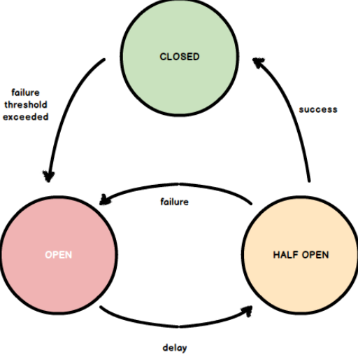

# Паттерн Circuit Breaker

Представьте себе обычный автоматический выключатель в вашем доме. Когда происходит перегрузка, он "выбивается", предотвращая возможные повреждения. Точно так же работает и Circuit Breaker в микросервисах. Он мониторит вызовы к внешнему сервису и при обнаружении слишком большого количества неудачных попыток временно "отключает" вызов, предотвращая тем самым падение всей системы.

Этот паттерн основывается на трех основных состояниях: _закрытое_, _открытое_ и _полуоткрытое_.

В "_закрытом_" состоянии запросы к сервису выполняются нормально. Если сбои начинают учащаться, состояние переключается на "_открытое_", и вызовы временно блокируются. После определенного времени система переходит в "_полуоткрытое_" состояние, где некоторые вызовы тестируются, чтобы проверить, исправился ли сбой.

## Состояния Circuit Breaker

#### **Закрытое** состояние (*Closed state*)
В закрытом состоянии `Circuit Breaker` позволяет запросам проходить к защищаемому сервису. Это нормальное рабочее состояние.
В этом состоянии `Circuit Breaker` отслеживает количество неудачных запросов. Если число ошибок не превышает определенный порог, то `Circuit Breaker` продолжает оставаться в закрытом состоянии.
Обычно реализации `Circuit Breaker` ведут учет **времени ответа** и **количества неудачных запросов**. Это позволяет определить, когда пора переключиться в открытое состояние.

#### **Открытое** состояние (*Open state*)
В открытом состоянии `Circuit Breaker` блокирует все попытки выполнить запрос к защищаемому сервису. Это профилактическая мера, предотвращающая дальнейшее распространение ошибок.
Переход в открытое состояние происходит, когда **количество неудачных запросов** в закрытом состоянии превышает установленный порог. Этот порог может быть определен **количеством ошибок**, **временем ответа** или **комбинацией обоих** факторов.
После перехода в открытое состояние, `Circuit Breaker` остается в этом состоянии в течение определенного времени. Этот период называется **временем ожидания** (*timeout*) и является критическим для восстановления стабильности защищаемого сервиса.

#### **Полуоткрытое** состояние (*Half-open state*)
Полуоткрытое состояние - это переходное состояние, в котором `Circuit Breaker` начинает частично разрешать запросы к сервису для тестирования его доступности и надежности.
После истечения времени ожидания в открытом состоянии, `Circuit Breaker` переходит в полуоткрытое состояние. В этом состоянии он позволяет **ограниченное** количество запросов пройти к сервису. Если эти запросы успешно обработаны и не вызывают ошибок, `Circuit Breaker` возвращается в закрытое состояние, считая, что проблемы с сервисом устранены.
Если в полуоткрытом состоянии обнаруживаются ошибки, `Circuit Breaker` снова переходит в открытое состояние, и время ожидания начинает отсчитываться заново. Это гарантирует, что в случае повторного возникновения проблемы, нагрузка на сервис будет снижена.
...

---
полная статья на `habr.com`: [Паттерн Circuit Breaker](https://habr.com/ru/companies/otus/articles/778574/)
