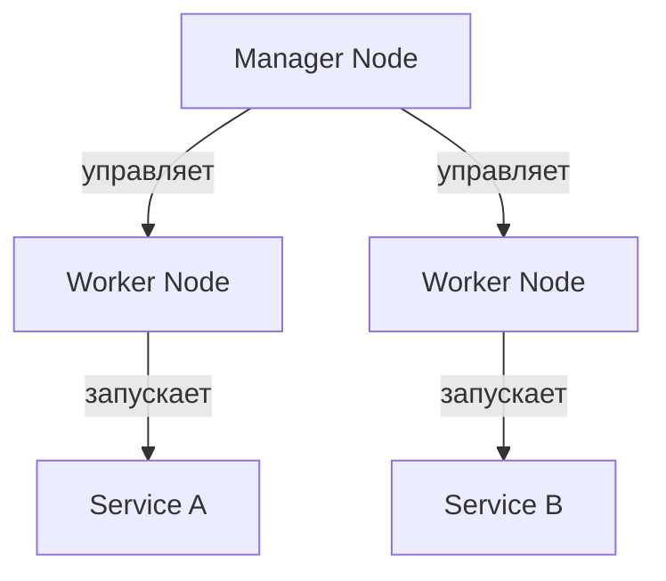

### **🐳 `Docker Swarm`: полный обзор оркестратора контейнеров**

#### **🛠️ Краткий обзор**
**Docker Swarm** — встроенный в Docker инструмент для **оркестрации контейнеров**, позволяющий создавать кластеры из множества хостов и управлять ими как единой системой.

🔹 **Проще Kubernetes**, но менее мощный  
🔹 **Встроен в Docker Engine** (не требует отдельной установки)  
🔹 **Идеален для небольших и средних проектов**

---
## **🔍 Архитектура Docker Swarm**

### **1. Компоненты**

|Роль|Описание|
|---|---|
|**Manager Nodes**|Управляют кластером (распределяют задачи, поддерживают состояние)|
|**Worker Nodes**|Исполняют задачи (запускают контейнеры)|
|**Services**|Группа идентичных контейнеров (аналог Pods в Kubernetes)|
|**Tasks**|Отдельные экземпляры контейнеров в сервисе|



### **2. Как работает?**
1. **Инициализация кластера** (`docker swarm init`)    
2. **Добавление нод** (`docker swarm join`)    
3. **Создание сервисов** (`docker service create`)    
4. **Масштабирование** (`docker service scale`)    

---
## **⚙️ Основные возможности**

### **1. Особенности**
✅ **Встроенная балансировка нагрузки** (через DNS/Round Robin)  
✅ **Rolling updates** (постепенное обновление сервисов)  
✅ **Секреты и конфиги** (управление чувствительными данными)  
✅ **Автоматическое восстановление** (рестарт упавших контейнеров)

### **2. Ограничения**
❌ **Нет сложных правил балансировки** (как в Kubernetes Ingress)  
❌ **Базовый мониторинг** (нет встроенного аналога Prometheus)  
❌ **Меньше экосистемы** (по сравнению с Kubernetes)

---
## **🆚 Сравнение с Kubernetes**

|Характеристика|Docker Swarm|Kubernetes|
|---|---|---|
|**Сложность**|Простота|Высокий порог входа|
|**Масштабируемость**|До ~100 нод|Тысячи нод|
|**Настройка**|Минимальная|Требует конфигурации|
|**Использование**|Малые/средние проекты|Крупные production-системы|

---
## **🚀 Практическое использование**

### **1. Основные команды**
```bash
# Инициализация кластера
docker swarm init --advertise-addr <MANAGER_IP>

# Добавление worker-ноды
docker swarm join --token <TOKEN> <MANAGER_IP>:2377

# Создание сервиса
docker service create --name web --replicas 3 -p 80:80 nginx

# Масштабирование
docker service scale web=5

# Просмотр сервисов
docker service ls
```

### **2. Пример развертывания**
```bash
# 1. Инициализируем Swarm
docker swarm init

# 2. Разворачиваем сервис
docker service create \
  --name my-api \
  --replicas 3 \
  --publish published=8080,target=80 \
  my-api-image

# 3. Проверяем
docker service ps my-api
```

---
## **💡 Когда выбирать Docker Swarm?**

### **Подходит для:**
- **Небольших проектов** (до 50-100 контейнеров)    
- **Быстрого развертывания** без сложной настройки    
- **Команд, уже использующих Docker**    

### **Не подходит для:**
- **Сложных микросервисных архитектур**    
- **Систем с высокими требованиями к масштабируемости**    

---
## **📌 Итог**
Docker Swarm — это **простой и эффективный** инструмент для оркестрации, который:
- **Легко освоить** (если знаете Docker)    
- **Не требует дополнительных компонентов**    
- **Хорош для старта** перед переходом на Kubernetes    

**👉 Альтернативы:**
- Для простых проектов → **Docker Compose**    
- Для сложных систем → **Kubernetes**    
- Компромиссный вариант → **Nomad**

---
