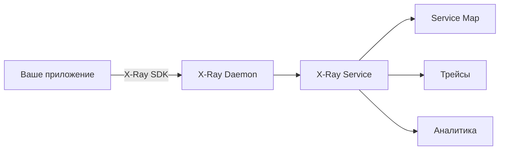

### **☁️ AWS X-Ray — распределенный трейсинг для облачных приложений AWS**
_(Глубокий анализ с примерами и сравнениями)_

---
## **🛠️ Краткий обзор**
**AWS X-Ray** — это **нативный сервис трейсинга** от Amazon, глубоко интегрированный с экосистемой AWS.

**🔍 Ключевые особенности:**  
✅ **Автоматическое трейсинг** для AWS-сервисов (Lambda, API Gateway, ECS)  
✅ **Интерактивная карта сервисов** (Service Map)  
✅ **Анализ задержек** с breakdown по компонентам  
✅ **Интеграция с OpenTelemetry** (с ограничениями)

**👉 Главное преимущество:**  
Минимальная настройка для сервисов AWS — X-Ray **автоматически собирает данные** из поддерживаемых сервисов.

---
## **🔍 Подробный разбор AWS X-Ray**

### **1. Основные функции**

|Функция|Описание|
|---|---|
|**Авто-инструментация**|Работает с Lambda, API Gateway, EC2, ECS, SQS без ручного кода|
|**Service Map**|Визуализация связей между сервисами в реальном времени|
|**Анализ ошибок**|Фильтрация трейсов с 4xx/5xx ошибками|
|**Сегментация**|Разбивка времени выполнения по: AWS-сервисам, БД, внешним HTTP-вызовам|

### **2. Архитектура**


**Компоненты:**
- **X-Ray SDK** (для Python, Node.js, Java, .NET, Go)    
- **X-Ray Daemon** (сборщик данных, работает как sidecar)    
- **X-Ray Service** (управляемый сервис AWS)    

### **3. Плюсы ✅**
- **🚀 Нулевая настройка** для сервисов AWS (Lambda и др.)    
- **📊 Лучшая визуализация** среди облачных трейсеров (vs GCP Trace)    
- **🔗 Автоматический трейсинг** для:    
    - API Gateway → Lambda → DynamoDB        
    - ECS → SQS → Lambda        
- **💵 Экономия** (первые 100,000 трейсов бесплатно)    

### **4. Минусы ❌**
- **🔒 Vendor lock-in** — только для AWS    
- **📉 Ограниченная кастомизация** (vs Jaeger/OTel)    
- **⚡ Нет sampling-правил** (в отличие от Jaeger)    
- **🛠️ Сложность** для гибридных систем (вне AWS)    

### **5. Ключевые сценарии использования**
1. **Серверные приложения (Lambda + API Gateway)**    
    - Автоматический трейсинг без кода        
2. **Микросервисы на ECS/EKS**    
    - Сквозное отслеживание через X-Ray SDK        
3. **Анализ медленных запросов**    
    - Поиск узких мест в цепочках вызовов        

### **6. Пример трейса в X-Ray**
```json
{
  "trace_id": "1-5f3b1a2b-3c4d5e6f7g8h",
  "segments": [
    {
      "name": "API Gateway",
      "latency": 120,
      "annotations": {
        "status_code": 200
      }
    },
    {
      "name": "Lambda",
      "latency": 98,
      "subsegments": [
        {
          "name": "DynamoDB:Query",
          "latency": 45
        }
      ]
    }
  ]
}
```

---

## **🆚 Сравнение с аналогами**

|Критерий|AWS X-Ray|Jaeger|Zipkin|
|---|---|---|---|
|**Интеграция**|Только AWS|Любая среда|Любая среда|
|**Настройка**|Минимальная|Сложная|Средняя|
|**Визуализация**|Лучшая (Service Map)|Хорошая|Базовая|
|**Цена**|Бесплатный лимит|Self-hosted|Self-hosted|

---
## **💡 Практические советы**
1. **Для чистого AWS-стека** — X-Ray оптимален, особенно с Lambda.    
2. **Гибридные системы** — используйте OpenTelemetry + X-Ray exporter.    
3. **Глубокий анализ** — комбинируйте с CloudWatch Logs и Metrics.    
4. **Осторожно с квотами** — при высоких нагрузках могут быть расходы.    

**🚀 Старт работы:**
```python
# Пример для AWS Lambda (Python)
from aws_xray_sdk.core import xray_recorder
from aws_xray_sdk.core import patch_all

patch_all()  # Авто-инструментация для boto3/requests

def lambda_handler(event, context):
    # Ваш код
    return {"statusCode": 200}
```

---
## **📌 Итог: когда выбирать AWS X-Ray?**
- **Если 100% инфраструктуры в AWS**    
- **Для serverless-архитектур (Lambda, API Gateway)**    
- **Когда нужен трейсинг "из коробки" без настроек**    

**⚠️ Альтернативы:**
- Гибридные системы → **OpenTelemetry + Jaeger**    
- GCP → **Google Cloud Trace**    
- Глубокая аналитика → **Datadog APM**    

**AWS X-Ray — это "волшебная таблетка" для трейсинга внутри AWS, но не универсальное решение.**

---
