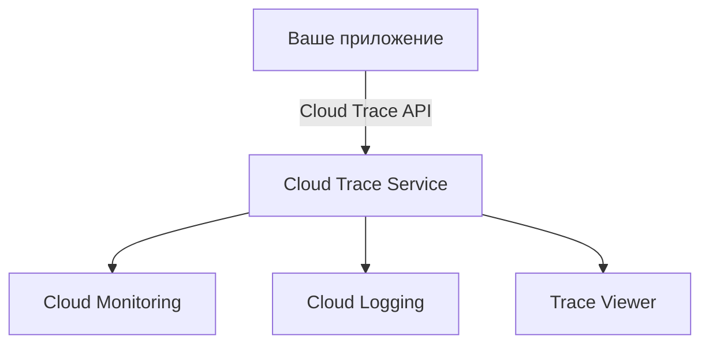

### **☁️ Google Cloud Trace — трейсинг для экосистемы GCP**
_(Полное руководство с техническими деталями и сравнениями)_

---
## **🛠️ Краткий обзор**

**Google Cloud Trace** — это **управляемый сервис трейсинга**, глубоко интегрированный с Google Cloud Platform.

**🔍 Ключевые особенности:**  
✅ **Автоматический сбор данных** для App Engine, Cloud Run, GKE  
✅ **Анализ перцентилей задержек** (P50, P95, P99)  
✅ **Интеграция с Cloud Monitoring и Logging**  
✅ **Поддержка OpenTelemetry**

**👉 Главное преимущество:**  
Мощная аналитика производительности + полная интеграция с другими сервисами GCP.

---
## **🔍 Детальный анализ**

### **1. Основные функции**

|Функция|Описание|
|---|---|
|**Авто-инструментация**|Работает с App Engine, Cloud Functions, GKE без ручного кода|
|**Анализ задержек**|Детализация по перцентилям (P50, P95, P99)|
|**Интеграция с логами**|Привязка трейсов к Cloud Logging|
|**Сравнение метрик**|Наложение данных за разные периоды времени|

### **2. Архитектура**



**Компоненты:**
- **Агенты** (для Java, Python, Go, Node.js)    
- **Cloud Trace API** (REST-интерфейс)    
- **Trace Viewer** (веб-интерфейс)    

### **3. Плюсы ✅**
- **📊 Лучшая аналитика задержек** среди облачных трейсеров    
- **🔗 Полная интеграция** с GCP-сервисами    
- **📈 Автоматические отчеты** о производительности    
- **🔄 Поддержка OpenTelemetry**    

### **4. Минусы ❌**
- **🔒 Только для GCP** (нет гибридного режима)    
- **📉 Ограниченная фильтрация** трейсов    
- **🛠️ Сложнее настройка** для кастомных сервисов    

### **5. Ключевые сценарии использования**
1. **Мониторинг API** (Cloud Endpoints + Cloud Run)    
2. **Анализ производительности GKE**    
3. **Оптимизация serverless-функций**    

### **6. Пример трейса**
```json
{
  "traceId": "1234567890abcdef",
  "spans": [
    {
      "name": "projects/your-project/traces/123",
      "latency": "0.123s",
      "attributes": {
        "http.status_code": 200
      }
    }
  ]
}
```

---

## **🆚 Сравнение с конкурентами**

|Критерий|Google Cloud Trace|AWS X-Ray|Jaeger|
|---|---|---|---|
|**Интеграция**|Только GCP|Только AWS|Любая среда|
|**Аналитика**|Лучшая|Хорошая|Средняя|
|**Цена**|$0.20/миллион сэмплов|Бесплатный лимит|Self-hosted|

---
## **💡 Практические советы**
1. **Для App Engine** — автоматический трейсинг без кода     
2. **С OpenTelemetry** — используйте Cloud Trace exporter     
3. **Оптимизация API** — ищите медленные эндпоинты через перцентили      

**🚀 Пример настройки для Python:**
```python
from opencensus.trace.exporters import stackdriver_exporter
from opencensus.trace.tracer import Tracer

exporter = stackdriver_exporter.StackdriverExporter()
tracer = Tracer(exporter=exporter)

with tracer.span(name="my_operation"):
    # Ваш код
```

---
## **📌 Итог: когда выбирать?**
- **Для 100% G-инфраструктуры**    
- **Когда нужен продвинутый анализ задержек**    
- **Для интеграции с Cloud Monitoring**    

**⚠️ Альтернативы:**
- Мультиклауд → **OpenTelemetry + Jaeger**    
- AWS → **X-Ray**    
- Глубокая аналитика → **Datadog**    

**Google Cloud Trace — лучший выбор для глубокого анализа в чистой GCP-среде.**

---
