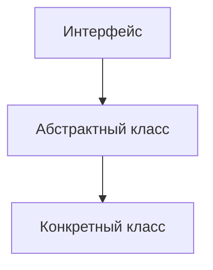
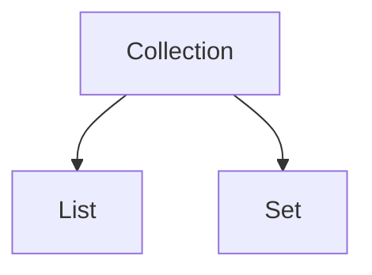
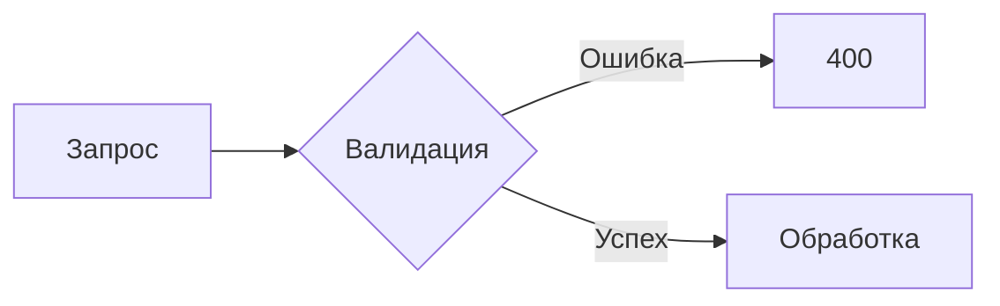
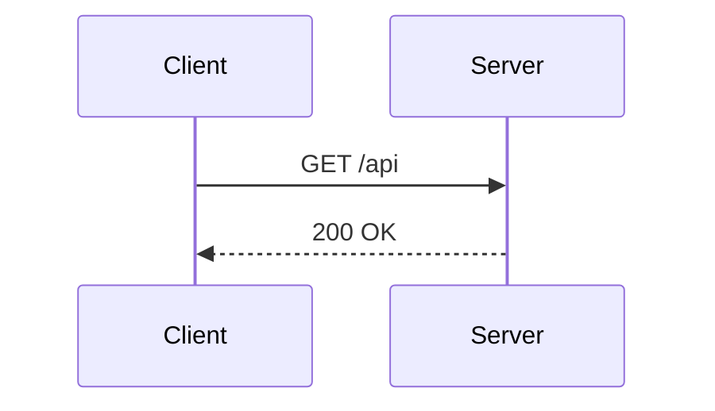

**Проверенный стек** + плагины для Obsidian, чтобы конспекты были 🔥 везде.

---

## ✅ 100% работают везде (Obsidian + GitHub)

|Фишка|Синтаксис|Где пригодится|
|---|---|---|
|**Заголовки**|`# ## ###`|Структура|
|**Жирный / курсив**|`**текст**` `*текст*`|Выделение|
|**Списки**|`-` `1.`|Перечисления|
|**Таблицы**|стандартные `\|`|Сравнения|
|**Код с подсветкой**|` ```java ` \| Примеры кода \|||
|**Цитаты**|`> текст`|Определения|
|**Горизонтальная черта**|`---`|Разделы|
|**Ссылки**|`[текст](url)`|Источники|
|**Изображения**|``|Скриншоты|
|**Эмодзи**|`:rocket:` или сами символы|Визуал|
|**Details (сворачиваемые блоки)**|`<details>` + `</details>`|Длинные примеры|

---
## ⚠️ Работает везде, но есть нюанс

|Фишка|В Obsidian|На GitHub|Важно|
|---|---|---|---|
|**Mermaid**|✅ (встроен)|✅ (поддерживает)|Работает идентично|
|**Alerts** (`> [!NOTE]`)|✅ (через плагин)|✅ (нативно)|В Obsidian нужен плагин!|
|**LaTeX (`$$`)**|✅ (встроен)|❌ не работает|**Забудь** для GitHub|

---
## 🔧 Плагины для Obsidian (критические)

Чтобы Obsidian **не ломал** то, что работает на GitHub, и наоборот — добавь:

|Плагин|Зачем|
|---|---|
|**Git** (встроенный)|Для пуша конспектов|
|**Admonition**|Для поддержки `> [!NOTE]` как на GitHub|
|**Code Styler**|Для красивой подсветки кода|
|**Pandoc Plugin**|Если экспортируешь в PDF/Word|

⚠️ **НЕ ставь** плагины, которые меняют синтаксис Markdown (например, Dataview, Latex Suite) — они сломают отображение на GitHub.

---
## 📌 Мой рекомендованный стек для конспектов

Вот **готовый шаблон**, который красиво выглядит везде:
```markdown
# 🚀 Тема: Коллекции Java
> [!NOTE]
> **Определение:** Collection — это корневой интерфейс иерархии.

---
## 📊 Сравнение
| Характеристика | ArrayList | LinkedList |
|----------------|-----------|------------|
| Доступ по индексу | O(1) | O(n) |
| Вставка в начало | O(n) | O(1) |
---
## 💻 Пример кода
<details>
	<summary>📘 Показать код</summary>
	```java
	List<String> list = new ArrayList<>();
	list.add("Java");
</details>
```

---
## 🧠 Схема
## ✅ 1. Mermaid — диаграммы в коде

GitHub **нативно поддерживает Mermaid** с 2022 года.

```markdown
graph TD  
A[Интерфейс] --> B[Абстрактный класс]  
B --> C[Конкретный класс]
```


```markdown
graph TD  
A[Collection] --> B[List]  
A --> C[Set]
```


```markdown
flowchart LR  
A[Запрос] --> B{Валидация}  
B -->|Ошибка| C[400]  
B -->|Успех| D[Обработка]
```


```markdown
sequenceDiagram  
Client->>Server: GET /api  
Server-->>Client: 200 OK
```

🎯 Для: архитектурных схем, `flowcharts`, `sequence` `diagrams`, `class diagrams`.

---
## ✅ 2. Alerts (Admonitions) — цветные блоки

GitHub поддерживает специальные блоки-предупреждения:
> [!NOTE]
> Полезная заметка

> [!TIP]
> Совет по коду

> [!IMPORTANT]
> Важный момент

> [!WARNING]
> Осторожно!

> [!CAUTION]
> Критично!

```markdown
> [!NOTE]
> Полезная заметка

> [!TIP]
> Совет по коду

> [!IMPORTANT]
> Важный момент

> [!WARNING]
> Осторожно!

> [!CAUTION]
> Критично!
```

Выглядит как **цветные плашки** — супер для выделения ключевых мыслей.

---
## ✅ 3. Сворачиваемые блоки (details)

<details>
<summary>📘 Нажми, чтобы раскрыть блок текста</summary>

Тут пишем текст

</details>

```markdown
<details>
<summary>📘 Нажми, чтобы раскрыть блок текста</summary>

Тут пишем текст

</details>
```
🎯 Для: длинных примеров/ вопросов которые не хочется разворачивать всегда.

---
## ✅ 4. Таблицы с выравниванием

| Лево | Центр | Право |
|:-----|:-----:|------:|
| 1    |   2   |     3 |


Работает красиво и предсказуемо.

---
## ✅ 5. Эмодзи ✨

GitHub поддерживает эмодзи-коды:

:rocket: :java: :bulb: :warning: :check:
```markdown
:rocket: :java: :bulb: :warning: :check:
```
→ 🚀 ☕ 💡 ⚠️ ✅

Полный список: [emojipedia.org/github](https://emojipedia.org/github)

---
## ✅ 6. Ссылки на заголовки (якоря)

## 👑 Исключения

Перейти к [✅ 1. Mermaid — диаграммы в коде](#mermaid--диаграммы-в-коде)
[Mermaid](#mermaid--диаграммы-в-коде)
```markdown
## 👑 Исключения
Перейти к [✅ 1. Mermaid — диаграммы в коде](#1.-Mermaid-—-диаграммы-в-коде)
Перейти к [Исключениям](#исключения)
```

GitHub автоматически генерирует якоря из заголовков (транслит + нижний регистр).

GitHub автоматически создаёт **якорь** (скрытый идентификатор) на основе текста:

- Убирает эмодзи (`👑`)    
- Приводит к нижнему регистру    
- Заменяет пробелы на дефисы (`-`)    

→ Получается: `#исключения`


********

## ❌ Чего избегать
| Что                     | Почему                     |
| ----------------------- | -------------------------- |
| `$$` LaTeX              | Не работает на GitHub      |
| Плагины типа `Dataview` | Ломают рендеринг на GitHub |
| Собственные CSS-классы  | GitHub игнорирует          |
| `[TOC]` (оглавление)    | GitHub не поддерживает     |

---
🎯 **Вывод**: используй **стандартный Markdown + Mermaid + Alerts + Details** — и конспекты будут идеальны и в Obsidian, и на GitHub.


