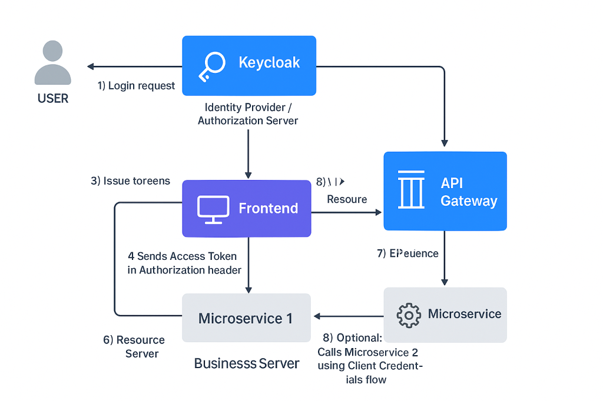

# Авторизация через `Keycloak` — как отвечать ✅

## 1) Что это и где стоит
- **Keycloak** = IdP + Authorization Server (OIDC/OAuth2, SSO, MFA).    
- Разделение: **Realm** (тенант), **Clients** (apps), **Users/Groups**, **Roles**, **Mappers/Policies**.    
- Схема: **Frontend ⟷ Keycloak (OIDC Code+PKCE)** → токены → **API Gateway/микросервисы (Resource Servers)**.    

---
## 2) Потоки авторизации (*что используем*)
- **Browser users:** _Authorization Code + PKCE_ (без Implicit).    
- **Service→Service:** _Client Credentials_ (machine-to-machine).    
- **Mobile/SPA:** публичный клиент + PKCE.    
- **Refresh:** короткий **Access Token** (5–15 мин) + **Refresh Token** (ротация включена).    

---
## 3) Как токен попадает и проверяется в бэкенде
- Пользователь логинится на Keycloak → получает **ID Token** (для UI) и **Access Token (JWT)**.    
- **Gateway** делает token relay в downstream-сервисы.    
- Микросервисы работают как **OAuth2 Resource Server**: валидируют JWT **по JWKS** (URL `/.well-known/openid-configuration` → `jwks_uri`).    
- **Без интроспекции** в рантайме (кроме edge-кейсов) → верификация локально: подпись + срок + audience.    

---
## 4) Роли/права и маппинг в Spring
- Роли задаём в Keycloak: **Realm Roles** и/или **Client Roles**.    
- В JWT роли приходят в `realm_access.roles` и `resource_access.<client>.roles`.    
- На стороне Spring настраиваем конвертер, чтобы превращать роли в **GrantedAuthority** (`ROLE_…` или `SCOPE_…`).    
- Доступ ограничиваем аннотациями (`@PreAuthorize("hasRole('PAYMENTS_ADMIN')")`) и через **endpoint security rules**.    

---
## 5) Авторизация на уровне ресурсов
- Для сложных кейсов — **Keycloak Authorization Services**: ресурсы, **scopes**, **policies** (RBAC/ABAC), **permissions**.    
- Политики по ролям, атрибутам пользователя/группы, времени, IP и т.д.    
- Проверка либо на стороне Keycloak (Entitlement API), либо принимаем **RPT** токен с разрешениями (OPAQUE/.JWT).    

---
## 6) Управление пользователями и жизненный цикл
- Создание/управление через **Admin REST API**, группы → массовое наследование ролей.    
- **MFA/OTP**, policy по паролям, email verification.    
- **Back-channel logout** и session revocation поддерживаются; фронт — **front-channel logout**.    
- События (login/failed) → экспорт в ELK для аудита.    

---
## 7) Безопасность и best practices (коротко)
- **PKCE**, **HTTPS/TLS** везде, точные **Redirect URIs** и CORS.    
- **Короткий AT**, **ротация RT**, **offline tokens** только по необходимости.    
- **JWKS cache** + допустимый **clock skew**.    
- **aud**/**resource** корректно выставляем, чтобы токен был «для» нужного сервиса.    
- Роли — **least privilege**, секреты клиентов — в Secret Manager.    
- Разные **realms/clients** на окружения; автоматизация через **Terraform/Keycloak operator**.    

---
## 8) Типовой ландшафт в микросервисах
- **API Gateway** (Spring Cloud Gateway / NGINX Ingress) валидирует токен и прокидывает заголовки (`Authorization`, `x-user-id`, `x-roles`).    
- Каждый сервис — **resource server**; **не доверяем** заголовкам без подписи, доверяем **JWT**.    
- Внутренние вызовы без пользователя — **client credentials** с техклиентом и узкими ролями.    

---
## 9) Что спросят дополнительно — короткие ответы
- **Как маппите атрибуты в токен?** → через **Protocol Mappers** (user attributes → custom claims).    
- **Как откатываете доступ мгновенно?** → короткий TTL + revocation (session logout), критичное — через **token introspection**/permission endpoint.    
- **Как решаете “scope vs role”?** → Scopes для API-разрешений, роли — для бизнес-ролей; в простых системах достаточно ролей.    

---
## 10) Итоговая «золотая фраза»
**«Мы используем OIDC Code+PKCE для пользователей, Client Credentials для сервисов; роли и атрибуты управляются в Keycloak и маппятся в JWT, микросервисы валидируют токен по JWKS и ограничивают доступ на уровне аннотаций и политик. Ключевые практики — короткий срок жизни токенов, ротация, JWKS-кэш, точный audience и централизованный аудит событий в ELK.»**

---
---
---
Вот готовый пример для **Spring Boot + Keycloak** с `application.yml` и конфигурацией безопасности (`SecurityFilterChain`) для микросервиса, который валидирует JWT токен от Keycloak. 🔐

---

## 1) `application.yml` (пример)
```yaml
spring:
  security:
    oauth2:
      resourceserver:
        jwt:
          # URL JWKS Keycloak (public keys для проверки подписи)
          jwk-set-uri: https://keycloak.example.com/auth/realms/myrealm/protocol/openid-connect/certs
          issuer-uri: https://keycloak.example.com/auth/realms/myrealm
  application:
    name: my-service

keycloak:
  client-id: my-service-client
  # В микросервисе client secret для client credentials, если нужно M2M
  client-secret: ${KEYCLOAK_CLIENT_SECRET} # через protected env var
```

**Пояснения:**
- `jwk-set-uri` — автоматически подтягивает ключи для проверки подписи JWT.    
- `issuer-uri` — проверка, что токен действительно от нужного Keycloak realm.    
- `client-secret` хранится в защищённой переменной окружения / Vault.    

---
## 2) Spring Security Config (`SecurityFilterChain`)
```java
@Configuration
@EnableWebSecurity
public class SecurityConfig {

    @Bean
    public SecurityFilterChain securityFilterChain(HttpSecurity http) throws Exception {
        http
            .csrf().disable()  // REST API, обычно CSRF не нужен
            .authorizeHttpRequests(authz -> authz
                .requestMatchers("/public/**").permitAll()
                .requestMatchers("/admin/**").hasRole("ADMIN")
                .requestMatchers("/user/**").hasAnyRole("USER", "ADMIN")
                .anyRequest().authenticated()
            )
            .oauth2ResourceServer(oauth2 -> oauth2
                .jwt(Customizer.withDefaults()) // Spring Security сам валидирует JWT по jwk-set-uri
            );
        return http.build();
    }
}
```

**Пояснения:**
- `requestMatchers` → задают доступ на основе **ролей из JWT** (`ROLE_USER`, `ROLE_ADMIN`).
- JWT валидируется через `jwk-set-uri` + проверка `issuer` + `exp`.    
- Для API Gateway можно оставить `authenticated()` — gateway будет передавать токен downstream.    

---
## 3) Как роли и scope маппятся

- JWT пример:
```json
{
  "exp": 1697000000,
  "iat": 1696999000,
  "iss": "https://keycloak.example.com/auth/realms/myrealm",
  "aud": "my-service-client",
  "realm_access": {
    "roles": ["USER", "ADMIN"]
  },
  "resource_access": {
    "my-service-client": { "roles": ["SERVICE_ROLE"] }
  },
  "preferred_username": "johndoe"
}

```

- В Spring Security:    
    - `ROLE_USER` → `hasRole("USER")`        
    - `ROLE_ADMIN` → `hasRole("ADMIN")`        
- Для кастомных claims используем **JwtAuthenticationConverter**:    

```java
@Bean
public JwtAuthenticationConverter jwtAuthenticationConverter() {
    JwtGrantedAuthoritiesConverter authoritiesConverter = new JwtGrantedAuthoritiesConverter();
    authoritiesConverter.setAuthorityPrefix("ROLE_");
    authoritiesConverter.setAuthoritiesClaimName("realm_access.roles");

    JwtAuthenticationConverter converter = new JwtAuthenticationConverter();
    converter.setJwtGrantedAuthoritiesConverter(authoritiesConverter);
    return converter;
}
```

И в `SecurityFilterChain`:
```java
.oauth2ResourceServer(oauth2 -> oauth2.jwt(jwt -> jwt.jwtAuthenticationConverter(jwtAuthenticationConverter())));
```

---
## 4) Machine-to-Machine (*Client Credentials*)

Если микросервис вызывает другой сервис:
```yaml
spring:
  security:
    oauth2:
      client:
        registration:
          my-service-client:
            client-id: my-service-client
            client-secret: ${KEYCLOAK_CLIENT_SECRET}
            authorization-grant-type: client_credentials
            scope: service.read service.write
        provider:
          keycloak:
            token-uri: https://keycloak.example.com/auth/realms/myrealm/protocol/openid-connect/token
```

В коде:
```java
@Autowired
private WebClient.Builder webClientBuilder;

public Mono<String> callOtherService() {
    return webClientBuilder
        .build()
        .get()
        .uri("http://other-service/api/data")
        .attributes(ServletOAuth2AuthorizedClientExchangeFilterFunction.clientRegistrationId("my-service-client"))
        .retrieve()
        .bodyToMono(String.class);
}
```

---
## 5) Best Practices для интервью

- **JWT валидируется локально**, без обращения к Keycloak каждый раз (кроме refresh/introspection).    
- **Roles → GrantedAuthority** через converter.    
- **Access Token TTL** 5–15 мин, **Refresh Token** ротация.    
- **MFA/SSO** управляется на Keycloak.    
- **Secrets** (`client-secret`) — в Vault или protected env vars.    
- **Scopes vs Roles:** Scopes → API permissions, Roles → бизнес-роль пользователя.    
- **Audit/Events:** все логины/отказы/refresh → ELK.    

---
## Вот визуальная схема полного потока авторизации через `Keycloak` для микросервисного Spring Boot приложения. 🔐

---
## **Схема потока авторизации**
```pgsql
USER (Browser / Mobile App)
        |
        | 1) Login request → OIDC Authorization Code + PKCE
        v
   -----------------
   |  Keycloak     |  (Identity Provider / Authorization Server)
   -----------------
        |
        | 2) Authenticate user + MFA
        | 3) Issue Tokens: ID Token (UI), Access Token (JWT), Refresh Token
        v
   -----------------
   |   Frontend    | (SPA / Mobile App)
   -----------------
        |
        | 4) Sends Access Token in Authorization header
        v
   -----------------
   | API Gateway   | (optional, e.g., Spring Cloud Gateway / NGINX)
   -----------------
        |
        | 5) Validate JWT (signature, issuer, audience, expiry)
        | 6) Map roles/claims → headers / x-user-id / x-roles
        v
   -----------------
   | Microservice 1| (Spring Boot Resource Server)
   -----------------
        |
        | 7) Resource Server validates JWT (JWKS), applies @PreAuthorize / security rules
        v
   -----------------
   | Business Logic|
   -----------------
        |
        | 8) Optional: calls Microservice 2 using Client Credentials flow
        v
   -----------------
   | Microservice 2| (Resource Server, JWT validated via Keycloak)
   -----------------
```

---
## **Пояснения по шагам**

1. **Login request**    
    - Пользователь открывает фронтенд → OIDC Code Flow + PKCE.        
    - Browser направляется на Keycloak login page.        
2. **Authenticate user**    
    - Keycloak проверяет credentials, MFA, политики.        
    - Генерирует **Access Token (JWT)**, **ID Token** (для UI) и **Refresh Token**.        
3. **Frontend получает токен**    
    - Сохраняет Access Token в памяти (SPA) / secure storage (Mobile).        
    - Refresh Token для обновления Access Token.        
4. **Frontend делает API call**    
    - Header: `Authorization: Bearer <access_token>`.        
5. **API Gateway (опционально)**    
    - Проверяет JWT: подпись (JWKS), issuer, expiry.        
    - Пропускает дальше → микросервисы.        
    - Можно передавать user info/roles через `X-User-Id`, `X-Roles`.        
6. **Microservice (Resource Server)**    
    - В Spring Boot → `@EnableWebSecurity` + JWT валидатор (`jwk-set-uri`).        
    - Применяет роли → `@PreAuthorize("hasRole('ADMIN')")` или endpoint rules.        
7. **Business Logic**    
    - Обработка запроса.        
    - Логи (с MDC: traceId, userId) → ELK.        
8. **Service-to-service calls**    
    - Используется **Client Credentials flow**.        
    - JWT генерируется Keycloak для сервиса → подписан → проверяется downstream.        

---
## **Дополнительно: поток обновления токенов**

`Refresh Token` → `Frontend` → `Keycloak` → `new Access Token`

- Обновление токена без повторного *login*.    
- TTL Access Token 5–15 мин, Refresh Token ротация.    
- При logout / session revoke → токены становятся недействительными.    

---
## **Лучшие практики на схеме**

- PKCE для SPA/mobile.    
- TLS everywhere.    
- Short-lived JWT + rotating refresh.    
- Roles / claims маппятся локально → no call to Keycloak per request.    
- Gateway optional, но часто нужен для auditing & propagation of headers.    
- Service-to-service → client credentials.

---


---
