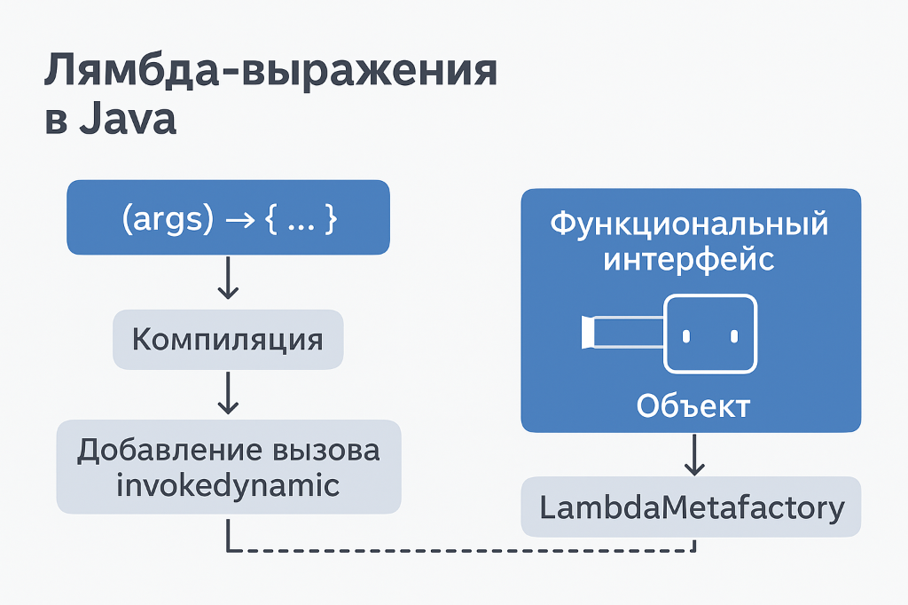

# Лямбда-выражения в Java — полный разбор, «по-человечески» 💡

## 1) Что это такое и зачем

**Лямбда** — компактная запись «функции как значения». Позволяет передавать поведение как аргумент, хранить его в переменных, возвращать из методов. В Java лямбда всегда привязывается к **функциональному интерфейсу** (интерфейс с ровно **одним** абстрактным методом, т. н. SAM).

Плюсы:
- короче и чище, чем анонимные классы;    
- лучше читаемость stream-цепочек;    
- упрощает композицию поведения (filter/map/reduce, коллбеки, стратегии).    

---
## 2) Ключевые понятия (мишени и типы)

- **Функциональный интерфейс (FI/SAM):** интерфейс с одним абстрактным методом. Аннотация `@FunctionalInterface` не обязательна, но полезна (защищает от случайного добавления второго метода).
    
- **Target typing («целевая типизация»):** тип лямбды выводится **из контекста** — из места, куда вы её передаёте (типа параметра/переменной/возвращаемого значения). Отсюда: без контекста лямбда «без типа».
    
- **Типы FI из JDK:** `Runnable`, `Callable<T>`, `Comparator<T>`, `Supplier<T>`, `Consumer<T>`, `Function<T,R>`, `Predicate<T>` и их примитивные варианты для избежания автобоксинга.    

---
## 3) Синтаксис — как мозгу проще запомнить 🧠

Ментальная формула: **«параметры → тело»**.
- Параметры могут быть с типами или без (тип выводится).    
- Тело: одиночное выражение (неявный `return`) или блок с `{}` и явными `return`.    
- Один параметр без типа → можно без скобок; с `var` или с типом → нужны скобки. 
- Нельзя смешивать «с типами» и `var` внутри одного списка — либо всё типизировано явно, либо всё `var`.

---
## 4) Замыкания, области видимости, «effectively final»

- **Захват переменных:** лямбда видит внешние локальные переменные, но **только «эффективно финальные»** (их значение после инициализации больше не меняется). Это гарантирует потокобезопасность и упрощает трансляцию.
    
- **`this`/`super`:** внутри лямбды `this` — это **внешний** объект (в отличие от анонимного класса, где `this` указывает на анонимный объект).
    
- **Тени и имена:** лямбда **не создаёт новую область имён для переменных,** поэтому нельзя заново объявить локальную переменную с именем, уже существующим снаружи (у анонимного класса — можно, у лямбды — нельзя).
    
- **Циклы:** в `for-each` переменная итерации «эффективно финальна» в каждой итерации; в индексном `for` нужно создавать локальную копию, если её хочется захватить.

---
## 5) Исключения (checked/unchecked)

- Лямбда может пробрасывать исключения, **если** абстрактный метод FI их декларирует.
    
- Если целевой FI не декларирует checked-исключение, а внутри лямбды оно возникает — придётся обработать или «обернуть» (часто применяют «sneaky throw»-утилиты, но аккуратно).

---
## 6) Перегрузка методов и двусмысленность (overload resolution)

- Когда перегруженные методы принимают разные FI, одна и та же лямбда может подходить к нескольким вариантам. Решения:
    
    - **явное приведение** к нужному FI;
        
    - **ввод «якоря»** (присвоить лямбду переменной конкретного FI и передать переменную).
        
- Также влияют **generic-параметры** и **возвращаемый тип** SAM-метода (иногда достаточно, чтобы компилятор «склеил» типы).

---
## 7) Метод-ссылки (method references)

Синтаксический сахар, когда «лямбда просто вызывает метод»:

- `СтатическийМетод`: `Type::staticMethod`
    
- «На конкретном объекте»: `instance::instanceMethod`
    
- «На экземпляре, который придёт параметром»: `Type::instanceMethod`
    
- Конструктор: `Type::new`  
    Выбираемая форма должна совпадать с сигнатурой SAM.

---
## 8) Поведение в рантайме: как это работает внутри JVM ⚙️

- В Java лямбды **не** порождают именованные анонимные классы, как раньше.
    
- Компилятор генерирует вызов `invokedynamic`, а в рантайме `LambdaMetaFactory` создаёт нужный объект (часто через синтетический класс), что даёт:    
    - меньше накладных расходов, чем «анонимные классы»,        
    - оптимизации JIT (инлайн и т. п.),        
    - иногда кеширование **незахватывающих** лямбд (могут быть синглтонами).
    
- **Захватывающие** лямбды обычно выделяются в куче (объект с полями для захваченных значений).

---
## 9) Отличия от анонимных классов (важно на собесе)

- **`this`/`super`:** у лямбды — это внешний объект; у анонимного класса — свой.
    
- **Область имён:** лямбда **не** создаёт новую для локальных переменных; анонимный класс — создаёт.
    
- **equals/hashCode:** у лямбд нет «семантики тождества по коду» — это просто объекты; два одинаковых на вид лямбда-литерала **не обязаны** быть равны.
    
- **Сериализация:** серилизовать лямбды в общем случае **не рекомендуется** (детали реализации не стабильны). Если надо, используйте именованные типы/метод-ссылки + кастомные сериализуемые обёртки.

---
## 10) Производительность и практика ⚖️

- **Незахватывающие** лямбды дешёвые (могут кешироваться); **захватывающие** — создают объект.
    
- Streams с лямбдами удобны, но:    
    - на **малых коллекциях** и простых операциях «обычный for» часто быстрее (меньше аллокаций/боксинга);        
    - используйте **примитивные стримы** (`IntStream` и т. п.), чтобы не создавать автобоксинг-мусор;        
    - **parallelStream** даёт профит только на CPU-тяжёлых задачах с хорошим сплиттером и без блокировок.
    
- **Идемпотентность и чистота:** избегайте побочных эффектов в лямбдах внутри stream-операций; это улучшает предсказуемость и параллелизацию.

---
## 11) Композиция функций (готовые «кирпичики»)

- У функциональных интерфейсов есть методы-комбинаторы:    
    - `Function`: `andThen`, `compose`;        
    - `Predicate`: `and`, `or`, `negate`;        
    - `Comparator`: `thenComparing`, `reversed`;        
    - `Consumer`: `andThen`.  
        Это позволяет собирать конвейеры без лишних временных переменных.

---
## 12) Безопасность и читаемость (best practices)

- Давайте понятные имена переменным, куда сохраняете лямбды (особенно если они длинные по логике).
    
- Не злоупотребляйте вложенными лямбдами — сложные цепочки разбивайте на именованные функции.
    
- В публичном API старайтесь принимать **готовые JDK-FI**, а не свои собственные типы (если хватает выразительности).
    
- В **перегрузках** избегайте комбинаций, создающих неоднозначность целевого типа.
    
- Для логгирования/метрик/трассировки — лучше отдельные обёртки, чем «втыкать» сайд-эффекты в лямбды стритмов.

---
## 13) Частые ловушки на собесе (и как отвечать) 🚩

- **«Почему нельзя менять локальную переменную, захваченную лямбдой?»**  
    Потому что компилятор требует «effectively final», это упрощает модель памяти и исключает гонки/несогласованность.
    
- **«Чем лямбда отличается от анонимного класса?»**  
    Сфокусируйся на `this`, области имён, механизме `invokedynamic`, производительности и сериализации.
    
- **«Почему метод-ссылка иногда не компилируется?»**  
    Подпись SAM не совпадает с подписью целевого метода (или нужна другая форма ссылки).
    
- **«Почему перегрузка не выбирается?»**  
    Нет однозначной целевой типизации — помоги компилятору явным приведением или переменной-«якорем».

---
## 14) Как это звучит на собеседовании (30–45 сек)

«В Java лямбда — это реализация функционального интерфейса (SAM) с типом, выводимым из контекста. В рантайме она создаётся через `invokedynamic` и `LambdaMetaFactory`, поэтому дешевле анонимных классов, особенно если не захватывает состояние. Лямбды захватывают только “effectively final” переменные; `this` внутри лямбды — это внешний объект. Отличия от анонимных классов — область имён и семантика `this`, а также отсутствие стабильной сериализации/equals. На практике я использую их для stream-операций, композиций `Function/Predicate/Comparator`, аккуратно обращаюсь с checked-исключениями и избегаю сайд-эффектов для читаемости и параллелизма.»

---
---
---
# 🔹 Лямбда-выражения в Java

## 1. Что это такое

Лямбда-выражение — это **короткая запись анонимного метода** (функции без имени), которую можно передать как аргумент или сохранить в переменную.  
Оно появилось в Java 8 и стало ключевым для **функционального программирования** в Java.

📌 Основная идея: «поведение» (функция) можно передавать как значение.

---
## 2. Синтаксис
```java
(параметры) -> {тело метода}
```

Вариации:
- `(a, b) -> a + b`    
- `x -> x * 2`    
- `() -> System.out.println("Hello")

---
## 3. Где применяется

1. **Функциональные интерфейсы** — интерфейсы с **одним методом** (`@FunctionalInterface`).    
    - Примеры: `Runnable`, `Callable`, `Comparator`, `Function`, `Consumer`, `Supplier`.
    - Лямбда может быть присвоена такой ссылке.
    
2. **Коллекции и Stream API**    
    - Используются в `map`, `filter`, `forEach`, `reduce` и др.

---
## 4. Внутренний механизм работы

- Компилятор не создает анонимный класс.
    
- Он применяет технику **invokedynamic (байткод)** → динамически создает реализацию интерфейса.
    
- Это делает лямбды **легковесными** по сравнению с анонимными классами.    

---
## 5. Типы

1. **Без параметров**:
```java
() -> System.out.println("Hi")
```
    
2. **С одним параметром**:
```java
x -> x * x
```
    
3. **С несколькими параметрами**:
```java
(a, b) -> a + b
```
    
4. **С телом из нескольких строк**:
```java
(a, b) -> {
    int res = a + b;
    return res;
}
```

---
## 6. Замыкания (Closures)

Лямбда может использовать переменные из внешнего контекста, если они **effectively final** (не меняются после присвоения).
```java
int factor = 2;
Function<Integer, Integer> f = x -> x * factor;
```

---
## 7. Отличия от анонимных классов

|Анонимный класс|Лямбда|
|---|---|
|Создает новый класс|Не создает — работает через `invokedynamic`|
|`this` → ссылка на анонимный класс|`this` → ссылка на внешний класс|
|Более многословен|Краткий синтаксис|

---
## 8. Преимущества

✅ Чистый и читаемый код  
✅ Меньше шаблонности (boilerplate)  
✅ Позволяет использовать **Stream API**  
✅ Ускоряет разработку

---
## 9. Под капотом

- При компиляции создается **метод в байткоде**.    
- JVM через `LambdaMetafactory` генерирует объект.    
- То есть фактически это **функция-объект**, привязанная к функциональному интерфейсу.    

---
## 10. На практике

- Использовал в `Stream API` (обработка коллекций).    
- В `CompletableFuture` для асинхронных вызовов.    
- В `KafkaListener` / обработчиках событий.    
- В `Comparator` при сортировках.    

---
📌 **Ключевая мысль для собеседования**:  
Лямбда в Java — это синтаксический сахар над функциональными интерфейсами, реализованный через `invokedynamic`. Она позволяет передавать поведение как аргумент, делая код компактным и удобным для работы с потоками данных.

---



---
