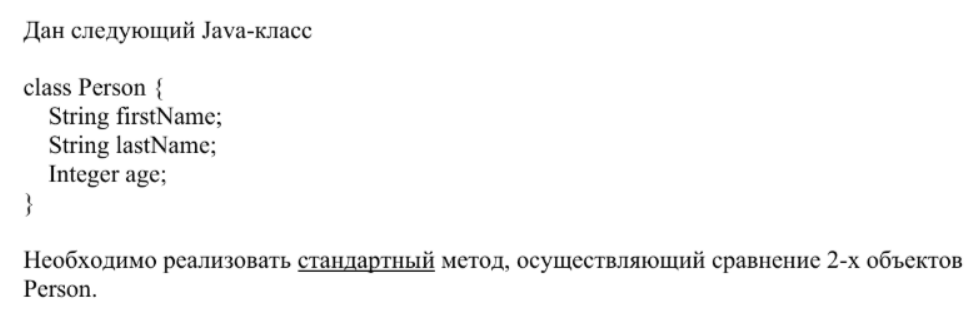

## Задача № 1:

Для следующего Java - класса
```java
class Person {
    String firstName;
    String lastName;
    Integer age;
}
```
Необходимо реализовать <u>стандартный</u> метод, осуществляющий сравнение 2-х объектов Person.

---
Скрин оригинального задания:


---
