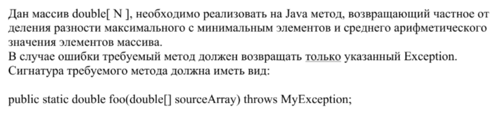

## Задача № 1:

Дан массив double[ N ], необходимо реализовать на Java метод, возвращающий частное от деления разности максимального с минимальным элементов и среднего арифметического значения элементов массива.  
В случае ошибки требуемый метод должен возвращать только указанный Exception.  
Сигнатура требуемого метода должна иметь вид:

```java
public static double foo(double[] sourceArray) throws MyException;
```


---



---
