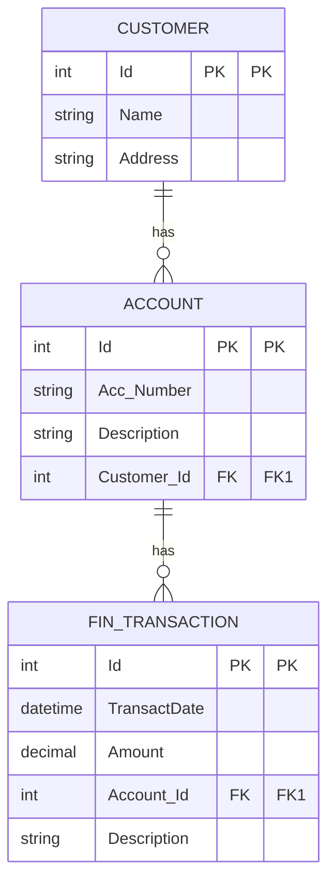

## Задача № 4:

---
**Дана схема БД**

У клиента может не быть лицевых счетов. По лицевому счёту может не быть
транзакций.

Необходимо написать SQL-запрос, возвращающий имя клиента, описание его
лицевого счёта и среднюю сумму транзакции по этому счёту.

---
Скрин оригинального задания:

---
