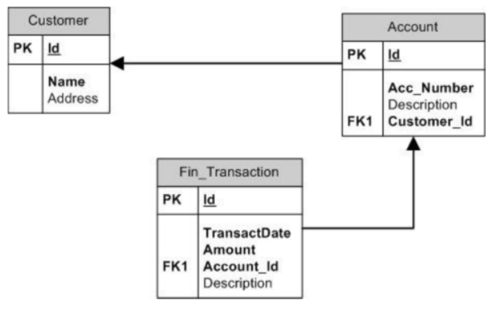
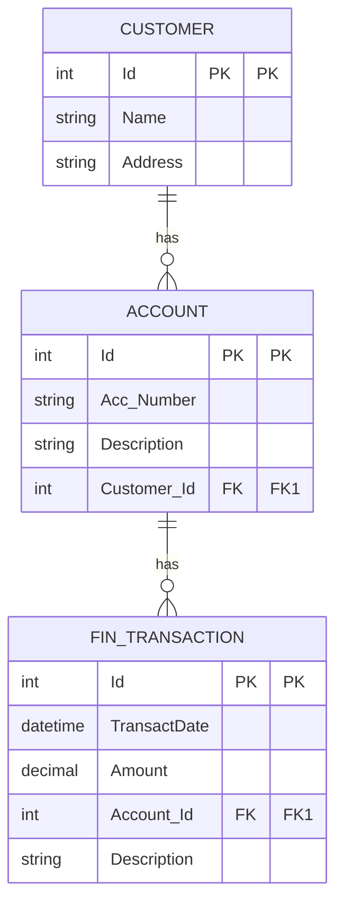
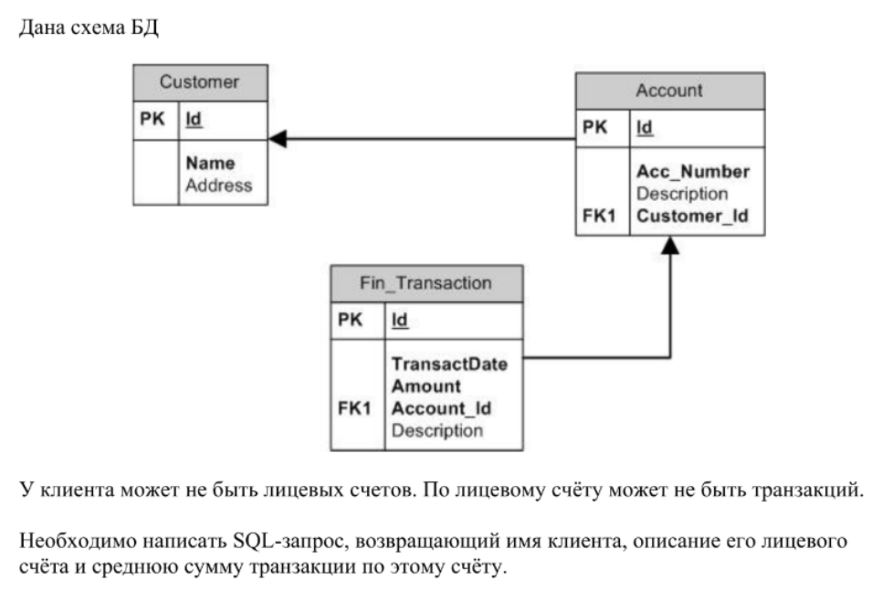

## Задача № 4:

---
**Дана схема БД**




У клиента может не быть лицевых счетов. По лицевому счёту может не быть
транзакций.

Необходимо написать SQL-запрос, возвращающий имя клиента, описание его
лицевого счёта и среднюю сумму транзакции по этому счёту.



---
Скрин оригинального задания:


---
# РЕШЕНИЕ:

**Получить имя клиента, описание его лицевого счёта и среднюю сумму транзакции по этому счёту.**

Сделаем это постепенно: от самого примитивного запроса до более оптимального и читаемого.


# SQL-запросы для получения имени клиента, описания его счёта и средней суммы транзакции

Дана схема БД:

- `Customer(Id, Name, Address)`  
- `Account(Id, Acc_Number, Description, Customer_Id)`  
- `Fin_Transaction(Id, TransactDate, Amount, Account_Id, Description)`  

Условия:
- У клиента может **не быть лицевых счетов**.  
- У счёта может **не быть транзакций**.  
- Нужно вернуть: **имя клиента, описание счёта и среднюю сумму транзакций**.  

---
## 🔹 Вариант 1. Примитивный (только INNER JOIN)

```sql
SELECT c.Name,
       a.Description,
       AVG(t.Amount) AS AvgAmount
FROM Customer c
JOIN Account a ON a.Customer_Id = c.Id
JOIN Fin_Transaction t ON t.Account_Id = a.Id
GROUP BY c.Name, a.Description;
```
### Комментарий:
- Работает только для клиентов со счетами и транзакциями.  
- Если у клиента нет счёта или у счёта нет транзакций — он пропадёт.  

---
## 🔹 Вариант 2. С учётом отсутствия транзакций

```sql
SELECT c.Name,
       a.Description,
       AVG(t.Amount) AS AvgAmount
FROM Customer c
JOIN Account a ON a.Customer_Id = c.Id
LEFT JOIN Fin_Transaction t ON t.Account_Id = a.Id
GROUP BY c.Name, a.Description;
```
### Комментарий:
- Теперь клиент с пустым счётом попадает в выборку.  
- Если у счёта нет транзакций → `AvgAmount = NULL`.  
- Но клиент без счёта всё ещё не попадёт.  

---
## 🔹 Вариант 3. С учётом клиентов без счетов

```sql
SELECT c.Name,
       a.Description,
       AVG(t.Amount) AS AvgAmount
FROM Customer c
LEFT JOIN Account a ON a.Customer_Id = c.Id
LEFT JOIN Fin_Transaction t ON t.Account_Id = a.Id
GROUP BY c.Name, a.Description;
```
### Комментарий:
- Попадают **все клиенты** (даже если у них нет счетов).  
- Если нет счёта → `Description = NULL`.  
- Если нет транзакций → `AvgAmount = NULL`.  

---
## 🔹 Вариант 4. Оптимизированный (через CTE)

```sql
WITH AvgTransactions AS (
    SELECT Account_Id, AVG(Amount) AS AvgAmount
    FROM Fin_Transaction
    GROUP BY Account_Id
)
SELECT c.Name,
       a.Description,
       at.AvgAmount
FROM Customer c
LEFT JOIN Account a ON a.Customer_Id = c.Id
LEFT JOIN AvgTransactions at ON at.Account_Id = a.Id;
```
### Комментарий:
- Подсчёт средней суммы вынесен в отдельный CTE.  
- Улучшает читаемость и производительность.  
- Корректно работает для всех клиентов и счетов.  

---
## 🔹 Вариант 5. Оптимальный (с индексами)

Рекомендуется добавить индексы:
```sql
CREATE INDEX idx_ft_account_amount ON Fin_Transaction(Account_Id, Amount);
CREATE INDEX idx_acc_customer ON Account(Customer_Id);
```

Тогда запрос из **варианта 4** будет работать максимально эффективно.  

---
## ✅ Итог
- **Вариант 1** — самый простой, но теряет клиентов/счета без данных.  
- **Вариант 3** — базовый правильный (учитывает все случаи).  
- **Вариант 4** — оптимальный по читаемости и скорости.  
- **Вариант 5** — тот же запрос + индексы для ускорения.  

---
