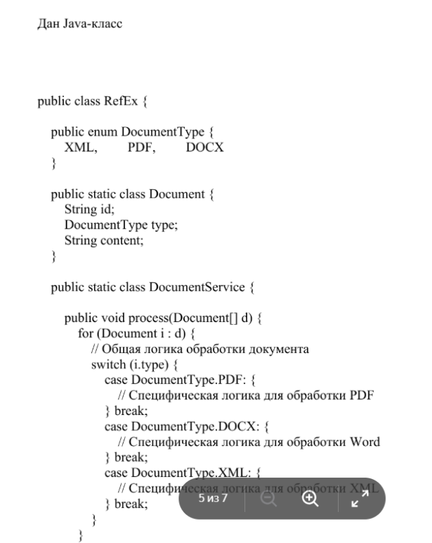
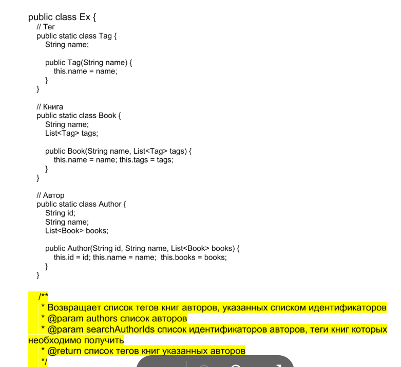
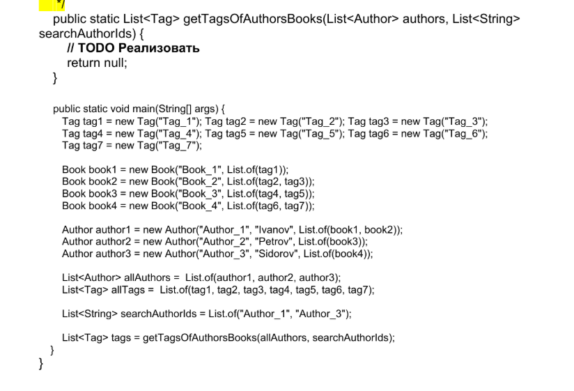

## Задача № 5:

---
Дан Java-класс

```java
public class RefEx {
	
    public enum DocumentType {
        XML, PDF, DOCX
    }
	
    public static class Document {
        String id;
        DocumentType type;
        String content;
    }
	
    public static class DocumentService {
	
        public void process(Document[] d) {
            for (Document i : d) {
                // Общая логика обработки документа
                switch (i.type) {
                    case DocumentType.PDF: {
                        // Специфическая логика для обработки PDF
                    } break;
                    case DocumentType.DOCX: {
                        // Специфическая логика для обработки Word
                    } break;
                    case DocumentType.XML: {
                        // Специфическая логика для обработки XML
                    } break;
                }
            }
        }
    }
}
```

```java
public class Ex {
    // Тег
    public static class Tag {
        String name;
		
        public Tag(String name) {
            this.name = name;
        }
    }
	
    // Книга
    public static class Book {
        String name;
        List<Tag> tags;
		
        public Book(String name, List<Tag> tags) {
            this.name = name; this.tags = tags;
        }
    }
	
    // Автор
    public static class Author {
        String id;
        String name;
        List<Book> books;
		
        public Author(String id, String name, List<Book> books) {
            this.id = id; this.name = name; this.books = books;
        }
    }
}
```

```java
/**
 * Возвращает список тегов книг авторов, указанных списком идентификаторов
 * @param authors список авторов
 * @param searchAuthorIds список идентификаторов авторов, теги книг которых необходимо получить
 * @return список тегов книг указанных авторов
 */
```

```java
public static List<Tag> getTagsOfAuthorsBooks(List<Author> authors, List<String> searchAuthorIds) {
    // TODO Реализовать
    return null;
}

public static void main(String[] args) {
    Tag tag1 = new Tag("Tag_1"); 
    Tag tag2 = new Tag("Tag_2"); 
    Tag tag3 = new Tag("Tag_3");
    Tag tag4 = new Tag("Tag_4"); 
    Tag tag5 = new Tag("Tag_5"); 
    Tag tag6 = new Tag("Tag_6");
    Tag tag7 = new Tag("Tag_7");

    Book book1 = new Book("Book_1", List.of(tag1));
    Book book2 = new Book("Book_2", List.of(tag2, tag3));
    Book book3 = new Book("Book_3", List.of(tag4, tag5));
    Book book4 = new Book("Book_4", List.of(tag6, tag7));

    Author author1 = new Author("Author_1", "Ivanov", List.of(book1, book2));
    Author author2 = new Author("Author_2", "Petrov", List.of(book3));
    Author author3 = new Author("Author_3", "Sidorov", List.of(book4));

    List<Author> allAuthors = List.of(author1, author2, author3);
    List<Tag> allTags = List.of(tag1, tag2, tag3, tag4, tag5, tag6, tag7);

    List<String> searchAuthorIds = List.of("Author_1", "Author_3");

    List<Tag> tags = getTagsOfAuthorsBooks(allAuthors, searchAuthorIds);
}

```

---
Скрин оригинального задания:






---
