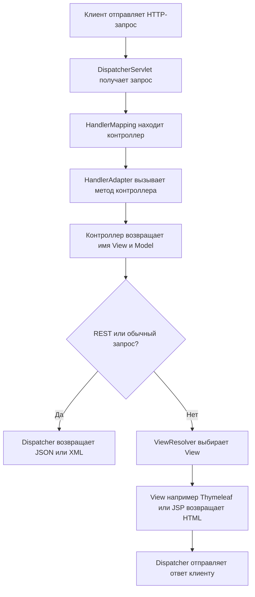
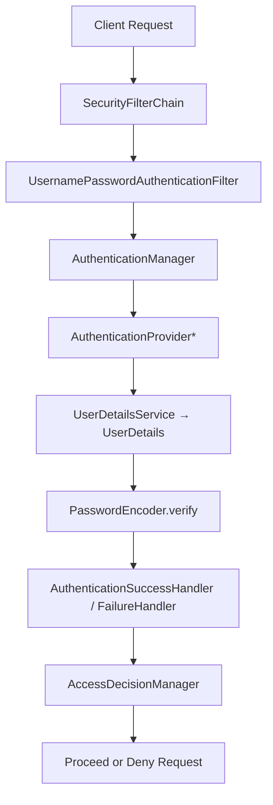
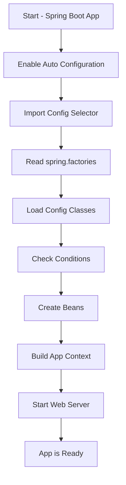
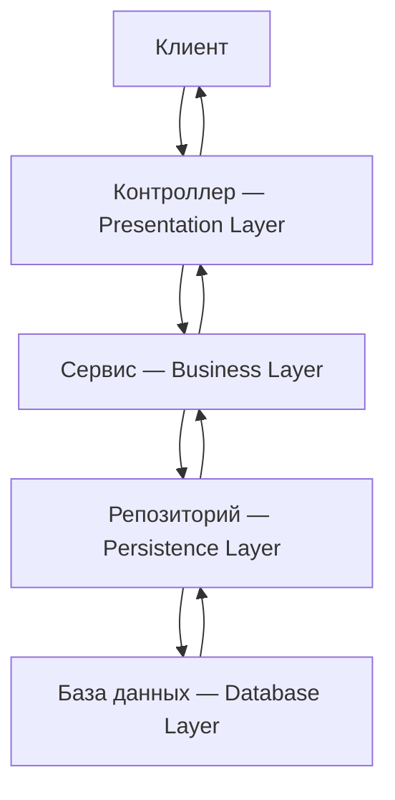

# Spring

---


<details>
        <summary>Список вопросов</summary>

## Список вопросов:

1	Что такое инверсия контроля (IoC) и внедрение зависимостей (DI)? Как эти принципы реализованы в Spring?  
2	Что такое IoC контейнер?  
3	Расскажите про ApplicationContext и BeanFactory, чем отличаются? В каких случаях что стоит использовать?  
4	Расскажите про аннотацию @Bean?  
5	Расскажите про аннотацию @Component?  
6	Чем отличаются аннотации @Bean и @Component?  
7	Расскажите про аннотации @Service и @Repository. Чем они отличаются?  
8	Расскажите про аннотацию @Autowired  
9	Расскажите про аннотацию @Resource  
10	Расскажите про аннотацию @Inject  
11	Расскажите про аннотацию @Lookup  
12	Можно ли вставить бин в статическое поле? Почему?  
13	Расскажите про аннотации @Primary и @Qualifier  
14	Как заинжектить примитив?  
15	Как заинжектить коллекцию?  
16	Расскажите про аннотацию @Conditional  
17	Расскажите про аннотацию @Profile  
18	Расскажите про жизненный цикл бина, аннотации @PostConstruct и @PreDestroy()  
19	Расскажите про скоупы бинов? Какой скоуп используется по умолчанию? Что изменилось в Spring 5?  
20	Расскажите про аннотацию @ComponentScan  
21	Как спринг работает с транзакциями? Расскажите про аннотацию @Transactional.  
22	Расскажите про аннотации @Controller и @RestController. Чем они отличаются? Как вернуть ответ со своим статусом (например 213)?  
23	Что такое ViewResolver?  
24	Чем отличаются Model, ModelMap и ModelAndView?  
25	Расскажите про паттерн Front Controller, как он реализован в Spring?    
26	Расскажите про паттерн MVC, как он реализован в Spring?  
27	Что такое АОП? Как реализовано в спринге?  
28	В чем разница между Filters, Listeners and Interceptors?  
29	Можно ли передать в запросе один и тот же параметр несколько раз? Как?  
30	Как работает Spring Security? Как сконфигурировать? Какие интерфейсы используются?  
31	Что такое SpringBoot? Какие у него преимущества? Как конфигурируется? Подробно.  
32	Расскажите про нововведения Spring 5.  

</details>

---


<details>
        <summary>1	_ IoC и DI? Как _реализованы в Spring?</summary>

## [Что такое инверсия контроля (`IoC`) и внедрение зависимостей (`DI`)? Как эти принципы реализованы в `Spring`?](/ITM/ITM06_Spring/by_questions/IoC_&_DI_for_Spring.md)

### 🔁 `IoC` и 💉 `DI` в `Spring`

### 📌 Inversion of Control (IoC)
**Принцип**, при котором создание и управление зависимостями делегируется **контейнеру**, а не реализуется вручную.
> **В Spring роль _IoC_-контейнера выполняют `ApplicationContext` и `BeanFactory`.**

---
### 📌 Dependency Injection (DI)
**Механизм реализации IoC**, при котором зависимости внедряются контейнером в объект.

**Способы внедрения**:
* 🛠️ Конструктор
* 🔧 Сеттер
* 📄 XML-конфигурация
* 🧪 Аннотации (`@Autowired`, `@Inject`)
* ⚙️ Автоматическое связывание (Autowiring)

---
### ✅ Плюсы `IoC` / `DI`
- 🔄 Отделение **логики** от **реализации**
- 🔀 **Простота** смены реализаций
- 🧩 Повышенная **модульность**
- 🧪 Лёгкость **тестирования**
- 🔗 **Слабая связность** компонентов

---
###### _"Чем меньше ты зависишь — тем легче двигаться вперёд. Это работает и в коде, и в жизни."_

---

```text
***** из методички *****
Inversion of Control - это принцип в разработке программы, при котором управление объектами 
или частями программы передается контейнеру или фреймворку.(с помощью рефлексии). 
Вместо ручного внедрения зависимостей, фреймворк забирает ответственность за это посредством IoC-контейнера. 
Dependency Injection — является одним из способов реализации принципа IoC в Spring. 
Это шаблон проектирования, в котором контейнер передает экземпляры объектов по их типу 
другим объектам с помощью конструктора или метода класса(setter), что позволяет писать слабосвязный код.
(Конфигурации для внедрения - scope,factory method, Можно внедрить через XML или аннотации JAVA, 
процесс внедрения можно автоматизировать Autowiring)
```
---
</details>


<details>
        <summary>2	_ IoC контейнер?</summary>

## [Что такое `IoC` контейнер?](/ITM/ITM06_Spring/by_questions/IoC_container.md)

### 🔄 Что такое `IoC`-контейнер в `Spring`?
### 🧠 Суть:
**IoC-контейнер** — это ядро Spring, которое управляет созданием, 
конфигурацией и жизненным циклом объектов (📦 _beans_) на основе метаданных (_**аннотаций** или `XML`_).

---
### ⚙️ Основные интерфейсы:

| Интерфейс            | 	Назначение                                                                                                                                                                                                                                                                                                                      |
|:---------------------|:---------------------------------------------------------------------------------------------------------------------------------------------------------------------------------------------------------------------------------------------------------------------------------------------------------------------------------|
| `BeanFactory`        | 	Базовый интерфейс **IoC**-контейнера. Управляет созданием и получением бинов.                                                                                                                                                                                                                                                   |
| `ApplicationContext` | 	`ApplicationContext` — это "продвинутая" версия `BeanFactory`, которая добавляет:  <br> 1. **Удобные способы конфигурации** (аннотации, Java Config). <br> 2. **Enterprise-функции** (AOP, события, i18n). <br> 3. **Интеграции с веб-средой**. <br> 4. **Автоматизацию** (регистрация BeanPostProcessor, обработка аннотаций). |

### Сравнение BeanFactory и ApplicationContext
| Функция                        | BeanFactory | 	ApplicationContext |
|:-------------------------------|:-----------:|:-------------------:|
| Создание бинов                 |    ✅ Да     |        ✅ Да         |
| Внедрение зависимостей         |    	✅ Да    |        	✅ Да        |
| Аннотации (`@Autowired`)       |   	❌ Нет    |        	✅ Да        |
| `@PostConstruct`/`@PreDestroy` |   	❌ Нет    |        	✅ Да        |
| AOP                            |   	❌ Нет    |        	✅ Да        |
| Сканирование компонентов       |   	❌ Нет    |        	✅ Да        |
| Интернационализация            |   	❌ Нет    |        	✅ Да        |
| Публикация событий             |   	❌ Нет    |        	✅ Да        |
| Доступ к ресурсам              |   	❌ Нет    |        	✅ Да        |
| Веб-интеграция                 |   	❌ Нет    |        	✅ Да        |

### 📌 Что делает `IoC`-контейнер:
- 🛠️ Создаёт объекты (_бины_)
- 🔗 Связывает зависимости (_внедрение_)
- ⚙️ Конфигурирует компоненты
- 🔄 Управляет жизненным циклом (_инициализация → работа → уничтожение_)

### 🗂️ Конфигурация контейнера:
- 💡 Аннотации: `@Component`, `@Service`, `@Autowired`, и т.п.
- 📄 `XML`-файлы (_олдскул, но всё ещё поддерживаются_)
- 🧬 Java-конфигурации (`@Configuration`, `@Bean`)

---
### 📦 Объекты, управляемые контейнером:
Называются `beans` — это любые классы, объявленные и зарегистрированные в контейнере.

---
###### _"Контейнер — это как личный дворецкий для твоих объектов. Всё под контролем, всё по расписанию."_

---

```text
***** из методички *****
В среде Spring IoC-контейнер представлен интерфейсом ApplicationContext, который является 
оберткой над BeanFactory, предоставляющей дополнительные возможности, например AOP и транзакции. 
Интерфейс BeanFactory предоставляет фабрику для бинов, которая в то же время и является IoC-контейнером приложения. 
Управление бинами основано на конфигурации(аннотации или xml). Контейнер создает бъекты на основе конфигураций 
и управляет их жизненным циклом от создания объекта до уничтожения."

Контейнер отвечает за управление жизненным циклом объекта: 
создание объектов, вызов методов инициализации и конфигурирование объектов путём связывания их между собой.
Объекты, создаваемые контейнером, называются beans. Конфигурирование контейнера осуществляется 
путём внедрения аннотаций, но также, есть возможность, по старинке, загрузить XML-файлы, 
содержащие определение bean’ов и предоставляющие информацию, необходимую для создания bean’ов.
```
---
</details>


<details>
        <summary>3 _ ApplicationContext и BeanFactory _отличия? _что стоит использовать?</summary>

## [Расскажите про `ApplicationContext` и `BeanFactory`, чем отличаются? <br>В каких случаях что стоит использовать?](/ITM/ITM06_Spring/by_questions/BeanFactory_VS_ApplicationContext.md)

### 🔍 `ApplicationContext` vs `BeanFactory`


### 🧠 Суть:

| Компонент            | 	Назначение                                                                                                                                         |
|:---------------------|:----------------------------------------------------------------------------------------------------------------------------------------------------|
| `BeanFactory`        | 	💡 Базовый `IoC`-контейнер (_легковесный_) — **управляет** бинами и **внедряет** зависимости.                                                      |
| `ApplicationContext` | 	🚀 **Расширенный** контейнер — включает весь функционал `BeanFactory` + _enterprise_-фичи. <br>**Доступен только для чтения во время выполнения.** |

---
> **🔍 ApplicationContext предоставляет:**
> * 🧩 Фабричные методы бина для доступа к компонентам приложения
> * 📁 Возможность загружать файловые ресурсы в общем виде
> * 📢 Публикацию событий и регистрацию слушателей
> * 🌐 Интернационализацию через MessageSource
> * 🧬 Наследование от родительского контекста

### 📊 Сравнительная таблица: `BeanFactory` vs `ApplicationContext`

| 🔧 Категория                             | 🟢 `BeanFactory`                                                                | 💚 `ApplicationContext`                                                                  |
|:-----------------------------------------|:--------------------------------------------------------------------------------|:-----------------------------------------------------------------------------------------|
| 📦 Загрузка бинов                        | 💤 Лениво — бин создаётся при вызове `getBean()`                                | 🚀 Проактивно — бины создаются при старте контейнера                                     |
| 📄 Загрузка конфигураций                 | ❌ Один XML-файл                                                                 | ✅ Несколько `XML`-файлов (_массив_)                                                      |
| 🔄 Регистрация BeanPostProcessor         | ❌ Ручная                                                                        | ✅ Автоматическая                                                                         |
| 🔄 Регистрация BeanFactoryPostProcessor  | ❌ Ручная                                                                        | ✅ Автоматическая                                                                         |
| 🧬 Внедрение зависимостей по аннотациям  | ❌ Не поддерживается                                                             | ✅ `@Autowired`, `@PreDestroy`, и др.                                                     |
| 🌐 Интернационализация (MessageSource)   | ❌ Нет                                                                           | ✅ Да                                                                                     |
| 📢 Публикация событий (ApplicationEvent) | ❌ Нет                                                                           | ✅ Да                                                                                     |
| 🏢 Корпоративные сервисы                 | ❌ Нет                                                                           | ✅ Поддержка `JNDI`, `EJB`, `RMI` и др.                                                   |
| 🧪 Поддержка всех скоупов                | ❌ Ограниченно                                                                   | ✅ Полная поддержка: `singleton`, `prototype` и др.                                       |
| 💻 Пример инициализации                  | `BeanFactory factory = new XmlBeanFactory(new ClassPathResource("beans.xml"));` | `ApplicationContext ctx = new ClassPathXmlApplicationContext("dao.xml", "service.xml");` |

---
### 🤔 Когда использовать?

| Использовать...          | 	Когда:                                                             |
|:-------------------------|:--------------------------------------------------------------------|
| 🪶 `BeanFactory`         | 	➤ Нужен **минимальный overhead** (_например, в IoT/моб. среде_)    |
| 🚀 `ApplicationContext`  | 	➤ Стандарт в **enterprise-приложениях**, почти всегда используется |

#### 📌 Рекомендации:

| Сценарий                          | Рекомендация         |
|:----------------------------------|:---------------------|
| Простое приложение, без аннотаций | `BeanFactory`        |
| Современное приложение на Spring  | `ApplicationContext` |
| Нужно слушать события             | `ApplicationContext` |
| Поддержка i18n                    | `ApplicationContext` |
| Масштабируемость и расширяемость  | `ApplicationContext` |

---
### 💡 Вывод:
* **BeanFactory** — минимальный контейнер, полезен для тестов и простых задач, где важна ленивая инициализация.


* **ApplicationContext** — полноценный фреймворк, используется везде, где нужно:
  * события,
  * аннотации,
  * интернационализация,
  * интеграция с корпоративными сервисами,
  * удобство и расширяемость.

---
#### 🧠 лайфхак:
###### `BeanFactory` — как ручная коробка передач: работает, но требует усилий.
###### `ApplicationContext` — это автомат с круиз-контролем, подогревом сидений и кофе ☕💅

---
###### _"Переусложнённая конфигурация — это не гибкость, это отчаяние."_

---

```text
***** из методички *****
ApplicationContext является наследником BeanFactory и полностью реализует его функционал, 
добавляя больше специфических enterprise-функций. Может работать с бинами всех скоупов.
BeanFactory - это фактический контейнер, который создает, настраивает и управляет рядом bean-компонентов. 
Эти бины обычно взаимодействуют друг с другом и, таким образом, имеют зависимости между собой. 
Эти зависимости отражены в данных конфигурации, используемых BeanFactory. 
Может работать с бинами singleton и prototype.
BeanFactory обычно используется тогда, когда ресурсы ограничены (мобильные устройства), 
так как он легче по сравнению с ApplicationContext. 
Поэтому, если ресурсы не сильно ограничены, то лучше использовать ApplicationContext.
ApplicationContext загружает все бины при запуске, а BeanFactory по требованию. 
```
---
</details>


<details>
        <summary>4	_ @Bean?</summary>

## Расскажите про аннотацию @Bean?

### 🧩 Аннотация `@Bean` в Spring
`@Bean` — указывает, что метод возвращает объект, 
который должен быть зарегистрирован как _Spring Bean_ в IoC-контейнере. 
Используется в классах, помеченных `@Configuration` или `@Component`.

---
### 🔧 Основные свойства `@Bean`:

| Свойство            | 	Описание                                                         |
|:--------------------|:------------------------------------------------------------------|
| `name` / `value`    | 	Уникальное имя бина (_по умолчанию — имя метода_)                |
| `initMethod`        | 	Метод, вызываемый при инициализации бина                         |
| `destroyMethod`     | 	Метод, вызываемый при удалении бина из контекста                 |
| `autowireCandidate` | 	Указывает, может ли бин быть внедрён в другие бины автоматически |

---
### 📦 Области видимости (_scopes_) бинов:

| Scope         | 	Описание                                               |
|:--------------|:--------------------------------------------------------|
| `Singleton`   | 	(_**по умолчанию**_) — один экземпляр **на контейнер** |
| `Prototype`   | 	новый экземпляр **при каждом запросе**                 |
| `Request`     | 	один бин на **HTTP-запрос** (_Web_)                    |
| `Session`     | 	один бин на **HTTP-сессию** (_Web_)                    |
| `Application` | 	один бин на `ServletContext` (_Web_)                   |

---
### 💡 Важно:
* `@Bean` — альтернатива аннотациям `@Component`, `@Service`, и т.п., когда нужна **ручная** регистрация.
* Используется, когда бин создаётся через стороннюю библиотеку или требует сложной инициализации.

[🌟 `@Bean` и `@Configuration`: Как это работает? 🌟](/ITM/ITM06_Spring/otc/@Bean_with_@Configuration_vs_@Component.md)

---
###### _“Spring может всё. Но чем больше он может, тем важнее знать, что тебе действительно нужно.” 😉_

---

```text
***** из методички *****
Аннотация @Bean используется для указания того, что метод создает, 
настраивает и инициализирует новый объект, управляемый IoC-контейнером. 
Такие методы можно использовать как в классах с аннотацией @Configuration, 
так и в классах с аннотацией @Component(или её наследниках).

Имеет следующие свойства:
destroyMethod, initMethod — варианты переопределения методов  
удаления и инициализации бина, указав их имена в аннотации.
name — имя бина. По умолчанию именем бина является имя метода.
value — алиас для name()
Bean id в аннотации @Bean будет имя метода. 
Singleton Область видимости по умолчанию. В контейнере находится всего 1 экземпляр бина
Prototype
В контейнере может находится любое количество экземпляров бина
```
---
</details>


<details>
        <summary>5	_ @Component?</summary>

## Расскажите про аннотацию @Component?

### 🧷 Аннотация `@Component` в _Spring_
`@Component` — указывает, что класс является **компонентом** 
и должен быть автоматически обнаружен и зарегистрирован как `Bean` в _IoC_-контейнере.

#### ⚙️ Как работает:
* Используется во время **component scanning**.
* **Spring** находит все классы с `@Component` (_и её наследниками_) 
в указанных пакетах и автоматически регистрирует их как бины.

---
### 🌟 Стереотипные аннотации (_наследники_ `@Component`):

| Аннотация         | 	Предназначение                                                                  |
|-------------------|----------------------------------------------------------------------------------|
| `@Service`        | 	Логика **бизнес**-уровня                                                        |
| `@Repository`     | 	**DAO**-слой, доступ к данным, поддержка `@PersistenceExceptionTranslation`     |
| `@Controller`     | 	Обработка `HTTP`-запросов в **MVC**                                             |
| `@RestController` | 	То же, что `@Controller`, но возвращает **JSON/XML** напрямую (`@ResponseBody`) |

> **Все они = `@Component` + смысловое разделение по слоям архитектуры.**

детально про [`@Repository`](/ITM/ITM06_Spring/otc/@Repository_Exception_Handling.md)

детально про [`@Controller`](/ITM/ITM06_Spring/otc/@Controller_Detailed_Guide.md)

---
### 🔍 Не забудь:
* Для работы `@Component` необходима директива `@ComponentScan`, чтобы указать, где искать эти компоненты.

```java
@Configuration
@ComponentScan("com.example.package")
public class AppConfig {}
```

---
###### _"Кто не прячет свои классы в `@Component`, тот не даёт Spring'у раскрыть их истинный потенциал." 😏_

---

```text
***** из методички *****
@Component - помечаем ей класс чтобы Spring Framework создал бин из этого класса. 
Именно эту аннотацию ищет Spring.F когда сканирует наши классы. 
@Component имеет наследников: 
@Repository, @Service и @Controller, их также называют стереотипными аннотациями
```
---
</details>


<details>
        <summary>6	_ отличия @Bean и @Component?</summary>

## Чем отличаются аннотации `@Bean` и `@Component`?

---
### 💥 `@Bean` vs `@Component` — в чём разница?

| 🔸 Характеристика   | 	`@Component`                             | 	`@Bean`                                                       |
|---------------------|-------------------------------------------|----------------------------------------------------------------|
| 📌 Где используется | 	На **классе**                            | 	На **методе** в классе `@Configuration`                       |
| 🧠 Подход           | 	**Автоматическое** создание бина         | 	**Явное** создание и конфигурация вручную                     |
| 🔍 Обнаружение      | 	Через `@ComponentScan`                   | 	Через `@Configuration`                                        |
| 🧬 Гибкость         | 	Меньше контроля над созданием            | 	Полный контроль (_можно передать параметры, вызывать логику_) |
| 👪 Наследники       | 	`@Service`, `@Repository`, `@Controller` | 	Нет                                                           |

---


```less
@Component  
├── @Repository      — слой DAO (работа с БД + обработка исключений)  
├── @Service         — бизнес-логика (сервисный слой)  
└── @Controller      — обработка HTTP-запросов (MVC слой)
     └── @RestController — REST API (возврат JSON/данных вместо представлений)
```

### 🔍 Объяснение аннотаций:
#### ✅ `@Component`
* Общая аннотация для любого _Spring Bean_.
* Используется, если нет более специфичной аннотации.
* Участвует в _component scanning_.

#### 🛢️ [`@Repository`](/ITM/ITM06_Spring/otc/@Repository_Exception_Handling.md)
* Для DAO-классов, работающих с базами данных.
* Автоматически оборачивает исключения в DataAccessException.

#### ⚙️ `@Service`
* Обозначает бизнес-логику.
* Никакой "магии", только семантическое обозначение.

#### 🌐 [`@Controller`](/ITM/ITM06_Spring/otc/@Controller_Detailed_Guide.md)
* Указывает, что класс — **веб-контроллер**.
* Обрабатывает HTTP-запросы.
* Используется в _Spring MVC_.

#### 🛰️ `@RestController`
* Расширяет [`@Controller`](/ITM/ITM06_Spring/otc/@Controller_Detailed_Guide.md).
* Автоматически добавляет `@ResponseBody` ко всем методам.
* Для построения **REST API**.

---
В центре `@Bean`. Она используется в классах, помеченных `@Configuration`, 
чтобы **вручную** определить `Bean` в контексте _Spring_.  
Вокруг неё — аннотации, которые модифицируют или уточняют поведение этих бинов:


🏗️ Логическая иерархия вокруг `@Bean`
```less
@Bean  
├── @Qualifier  — уточняет, какой бин внедрить  
├── @Primary    — назначает бин "по умолчанию"  
└── @Scope      — задаёт область видимости бина
```

### 🔍 Объяснение:
#### ✅ `@Bean`
* Объявляет метод, создающий Spring-managed Bean.
* Используется в классах с `@Configuration`.

#### 🎯 `@Qualifier`
* Уточняет, **какой именно бин** внедрять, если есть несколько одного типа.
* Пример: `@Autowired` `@Qualifier("beanName")`.

#### 🥇 `@Primary`
* Делает бин приоритетным, если не указан `@Qualifier`.

#### 📦 `@Scope`
* Управляет жизненным циклом бина:
* singleton (_по умолчанию_),
* `prototype`, `request`, `session` и т.д. — в Web-приложениях.

---
### 💎 Когда использовать?
* ✅ `@Component` — когда у тебя **простой** класс, и его можно зарегистрировать **автоматически**.
* ✅ `@Bean` — когда нужна ручная конфигурация, передача параметров, 
создание объектов сторонних библиотек, на которые ты не можешь повесить `@Component`.

[🌟 `@Bean` и `@Configuration`: Как это работает? 🌟](/ITM/ITM06_Spring/otc/@Bean_with_@Configuration_vs_@Component.md)

---
###### _"С `@Component` ты – романтик, а с `@Bean` — стратег." 🎯_

---

```text
***** из методички *****
Аннотация @Component (как и @Service и @Repository) используется для автоматического 
обнаружения и автоматической настройки бинов в ходе сканирования путей к классам. 
Аннотация @Bean используется для явного объявления бина, а не для того, 
чтобы Spring делал это автоматически в ходе сканирования путей к классам
```
---
</details>


<details>
        <summary>7	_ @Service и @Repository. Чем они отличаются?</summary>

## Расскажите про аннотации `@Service` и `@Repository`. Чем они отличаются?

### 🏷️ Аннотации `@Service` и `@Repository` в Spring

| Аннотация     | 	Назначение                                 | 	Особенности                                                                                                                     |
|:--------------|:--------------------------------------------|:---------------------------------------------------------------------------------------------------------------------------------|
| `@Service`    | 	Обозначает **класс бизнес-логики**         | 	Служит для маркировки слоя сервисов (_Business Layer_).                                                                         |                                                                       
| `@Repository` | 	Обозначает **слой доступа к данным (DAO)** | 	Автоматически оборачивает исключения БД в `DataAccessException` <br>+ работает с `PersistenceExceptionTranslationPostProcessor` |

  **🧠 Общее:**
* Обе аннотации — стереотипы (наследники `@Component`) 👉 используются для автоматического сканирования компонентов. 
* Помогают Spring понять роль класса в архитектуре приложения (и упростить поддержку).

---
### 🧨 Отличие по сути:
* `@Service` `=` `@Component` + ясность: _"это бизнес-логика"_ ~~(просто логическая маркировка бизнес-слоя)~~
* `@Repository` `=` `@Component` + логика + _обработка исключений данных_

детально про [`@Repository`](/ITM/ITM06_Spring/otc/@Repository_Exception_Handling.md)

---

```text
***** из методички *****
 @Repository - указывает, что класс используется для работы с поиском, получением и хранением данных. 
    Аннотация может использоваться для реализации шаблона DАО.
 @Service - указывает, что класс является сервисом для реализации бизнес-логики.

Задача @Repository заключается в том, чтобы отлавливать определенные исключения персистентности 
и пробрасывать их как одно непроверенное исключение Spring Framework. 
Для этого в контекст должен быть добавлен класс PersistenceExceptionTranslationPostProcessor.
```
---
</details>


<details>
        <summary>8	_ @Autowired</summary>

## Расскажите про аннотацию `@Autowired`

### 🏷️ Аннотация `@Autowired` в Spring
`@Autowired` — аннотация _Spring_ для автоматического внедрения зависимостей в поля, конструкторы или методы.

[Типы внедрения зависимостей с `@Autowired`](/ITM/ITM06_Spring/otc/@Autowired_Injection_Types.md)

---
### ⚙️ Как работает?
1. **Поиск по типу** (_by **type**_)

2. **Если кандидатов несколько**:
   * Используется бин, помеченный `@Primary` _(бин по умолчанию)_
   * Либо уточняется через `@Qualifier`
   * Либо — по имени **поля/метода/параметра**

3. **Если не найден подходящий бин:**
   * `required = true` (_по умолчанию_) ➜ исключение
   * `required = false` ➜ просто `null`

🛠️ Обрабатывается через `AutowiredAnnotationBeanPostProcessor`.

---
### 💡 Где применяется?

| Способ внедрения    | 	Поддерживается  | 	Примечания                                                                     |
|---------------------|------------------|---------------------------------------------------------------------------------|
| 🔧 **Конструктор**  | 	✅ Да            | 	Рекомендуемый способ (_особенно с_ `final`), поддерживает **иммутабельность**. |
| 🔩 **Сеттер/метод** | 	✅ Да            | 	Хорош для **опциональных** зависимостей.                                       |
| 🧩 **Поле**         | 	✅ Да            | 	Неявное, но **менее гибкое**, не поддерживает final, хуже для тестирования.    |

---
### ❗ Ограничения:
* Не работает в BeanFactoryPostProcessor и BeanPostProcessor, т.к. AutowiredAnnotationBeanPostProcessor ещё не активен.
* ❌ Циклические зависимости (через конструктор) приведут к ошибке.
* Поле без конструктора ➜ легко получить NullPointerException.

---
### 🔄 Отличие от `@Inject`:

| Аннотация    | 	`required`-параметр   | 	Стандарт                |
|--------------|------------------------|--------------------------|
| `@Autowired` | 	✅ Есть (`true/false`) | 	Spring                  |
| `@Inject`    | 	❌ Нет                 | 	JSR-330 (Java стандарт) |

---
#### 💎 Лайфхак _(Spring 4.3+):_
Если в компоненте **только один конструктор**, `@Autowired` можно **не указывать вообще** — Spring сам догадается 😉

---

```text
***** из методички *****
 @Autowired – автоматическое внедрение подходящего бина(конструктор, поле, сеттер-метод или
метод конфигурации):
1) Контейнер определяет тип объекта для внедрения
2) Контейнер ищет соответствующий тип бина в контексте(он же контейнер)
3) Если есть несколько кандидатов, и один из них помечен как @Primary, то внедряется он
4) Если используется @Qualifier, то контейнер будет использовать информацию из @Qualifier, 
    чтобы понять, какой компонент внедрять
5) В противном случае контейнер внедрит бин, основываясь на его имени или ID
6) Если ни один из способов не сработал, то будет выброшено исключение

Контейнер обрабатывает DI с помощью AutowiredAnnotationBeanPostProcessor. 
В связи с этим, аннотация не может быть использована ни в одном BeanFactoryPP или BeanPP.
В аннотации есть один параметр required = true/false - указывает, обязательно ли делать DI. По умолчанию true. 
Либо можно не выбрасывать исключение, а оставить поле c null, если нужный бин не был найден - false.
При циклической зависимости, когда объекты ссылаются друг на друга, нельзя ставить над конструктором.
    Однако при внедрении прямо в поля вы не предоставляете прямого способа создания экземпляра класса 
        со всеми необходимыми зависимостями. Это означает, что:
    Существует способ (путем вызова конструктора по-умолчанию) создать объект с использованием new в состоянии, 
    когда ему не хватает некоторых из его обязательных зависимостей, и использование приведет к NullPointerException
    Такой класс не может быть использован вне DI-контейнеров (тесты, другие модули) и нет способа 
    внедрить зависимости кроме рефлексии предоставить ему необходимые зависимости Неизменность
    
В отличие от способа с использованием конструктора, внедрение через поля не может использоваться 
для присвоения зависимостей final-полям, что приводит к тому, что ваши объекты становятся изменяемыми


Аннотация @Autowired является альтернативой Java-аннотации @Inject, 
не имеющей required = false (зависимость должна быть обязательно внедрена). 
Начиная со Spring Framework 4.3, аннотация @Autowired для конструктора больше не требуется, 
если целевой компонент определяет только один конструктор. 
Однако, если доступно несколько конструкторов и нет основного/стандартного конструктора, 
по крайней мере один из конструкторов должен быть аннотирован @Autowired, 
чтобы указать контейнеру, какой из них использовать.
```
---
</details>


<details>
        <summary>9	_ @Resource</summary>

## Расскажите про аннотацию `@Resource`

### 💎 Аннотация `@Resource` (_javax.annotation_)
`@Resource` — аннотация _Java EE_ (JSR-250) для внедрения зависимостей, поддерживается _Spring_'ом.

---
### ⚙️ Как работает?
📍 **Алгоритм поиска бина:**
1. **По имени** — из параметра **name**, либо из имени **поля/сеттера**.
2. **По типу** — если бин с таким именем не найден.
3. **По `Qualifier`** — как последний шаг (_в специфичных реализациях_).

```java
@Resource // бин с именем "context"
private ApplicationContext context;

@Resource(name = "greetingService")
public void setGreetingService(GreetingService service) {
    this.greetingService = service;
}
```

---
### 🆚 Отличие от `@Autowired`

| Характеристика            | 	`@Resource`                         | 	`@Autowired`                        |
|---------------------------|--------------------------------------|--------------------------------------|
| 🔍 **Поиск**              | 	Сначала **по имени**, потом по типу | 	Сначала **по типу**, потом по имени |
| 🧭 **Гибкость внедрения** | 	Нет `required`                      | 	Есть `required = false`             |
| 🎯 **Указание бина**      | 	`name = "beanName"`                 | 	Используется `@Qualifier`           |
| 🧪 **Тестирование / DI**  | 	Жёстче привязан к контейнеру        | 	Более гибкий                        |
| 🧬 **Стандарт**           | 	Java EE (_JSR-250_)                 | 	Spring (_proprietary_)              |
| 🔁 **Миграция**           | 	Универсальная, стандартная          | 	Привязана к Spring                  |

---
### ❗Важно:
* Может использоваться и в **Spring**, и в **других Java EE фреймворках**.
* **Не имеет параметра** `required` → бин должен быть найден, иначе ошибка.
* Работает **только по полям и методам** (_не поддерживает конструкторы!_).

---

```text
***** из методички *****
@Resource(аннотация java) пытается получить зависимость: по имени, по типу, затем по описанию (Qualifier). 
Имя извлекается из имени аннотируемого сеттера или поля, либо берется из параметра name.

    @Resource //По умолчанию поиск бина с именем "context"
    private ApplicationContext context;

    @Resource(name="greetingService") //Поиск бина с именем "greetingService"
    public void setGreetingService(GreetingService service) {
        this.greetingService = service;
    }

Разница с @Autowired:
❖        ищет бин сначала по имени, а потом по типу;
❖        не нужна дополнительная аннотация для указания имени конкретного бина;
❖        @Autowired позволяет отметить место вставки бина как
необязательное @Autowired(required = false);
❖        при замене Spring Framework на другой фреймворк, менять аннотацию @Resource не нужно.
```
---
</details>


<details>
        <summary>10	_ @Inject</summary>

## Расскажите про аннотацию `@Inject`

### 💉 Аннотация @Inject (javax.inject)
🔹 `@Inject` — стандартная аннотация _Java_ из пакета `javax.inject` (JSR-330)️  
🔹 Это аналог Spring-овской `@Autowired`, но без параметров (_например, нет_ `required=false`).  

---
### ⚙️ Особенности:
📦 Зависимость:

```xml
<dependency>
   <groupId>javax.inject</groupId>
   <artifactId>javax.inject</artifactId>
   <version>1</version>
</dependency>
```

🧭 Алгоритм внедрения:
1. **По типу** (_основной критерий_)
2. **По описанию** (_если есть аннотация_ `@Named`)
3. **По имени** (_в самом конце, неявно_)

🪄 Для указания имени используем `@Named`:
```java
@Inject
@Named("mySpecialBean")
private MyService myService;
```

---
### 🆚 Отличие от `@Autowired`

| Характеристика              | 	`@Inject`             | 	`@Autowired`                                   |
|-----------------------------|------------------------|-------------------------------------------------|
| 🏷️ Из пакета               | 	`javax.inject`        | 	`org.springframework.beans.factory.annotation` |
| 🔍 Поиск                    | 	По типу → по `@Named` | 	По типу → по `@Qualifier`                      |
| 🧷 Параметры                | 	❌ Нет                 | 	✅ Есть (`required`)                            |
| 🤝 Стандартизована          | 	✅ Да (_JSR-330_)      | 	❌ Только в Spring                              |
| 🚫 Required=false           | 	❌ Нельзя              | 	✅ Можно                                        |
| 🧪 Использование вне Spring | 	✅ Универсальна        | 	❌ Ограничена Spring'ом                         |

---

```text
***** из методички *****
@Inject входит в пакет javax.inject и, чтобы её использовать, нужно добавить зависимость:

<dependency>
   <groupId>javax.inject</groupId>
   <artifactId>javax.inject</artifactId>
   <version>1</version>
</dependency>

@Inject (аннотация java) аналог @Autowired (аннотация spring) 
в первую очередь пытается подключить зависимость по типу, затем по описанию и только потом по имени. 
В ней нет параметров. Поэтому при использовании конкретного имени (Id) бина используем @Named:

@Inject
@Named("yetAnotherFieldInjectDependency")
private ArbitraryDependency yetAnotherFieldInjectDependency;
```
---
</details>


<details>
        <summary>11	_ @Lookup</summary>

## Расскажите про аннотацию `@Lookup`

### 🔍 Аннотация `@Lookup` в _Spring_
### 🧠 Суть:
`@Lookup` — это способ получить **новый** (`prototype`) бин из `singleton`-бина, 
при **каждом** вызове метода, а не один раз при инициализации. [_(см. статья)_](https://sysout.ru/kak-ispolzovat-annotatsiyu-lookup/)

---
### 💡 Когда используется?
Когда нужно **динамически внедрять бины с разным _scope_**:
* 🔁 **Singleton** бин зависит от **Prototype** бина
* ❗ Обычное `DI` не сработает — ведь **singleton** создаётся один раз, 
и в нём внедряется один и тот же **prototype**-объект

---
### 🧪 Как работает?
1. Создать **метод-заглушку**, возвращающий нужный бин (_даже `null` можно вернуть_)
2. Отметить его аннотацией `@Lookup`
3. **Spring** в _рантайме_ создаёт **прокси**, который **переопределит** этот метод 
и будет возвращать **новый экземпляр при каждом вызове**

```java
@Component
public class Car {

    @Lookup
    public Passenger getPassenger() {
       // Spring сам внедрит прокси и вернёт новый объект каждый раз
       return null; // Неважно, что здесь, Spring заменит реализацию
    }
}
```

---
### ⚙️ Под капотом:
* Контейнер генерирует **прокси-наследника** класса и переопределяет метод `@Lookup`
* Внедрение происходит **поздно**, _не при старте контекста_, а при каждом вызове метода

---
### 📌 Особенности:

| Фактор                    | 	Значение                                                                       |
|:--------------------------|:--------------------------------------------------------------------------------|
| 🔁 Scope поддержка        | 	Позволяет singleton'у вызывать prototype                                       |
| ⏰ Время внедрения         | 	При вызове метода, не при старте                                               |
| ⚠️ Обязательное поведение | 	Метод должен быть **виртуальным** (_не static, не final, не **private**_)      |
| 📦 Используется где?      | 	Там, где DI через конструктор/сеттер **не подходит** из-за конфликтов scope'ов |

---
### ⚠️ Важно помнить:
* `@Lookup` можно ставить только на **абстрактные** или **override**'нутые методы.
* _Spring_ генерирует подкласс (**`CGLib`**), который **подменяет реализацию** метода.

---
### 💎 Что такое `CGLib`?
`CGLib` (_Code Generation Library_) — это библиотека для создания **прокси** путём **наследования** от целевого класса.

Spring использует `CGLib`, когда невозможно применить интерфейсный прокси (_JDK Proxy_), то есть:
* если класс **не реализует интерфейсы**,
* или нужен прокси **именно над классом**, а не интерфейсом.

> 🛠️ **Как работает?**
> * Создаёт подкласс целевого класса во время выполнения (_runtime_).
> * Переопределяет методы и вставляет в них дополнительную логику (_например, логгирование, транзакции и т.д._).

> ⚠️ **Важные нюансы:**
> * Не работает с `final` классами/методами.
> * Чуть медленнее, чем JDK Proxy (_из-за bytecode generation_).
> * Под капотом использует **ASM** (_генератор байткода_).

---
###### _"Иногда лучше вызвать, чем привязать навсегда — особенно если хочешь свежий экземпляр." 💫_

---

---
**_дполпнительно_**
## 📊 Сравнение аннотаций внедрения зависимостей в Spring

|   Аннотация   |  Принадлежность  | Поиск зависимости       | Поддержка `@Qualifier` | Поддержка `required` | Поддержка `@Primary`  |   Время внедрения   | Особенности                                                          |
|:-------------:|:----------------:|:------------------------|:-----------------------|:---------------------|:----------------------|:-------------------:|:---------------------------------------------------------------------|
| `@Autowired ` |      Spring      | По типу → по имени      | ✅ Да                   | ✅ Да                 | ✅ Да                  | На старте (_Eager_) | Можно на конструкторе, поле, сеттере. Расширяемая логика.            |
|  `@Inject `   | Java (_JSR-330_) | По типу → по описанию   | ✅ С `@Named`           | ❌ Нет                | ✅ Да                  | На старте (_Eager_) | Универсальная Java-спецификация, нет `required=false`.               |
|  `@Resource`  | Java (_JSR-250_) | По имени → по типу      | 🚫 Не требуется        | ❌ Нет                | ❌ Нет                 | На старте (_Eager_) | Порядок важен: имя → тип. Хорошо работает без Spring.                |
|    `@Bean`    |      Spring      | Явная регистрация       | ✅ Через параметры      | ✅ Через Optional     | ✅ Да                  | На старте (_Eager_) | Полный контроль над созданием, init/destroy методы.                  |
| `@Component`  |      Spring      | Автообнаружение классов | ✅ С `@Qualifier`       | ✅ Через `@Autowired` | ✅ Да                  | На старте (_Eager_) | Используется для автоматического создания бинов.                     |
|   `@Lookup`   |      Spring      | По типу                 | ✅ Да                   | ❌ Нет                | ❌ Нет                 |  При вызове метода  | Позволяет singleton'у получать prototype-бин. Создание через прокси. |

---

```text
***** из методички *****
Обычно бины в приложении Spring являтся синглтонами, 
и для внедрения зависимостей мы используем конструктор или сеттер.

Но бывает и другая ситуация: имеется бин Car – синглтон (singleton bean), 
и ему требуется каждый раз новый экземпляр бина Passenger. 
То есть Car – синглтон, а Passenger – так называемый прототипный бин (prototype bean). 
Жизненные циклы бинов разные. Бин Car создается контейнером только раз, 
а бин Passenger создается каждый раз новый – допустим, это происходит каждый раз 
при вызове какого-то метода бина Car. 
Вот здесь то и пригодится внедрение бина с помощью Lookup метода. 
Оно происходит не при инициализации контейнера, а позднее: каждый раз, когда вызывается метод. 

Суть в том, что вы создаете метод-заглушку в бине Car и помечаете его специальным образом – аннотацией @Lookup. 
Этот метод должен возвращать бин Passenger, каждый раз новый. 
Контейнер Spring под капотом создаст прокси-подкласс и переопределит этот метод 
и будет нам выдавать новый экземпляр бина Passenger при каждом вызове аннотированного метода. 
Даже если в нашей заглушке он возвращает null 
(а так и надо делать - всё равно этот метод будет переопределен в прокси-подклассе)
```
---
</details>


<details>
        <summary>12	Можно ли вставить бин в СТАТИЧЕСКОЕ поле? Почему?</summary>

## Можно ли вставить бин в статическое поле? Почему?

### 🚫 Можно ли внедрить бин в **статическое поле**?
**Нет**, Spring **не поддерживает прямое внедрение в статические поля**.

#### 🧠 Почему ❓
* **Статические поля инициализируются** загрузчиком классов **до** запуска Spring-контекста.
* Контейнер не управляет жизненным циклом статических членов.
* DI (Dependency Injection) — это механизм экземпляра, а не класса.

---
### ✅ Как обойти?
Воспользуйся **нестатическим сеттером** с `@Autowired`, чтобы передать зависимость:

```java
private static OrderItemService orderItemService;

@Autowired
public void setOrderItemService(OrderItemService service) {
    TestDataInit.orderItemService = service;
}
```

---

```text
***** из методички *****
НЕТ. 
Spring не позволяет внедрять бины напрямую в статические поля. 
Это связано с тем, что когда загрузчик классов загружает статические значения, контекст Spring ещё не загружен. 
Чтобы исправить это, создайте нестатический сеттер-метод с @Autowired:

   private static OrderItemService orderItemService;

   @Autowired
   public void setOrderItemService(OrderItemService orderItemService) {
       TestDataInit.orderItemService = orderItemService;
   }
```
---
</details>


<details>
        <summary>13	_ @Primary и @Qualifier</summary>

## Расскажите про аннотации `@Primary` и `@Qualifier`

### 🎯 Аннотации `@Primary` и `@Qualifier` в Spring
Когда **в контексте есть несколько бинов одного типа**, нужно указать, какой именно внедрять. 
Вот тут и вступают в игру:

---
### 🏷️ `@Qualifier` — точечный выбор бина _(определяет **приоритет** внедрения)_
🔍 Указывает **по имени**, какой бин внедрить:

```java
@Autowired
@Qualifier("main")
private GreetingService greetingService;
```

> * 📌 Работает с: полями, параметрами конструктора и методов.
> * ✅ Даёт полный контроль — внедряет конкретный бин по имени.

---
### ⭐ `@Primary` — бин по умолчанию _(носит **рекомендательный** характер)_
🌟 Помечает **один бин как приоритетный**, если конкретика не указана:

```java
@Primary
@Bean
public GreetingService defaultService() { ... }
```

> * 📌 Используется, когда не указан @Qualifier.
> * ✅ Удобно при множестве реализаций и одной "по умолчанию".

---
### ⚖️ Приоритет:

| Ситуация               | 	Что внедряется             |
|:-----------------------|:----------------------------|
| Только `@Primary`      | 	Primary-бин                |
| Только `@Qualifier`    | 	Указанный бин              |
| **Оба** присутствуют   | 	`@Qualifier` выигрывает 🎯 |

По умолчанию Spring распознает объекты для вставки по ТИПУ.
Если при использовании `@Autowired` подходящих по типу бинов **больше одного**, то выбрасывается исключение.
Предотвратить выброс данного исключения можно, конкретно указав, какой бин должен быть внедрён. 
Используют аннотацию `@Qualifier`.
---

---
дополнительно:
### 🧩 Аннотации внедрения зависимостей в Spring

| Аннотация     | Принадлежность    |   Основной способ поиска       | Особенности и фишки                                                                 |
|:-------------:|:-----------------:|:------------------------------:|:------------------------------------------------------------------------------------|
| `@Autowired`  |      Spring       |        Сначала по типу         | + Поддерживает `@Qualifier` и `@Primary`<br>+ `required = false` для необязательных |
| `@Qualifier`  |      Spring       | По имени (в паре с @Autowired) | + Уточняет, какой именно бин внедрить                                               |
|  `@Primary`   |      Spring       |            По типу             | + Делает бин приоритетным "по умолчанию"                                            |
|  `@Resource`  | Java EE (JSR-250) |        Сначала по имени        | + Не требует @Qualifier<br>+ Поддерживается многими контейнерами                    |
|   `@Inject`   |  Java (JSR-330)   |        Сначала по типу         | + Аналог @Autowired<br>- Нет параметров типа `required`                             |
|   `@Named`    |  Java (JSR-330)   |  По имени (в паре с @Inject)   | + Альтернатива @Qualifier для JSR-330                                               |
|   `@Lookup`   |      Spring       |   По типу (во время вызова)    | + Позднее внедрение<br>+ Для `prototype` в `singleton`                              |


---

```text
***** из методички *****
@Qualifier применяется если кандидатов для автоматического связывания несколько, 
она позволяет указать в качестве аргумента имя конкретного бина, который следует внедрить. 
Она может быть применена к отдельному полю класса, к отдельному аргументу метода или конструктора:

public class AutowiredClass {

    @Autowired //к полям класса
    @Qualifier("main")
    private GreetingService greetingService;

    @Autowired //к отдельному аргументу конструктора или метода
    public void prepare(@Qualifier("main") GreetingService greetingService){
        /* что-то делаем... */
    };
}

Соответственно, у одной из реализации GreetingService 
должна быть установлена соответствующая аннотация @Qualifier:

@Component
@Qualifier("main")
public class GreetingServiceImpl implements GreetingService {
    //...
}


@Primary тоже используется, чтобы отдавать предпочтение бину, 
когда есть несколько бинов одного типа, но в ней нельзя задать имя бина, 
она определяет значение по умолчанию, в то время как @Qualifier более специфичен.
Если присутствуют аннотации @Qualifier и @Primary, то аннотация @Qualifier будет иметь приоритет. 
```
---
</details>


<details>
        <summary>14	Как заинжектить ПРИМИТИВ?</summary>

## Как заинжектить примитив?

### 🎯 Внедрение примитивов с `@Value`
```java
@Value("${some.key}")
private String myValue;
```

#### 🧩 Аннотация `@Value` позволяет внедрить:
* значения из **application.properties / yml**
* значения, возвращаемые из **SpEL** выражений _(Spring Expression Language)_
* **константы** и **выражения**

---
### 🌟 Где можно ставить:
* над **полями**
* в **конструкторе**
* над **сеттерами**
* над **аргументами методов**

---
### 🧙‍♂️ Примеры:
```java
@Value("#{2 * T(Math).PI}")     // пример со SpEL: результат выражения
@Value("#{someBean.someField}") // пример со SpEL: значение поля другого бина
@Value("#{value.from.file:someDefault}") 
// В примере выше, если не будет доступен 'value.from.file', то внедрится значение “someDefault”
```

---
### 📦 Поддерживаемые типы:
* `String`, `int`, `boolean`, `double` и другие примитивы
* `Date`, `Enum` и даже `Collection`

---

---
###### _"Не всё то бин, что `@Autowired`. Иногда достаточно просто `@Value` и хорошего properties-файла." 🧹✨_

---

```text
***** из методички *****
Для этого можно использовать аннотацию @Value. Можно ставить над полем, конструктором, методом.
Такие значения можно получать из property файлов, из бинов, и т.п.

@Value("${some.key}")
public String stringWithDefaultValue;

В эту переменную будет внедрена строка, например из property или из view.
Кроме того, для внедрения значений мы можем использовать язык SpEL (Spring Expression Language)
```
---
</details>


<details>
        <summary>15	Как заинжектить КОЛЛЕКЦИЮ?</summary>

## Как заинжектить коллекцию?

### 🍭 Внедрение коллекций в Spring
### 🛠 Как это работает?
Если поле — это **массив, List, Set** или **Map**, и используется `@Autowired` — 
Spring подставит **все бины подходящего типа**:

```java
@Autowired
private List<GreetingService> services;
```

---
### 🚀 Способы инъекции:

#### 🔹 Через аннотации (на поле)
* `@Autowired` на поле `List<T>`, `Set<T>` или `Map<String, T>`
* Spring автоматически найдёт все бины нужного типа и поместит в коллекцию
```java
@Autowired
List<Ingredient> ingredients;
```

#### 🔹 Через конструктор _(рекомендуется!)_
* Принимаете `List<T>` (_или другой тип_) в конструкторе
* Обеспечивает `final`‑поля, простое тестирование и неизменяемость
```java
public Kitchen(List<Ingredient> ingredients) {
    this.ingredients = ingredients;
}
```

#### 🔹 Внедрение `Map`  _(ключ = имя бина)_
```java
// Map-инъекция
@Autowired
Map<String, Ingredient> ingredientMap;
```

---
### 📦 Типы внедряемых коллекций:

|   Тип поля       | 	Что внедряется                                 |
|:----------------:|:------------------------------------------------|
|    `List<T>`     | 	Все бины типа `T`, в порядке согласно `@Order` |
|     `Set<T>`     | 	Все бины типа `T`, порядок не гарантируется    |
| `Map<String, T>` | 	**Ключ** — имя бина, **значение** — бин `T`    |
|      `T[]`       | 	Все бины типа `T`, как массив                  |

#### ✅ Работает с полями, конструкторами и сеттерами.

> Со всеми массивами и коллекциями используем внедрение через:
> - поля
> - конструкторы
> - методы-сеттеры

---
### 🎯 Фильтрация — с `@Qualifier`
Если нужно внедрить **только часть** бинов:

* Помечаем каждый бин:
```java
@Bean
@Qualifier("special")
public GreetingService g1() { ... }
```

* Внедряем по квалификатору:

```java
@Autowired
@Qualifier("special")
private List<GreetingService> specialServices;
```

_🧠 Все бины с одним и тем же `@Qualifier` попадут в коллекцию._

---
### 📊 Упорядочивание:
Для `List<T>` и `T[]` можно указать порядок:
* с помощью `@Order(int)`
* или через реализацию интерфейса `Ordered`

```java
@Component
@Order(1)
public class FastService implements GreetingService { ... }
```

---
### 📚 Кратко:
* `@Autowired` внедрит все бины нужного типа в массив, коллекцию или `Map`.
* В `Map` ключами будут имена бинов, значениями — сами бины.
* Для фильтрации используйте `@Qualifier`.
* У бинов в коллекции может быть порядок — `@Order` или `Ordered`.

---

---
###### _“В Spring даже кофейные чашки встанут в очередь — лишь бы стать бином!”_

---

```text
***** из методички *****
Если внедряемый объект массив, коллекция, или map с дженериком, то используя аннотацию @Autowired, 
Spring внедрит все бины подходящие по типу в этот массив(или другую структуру данных). 
В случае с map значениями будут сами бины, а ключами будут имена бинов:
Используя аннотацию @Qualifier можно настроить тип искомого бина. 
(Мы использовали параметр 'name' у аннотации @Bean, чтобы указать конкретный классификатор для бина. 
Но элемент 'name', на самом деле, является не столько именем, сколько идентификатором бина, 
который должен быть уникальным, потому что все бины хранятся в контейнере в Map. 
В случае с коллекцией мы хотим, чтобы несколько бинов имели одно и то же имя квалификатора, 
чтобы их можно было внедрить в одну коллекцию с одним и тем же квалификатором. 
В этом случае мы должны использовать аннотацию @Qualifier вместе с @Bean вместо элемента name.)
Бины могут быть упорядочены, когда они вставляются в списки (не Set или Map) или массивы. 
Поддерживаются как аннотация @Order, так и интерфейс Ordered.
```
---
</details>


<details>
        <summary>16	_ @Conditional</summary>

## Расскажите про аннотацию `@Conditional`

### 💡 Что такое `@Conditional`?
Аннотация, позволяющая **включать/выключать бины** или конфигурации в зависимости от заданных условий
_(указывает, что компонент имеет право на **регистрацию в контексте** только тогда, 
когда все условия **соответствуют**)_.

**📍 Может применяться:**
* Над методами `@Bean`
* Над классами прямо или косвенно аннотированными `@Component`, включая классы `@Configuration`
* Как мета-аннотация при создании наших собственных аннотаций-условий

---
### 🔧 Как работает?
Указываешь **класс**, реализующий интерфейс `Condition`:

```java
public class IsWindowsCondition implements Condition {
   public boolean matches(ConditionContext ctx, AnnotatedTypeMetadata meta) {
      return System.getProperty("os.name").contains("Windows");
   }
}
```

Условия проверяются непосредственно **перед** тем, как должно быть зарегистрировано 
`BeanDefinition` компонента, и они могут помешать регистрации данного `BeanDefinition`


Условия проверяются в специально классах, кот. импл. функц. интерфейс `Condition`:
`boolean matches(ConditionContext context, AnnotatedTypeMetadata metadata) {}`
В Spring Framework имеется множество **готовых аннотаций** 
(_и связанных с ними классами-условиями, имплементирующими интерфейс `Condition`_), 
которые можно применять совместно над одним определением бина..

---
Применение:

```java
@Bean
@Conditional(IsWindowsCondition.class)
public MyService windowsService() { return new WindowsService(); }
```

✅ Бин создаётся только если `matches()` вернёт `true`.

---
### 🧩 Дополнительно:

#### 🔸 Комбинирование условий:
* `AllNestedConditions` – все условия `true`
* `AnyNestedCondition` – хотя бы одно `true`
* `NoneNestedConditions` – ни одно не `true`

#### 🔸 Важные нюансы:
* Проверка идёт до создания бинов.
* Внутри `matches()` не обращаться к самим бинам — только `BeanDefinition`, `Environment`, `Metadata`.

---

```text
***** из методички *****
Spring предоставляет возможность на основе вашего алгоритма включить или выключить 
определение бина или всей конфигурации через @Conditional, 
в качестве параметра которой указывается класс, реализующий интерфейс Condition, 
с единственным методом matches(ConditionContext var1, AnnotatedTypeMetadata var2), возвращающий boolean.
Для создания более сложных условий можно использовать классы 
AnyNestedCondition, AllNestedConditions и NoneNestedConditions.

Аннотация @Conditional указывает, что компонент имеет право на регистрацию 
в контексте только тогда, когда все условия соответствуют.

Условия проверяются непосредственно перед тем, как должен быть зарегистрирован BeanDefinition компонента, 
и они могут помешать регистрации данного BeanDefinition. 
Поэтому нельзя допускать, чтобы при проверке условий мы взаимодействовали с бинами, 
которых еще не существует, с их BeanDefinition-ами можно.
Для того, чтобы проверить несколько условий, можно передать в @Conditional несколько классов с условиями:
@Conditional(HibernateCondition.class, OurConditionClass.class)
Если класс @Configuration помечен как @Conditional, то на все методы @Bean, 
аннотации @Import и аннотации @ComponentScan, связанные с этим классом, 
также будут распространяться указанные условия.
```
---
</details>


<details>
        <summary>17	_ @Profile</summary>

## Расскажите про аннотацию `@Profile`

### 🌱 Аннотация `@Profile` в Spring
### 📌 Суть:
`@Profile` — аннотация для **разделения конфигураций и бинов по средам** (_например: `dev`, `test`, `prod`_). 
Позволяет активировать только нужные бины в зависимости от окружения.

---
### ✅ Основные моменты:

|      Аспект             | 	Описание                                                          |
|:-----------------------:|:-------------------------------------------------------------------|
|      📦 Назначение      | 	Определяет, при каком профиле будет создан бин                    |
|   📍 Где применяется    | 	На `@Component`, `@Configuration`, `@Bean`                        |
|       🔁 Профили        | 	Может принимать **один** или **несколько** профилей               |
|  ⚙️ Активация профиля   | 	Через `application.properties`, переменные среды или аргумент JVM |
| 🔧 Механизм под капотом | 	Основана на аннотации `@Conditional`                              |

---
### 🛠 Активация профиля

1. В `application.properties`:
```properties
spring.profiles.active=dev
```

2. Через VM-параметр:
```bash
-Dspring.profiles.active=prod
```

3. Через переменную окружения:
```bash
SPRING_PROFILES_ACTIVE=test
```

---
### 📁 Конфигурации по профилям:

_Spring Boot_ поддерживает многослойные настройки:
```bash
application.properties           # общие настройки
application-dev.properties       # dev-специфичные
application-prod.properties      # prod-специфичные
```

---
### 💡 Полезно знать:
* Если профиль не активен — бин **не будет зарегистрирован**.
* Можно комбинировать с `@Conditional`, `@Bean`, `@Configuration`.
* Прекрасно подходит для **интеграции, настройки БД, логирования, почты и т.д.**

В качестве быстрого обозначения имена профилей также могут начинаться с оператора
NOT, например «!dev», чтобы исключить их из профиля.
В приведенном примере компонент активируется,
только если профиль «dev» не активен


Одновременно могут быть активны несколько профилей.  
По умолчанию, если профиль бина не определен, то он относится к профилю “default”.  
Spring также предоставляет способ установить профиль по умолчанию, когда другой
профиль не активен, используя свойство «spring.profiles.default».  


---

```text
***** из методички *****
Профили - это ключевая особенность Spring Framework, 
позволяющая нам относить наши бины к разным профилям (логическим группам), например, dev, test, prod.
Мы можем активировать разные профили в разных средах, чтобы загрузить только те бины, которые нам нужны.
Используя аннотацию @Profile, мы относим бин к конкретному профилю. 
Её можно применять на уровне класса или метода. 
Аннотация @Profile принимает в качестве аргумента имя одного или нескольких профилей. 
Она фактически реализована с помощью гораздо более гибкой аннотации @Conditional.
Ее можно ставить на @Configuration и Component классы. 
В Spring Boot есть возможность иметь один файл настроек application.properties, 
в котором будут основные настройки для всех профилей, и иметь по файлу настроек 
для каждого профиля application-dev.properties и application-prod.properties, 
содержащие свои собственные дополнительные настройки.
```
---
</details>


<details>
        <summary>18	_ жизненный цикл БИНА, _ @PostConstruct и @PreDestroy()</summary>

## [Расскажите про жизненный цикл бина, аннотации @PostConstruct и @PreDestroy()](/ITM/ITM06_Spring/by_questions/spring_bean_life_cycle.md)

### 💖 ЖИЗНЕННЫЙ ЦИКЛ БИНА В SPRING [_//видео_](https://youtu.be/5lmmB1yb0ZQ?si=TSJHmjUgi2K-MLF1&t=1085)

🔁 Полный цикл от А до Я:

| 🔢 Этап   | 	💬 Описание                                                                                          |
|:---------:|:------------------------------------------------------------------------------------------------------|
|    1️⃣    | 	**Парсинг конфигурации** — `@ComponentScan`, `@Configuration`, `XML`, `Groovy` и т.д.                |
|    2️⃣    | 	**Создание `BeanDefinition`** — из класса генерится метаинформация                                   |
|    3️⃣    | 	**Регистрация `BeanFactoryPostProcessor`-ов** — на этом этапе можно кастомизировать `BeanDefinition` |
|    4️⃣    | 	**Создание экземпляра бина** — либо через `FactoryBean`, либо `BeanFactory`                          |
|    5️⃣    | 	**Вызов `BeanPostProcessor`-ов (_до инициализации_)** — `postProcessBeforeInitialization()`          |
|    6️⃣    | 	**Вызов** `@PostConstruct` или `afterPropertiesSet()` (_если реализует_ `InitializingBean`)          |
|    7️⃣    | 	**Вызов `initMethod` (_если есть_)** в `@Bean(initMethod="...")`                                     |
|    8️⃣    | 	**Вызов `BeanPostProcessor`-ов (_после инициализации_)** — `postProcessAfterInitialization()`        |
|    9️⃣    | 	**Регистрация в** `Map<BeanName, Bean>`                                                              |
|    🔟     | 	🎉 Готово к использованию! Можно вызывать через `getBean()`                                          |
|    🚪     | 	При `context.close()` — `@PreDestroy`, `destroyMethod`, ресурсы очищаются                            |

Иллюстрация: _Создание **экземпляров бинов**_


Иллюстрация1: _жизненный цикл_ `Spring Bean`


Иллюстрация2: _жизненный цикл_ `Spring Bean`


---
### 🌼 Аннотации `@PostConstruct` и `@PreDestroy`
### 🔧 `@PostConstruct`
Используется для **инициализации после внедрения зависимостей**.

```java
@PostConstruct
private void init() {
// Красивый initial setup 💅
}
```

#### 💡 Особенности:
* Метод должен быть **без аргументов**
* Можно любой уровень доступа (_но чаще_ `private`)
* **Вызывается один раз**
* Работает только на **Managed Beans** (_управляемые Spring_)

🧠 _**Пример**: Загрузка справочников, первичная инициализация кэшей и т.п._

---
### 🧹 `@PreDestroy`
Метод вызывается перед уничтожением бина, чтобы освободить ресурсы.
```java
@PreDestroy
private void cleanup() {
// Bye-bye, любимая база 😢
}
```

### 💡 Особенности:
* Один раз перед удалением
* Только на singleton бинах
* Не должен быть static

🧠 _**Пример**: Закрытие соединений, освобождение потоков, удаление временных файлов_

---

```text
***** из методички *****
1) Парсирование конфигурации и создание BeanDefinition

1. Xml конфигурация — ClassPathXmlApplicationContext(“context.xml”) 
2. Конфигурация через аннотации с указанием пакета 
    для сканирования — AnnotationConfigApplicationContext(“package.name”)
3. Конфигурация через аннотации с указанием класса (или массива классов) 
    помеченного аннотацией @Configuration -AnnotationConfigApplicationContext(JavaConfig.class). 
    Этот способ конфигурации называется — JavaConfig. 
4. Groovy конфигурация — GenericGroovyApplicationContext(“context.groovy”)  
 Если заглянуть внутрь AnnotationConfigApplicationContext, то можно увидеть два поля.  
    private final AnnotatedBeanDefinitionReader reader; private final ClassPathBeanDefinitionScanner scanner;  
    ClassPathBeanDefinitionScanner сканирует указанный пакет на наличие классов помеченных 
    аннотацией @Component (или её алиаса). Найденные классы парсируются и для них создаются BeanDefinition. 
    Чтобы было запущено сканирование, в конфигурации должен быть указан пакет 
    для сканирования @ComponentScan({"package.name"}). AnnotatedBeanDefinitionReader работает в несколько этапов. 
    1. Первый этап — это регистрация всех @Configuration для дальнейшего парсирования. 
        Если в конфигурации используются Conditional, то будут зарегистрированы только те конфигурации,
        для которых Condition вернет true.  
    2. Второй этап — это регистрация BeanDefinitionRegistryPostProcessor, 
        который при помощи класса ConfigurationClassPostProcessor парсирует JavaConfig и создает BeanDefinition. 
        Цель первого этапа — это создание всех BeanDefinition. BeanDefinition — это специальный интерфейс, 
        через который можно получить доступ к метаданным будущего бина. В зависимости от того, 
        какая у вас конфигурация, будет использоваться тот или иной механизм парсирования конфигурации. 
        BeanDefinition — это набор метаданных будущего бина, макет, по которому нужно будет создавать бин 
        в случае необходимости. То есть для каждого бина создается свой объект BeanDefinition, 
        в котором хранится описание того, как создавать и управлять этим конкретным бином. 
        Проще говоря, сколько бинов в программе - столько и объектов BeanDefinition, их описывающих. 
        Сюда входит: из какого класса бин надо создать, scope, установлена ли ленивая инициализация, 
        нужно ли перед данным бином инициализировать другой, init и destroy методы, зависимости. 
    Все полученные BeanDefinition’ы складываются в ConcurrentHashMap, в которой ключём является имя бина, 
    а объект - сам BeanDefinition. При старте приложения, в IoC контейнер попадут бины, которые имеют 
    scope Singleton (устанавливается по-умолчанию), остальные же создаются, тогда когда они нужны.


2) Настройка созданных BeanDefinition

Есть возможность повлиять на бины до их создания, иначе говоря мы имеем доступ к метаданным класса. 
Для этого существует специальный интерфейс BeanFactoryPostProcessor, реализовав который, мы получаем доступ 
к созданным BeanDefinition и можем их изменять. В нем один метод. 
Метод postProcessBeanFactory принимает параметром ConfigurableListableBeanFactory. 
Данная фабрика содержит много полезных методов, в том числе getBeanDefinitionNames, через который 
мы можем получить все BeanDefinitionNames, а уже потом по конкретному имени получить BeanDefinition 
для дальнейшей обработки метаданных.
Разберем одну из родных реализаций интерфейса BeanFactoryPostProcessor. 
Обычно, настройки подключения к базе данных выносятся в отдельный property файл, 
потом при помощи PropertySourcesPlaceholderConfigurer они загружаются и делается inject этих значений в нужное поле. 
Так как inject делается по ключу, то до создания экземпляра бина нужно заменить этот ключ на само значение 
из property файла. Эта замена происходит в классе, который реализует интерфейс BeanFactoryPostProcessor. 
Название этого класса — PropertySourcesPlaceholderConfigurer. Он должен быть объявлен как static

@Bean
public static PropertySourcesPlaceholderConfigurer configurer() {
    return new PropertySourcesPlaceholderConfigurer();
}


3) Создание кастомных FactoryBean (только для XML-конфигурации)

FactoryBean — это generic интерфейс, которому можно делегировать процесс создания бинов типа . 
В те времена, когда конфигурация была исключительно в xml, разработчикам был необходим механизм 
с помощью которого они бы могли управлять процессом создания бинов. Именно для этого и был сделан этот интерфейс.
Создадим фабрику которая будет отвечать за создание всех бинов типа — Color.
public class ColorFactory implements FactoryBean<Color> {
    @Override
    public Color getObject() throws Exception {
        Random random = new Random();
        Color color = new Color(random.nextInt(255), random.nextInt(255), random.nextInt(255));
        return color;
    }

    @Override 
    public Class<?> getObjectType() {
        return Color.class;
    }

    @Override
    public boolean isSingleton() {
        return false;
    }
}

Теперь создание бина типа Color.class будет делегироваться ColorFactory, у которого при каждом создании 
нового бина будет вызываться метод getObject.
Для тех кто пользуется JavaConfig, этот интерфейс будет абсолютно бесполезен.


4) Создание экземпляров бинов

Сначала BeanFactory из коллекции Map с объектами BeanDefinition достаёт те из них, из которых создаёт 
все BeanPostProcessor-ы (Инфраструктурные бины), необходимые для настройки обычных бинов.
Создаются экземпляры бинов через BeanFactory на основе ранее созданных BeanDefinition.
Созданием экземпляров бинов занимается BeanFactory на основе ранее созданных BeanDefinition. 
Из Map<BeanName, BeanDefinition> получаем Map<BeanName, Bean>
Создание бинов может делегироваться кастомным FactoryBean. О их создании читай выше.


5) Настройка созданных бинов

На данном этапе бины уже созданы, мы можем лишь их донастроить.
Интерфейс BeanPostProcessor позволяет вклиниться в процесс настройки наших бинов до того, как они попадут в контейнер. 
ApplicationContext автоматически обнаруживает любые бины с реализацией BeanPostProcessor и помечает их 
как “post-processors” для того, чтобы создать их определенным способом. Например, в Spring 
есть реализации BeanPostProcessor-ов, которые обрабатывают аннотации @Autowired, @Inject, @Value и @Resource.
Интерфейс несет в себе два метода: postProcessBeforeInitialization(Object bean, String beanName) 
и postProcessAfterInitialization(Object bean, String beanName). 
У обоих методов параметры абсолютно одинаковые. Разница только в порядке их вызова. 
Первый вызывается до init-метода, второй - после.
Как правило, BeanPostProcessor-ы, которые заполняют бины через маркерные интерфейсы или тому подобное, 
реализовывают метод postProcessBeforeInitialization (Object bean, String beanName), тогда как BeanPostProcessor-ы, 
которые оборачивают бины в прокси, обычно реализуют postProcessAfterInitialization (Object bean, String beanName).

Прокси — это класс-декорация над бином. Например, мы хотим добавить логику нашему бину, 
но джава-код уже скомпилирован, поэтому нам нужно на лету сгенерировать новый класс. 
Этим классом мы должны заменить оригинальный класс так, чтобы никто не заметил подмены.
Есть два варианта создания этого класса:
1. либо он должен наследоваться от оригинального класса (CGLIB) и переопределять его методы, добавляя нужную логику;
2. либо он должен имплементировать те же самые интерфейсы, что и первый класс (Dynamic Proxy).
По конвенции спринга, если какой-то из BeanPostProcessor-ов меняет что-то в классе, 
то он должен это делать на этапе postProcessAfterInitialization(). 
Таким образом мы уверены, что initMethod у данного бина, работает на оригинальный метод, до того, 
как на него накрутился прокси.


Хронология событий:
1. Сначала сработает метод postProcessBeforeInitialization() всех имеющихся BeanPostProcessor-ов.
2. Затем, при наличии, будет вызван метод, аннотированный @PostConstruct.
3. Если бин имплементирует InitializingBean, то Spring вызовет метод afterPropertiesSet() - 
    не рекомендуется к использованию как устаревший.
4. При наличии, будет вызван метод, указанный в параметре initMethod аннотации @Bean.
5. В конце бины пройдут через postProcessAfterInitialization (Object bean, String beanName). 
    Именно на данном этапе создаются прокси стандартными BeanPostProcessor-ами. 
    Затем отработают наши кастомные BeanPostProcessor-ы и применят нашу логику к прокси-объектам. 
    После чего все бины окажутся в контейнере, который будет обязательно обновлен методом refresh().
6. Но даже после этого мы можем донастроить наши бины ApplicationListener-ами.
7. Теперь всё.


6) Бины созданы
Их можно получить с помощью метода ApplicationContext.getBean().


7) Закрытие контекста
Когда контекст закрывается (метод close() из ApplicationContext), бин уничтожается. Если в бине есть метод, 
аннотированный @PreDestroy, то перед уничтожением вызовется этот метод.
Если в аннотации @Bean определен метод destroyMethod, то будет вызван и он.

Аннотация PostConstruct

Spring вызывает методы, аннотированные @PostConstruct, только 1 раз, сразу после инициализации свойств компонента. 
За данную аннотацию отвечает один из BeanPostProcessorов.
Метод, аннотированный @PostConstruct, может иметь любой уровень доступа, может иметь любой тип возвращаемого 
значения (хотя тип возвращаемого значения игнорируется Spring-ом), метод не должен принимать аргументы. 
Он также может быть статическим, но преимуществ такого использования метода нет, т.к. доступ у него будет 
только к статическим полям/методам бина, и в таком случае смысл его использования для настройки бина пропадает.
Одним из примеров использования @PostConstruct является заполнение базы данных. 
Например, во время разработки нам может потребоваться создать пользователей по умолчанию.


Аннотация PreDestroy

Метод, аннотированный @PreDestroy, запускается только один раз, непосредственно перед тем, 
как Spring удаляет наш компонент из контекста приложения.
Как и в случае с @PostConstruct, методы, аннотированные @PreDestroy, 
могут иметь любой уровень доступа, но не могут быть статическими. 
Целью этого метода может быть освобождение ресурсов или выполнение любых других задач 
очистки до уничтожения бина, например, закрытие соединения с базой данных.

Класс, имплементирующий BeanPostProcessor, обязательно должен быть бином, 
поэтому мы его помечаем аннотацией @Component.
SCOPE_SINGLETON — инициализация произойдет один раз на этапе поднятия контекста. 
SCOPE_PROTOTYPE — инициализация будет выполняться каждый раз по запросу. 
Причем во втором случае ваш бин будет проходить через все BeanPostProcessor-ы 
что может значительно ударить по производительности.
```
---
</details>


<details>
        <summary>19	_ скоупы бинов? Какой _ по умолчанию? _ Spring 5?</summary>

## Расскажите про скоупы бинов? Какой скоуп используется по умолчанию? Что изменилось в Spring 5?
### 🌈 Scopes в Spring: области видимости бинов
### 💡 По умолчанию используется:

```java
@Scope("singleton") // это default
```

### 📦 1. Core scopes (_основные_):

|   🏷 Скоуп    | 	📖 Описание                                                                     |
|:-------------:|:---------------------------------------------------------------------------------|
| **singleton** | 	🐘 Один бин на весь Spring контейнер. Всегда один и тот же экземпляр.           |
| **prototype** | 	🐣 Новый бин каждый раз, когда он запрашивается. Spring не управляет удалением. |

---
### 👯 Особенности `prototype`:
* `@PostConstruct` — вызывается ✅
* `@PreDestroy` — **НЕ вызывается**, ❌ (_ты сам за это в ответе 😏_)
* Полезно для объектов **с коротким временем жизни**, например, временные задачи, динамические формы и т.п.

---
### 🌐 2. Web scopes (_доступны только в веб-приложениях_):

|   🌍 Скоуп      | 	📖 Описание                                               |
|:---------------:|:-----------------------------------------------------------|
|   **request**   | 	🔁 Один бин на один HTTP-запрос                           |
|   **session**   | 	🛋 Один бин на одну HTTP-сессию                           |
| **application** | 	🏢 Один бин на весь ServletContext (_всё веб-приложение_) |
|  **websocket**  | 	🔌 Один бин на весь WebSocket-сеанс                       |

> ❗️ Все эти скоупы требуют регистрации `RequestContextListener` или использование **Spring Web MVC**

---
### ❌ Что **убрали** в _Spring 5_?
### ❎ Global session scope — удалён
* Раньше применялся в портлетах (JSR-168/286)
* Использовался для PortletSession.SCOPE_GLOBAL_SESSION
* Spring 5 сказал ему: _"~~Bye, ты устарел, малыш!~~" 😘_

### ✅ Что добавили / актуализировали?
#### 💡 WebSocket scope
* Поддержка бинов на весь WebSocket-сеанс
* Очень удобно для **stateful** WebSocket-соединений
* Жизненный цикл строго привязан к живости WebSocket'а

#### 🧠 `application` стал использоваться активнее:
* Привязан к `ServletContext`
* Хорош для хранения общих сервисов, кэшей, глобальных счетчиков и т.д.

---
### 📌 Как указывать scope?
```java
@Component
@Scope("prototype") // или "request", "session", "application", "websocket"
public class MyBean { ... }
```

Или через XML (_ретро-стайл, но вдруг тебя качает по-олдскулу 😉_):

```xml
<bean id="myBean" class="com.example.MyBean" scope="session"/>
```

---
## 💎 Spring Bean Scopes — шпаргалка (GitHub Markdown)

| 🏷 Scope      | 🌍 Доступность          | 🔁 Кол-во экземпляров       | 🧬 Жизненный цикл                             | 💥 Особенности                                            |
|:-------------:|:------------------------|:----------------------------|:----------------------------------------------|-----------------------------------------------------------|
|  `singleton`  | Всегда (_по умолчанию_) | 1 бин на весь контейнер     | Создаётся при старте контейнера, живёт вечно  | По дефолту, общий для всех; экономит ресурсы              |
|  `prototype`  | Всегда                  | Новый бин при каждом вызове | Создаётся при запросе, Spring не уничтожает   | `@PreDestroy` не вызывается, бин сам себе хозяин          |
|   `request`   | Только в веб            | 1 бин на HTTP-запрос        | На каждый запрос создаётся и уничтожается     | Требует WebContext, подходит для REST-контроллеров        |
|   `session`   | Только в веб            | 1 бин на HTTP-сессию        | Живёт пока активна сессия                     | Отлично подходит для хранения пользовательского состояния |
| `application` | Только в веб            | 1 бин на приложение         | Живёт столько, сколько живёт `ServletContext` | Удобно для кэшей, глобальных параметров                   |
|  `websocket`  | Только в веб            | 1 бин на WebSocket-сеанс    | Живёт пока жив соединение                     | Новый в Spring 5, идеален для stateful-коммуникации       |

### 🧠 Быстрое запоминание:
* `singleton` — как директор: _один и на всех_.
* `prototype` — как арендный самокат: _нужен — взял_.
* `request` — как курьер: _пришёл — ушёл_.
* `session` — как гость: _задержался на выходные_.
* `application` — как хост: _следит за всем_.
* `websocket` — как чат с красоткой: _пока коннект есть — вы вместе_ 😏

Следующая диаграмма иллюстрирует область действия прототипа Spring:


---

```text
***** из методички *****
Существует 2 области видимости по умолчанию.
Singleton - область видимости по умолчанию. В контейнере будет создан только один бин, 
и все запросы на него будут возвращать один и тот же бин.
Prototype - приводит к созданию нового бина каждый раз, когда он запрашивается.
Для бинов со scope “prototype” Spring не вызывает метод destroy(), так как не берет на себя 
контроль полного жизненного цикла этого бина. 
Spring не хранит такие бины в своём контексте ( контейнере), 
а отдаёт их клиенту и больше о них не заботится (в отличие от синглтон-бинов).

И 4 области видимости в веб-приложении.
Request - Область видимости — 1 HTTP запрос. На каждый запрос создается новый бин
Session - Область видимости — 1 сессия. На каждую сессию создается новый бин
Application - Область видимости — жизненный цикл ServletContext 
WebSocket - Область видимости — жизненный цикл WebSocket
Жизненный цикл web csope полный.

В пятой версии Spring Framework не стало Global session scope. И появились Application и WebSocket
```
---
</details>


<details>
        <summary>20	_ @ComponentScan</summary>

## Расскажите про аннотацию `@ComponentScan`
### 📦 `@ComponentScan` — Сканирование компонентов в Spring
Аннотация `@ComponentScan` используется для указания Spring-контейнеру, 
в каких пакетах искать бины, помеченные аннотациями:
* `@Component`
* `@Service`
* `@Repository`
* `@Controller`
* и даже `@RestController` 🧙‍♂️

📍 **По умолчанию** Spring сканирует пакет, где находится аннотированный `@ComponentScan` класс, и его **подпакеты**.

---
### 🔍 Основные параметры

|      Параметр        | 	Описание                                                                         |
|:--------------------:|:----------------------------------------------------------------------------------|
|    `basePackages`    | 	Указывает пакеты для сканирования (_массив строк_).                              |
| `basePackageClasses` | 	Классы, по которым определяются пакеты (_альтернатива строкам_).                 |
|   `includeFilters`   | 	Фильтры, указывающие, какие компоненты **включать** в сканирование.              |
|   `excludeFilters`   | 	Фильтры, определяющие, какие компоненты **исключать** из сканирования.           |
| `useDefaultFilters`  | 	Отключает стандартное поведение (_сканирование `@Component` и его производных_). |

---
### 🔬 Типы фильтров (_ComponentScan.Filter_)

|       Тип         | 	Описание                                             |
|:-----------------:|:------------------------------------------------------|
|   `ANNOTATION`    | 	По аннотациям (например, исключить все @Controller). |
| `ASSIGNABLE_TYPE` | 	По типу класса (_конкретные классы_).                |
|     `ASPECTJ`     | 	По выражению AspectJ.                                |
|      `REGEX`      | 	По регулярному выражению на имя класса.              |
|     `CUSTOM`      | 	Пользовательская реализация `TypeFilter`.            |

---
### 💡 Где обычно используется?
* Вместе с `@Configuration` в Java-based конфигурации.
* Или уже включена в `@SpringBootApplication`.

```java
@Configuration
@ComponentScan(basePackages = "com.example.myapp")
public class AppConfig { }
```

🔁 Если не указать `basePackages`, то **сканируется пакет, где лежит этот класс**, и всё, что внутри (_подпакеты тоже_).

---
### 🔗 Взаимосвязь с `@SpringBootApplication`

```java
@SpringBootApplication
public class MyApp { }
```

👆 Эта аннотация уже **включает** в себя `@ComponentScan`, направленный на пакет, где находится `MyApp.class`.

Состав `@SpringBootApplication`:
```java
@ComponentScan
@Configuration
@EnableAutoConfiguration
```

👉 Но ты можешь переопределить сканируемые пакеты, явно указав @ComponentScan:

```java
@SpringBootApplication
@ComponentScan(basePackages = {"com.superapp.services", "com.superapp.utils"})
public class SuperApp { }
```

---
### 💡 Для чего используется?
* Контроль точек сканирования, чтобы избежать ненужной инициализации бинов.
* Исключение сторонних или лишних компонентов из контекста.
* Настройка гибкой фильтрации для масштабных проектов.


----
###### _"Spring сканирует, но ты выбираешь, что он найдёт. Настрой фильтры — и управляй хаосом."_

---

```text
***** из методички *****
Первый шаг для описания конфигурации Spring это добавление аннотаций — @Component или наследников.
Однако, Spring должен знаеть где искать их. В @ComponentScan вы указываете пакеты, 
которые должны сканироваться. Можно указать массив строк.
Spring будет искать бины и в их подпакетах.
Мы можем расширить это поведение с помощью includeFilters и excludeFilters параметров в аннотации.
Для ComponentScan.Filter доступно пять типов фильтров:
ANNOTATION
ASSIGNABLE_TYPE
ASPECTJ
REGEX
CUSTOM

Нужно для того, что например, имея какой-то ненужный класс в не нашей библиотеке, 
мы можем создать для него фильтр, чтобы его бин не инициализировался.


Аннотация @ComponentScan используется вместе с аннотацией @Configuration для указания пакетов, 
которые мы хотим сканировать на наличие компонентов, из которых нужно сделать бины. 
@ComponentScan без аргументов указывает Spring по умолчанию сканировать текущий пакет и все его подпакеты. 
Текущий пакет - тот, в котором находится файл конфигурации с этой самой аннотацией @ComponentScan. 
В данном случае в контейнер попадут: 
❖ бин конфигурационного класса; 
❖ бины, объявленные в конфигурационном классе с помощью @Bean; 
❖ все бины из пакета и его подпакетов. Аннотация @SpringBootApplication включает в себя 
аннотации @ComponentScan, @SpringBootConfiguration и @EnableAutoConfiguration, но это не мешает 
разместить её ещё раз отдельно для указания конкретного пакета. 
Если указать @ComponentScan с атрибутом basePackages, то это изменит пакет по умолчанию на указанный
```
---
</details>


<details>
        <summary>21	_ @Transactional. Как спринг работает с транзакциями?.</summary>

## [Как спринг работает с транзакциями? Расскажите про аннотацию `@Transactional`.](/ITM/ITM06_Spring/by_questions/@Transactional.md)

🚀 _Spring_ обеспечивает удобное управление транзакциями с помощью _@Transactional_, 
используя механизм **AOP-прокси**.

---
### 🔷 Ключевые компоненты Spring-транзакций:

|           Компонент            | 	Описание                                                                    |
|:------------------------------:|:-----------------------------------------------------------------------------|
|        `@Transactional`        | 	Определяет методы или классы, которые должны выполняться транзакционно.     |
|  `PlatformTransactionManager`  | 	Управляет физическим открытием/закрытием транзакций.                        |
|         **AOP Proxy**          | 	Создается _Spring_ для перехвата вызовов методов и управления транзакциями. |

---
### 🌟 Что происходит при вызове метода с `@Transactional`?
1. Spring создает **proxy** объекта с аннотацией `@Transactional`.

2. Proxy при вызове метода:
   * открывает соединение с БД (`Connection`),
   * устанавливает `autoCommit=false`,
   * начинает транзакцию и помещает её в `ThreadLocal` контекст.

3. После выполнения метода:
   * при успехе — коммитит транзакцию,
   * при исключении — откатывает.

---
### 📌 Особенности вызовов методов внутри класса:

| Сценарий                                                                         | 	Описание                                                                                  |
|:---------------------------------------------------------------------------------|:-------------------------------------------------------------------------------------------|
| `@Transactional` метод → внутренний метод с `@Transactional`                     | 	⚠️ Вызов идет мимо прокси — **новой транзакции не будет**.                                |
| метод БЕЗ `@Transactional` → внутренний метод с `@Transactional`                 | 	⚠️ Вызов идет мимо прокси — **транзакция не создаётся**.                                  |
| Метод одного класса с `@Transactional` → метод другого класса с `@Transactional` | 	✅ Создаётся новый прокси, возможны две разные транзакции, в зависимости от `propagation`. |

---
### Важно:
Для обхода ограничения вызова методов внутри одного класса 
можно использовать **self-injection** (_внедрение самого себя через контекст_).

---
### ⚙️ Атрибуты аннотации `@Transactional`:

| Атрибут         | 	Описание                                                             | 	Значение по умолчанию  |
|:----------------|:----------------------------------------------------------------------|:------------------------|
| `propagation`   | 	Поведение при вызове транзакционного метода.                         | 	`REQUIRED`             |
| `isolation`     | 	Уровень изоляции транзакции (_READ_COMMITTED, SERIALIZABLE, и т.д._) | 	`DEFAULT`              |
| `rollbackFor`   | 	Откат транзакции при заданном исключении.                            | 	`RuntimeException`     |
| `noRollbackFor` | 	Исключения, которые НЕ вызывают откат.                               | 	Пусто                  |
| `readOnly`      | 	Только для чтения (оптимизация).                                     | 	`false`                |
| `timeout`       | 	Таймаут выполнения транзакции.                                       | 	-                      |

---
### 🚧 Типы распространения (`Propagation`) транзакций:

| Propagation       | 	Описание поведения                                                        |
|:------------------|:---------------------------------------------------------------------------|
| `REQUIRED` ✅      | 	Использует **существующую** транзакцию или создаёт новую.                 |
| `REQUIRES_NEW` ✨  | 	Всегда **создаёт новую** транзакцию, **приостанавливая старую**.          |
| `NESTED` 📍       | 	Создаёт `savepoint` (_если БД поддерживает_), **иначе новую** транзакцию. |
| `MANDATORY` 🚨    | 	**Требует существующую** транзакцию, иначе выбросит **исключение**.       |
| `SUPPORTS` 🔄     | 	Работает в **существующей** транзакции, если нет — **без транзакции**.    |
| `NOT_SUPPORTED` ❌ | 	**Приостанавливает** текущую транзакцию, работает **без транзакции**.     |
| `NEVER` ⛔️        | 	**Запрещает** выполнение в транзакции, иначе **исключение**.              |

---
### 🛠️ Как настроить управление транзакциями?
* В конфигурации Spring:

```java
@Configuration
@EnableTransactionManagement
public class AppConfig {
    @Bean
    public PlatformTransactionManager txManager(DataSource dataSource) {
    return new DataSourceTransactionManager(dataSource);
    }
}
```

* В Spring Boot (`@EnableTransactionManagement` _по умолчанию_):
  * `DataSourceTransactionManager` достаточно указать bean `DataSource`.

---
### 🎯 Физические vs Логические транзакции:
* **Физические**: _JDBC_ транзакции (_открытие/закрытие соединений_).
* **Логические**: методы, помеченные `@Transactional` (_могут быть вложенными_).

Если метод с `Propagation.REQUIRES_NEW` вызывается внутри другой транзакции, 
будут созданы две физические транзакции (_два соединения_).

---
### 🔄 Интеграция с Hibernate/JPA:
При использовании Hibernate/JPA используйте `JpaTransactionManager` 
или `HibernateTransactionManager` вместо `DataSourceTransactionManager`.

* Сессия (`Session`) Hibernate будет синхронизироваться с транзакцией Spring.
* Не нужно вручную управлять `Session`.

Конфигурация:
```java
@Bean
public PlatformTransactionManager txManager(EntityManagerFactory emf) {
    return new JpaTransactionManager(emf);
}
```

---
### ❗️ Наиболее частая ошибка использования `@Transactional`:
Вызов транзакционного метода внутри одного класса (_self-call_) **не создаёт новую транзакцию**, 
даже если указан `REQUIRES_NEW`.

Используйте self-injection, чтобы избежать проблемы:

```java
@Service
public class MyService {
private MyService self;

    @Autowired
    public void setSelf(@Lazy MyService self) {
        this.self = self;
    }

    public void method() {
        self.transactionalMethod();
    }

    @Transactional(propagation = Propagation.REQUIRES_NEW)
    public void transactionalMethod() {
        // ...
    }
}
```

---
### ✅ Вывод (_итоги_):
* Аннотация `@Transactional` обеспечивает **декларативное** управление транзакциями.
* Транзакции управляются через **прокси** и `TransactionManager`.
* Внутренние вызовы **не создают** новых транзакций (_без self-injection_).
* Настройка проста и прозрачна, но важно понимать подводные камни.

#### 🌟 Главное:
Используйте аннотацию **на уровне сервиса**, избегайте внутренних вызовов, 
явно управляйте типами распространения и уровнями изоляции транзакций.

---

```text
***** из методички *****
Хорошая статья - marcobehler.com/guides/spring-transaction-management-transactional-in-depth
Коротко: Spring создает прокси для всех классов, помеченных @Transactional 
(либо если любой из методов класса помечен этой аннотацией), что позволяет вводить 
транзакционную логику до и после вызываемого метода. 
При вызове такого метода происходит следующее:
- proxy, который создал Spring, создаёт persistence context (или соединение с базой),
- открывает в нём транзакцию и сохраняет всё это в контексте нити исполнения (натурально, в ThreadLocal).
- По мере надобности всё сохранённое достаётся и внедряется в бины.

Таким образом, если в вашем коде есть несколько параллельных нитей, у вас будет 
и несколько параллельных транзакций, которые будут взаимодействовать друг с другом согласно уровням изоляции.

Что произойдёт, если один метод с @Transactional вызовет другой метод с @Transactional?
Если это происходит в рамках одного сервиса, то второй транзакционный метод будет считаться частью первого, 
так как вызван у него изнутри, а так как спринг не знает о внутреннем вызове, 
то не создаст прокси для второго метода.
(Обернуто в проски будет а вот транзакция создана не будет если из 2 класса вызван метод то транзакция будет)

Что произойдёт, если один метод БЕЗ @Transactional вызовет другой метод с @Transactional?
Так как spring не знает о внутреннем вызове, то не создаст прокси для второго метода.

Будет ли транзакция откачена, если будет брошено исключение, которое указано в контракте метода?
Если в контракте описано это исключение, то она не откатится. 
Unchecked исключения в транзакционном методе можно ловить, а можно и не ловить.

Значения атрибута propagation у аннотации:
REQUIRED — применяется по умолчанию. При входе в @Transactional метод будет использована 
    уже существующая транзакция или создана новая транзакция, если никакой ещё нет
REQUIRES_NEW — новая транзакция всегда создаётся при входе метод, ранее созданные транзакции 
    приостанавливаются до момента возврата из метода.
NESTED — корректно работает только с базами данных, которые умеют savepoints. 
    При входе в метод в уже существующей транзакции создаётся savepoint, который по результатам 
    выполнения метода будет либо сохранён, либо откачен. 
    Все изменения, внесённые методом, подтвердятся только поздее, с подтверждением всей транзакции. 
    Если текущей транзакции не существует, будет создана новая.
MANDATORY — всегда используется существующая транзакция и кидается исключение, если текущей транзакции нет.
SUPPORTS — метод с этим правилом будет использовать текущую транзакцию, 
    если она есть, либо будет исполнятся без транзакции, если её нет.
NOT_SUPPORTED — при входе в метод текущая транзакция, если она есть, 
    будет приостановлена и метод будет выполняться без транзакции.
NEVER — явно запрещает исполнение в контексте транзакции. 
    Если при входе в метод будет существовать транзакция, будет выброшено исключение.
    
Остальные атрибуты:
rollbackFor = Exception.class - если какой-либо метод выбрасывает указанное исключение, 
    контейнер всегда откатывает текущую транзакцию. По умолчанию отлавливает RuntimeException
noRollbackFor = Exception.class - указание того, что любое исключение, 
    кроме заданных, должно приводить к откату транзакции.
rollbackForClassName и noRollbackForClassName - для задания имен исключений в строковом виде.
readOnly - разрешает только операции чтения.
В свойстве transactionManager хранится ссылка на менеджер транзакций, определенный в конфигурации Spring.
timeOut - По умолчанию используется таймаут, установленный по умолчанию для базовой транзакционной системы. 
    Сообщает менеджеру tx о продолжительности времени, чтобы дождаться простоя tx, 
    прежде чем принять решение об откате не отвечающих транзакций.
isolation - уровень изолированности транзакций


Подробно:
Для работы с транзакциями Spring Framework использует AOP-прокси:
Для включения возможности управления транзакциями нужно разместить 
аннотацию @EnableTransactionManagement у класса конфигурации @Configuration.
Она означает, что классы, помеченные @Transactional, должны быть обернуты аспектом транзакций. 
Отвечает за регистрацию необходимых компонентов Spring, таких как TransactionInterceptor и советы прокси. 
Регистрируемые компоненты помещают перехватчик в стек вызовов при вызове методов @Transactional. 
Если мы используем Spring Boot и имеем зависимости spring-data-* или spring-tx, 
то управление транзакциями будет включено по умолчанию.
Пропагейшн работает только если метод вызывает другой метод в другом сервисе. 
Если метод вызывает другой метод в этом же сервисе, то используется this и вызов проходит мимо прокси.
Это ограничение можно обойти при помощи self-injection.
Слой логики(Service) - лучшее место для @Transactional.

Помечая @Transactional класс @Service, то все его методы станут транзакционными. 
Так, при вызове, например, метода save() произойдет примерно следующее:
1. Вначале мы имеем:
❖        класс TransactionInterceptor, у которого вызывается метод invoke(...), 
                внутри которого вызывается метод класса-родителя TransactionAspectSupport: 
                invokeWithinTransaction(...), в рамках которого происходит магия транзакций.
❖        TransactionManager: решает, создавать ли новый EntityManager и/или транзакцию.
❖        EntityManager proxy: EntityManager - это интерфейс, и то, что внедряется в бин в слое DAO 
                на самом деле не является реализацией EntityManager. 
                В это поле внедряется EntityManager proxy, который будет перехватывать обращение 
                к полю EntityManager и  делегировать выполнение  конкретному EntityManager в рантайме. 
                Обычно EntityManager proxy представлен классом SharedEntityManagerInvocationHandler.
2. Transaction  Interceptor
В TransactionInterceptor отработает код до работы метода save(), в котором будет определено, 
выполнить ли метод save() в пределах уже существующей транзакции БД или должна стартовать новая отдельная транзакция. 
TransactionInterceptor сам не содержит логики по принятию решения, решение начать новую транзакцию, 
если это нужно, делегируется TransactionManager. 
Грубо говоря, на данном этапе наш метод будет обёрнут в try-catch и будет добавлена логика до его вызова и после:
     try {
        transaction.begin();         // логика до
        service.save();         
        transaction.commit();      // логика после
      } catch(Exception ex) {
       transaction.rollback();
       throw ex;
      }
3. TransactionManager
Менеджер транзакций должен предоставить ответ на два вопроса:
❖        Должен ли создаться новый EntityManager?
❖        Должна ли стартовать новая транзакция БД?
Решение принимается, основываясь на следующих фактах:
❖        выполняется ли хоть одна транзакция в текущий момент или нет;
❖        атрибута «propagation» в @Transactional.
Если TransactionManager решил создать новую транзакцию, тогда:
❖        Создается новый EntityManager;
❖        EntityManager «привязывается» к текущему потоку (Thread);
❖        «Получается» соединение из пула соединений БД; 
❖        Соединение «привязывается» к текущему потоку.
И EntityManager и это соединение привязываются к текущему потоку, используя  переменные ThreadLocal.
4. EntityManager proxy
Когда метод save() слоя Service делает вызов метода save() слоя DAO, внутри которого вызывается, например, 
entityManager.persist(), то не происходит вызов метода persist() напрямую у EntityManager, 
записанного в поле класса DAO. 
Вместо этого метод вызывает EntityManager proxy, который достает текущий EntityManager для нашего потока, 
и у него вызывается метод persist().

5. Отрабатывает DAO-метод save().
6. TransactionInterceptor
Отработает код после работы метода save(), а именно будет принято решение по коммиту/откату транзакции.

Кроме того, если мы в рамках одного метода сервиса обращаемся не только к методу save(), 
а к разным методам Service и DAO, то все они буду работать в рамках одной транзакции, 
которая оборачивает этот метод сервиса.
Вся работа происходит через прокси-объекты разных классов. 
Представим, что у нас в классе сервиса только один метод с аннотацией @Transactional, а остальные нет. 
Если мы вызовем метод с @Transactional, из которого вызовем метод без @Transactional, 
то оба будут отработаны в рамках прокси и будут обернуты в нашу транзакционную логику. 
Однако, если мы вызовем метод без @Transactional, из которого вызовем метод с @Transactional, 
то они уже не будут работать в рамках прокси и не будут обернуты в нашу транзакционную логику.
```
---
</details>


<details>
        <summary>22	_ @Controller и @RestController. _ отличия? Как вернуть ответ со своим статусом?</summary>

## Расскажите про аннотации `@Controller` и `@RestController`. Чем они отличаются? Как вернуть ответ со своим статусом (например 213)?
### 🧭 Аннотации `@Controller` и `@RestController` в Spring
###### 🔗  [см. статью: _"**Spring MVC — основные понятия, архитектура**"_](https://javastudy.ru/spring-mvc/spring-mvc-basic/)
#### _Состоят из набора методов- обработчиков, помеченных `@RequestMapping`._


### 🎭 `@Controller`
* Используется для **обработки HTTP-запросов** и возврата **модели и представления (_View_)**.
* Подразумевает использование **шаблонизаторов** (`Thymeleaf`, `JSP` _и т.д._).
* Возвращает **имя представления**, а не данные.

---
### 📦 `@RestController`
* Состоит из `@Controller` + `@ResponseBody`.
* Возвращает **данные** (_чаще всего **JSON**_), а не представления.
* Используется в **REST API**.
* Все методы автоматически сериализуют результат в тело ответа (`ResponseBody` _по умолчанию_).

---
### 🔄 `@ResponseBody`
* Аннотация, указывающая, что результат метода должен быть сериализован и **помещён в тело ответа** (`HttpResponse`).
* Не нужна при использовании `@RestController` — там уже "**вшита**".

---
### 📬 Возврат ответа с _кастомным_ статусом
Для возврата ответа с произвольным HTTP-статусом используется `ResponseEntity<T>`:

```java
return ResponseEntity.status(213).body("Тело ответа");
```

Можно также добавить заголовки и другие параметры:

```java
return ResponseEntity
   .status(213)
   .header("X-Custom-Header", "value")
   .body("Данные");
```

---
### 🗺️ `@RequestMapping`
* Универсальная аннотация для **сопоставления HTTP-запросов** с методами контроллера.
* Может использоваться с `method = RequestMethod.GET/POST/...`, 
а также с параметрами `path`, `params`, `headers` и др.
* На практике чаще заменяется специализированными аннотациями:
`@GetMapping`, `@PostMapping`, `@PutMapping`, `@DeleteMapping`.

---

---
## 🎯 Что делает `@Controller` с приходящим запросом? <br>Механизм работы пошагово:
### 1️⃣ Запрос приходит в `DispatcherServlet`
* Это главный **фронт-контроллер** Spring MVC.
* Перехватывает все HTTP-запросы.
* Определяет, кто должен обработать запрос.
```text
Класс: DispatcherServlet
```

---
### 2️⃣ Ищется подходящий Handler (_контроллер_)
* Используется **HandlerMapping**, чтобы сопоставить **URL** и **HTTP-метод** с нужным методом контроллера.
* Метод определяется по аннотациям `@RequestMapping`, `@GetMapping`, и т.д.
```text
HandlerMapping → находит метод, помеченный @RequestMapping или @GetMapping и пр.
```

---
### 3️⃣ Выполняется метод контроллера
* Вызывается метод из класса, помеченного `@Controller`.
* Spring сам внедряет все нужные параметры 
(_через аннотации `@RequestParam`, `@PathVariable`, `@ModelAttribute`, и т.д._).

---
### 4️⃣ Формируется Model и View (_если это `@Controller`_)
* Возвращаемое значение метода интерпретируется как **имя шаблона** (_например, "`index`"_).
* Через **ViewResolver** находится нужный HTML-шаблон.
```java
return "index"; // → отрисуется шаблон /WEB-INF/views/index.html
```

---
### 5️⃣ Генерируется HTML и отправляется клиенту
* Spring объединяет данные из `Model` и шаблон из `ViewResolver`, чтобы собрать финальный HTML.
* Этот HTML возвращается пользователю.

---
### 🚨 Отличие от `@RestController`
Если бы ты использовал `@RestController`, то:
* Шаблон не искался бы.
* Возвращаемое значение сериализовалось бы напрямую в **JSON** через `HttpMessageConverter`.

---
### 💎 Визуально как это выглядит
```text
Browser ➜ DispatcherServlet ➜ HandlerMapping ➜ @Controller ➜ ViewResolver ➜ Response (HTML)
```


---
###### _“Контроллер не сам готовит блюдо, он просто вызывает нужного повара и подаёт результат — красиво и вовремя.”_

---

```text
***** из методички *****
@Controller - специальный тип класса, обрабатывает HTTP-запросы и часто используется с аннотацией @RequestMapping.
@RestController ставится на класс-контроллер вместо @Controller. 
Она указывает, что этот класс оперирует не моделями, а данными. 
Она состоит из аннотаций @Controller и @ResponseBody.
 Была введена в Spring 4.0 для упрощения создания RESTful веб-сервисов.

@ResponseBody сообщает контроллеру, что возвращаемый объект автоматически сериализуется 
(используя Jackson message converter) в json или xml и передается обратно в объект HttpResponse.

ResponseEntity используется для формирования кастомизированного HTTP-ответа 
с пользовательскими параметрами (заголовки, код статуса и тело ответа). 
Во всех остальных случаях достаточно использовать @ResponseBody.
Если мы хотим использовать ResponseEntity, 
то просто должны вернуть его из метода, Spring позаботится обо всем остальном.
return ResponseEntity.status(213);

RequestMapping - это аннотация в Spring, 
которая позволяет нам сопоставлять HTTP-запросы с методами, которые мы хотели бы запустить
```
---
</details>


<details>
        <summary>23	Что такое ViewResolver?</summary>

## Что такое ViewResolver?
### 🖼️ `ViewResolver` в _Spring MVC_
`ViewResolver` — это компонент _Spring MVC_, который преобразует **имя представления (_view name_)**, 
возвращённое контроллером, в **реальный шаблон (_view_)**, который нужно отрендерить.

> 🧠 То есть он **находит нужный файл**, например `.jsp`, `.html`, `.thymeleaf`, 
> и **передаёт туда модель (_Model_)** с данными.
 ([_см. **описание интерфейса**_](https://javastudy.ru/spring-mvc/spring-mvc-viewresolver/)).


---
### 🔄 Как работает `ViewResolver`?
1. Контроллер возвращает логическое имя представления:
```java
return "userProfile";
```

2. `DispatcherServlet` передаёт это имя `ViewResolver`.

3. `ViewResolver` находит нужный шаблон (_например, `HTML` или `JSP`_).
```bash
/WEB-INF/views/userProfile.jsp
или
templates/userProfile.html (если Thymeleaf)
```

4. Spring подставляет туда данные из `Model`/ Генерится `HTML` → отправляется клиенту.

---
### 🧰 Популярные реализации `ViewResolver`

| Класс                            | 	Описание                                                                |
|:---------------------------------|:-------------------------------------------------------------------------|
| **InternalResourceViewResolver** | 	🔧 По умолчанию. Работает с JSP. Добавляет `prefix` и `suffix` к имени. |
| **UrlBasedViewResolver**         | 	Основа для других реализаций. Строит URL из логического имени.          |
| **ThymeleafViewResolver**        | 	🌿 Поддержка `Thymeleaf` шаблонов.                                      |
| **FreeMarkerViewResolver**       | 	📄 Для `FreeMarker` шаблонов.                                           |
| **VelocityViewResolver**         | 	⚙️ Для Apache Velocity (_устаревшая, но встречается_).                  |
| **JasperReportsViewResolver**    | 	📊 Интеграция с JasperReports (_для PDF/Excel-отчётов и т.п._).         |


---
### 🔄 Порядок работы:
> Можно зарегистрировать **несколько ViewResolver'ов**, 
> и они будут вызываться **по очереди**, пока один не найдёт подходящий view.

---
### 📍 Когда ViewResolver НЕ используется?
> Если ты пишешь _REST API_ и возвращаешь _JSON_ через `@RestController` или `@ResponseBody`, 
> то никакой `ViewResolver` не нужен. Spring просто сериализует объект в JSON — и всё, никаких шаблонов.

---
### 📍 Настройка InternalResourceViewResolver
```java
@Bean
public ViewResolver viewResolver() {
   InternalResourceViewResolver resolver = new InternalResourceViewResolver();
   resolver.setPrefix("/WEB-INF/views/");
   resolver.setSuffix(".jsp");
   return resolver;
}
```

📎 Тогда `return "home"` → откроет: `/WEB-INF/views/home.jsp`

---
### 🌍 Поддержка интернационализации
Многие реализации поддерживают **интернационализацию (i18n):**
`ViewResolver` может выбирать представления 
в зависимости от локали пользователя (_например, `home_en.jsp`, `home_ru.jsp`_).

---
###### _"Контроллер говорит, что хочет видеть 'дом', а ViewResolver уже знает — где этот дом, как он выглядит, и на каком языке в нём таблички."_ 🏡

---

```text
***** из методички *****
ViewResolver  - распознаватель представлений - это способ работы с представлениями(html-файлы), 
который поддерживает их распознавание на основе имени, возвращаемого контроллером.
Spring Framework поставляется с большим количеством реализаций ViewResolver. 
Например, класс UrlBasedViewResolver поддерживает прямое преобразование логических имен в URL.
InternalResourceViewResolver — реализация ViewResolver по умолчанию, которая позволяет находить представления, 
которые возвращает контроллер для последующего перехода к ним. 
Ищет по заданному пути, префиксу, суффиксу и имени.
Любым реализациям ViewResolver желательно поддерживать интернационализацию, то есть множество языков.
Существует также несколько реализаций для интеграции с различными технологиями представлений, 
такими как FreeMarker (FreeMarkerViewResolver), Velocity (VelocityViewResolver) 
и JasperReports (JasperReportsViewResolver).

При помощи интерфейса ViewResolver DispatcherServlet определяет, какой Вид нужно использовать 
на основании полученного имени, возвращаемого контроллером.
```
---
</details>


<details>
        <summary>24	_ Model, ModelMap и ModelAndView - отличия?</summary>

## Чем отличаются `Model`, `ModelMap` и `ModelAndView`?

### 🧺 `Model`, `ModelMap`, `ModelAndView` — в чём разница?
Эти три сущности используются в контроллерах _Spring MVC_ для **передачи данных в представление (_View_)**.  
Различаются они по **структуре**, **гибкости** и **способу использования**.

---
### 📦 Сравнительная таблица

|    Компонент    | 	Класс/Интерфейс                                | 	Где используется                          | 	Особенности                                                                       |
|:---------------:|:------------------------------------------------|:-------------------------------------------|:-----------------------------------------------------------------------------------|
|     `Model`     | 	`org.springframework.ui.Model` (_интерфейс_)   | 	Spring MVC (_Controller **methods**_)     | 	Самый лёгкий способ передать данные во View. Реализуется через `ModelMap` внутри. |
|   `ModelMap`    | 	`org.springframework.ui.ModelMap` (_класс_)    | 	Spring MVC (_Controller **methods**_)     | 	Наследуется от `LinkedHashMap<String, Object>`. Удобен для манипуляций с моделью. |
| `ModelAndView`  | 	`org.springframework.web.servlet.ModelAndView` | 	Spring MVC (_Controller **return type**_) | 	Позволяет задать **и модель, и имя представления** в одном объекте. Гибкий.       |

---
### 🔍 Разбор по отдельности

--
### 🔸 `Model`

* Интерфейс для добавления атрибутов в модель  
(_Обычно используется как параметр метода контроллера_):
```java
@GetMapping("/example")
public String example(Model model) {
   model.addAttribute("message", "Привет, мир!");
   return "view";
}
```

#### Особенности:
* Интерфейс, часто внедряется автоматически _Spring_'ом.
* Не содержит логики отображения (_view_).
* Хорош для простых случаев// Идеален для лаконичного кода в методах контроллера.

--
### 🔸 `ModelMap`

* Наследует `LinkedHashMap<String, Object>`, который реализует тот же интерфейс `Model`.  
Позволяет обращаться с моделью как с обычной 'мапкой' (`map`).

* Можно использовать как параметр метода:
```java
@GetMapping("/example")
public String example(ModelMap modelMap) {
   modelMap.addAttribute("message", "Привет, мир!");
   return "view";
}
```

#### Особенности:
* Работает как `Map<String, Object>`.
* Позволяет манипулировать атрибутами более гибко.  
// Удобен, если нужны `map`-операции (_удаление, перезапись и т.п._).
* Поддерживает цепочку вызовов (`fluent interface`):
```java
modelMap.addAttribute("name", "Alex").addAttribute("age", 20);
```

--
### 🔸 `ModelAndView`
* Класс, объединяющий **модель + имя представления**.  
Используется, если нужно вернуть и данные, и view в одном объекте.
```java
@GetMapping("/example")
public ModelAndView example() {
   ModelAndView mav = new ModelAndView("view");
   mav.addObject("message", "Привет, мир!");
   return mav;
}
```

#### Особенности:
* Удобен, если нужно указать `view` программно.
* Хорош для более сложных сценариев.  
// Особенно полезен, когда ты хочешь **явно указать View** или работать с редиректами.
* Может быть предпочтительнее, если ты возвращаешь **не** `String`, а **объект**.

---
### Сравнение

| Характеристика      | 	`Model`               | 	`ModelMap`                        | 	`ModelAndView`                 |
|:--------------------|:-----------------------|:-----------------------------------|:--------------------------------|
| Тип                 | 	Интерфейс             | 	Класс                             | 	Класс                          |
| Основное назначение | 	Передача атрибутов    | 	То же самое, но с удобством `Map` | 	Передача и атрибутов, и _view_ |
| Управление View     | 	Нет                   | 	Нет                               | 	Да                             |
| Гибкость            | 	Средняя               | 	Выше                              | 	Максимальная                   |
| Удобство            | 	Прост в использовании | 	Похож на `Map`, удобно            | 	Централизованно задаёт всё     |

---
### 📌 Что выбрать?

| Случай                                          | 	Рекомендация           |
|:------------------------------------------------|:------------------------|
| Хочешь быстро пробросить данные во **View**     | 	`Model` или `ModelMap` |
| Хочешь работать с моделью как с `Map`           | 	`ModelMap`             |
| Хочешь вернуть и **модель**, и **View**         | 	`ModelAndView`         |
| Предпочитаешь чистый **MVC** стиль              | 	`ModelAndView`         |
| Используешь шаблонизатор (_`JSP`, `Thymeleaf`_) | 	**Все** три подойдут   |

---
###### _"Модель — это как чемодан: главное, что ты туда положишь, а не как он называется."_ 💼😉

---

```text
***** из методички *****
Model - Интерфейс, лежит в пакете spring-context. В методах контроллера мы можем
использовать объекты Model для того, чтобы складывать туда данные, предназначенные для
формирования представлений. Кроме того, в Model мы можем передать даже Map с
атрибутами
Содержимое модели используется для отображения данных во View.
Например, если View выводит информацию об объекте Customer, то она может ссылаться к ключам модели, 
например customerName, customerPhone, и получать значения для этих ключей.
Объекты-значения из модели также могут содержать бизнес-логику.
ModelMap - Этот класс наследуется от LinkedHashMap<String, Object> и по сути служит общим
контейнером модели для Servlet MVC, но не привязан к нему, и лежит в пакете spring-context.
Имеет все преимущества LinkedHashMap плюс несколько удобных методов
ModelAndView - Этот класс лежит в пакете spring-webmvc и может одновременно хранить модели и
представление, чтобы контроллер мог отдавать их в одном возвращаемом значении. Внутри
содержит поле private Object view, куда записывает нужное представление, а также поле private
ModelMap model, куда и складывает все атрибуты модели
View используется для отображения данных приложения пользователю.
Spring MVC поддерживает несколько поставщиков View
(они называются шаблонизаторы) — JSP, JSF, Thymeleaf, и т.п.
Интерфейс View преобразует объекты в обычные сервлеты.
```
---
</details>


<details>
        <summary>25	_ паттерн Front Controller, как он реализован в Spring?</summary>

## Расскажите про паттерн `Front Controller`, как он реализован в Spring?

### 🎯 Паттерн Front Controller в Spring
### 📌 Суть паттерна
**Front Controller** — это архитектурный паттерн, в котором **единая точка входа** 
принимает все входящие запросы и перенаправляет их нужным обработчикам.

---
### 🚦 В Spring реализация — это `DispatcherServlet`
```text
Client Request → DispatcherServlet → HandlerMapping → Controller → ViewResolver → Response
```


---
### 💡 DispatcherServlet:
* Центральный **Servlet**, указанный в web.xml (_или автоматически сконфигурированный в Spring Boot_).
* Обрабатывает **все входящие HTTP-запросы** (_обычно по маппингу "`/`"_).
* Отвечает за:
  * Роутинг запроса
  * Вызов нужного контроллера
  * Взаимодействие с `HandlerMapping`, `ViewResolver`, `HandlerAdapter`, `ExceptionResolver` и др.
* Обеспечивает **интеграцию между слоями** Spring MVC.

---
### 🧠 Контекст приложения

| Компонент               | 	Назначение                                                         |
|:------------------------|:--------------------------------------------------------------------|
| `WebApplicationContext` | 	Расширяет `ApplicationContext`, добавляя доступ к `ServletContext` |
| `ContextLoaderListener` | 	Создаёт и инициализирует **корневой контекст** приложения          |
| `DispatcherServlet`     | 	Загружает **дочерний контекст**, уникальный для каждого сервлета   |

---
### 🌳 Контекстная иерархия

| Контекст                                       | 	Доступ к бинам                                           |
|:-----------------------------------------------|:----------------------------------------------------------|
| **Корневой**                                   | 	Общие бины (_сервисы, репозитории и т.п._)               |
| **Дочерний** (_на уровне `DispatcherServlet`_) | 	Имеет доступ к корневым, но может **переопределять** их  |

--- 
### 🧬 Жизненный цикл
1. `ContextLoaderListener` → создаёт **корневой** `ApplicationContext`
2. `DispatcherServlet` → создаёт свой `WebApplicationContext`
3. При получении запроса:
   * Вызывает `HandlerMapping` → определяет контроллер
   * Через `HandlerAdapter` вызывает контроллер
   * Возвращает `ModelAndView` или `ResponseBody`
   * Использует `ViewResolver` (_если нужно_) → отрисовывает ответ

.png)

---
#### ✨ Вывод:
> `DispatcherServlet` в архитектуре:
> * Даёт централизацию обработки
> * Легко масштабируется (несколько сервлетов с разными контекстами)
> * Обеспечивает чистое разделение обязанностей

---

```text
***** из методички *****
Front controller - паттерн, где центральный сервлет, DispatcherServlet, принимает все запросы 
и распределяет их между контроллерами, обрабатывающими разные URL.
обеспечивает единую точку входа для всех входящих запросов. 
Все запросы обрабатываются одним обработчиком – DispatcherServlet с маппингом “/”. 
Этот обработчик может выполнить аутентификацию, авторизацию, регистрацию или отслеживание запроса, 
а затем распределяет их между контроллерами, обрабатывающими разные URL. 
Это и есть реализация паттерна Front Controller.
Веб-приложение может определять любое количество DispatcherServlet-ов. 
Каждый из них будет работать в своем собственном пространстве имен, 
загружая свой собственный дочерний WebApplicationContext с вьюшками, контроллерами и т.д.
❖        Один из контекстов будет корневым, а все остальные контексты будут дочерними.
❖        Все дочерние контексты могут получить доступ к бинам, определенным в корневом контексте, но не наоборот. 
❖        Каждый дочерний контекст внутри себя может переопределить бины из корневого контекста.
WebApplicationContext расширяет ApplicationContext (создаёт и управляет бинами и т.д.), 
но помимо этого он имеет дополнительный метод getServletContext(), 
через который у него есть возможность получать доступ к ServletContext-у.
ContextLoaderListener создает корневой контекст приложения и будет использоваться 
всеми дочерними контекстами, созданными всеми DispatcherServlet.
```
---
</details>


<details>
        <summary>26	_ паттерн MVC, _ реализация в Spring?</summary>

## Расскажите про паттерн MVC, как он реализован в Spring?

## 🧩 Паттерн MVC и его реализация в Spring

### Что такое MVC?


**MVC (_Model-View-Controller_)** — это шаблон проектирования, делящий программу на три взаимосвязанных компонента:

- **Model (_Модель_)** — управляет бизнес-логикой и данными приложения.
- **View (_Представление_)** — отображает данные пользователю.
- **Controller (_Контроллер_)** — принимает пользовательский ввод, 
обрабатывает его, обновляет модель и передаёт данные во view.

> 📌 Цель MVC — **отделить бизнес-логику от отображения**, 
> что упрощает сопровождение, тестирование и масштабирование приложения.

---
### Spring MVC: Общая архитектура

Spring MVC реализует шаблоны **Front Controller** и **MVC**. Центральное место в архитектуре занимает компонент:

### 🧭 `DispatcherServlet`

Это главный контроллер (_Front Controller_), через который проходят **все HTTP-запросы**. 
Он координирует работу остальных компонентов:
- 🔄 **Обрабатывает запрос**
- 🧭 **Ищет контроллер**
- 📦 **Формирует ответ**
- 📤 **Отправляет данные клиенту**


---
### 📚 Ключевые компоненты Spring MVC

| Компонент                         | Назначение                                                                 |
|:----------------------------------|:---------------------------------------------------------------------------|
| `DispatcherServlet`               | Центральный маршрутизатор всех запросов                                    |
| `HandlerMapping`                  | Определяет, какой контроллер должен обработать запрос                      |
| `HandlerAdapter`                  | Помогает вызвать метод контроллера                                         |
| `Controller`                      | Обрабатывает запросы, обновляет модель                                     |
| `Model / ModelMap / ModelAndView` | Используются для передачи данных во View                                   |
| `ViewResolver`                    | Определяет, какой шаблон использовать для отображения                      |
| `View`                            | Формирует HTML-ответ с помощью шаблонизаторов (`Thymeleaf`, `JSP` _и др._) |
| `ContextLoaderListener`           | Связывает жизненные циклы `ApplicationContext` и `ServletContext`          |

---
### ⚙️ Обработка запроса: Пошагово




---
### 🔍 Примеры
**Простой контроллер с `Model`**
```java
@Controller
public class HelloController {
    @GetMapping("/hello")
    public String hello(Model model) {
        model.addAttribute("name", "Мир");
        return "hello"; // будет отображен hello.html
    }
}
```

**`REST`-контроллер**
```java
@RestController
public class ApiController {
    @GetMapping("/api/user")
    public User getUser() {
        return new User("Anna", 28);
    }
}
```

---
### 💡 Примечания
* **REST-запросы** не используют ViewResolver: данные (JSON/XML) возвращаются напрямую.
* **Шаблонизаторы** в Spring не встроены, но легко подключаются:
  * Thymeleaf
  * FreeMarker
  * JSP (_устаревающий_)
* Каждый **DispatcherServlet** может иметь свою собственную конфигурацию и `WebApplicationContext`.

---
### ✅ Плюсы Spring MVC
* Полное разделение слоёв
* Конфигурируемость и расширяемость
* Простота тестирования
* Поддержка REST, WebSocket и т.п.

---

```text
***** из методички *****
"MVC — это шаблон проектирования, делящий программу на 3 вида компонентов:
* Model — модель отвечает за хранение данных.
* View — отвечает за вывод данных на фронтенде.
* Controller — оперирует моделями и отвечает за обмен данными model с view.

Основная цель следования принципам MVC — отделить реализацию бизнес-логики 
приложения (модели) от ее визуализации (view).

Spring MVC - это веб-фреймворк, основанный на Servlet API, с использованием 
двух шаблонов проектирования - Front controller и MVC.

Spring MVC реализует четкое разделение задач, 
что позволяет нам легко разрабатывать и тестировать наши приложения. 
Данные задачи разбиты между разными компонентами: Dispatcher Servlet, Controllers, 
View Resolvers, Views, Models, ModelAndView, Model and Session Attributes, 
которые полностью независимы друг от друга, и отвечают только за одно направление. 
Поэтому MVC дает нам довольно большую гибкость. 
Он основан на интерфейсах (с предоставленными классами реализации), 
и мы можем настраивать каждую часть фреймворка с помощью пользовательских интерфейсов."


Основные интерфейсы для обработки запросов:

"DispatcherServlet является главным контроллером, 
который получает запросы и распределяет их между другими контроллерами. 

@RequestsMapping указывает, какие именно запросы будут обрабатываться в конкретном контроллере. 
Может быть несколько экземпляров DispatcherServlet, отвечающих за разные задачи (обработка 
запросов пользовательского интерфейса, REST служб и т.д.). 
Каждый экземпляр DispatcherServlet имеет собственную конфигурацию WebApplicationContext.

HandlerMapping. Выбор класса и его метода, которые должны обработать данный входящий запрос 
на основе любого внутреннего или внешнего для этого запроса атрибута или состояния.

Controller — оперирует моделями и отвечает за обмен данными model с view.

ViewResolver. Выбор, какое именно View должно быть показано клиенту на основе имени, полученного от контроллера."

"View. Отвечает за возвращение ответа клиенту в виде текстов и изображений. 
Используются встраиваемые шаблонизаторы (Thymeleaf, FreeMarker и т.д.), так как у Spring нет родных. 
Некоторые запросы могут идти прямо во View, не заходя в Model, другие проходят через все слои.

HandlerAdapter. Помогает DispatcherServlet вызвать и выполнить метод для обработки входящего запроса.

ContextLoaderListener - слушатель при старте и завершении корневого класса Spring WebApplicationContext. 
Основным назначением является связывание жизненного цикла ApplicationContext и ServletContext, 
а также автоматического создания ApplicationContext. 
Можно использовать этот класс для доступа к бинам из различных контекстов спринг."


Ниже приведена последовательность событий, соответствующая входящему HTTP-запросу:

❖        После получения HTTP-запроса DispatcherServlet обращается к интерфейсу HandlerMapping, 
            который определяет, какой Контроллер (Controller) должен быть вызван, 
            после чего HandlerAdapter, отправляет запрос в нужный метод Контроллера.
❖        Контроллер принимает запрос и вызывает соответствующий метод. 
            Вызванный метод формирует данные Model и возвращает их в DispatcherServlet 
            вместе с именем View (как правило имя html-файла).
❖        При помощи интерфейса ViewResolver DispatcherServlet определяет, какое View 
            нужно использовать на основании имени, полученного от контроллера.
➢        если это REST-запрос на сырые данные (JSON/XML), то DispatcherServlet сам его отправляет, минуя ViewResolver;
➢        если обычный запрос, то DispatcherServlet отправляет данные Model в виде атрибутов во View - 
            шаблонизаторы Thymeleaf, FreeMarker и т.д., которые сами отправляют ответ.
 
Как видим, все действия происходят через один DispatcherServlet."
```
---
</details>


<details>
        <summary>27	Что такое АОП? _ реализация в Spring?</summary>

## Что такое АОП? Как реализовано в спринге?

### 🌀 Аспектно-ориентированное программирование (АОП) в Spring

### 📘 Что такое АОП?

**АОП (_Aspect-Oriented Programming_)** — это парадигма программирования, 
предназначенная для **разделения основного и служебного функционала**.  
Вместо того, чтобы размазывать служебный код (_например, логирование, безопасность, транзакции_) 
по всему приложению, он выносится в отдельные компоненты — **Аспекты**.  

Подход _Spring_ к **AOP** заключается в создании "_динамических прокси_" для целевых объектов 
и "_привязывании_" объектов к конфигурированному **совету** для выполнения сквозной логики. 
[_Статья на `habr.com` →_](https://habr.com/ru/post/428548/)

> 📌 Цель: централизованно и декларативно применять общие (_сквозные_) правила к разным частям приложения.
> 
[см. заметку: Spring proxy](/ITM/ITM06_Spring/otc/Spring_proxy.md)


---
### 🧱 Основные понятия АОП

| Термин                              | Описание                                                                                                                                                                                                                                      |
|:------------------------------------|:----------------------------------------------------------------------------------------------------------------------------------------------------------------------------------------------------------------------------------------------|
| **Аспект** (_Aspect_)               | Изменяет поведение остального кода, применяя совет в точках соединения, определённых некоторым срезом. <br>Состоит из методов, аннотированных как `@Before`, `@After`, и т.п. — они называются **Advice**.                                    |
| **Совет** (_Advice_)                | Дополнительная логика — код, который должен быть вызван из точки соединения. <br>Метод _(точнее - **Поведение**)_, который содержит **реализацию сквозной логики**, кот. вып-ся в определённое время (_**до, после, при** исключении и т.п._) |
| **Точка соединения** (_Join Point_) | Конкретное **место** в программе, куда может быть внедрён `Advice`. <br>👉 В _Spring_ **AOP** — это всегда **вызов метода**.<br>* В _Spring_ **AOP** это **только вызов методов бинов** (_никаких полей, конструкторов и т.п._).              |
| **Срез** (_Pointcut_)               | Набор точек соединения. <br>Условие _(чаще всего — выражение на основе `execution()`)_, <br>по которому определяется, к каким `Join Point` применять `Advice`                                                                                 |
| **Прокси** (_Proxy_)                | Обёртка над оригинальным объектом-бином. Позволяет внедрить доп. поведение (_сквозную логику_), **не изменяя код** самого класса. Используется _JDK_ или _CGLIB_.                                                                             |

---
### 🔧 Как реализовано АОП в Spring

#### 1. 📦 Подключение зависимости
Если используете Maven:

```xml
<dependency>
    <groupId>org.springframework.boot</groupId>
    <artifactId>spring-boot-starter-aop</artifactId>
</dependency>
```

#### 2. 🧩 Создание Аспекта

```java
@Aspect
@Component
public class LoggingAspect {

    @Before("execution(* com.example.service.*.*(..))")
    public void logBeforeMethod(JoinPoint joinPoint) {
        System.out.println("Вызов метода: " + joinPoint.getSignature());
    }

    @AfterReturning(pointcut = "execution(* com.example.service.*.*(..))", returning = "result")
    public void logAfterMethod(JoinPoint joinPoint, Object result) {
        System.out.println("Метод " + joinPoint.getSignature() + " завершился, результат: " + result);
    }
}
```

---
### ⚙️ Механизм _под капотом_

Spring использует **прокси** для внедрения аспектов:
* Если класс реализует **интерфейс** → применяется _**JDK Dynamic Proxy**_.
* Если нет → применяется _**CGLIB Proxy**_ (_создаёт подкласс_).

Создание прокси-классов осуществляется во время `postProcessAfterInitialization()` 
_(до возврата `fully-initialized bean` из `ApplicationContext`)_ 
через `BeanPostProcessor`, что гарантирует:

* `@PostConstruct` и `init-method` вызываются на **оригинальном объекте**, до проксирования.

> ⚠️ Важно:
> * **AOP** в _Spring_ работает **только с бинами из контекста**.
> * Если ты напрямую вызываешь метод **внутри того же бина** — AOP **не сработает**. 💣  
> 
> Не перехватывает:  
> * ❌ вызовы **приватных** методов  
> * ❌ вызовы внутри **того же** класса (_self-invocation_)  

---
### 💬 Примеры типичных сквозных задач
* Логирование
* Кэширование (_Spring Cache_)
* Транзакции (_Spring `@Transactional`_)
* Безопасность (_Spring Security_)
* Обработка исключений
* Проверка прав доступа

---
### 🔍 Советы (_Advice_) бывают:
* `@Before` — **до** вызова метода
* `@After` — **после** вызова (_в любом случае_)
* `@AfterReturning` — после **успешного** завершения
* `@AfterThrowing` — если метод выбрасывает **исключение**
* `@AfterFinally` — в случае выполнения блока **finally**
* `@Around` — оборачивает вызов (_можно контролировать до/после/вместо_)

```java
@Around("execution(* com.example..*(..))")
public Object aroundAdvice(ProceedingJoinPoint joinPoint) throws Throwable {
   System.out.println("Перед вызовом");
   Object result = joinPoint.proceed();
   System.out.println("После вызова");
   return result;
}
```

---
### ✅ Преимущества использования AOP в Spring
* 📦 Централизованное управление сквозной логикой
* 🔄 Повторное использование аспектов
* 📉 Меньше дублирования кода
* 🚀 Упрощение поддержки и расширения приложения

Статья → [https://habr.com/ru/post/428548/](https://habr.com/ru/post/428548/)

---

```text
***** из методички *****
Аспектно-ориентированное программирование (АОП) — это парадигма программирования, 
целью которой является разделениее основного и служебного функционала, служебный функционал записывается  
в Аспект-классы (в основе Аспект заключается сквозная логика) 
Примеры Аспекта - логирование, проверка прав, обработка транзакций, обработка исключений, кэширование и т.д.  
Это достигается путем добавления дополнительного поведения к существующему коду без изменения самого кода. 
АОП предоставляет возможность реализации сквозной логики в одном месте - т.е. логики, которая применяется 
к множеству частей приложения - и обеспечения автоматического применения этой логики по всему приложению. 
Аспект в АОП - это модуль или класс, реализующий сквозную функциональность. 
Аспект изменяет поведение остального кода, применяя совет в точках соединения, определённых некоторым срезом. 
Совет (advice) – дополнительная логика — код, который должен быть вызван из точки соединения. 
Точка соединения (join point) — место в выполняемой программе 
(вызов метода, создание объекта, обращение к переменной), где следует применить совет; 
Срез (pointcut) — набор точек соединения. 
Подход Spring к АОП заключается в создании "динамических прокси" для целевых объектов  
и "привязывании" объектов к конфигурированному совету для выполнения сквозной логики. 

Есть два варианта создания прокси-класса: 
1. либо он должен наследоваться от оригинального класса (CGLIB) и переопределять его методы, добавляя нужную логику; 
2. либо он должен имплементировать те же самые интерфейсы, что и первый класс (Dynamic Proxy). 


Прокси — это класс-декорация над бином. Например, мы хотим добавить логику нашему бину, 
но джава-код уже скомпилирован, поэтому нам нужно на лету сгенерировать новый класс. 
Этим классом мы должны заменить оригинальный класс так, чтобы никто не заметил подмены. 
Есть два варианта создания этого класса: 
1. либо он должен наследоваться от оригинального класса (CGLIB) и переопределять его методы, добавляя нужную логику; 
2. либо он должен имплементировать те же самые интерфейсы, что и первый класс (Dynamic Proxy). 
По конвенции спринга, если какой-то из BeanPostProcessor-ов меняет что-то в классе, 
то он должен это делать на этапе postProcessAfterInitialization(). 
Таким образом мы уверены, что initMethod у данного бина, работает на оригинальный метод, 
до того, как на него накрутился прокси.


Filter выполняет задачи фильтрации либо по пути запроса к ресурсу, либо по пути ответа от ресурса, 
либо в обоих направлениях.(Это интерфейс из пакета javax.servlet)
Фильтры выполняют фильтрацию в методе doFilter. Каждый фильтр имеет доступ к объекту FilterConfig, 
из которого он может получить параметры инициализации, и ссылку на ServletContext. 
Фильтры настраиваются в дескрипторе развертывания веб-приложения.
При создании цепочки фильтров, веб-сервер решает, какой фильтр вызывать первым, 
в соответствии с порядком регистрации фильтров.
Когда вызывается метод doFilter(ServletRequest request, ServletResponse response,
FilterChain chain) первого фильтра, веб-сервер создает объект FilterChain, 
представляющий цепочку фильтров, и передаёт её в метод.
Зависят от контейнера сервлетов. Могут работать с js, css.


Interceptor являются аналогом Filter в Spring. 
Перехватить запрос клиента можно в трех местах: preHandle, postHandle и afterCompletion.
Перехватчики работают с HandlerMapping и поэтому должны реализовывать интерфейс HandlerInterceptor 
или наследоваться от готового класса HandlerInterceptorAdapter, после чего переопределить указанные методы.
Чтобы добавить наши перехватчики в конфигурацию Spring, нам нужно переопределить 
метод addInterceptors() внутри класса, который реализует WebMvcConfigurer.
Interceptor основан на механизме Reflection, а фильтр основан на обратном вызове функции.


preHandle — метод используется для обработки запросов, которые еще не были переданы в метод контроллера. 
Должен вернуть true для передачи следующему перехватчику или в handler method. 
False укажет на обработку запроса самим обработчиком и отсутствию необходимости передавать его дальше. 
Метод имеет возможность выкидывать исключения и пересылать ошибки к представлению.
postHandle — вызывается после handler method, но до обработки DispatcherServlet для передачи представлению. 
Может использоваться для добавления параметров в объект ModelAndView. Вы можете
добавить больше объектов модели в представление, но вы не можете изменить
HttpServletResponse, так как он уже зафиксирован.
afterCompletion — вызывается после отрисовки представления.
```
---
</details>


<details>
        <summary>28	_ Filters, Listeners и Interceptors - отличия?</summary>

## В чем разница между `Filters`, `Listeners` and `Interceptors`?

### Сравнение `Filters`, `Interceptors` и `Listeners` в _Java_ и _Spring_

---
## `Servlet Filters`
#### Описание:
* Являются частью спецификации Java EE (_javax.servlet.Filter_).
* Обрабатывают как входящие запросы, так и исходящие ответы (_логирование, CORS, аутентификация_).
* Работают на уровне **сервлет-контейнера**.

#### Возможности:
* Перехватывают запрос **до** и **после** инициализации сервлета.
* Могут изменять **заголовки** и **тело** запроса/ответа.
* Применяются не только к **запросам контроллеров**, но и к **статическим ресурсам** (_CSS, JS, изображения_).

#### Метод: 
`doFilter(ServletRequest request, ServletResponse response, FilterChain chain)`

#### Конфигурация:
* Через `web.xml` или с использованием аннотаций `@WebFilter`.


---
## `Spring Interceptors`

#### Описание:
* Часть Spring Web MVC.
* Интерфейс: HandlerInterceptor (_или адаптер `HandlerInterceptorAdapter`_).
* Встраиваются в цепочку обработки `DispatcherServlet`.

#### Методы:
* `preHandle()` – вызывается до метода контроллера.
* `postHandle()` – вызывается после контроллера, но до рендеринга представления.
* `afterCompletion()` – вызывается после рендеринга представления.

#### Особенности:
* Используют _Reflection_.
* Могут обращаться к _Spring_-бинам.
* Не обрабатывают статические ресурсы по умолчанию.
* Регистрируются через `WebMvcConfigurer#addInterceptors()`.


---
## `Servlet Listeners`

#### Описание:
* Имплементируют интерфейс `ServletContextListener` и помечаются аннотацией `@WebListener`.
* Реагируют на события жизненного цикла веб-приложения.

#### Примеры:
* `contextInitialized(ServletContextEvent sce)` – вызывается при старте приложения.
* `contextDestroyed(ServletContextEvent sce)` – вызывается при остановке.

#### Использование:
* Инициализация ресурсов, логирование, связывание `ApplicationContext` и `ServletContext`.

---
### Краткое сравнение

| Характеристика                | Filter                                    | Interceptor                                | Listener                          |
|:------------------------------|:------------------------------------------|:-------------------------------------------|:----------------------------------|
| Основан на                    | Servlet API (_обратный вызов_)            | Spring (_рефлексия_)                       | Servlet API (_события_)           |
| Зависим от сервлет-контейнера | Да                                        | Нет                                        | Да                                |
| Область применения            | **Все** запросы/ответы (_включая static_) | Только **контроллеры** _Spring MVC_        | События **жизненного цикла**      |
| Доступ к Spring Context       | Нет                                       | Да (DI)                                    | Ограниченный                      |
| Где применяется               | До/после сервлетов                        | До/после контроллеров и представлений      | При старте/остановке приложения   |

---
### Когда что использовать?
* **Filter** – Сквозная логика (_например, сжатие данных, CORS_).// 
* когда нужен низкоуровневый контроль над HTTP-запросами/ответами, например: 
CORS, логирование, сжатие, безопасность.


* **Interceptor** – Бизнес-логика (_аудит, проверка прав_)// когда нужна интеграция с Spring MVC, доступ к модели, 
логика, зависящая от контроллеров.


* **Listener** – Управление ресурсами (_инициализация БД, кешей_).// когда нужно отреагировать на события старта 
или завершения приложения, или других событий жизненного цикла.

---
### 🔄 Порядок выполнения
1. **Filters** (`doFilter`) →
2. **Interceptors** (`preHandle`) →
3. **Controller** →
4. **Interceptors** (`postHandle`/`afterCompletion`) →
5. **Filters** (_отправка ответа_).

> 💡 ** **:  
> * **Filters** работают на уровне Servlet-контейнера, **Interceptors** – в Spring-контексте.
> * **Listeners** не влияют на обработку запросов, но реагируют на события приложения.

---

```text
***** из методички *****

Filter выполняет задачи фильтрации либо по пути запроса к ресурсу, 
либо по пути ответа от ресурса, либо в обоих направлениях. (Это интерфейс из пакета javax.servlet)
Фильтры выполняют фильтрацию в методе doFilter. Каждый фильтр имеет доступ к объекту FilterConfig, 
из которого он может получить параметры инициализации, и ссылку на ServletContext. 
Фильтры настраиваются в дескрипторе развертывания веб-приложения.
При создании цепочки фильтров, веб-сервер решает, какой фильтр вызывать первым, 
в соответствии с порядком регистрации фильтров.
Когда вызывается метод doFilter(ServletRequest request, ServletResponse response, FilterChain chain) 
первого фильтра, веб-сервер создает объект FilterChain, представляющий цепочку фильтров, и передаёт её в метод.
Зависят от контейнера сервлетов. Могут работать с js, css. 

Interceptor являются аналогом Filter в Spring. 
Перехватить запрос клиента можно в трех местах: preHandle, postHandle и afterCompletion.
Перехватчики работают с HandlerMapping и поэтому должны реализовывать интерфейс HandlerInterceptor 
или наследоваться от готового класса HandlerInterceptorAdapter, после чего переопределить указанные методы.
Чтобы добавить наши перехватчики в конфигурацию Spring, 
нам нужно переопределить метод addInterceptors () внутри класса, который реализует WebMvcConfigurer.
Interceptor основан на механизме Reflection, а фильтр основан на обратном вызове функции."
"preHandle — метод используется для обработки запросов, которые еще не были переданы в метод контроллера. 
Должен вернуть true для передачи следующему перехватчику или в handler method. 
False укажет на обработку запроса самим обработчиком и отсутствию необходимости передавать его дальше. 
Метод имеет возможность выкидывать исключения и пересылать ошибки к представлению.
postHandle — вызывается после handler method, но до обработки DispatcherServlet для передачи представлению. 
Может использоваться для добавления параметров в объект ModelAndView. Вы можете
добавить больше объектов модели в представление, но вы не можете изменить
HttpServletResponse, так как он уже зафиксирован.
afterCompletion — вызывается после отрисовки представления."
Listener - это класс, имплементирующий интерфейс ServletContextListener с аннотацией @WebListener. 
Listener ждет когда произойдет указанное событие, затем «перехватывает» событие и запускает собственное событие. 
Он инициализируется только один раз при запуске веб-приложения и уничтожается при остановке веб-приложения. 
Все ServletContextListeners уведомляются об инициализации контекста до инициализации любых фильтров 
или сервлетов в вебприложении и об уничтожении контекста после того, как все сервлеты и фильтры уничтожены. 
Основным назначением является связывание жизненного цикла ApplicationContext и ServletContext, 
а также автоматического создания ApplicationContext.


Filter vs. Interceptor ❖ Перехватчик основан на механизме Reflection, а фильтр основан на обратном вызове функции. 
❖ Фильтр зависит от контейнера сервлета, тогда как перехватчик не зависит от него. 
❖ Перехватчики могут работать только с запросами к контроллерам, 
    в то время как фильтры могут работать почти со всеми запросами (например, js, .css и т.д.). 
❖ Перехватчики в отличии от фильтров могут обращаться к объектам в контейнере Spring, 
    что даёт им более изощренный функционал
```
---
</details>


<details>
        <summary>29	Можно ли передать в запросе один и тот же параметр несколько раз? Как?</summary>

## Можно ли передать в запросе один и тот же параметр несколько раз? Как?

### Да, абсолютно верно — в HTTP-запросе можно передавать один и тот же параметр несколько раз, и это довольно часто используется для передачи списков значений.

### Вот подробности и примеры, как это работает, особенно в контексте Spring MVC:
✅ Как передать один параметр несколько раз

---
### 🔹 Вариант 1: Повторение параметра

http
```http
GET /api/users?role=admin&role=manager&role=guest
```

Контроллер:
```java
@GetMapping("/api/users")
public ResponseEntity<?> getUsersByRoles(@RequestParam List<String> role) {
// role = ["admin", "manager", "guest"]
...
}
```

### 🔹 Вариант 2: Через запятую

http
```http
GET /api/users?ids=1,2,3
```

Контроллер:
```java
@GetMapping("/api/users")
public ResponseEntity<?> getUsers(@RequestParam List<Integer> ids) {
// ids = [1, 2, 3]
...
}
```

> 💡 Spring автоматически сплитит значения по запятой _(если параметр один, но значения перечислены)_.

### 🔹 Вариант 3: Массив как параметр
http
```http
GET /api/search?keyword=java&keyword=spring
```

Контроллер:
```java
@GetMapping("/api/search")
public ResponseEntity<?> search(@RequestParam String[] keyword) {
// keyword = ["java", "spring"]
...
}
```

> ⚠️ Важно  
> * Если параметр не передан — список/массив будет пустым или null _(если не указан required=false)_.
> * Для сложных объектов лучше использовать @RequestBody с JSON.

---

```text
***** из методички *****
Да, можно принять все значения, используя массив в методе контроллера:

http://localhost:8080/login?name=Ranga&name=Ravi&name=Sathish
public String method(@RequestParam(value="name") String[] names){...}

http://localhost:8080/api/foos?id=1,2,3
public String getFoos(@RequestParam List<String> id){...}
```
---
</details>


<details>
        <summary>30	Как работает Spring Security? Как сконфигурировать? Какие интерфейсы используются?</summary>

## Как работает Spring Security? Как сконфигурировать? Какие интерфейсы используются?

[spring_security](/ITM/ITM06_Spring/by_questions/spring_security.md)

**Кратко**:  
`Spring Security` строится вокруг цепочки фильтров (`SecurityFilterChain`), 
которая перехватывает все HTTP‑запросы и проводит их через модули аутентификации и авторизации.  
Ядром является `SecurityContextHolder`, где хранится информация о текущем пользователе (`Authentication`). 
[`Home`](https://docs.spring.io/spring-security/reference/servlet/authentication/architecture.html?utm_source=chatgpt.com)  

Для аутентификации используется `AuthenticationManager` (_обычно реализация_ `ProviderManager`), 
перебирающий список `AuthenticationProvider` для проверки учётных данных. 
[`Medium`](https://medium.com/%40iamssrofficial/demystifying-spring-security-and-its-architecture-25e537e4d53b?utm_source=chatgpt.com) 
[`Stack Overflow`](https://stackoverflow.com/questions/2323377/spring-security-authenticationmanager-vs-authenticationprovider?utm_source=chatgpt.com)  

Загрузка данных о пользователе осуществляет `UserDetailsService`, возвращающий `UserDetails` (_логин, пароль, роли_).
[`GeeksforGeeks`](https://www.geeksforgeeks.org/spring-security-userdetailsservice-and-userdetails-with-example/?utm_source=chatgpt.com)  

Пароли кодируются через `PasswordEncoder` (_например,_ `BCryptPasswordEncoder`).
[Home](https://docs.spring.io/spring-security/reference/servlet/authentication/passwords/index.html?utm_source=chatgpt.com)  

Конфигурация обычно делается в Java‑классе с `@EnableWebSecurity`, 
где создаётся bean `SecurityFilterChain` и настраивается `HttpSecurity`. 
[Home](https://docs.spring.io/spring-security/reference/servlet/configuration/java.html?utm_source=chatgpt.com)  

---
### 🔐 Основные компоненты и интерфейсы

| Интерфейс / класс	                     | Роль	                                                    |                                                                       Источник                                                                         |
|:---------------------------------------|:---------------------------------------------------------|:------------------------------------------------------------------------------------------------------------------------------------------------------:|
| `SecurityFilterChain`                  | 	Цепочка фильтров безопасности, перехватывает запросы    |                   [`Home`](https://docs.spring.io/spring-security/reference/servlet/configuration/java.html?utm_source=chatgpt.com)                    |
| `SecurityContextHolder`                | 	Хранит `SecurityContext` с текущим `Authentication`     |                   [`Home`](https://docs.spring.io/spring-security/reference/servlet/configuration/java.html?utm_source=chatgpt.com)                    |
| `AuthenticationManager`                | 	Точка входа аутентификации (`authenticate()`)           |         [`Medium`](https://medium.com/%40iamssrofficial/demystifying-spring-security-and-its-architecture-25e537e4d53b?utm_source=chatgpt.com)         |
| `ProviderManager`                      | 	Стандартная реализация `AuthenticationManager`          |         [`Medium`](https://medium.com/%40iamssrofficial/demystifying-spring-security-and-its-architecture-25e537e4d53b?utm_source=chatgpt.com)         |
| `AuthenticationProvider`               | 	Выполняет аутентификацию конкретным способом            | [`Stack Overflow`](https://stackoverflow.com/questions/2323377/spring-security-authenticationmanager-vs-authenticationprovider?utm_source=chatgpt.com) |
| `UserDetailsService`                   | 	Загружает `UserDetails` по username                     | [`GeeksforGeeks`](https://stackoverflow.com/questions/2323377/spring-security-authenticationmanager-vs-authenticationprovider?utm_source=chatgpt.com)  |
| `UserDetails`                          | 	Хранит данные пользователя (_пароль, роли_)             |        [`GeeksforGeeks`](https://www.geeksforgeeks.org/spring-security-userdetailsservice-and-userdetails-with-example/?utm_source=chatgpt.com)        |
| `PasswordEncoder`                      | 	Кодирует и сверяет пароли                               |            [`Home`](https://www.geeksforgeeks.org/spring-security-userdetailsservice-and-userdetails-with-example/?utm_source=chatgpt.com)             |
| `UsernamePasswordAuthenticationFilter` | 	Формирует `UsernamePasswordAuthenticationToken`         | [`Medium`](https://medium.com/%40sallu-salman/understanding-the-key-components-in-spring-security-authentication-245297a40b93?utm_source=chatgpt.com)  |
| `AccessDecisionManager`                | 	Принимает решение об авторизации доступа                | [`Medium`](https://medium.com/%40sallu-salman/understanding-the-key-components-in-spring-security-authentication-245297a40b93?utm_source=chatgpt.com)  |

---
### 🔄 Порядок обработки запроса


1. **Фильтры** (`SecurityFilterChain`) перехватывают запрос. 
[`Home`](https://docs.spring.io/spring-security/reference/servlet/configuration/java.html?utm_source=chatgpt.com)

2. `UsernamePasswordAuthenticationFilter` создаёт токен `UsernamePasswordAuthenticationToken` (principal + credentials)
[`Medium`](https://medium.com/%40sallu-salman/understanding-the-key-components-in-spring-security-authentication-245297a40b93?utm_source=chatgpt.com)

3. Токен отдаётся `AuthenticationManager` (`ProviderManager`)
[`Medium`](https://medium.com/%40sallu-salman/understanding-the-key-components-in-spring-security-authentication-245297a40b93?utm_source=chatgpt.com)

4. `ProviderManager` перебирает список `AuthenticationProvider` и для каждого вызывает `authenticate()`
[`Stack Overflow`](https://stackoverflow.com/questions/2323377/spring-security-authenticationmanager-vs-authenticationprovider?utm_source=chatgpt.com)

5. `DaoAuthenticationProvider` (_одна из реализаций_) через `UserDetailsService` загружает `UserDetails` из БД
[`GeeksforGeeks`](https://stackoverflow.com/questions/2323377/spring-security-authenticationmanager-vs-authenticationprovider?utm_source=chatgpt.com)

6. `PasswordEncoder` сверяет введённый пароль с хранилищем
[`Home`](https://docs.spring.io/spring-security/reference/servlet/authentication/passwords/index.html?utm_source=chatgpt.com)

7. При успехе создаётся полная `Authentication`, сохраняется в `SecurityContextHolder`
[`Home`](https://docs.spring.io/spring-security/reference/servlet/authentication/passwords/index.html?utm_source=chatgpt.com)

8. `AccessDecisionManager` разрешает/запрещает доступ на основе ролей и прав (`GrantedAuthority`).

---
### ⚙️ Конфигурация (_Java Config_)
```java
@Configuration
@EnableWebSecurity
public class SecurityConfig {

   @Bean
   public SecurityFilterChain securityFilterChain(HttpSecurity http) throws Exception {
      http
         .authorizeHttpRequests(auth -> auth
            .requestMatchers("/admin/**").hasRole("ADMIN")
            .anyRequest().authenticated()
         )
         .formLogin(Customizer.withDefaults())
         .logout(Customizer.withDefaults());
      return http.build();
   }
   
   @Bean
   public UserDetailsService userDetailsService() {
      return new InMemoryUserDetailsManager(
         User.withUsername("user")
            .password(passwordEncoder().encode("pass"))
            .roles("USER")
            .build()
      );
   }
   
   @Bean
   public PasswordEncoder passwordEncoder() {
       return new BCryptPasswordEncoder();
   }
}
```

* Определяем `SecurityFilterChain` — **цепочку фильтров** для URL-правил/
[`Home`](https://docs.spring.io/spring-security/reference/servlet/configuration/java.html?utm_source=chatgpt.com)

* Реализуем `UserDetailsService` — **источник пользователей** (_InMemory, JDBC, LDAP и пр._)
[`GeeksforGeeks`](https://www.geeksforgeeks.org/spring-security-userdetailsservice-and-userdetails-with-example/?utm_source=chatgpt.com)

* Bean `PasswordEncoder` — **кодировщик паролей**
[`Home`](https://docs.spring.io/spring-security/reference/servlet/authentication/passwords/index.html?utm_source=chatgpt.com)


---
### 🔎 Настройка дополнительных фич
* **OAuth2 / OpenID Connect** через `oauth2Login()` 
[`Home`](https://spring.io/blog/2022/02/21/spring-security-without-the-websecurityconfigureradapter?utm_source=chatgpt.com)

* **JWT**: добавляем фильтр перед `UsernamePasswordAuthenticationFilter` 
[`Coding Shuttle`](https://www.codingshuttle.com/blogs/spring-security-is-really-not-that-hard-internal-working-of-spring-security/?utm_source=chatgpt.com)

* **CORS/CSRF**: настраивается через `HttpSecurity.cors()` и `csrf()` 
[`Home`](https://docs.spring.io/spring-security/reference/servlet/configuration/java.html?utm_source=chatgpt.com)

* **Method Security**: `@EnableGlobalMethodSecurity(prePostEnabled = true)` + `@PreAuthorize` 
[`Marco Behler`](https://docs.spring.io/spring-security/reference/servlet/configuration/java.html?utm_source=chatgpt.com)

---
###### _«Spring Security — это не просто фреймворк, а архитектура, где каждый фильтр, каждый провайдер и каждый сервис отвечает за свой кусочек безопасности. Правильно собранная цепочка — залог надёжного приложения.»_

---

```text
***** из методички *****
В кратце, основными блоками Spring Security являются:

* SecurityContextHolder, чтобы обеспечить доступ к SecurityContext.

* SecurityContext, содержит объект Authentication и в случае необходимости 
информацию системы безопасности, связанную с запросом.

* Authentication представляет принципала с точки зрения Spring Security.

* GrantedAuthority отражает разрешения выданные доверителю в масштабе всего приложения.

* UserDetails предоставляет необходимую информацию для построения объекта Authentication 
из DAO объектов приложения или других источника данных системы безопасности.

* UserDetailsService, чтобы создать UserDetails, когда передано имя пользователя в виде String 
(или идентификатор сертификата или что-то подобное).


Подробно:
Самым фундаментальным явлется SecurityContextHolder. В нем мы храним информацию о текущем контексте 
безопасности приложения, который включает в себя подробную информацию о пользователе, работающем с приложением. 
По умолчанию SecurityContextHolder использует MODE_THREADLOCAL для хранения такой информации, что означает, 
что контекст безопасности всегда доступен для методов исполняющихся в том же самом потоке, 
даже если контекст безопасности явно не передается в качестве аргумента этих методов:

SecurityContextHolder.getContext().getAuthentication().getPrincipal();
UserDetails выступает в качестве принципала.
MODE_GLOBAL - все потоки Java-машины используют один контекст безопасности.
MODE_INHERITABLETHREADLOCAL - потоки порожденные от одного защищенного потока, наличие аналогичной безопасности.
Интерфейс UserDetailsService - подход к загрузке информации о пользователе в Spring Security. 
Единственный метод этого интерфейса принимает имя пользователя в виде String и возвращает UserDetails. 
Он представляет собой принципала, но в расширенном виде и с учетом специфики приложения.
В случае успешной аутентификации, UserDetails используется для создания Authentication объекта, 
который хранится в SecurityContextHolder.
Ещё одним важным методом Authentication явлется getAuthorities() - предоставляет массив объектов GrantedAuthority(роли).
Credentials - под ними понимаются пароль пользователя, но им может быть и отпечаток пальца, фото сетчатки и т.п.


AuthenticationManager - основной стратегический интерфейс для аутентификации. 
ProviderManager, который содержит поле private List<AuthenticationProvider>. 
AuthenticationProvider - интерфейс объекта, выполняющего аутентификацию.  
Имеет массу готовых реализаций. Т
providers со списком AuthenticationProvider-ов и итерирует запрос аутентификации 
по этому списку AuthenticationProvider-ов.


❖ Пользователь вводит в форму и отправляет логин и пароль. 
❖ UsernamePasswordAuthenticationFilter создает объект Authentication - UsernamePasswordAuthenticationToken, 
    где в качестве Principal - логин, а в качестве Credentials - пароль. 
❖ Затем UsernamePasswordAuthenticationToken передаёт объект Authentication 
    с логином и паролем AuthenticationManager-у. 
❖ AuthenticationManager в виде конкретного класса ProviderManager внутри своего 
    списка объектов AuthenticationProvider, имеющих разные логики аутентификации, 
    пытается аутентифицировать посетителя, вызывая его метод authenticate(). 
    У каждого AuthenticationProvider-а: 
    ➢ Метод authenticate() принимает в качестве аргумента незаполненный объект Authentication, 
        например только с логином и паролем, полученными в форме логина на сайте. 
        Затем с помощью UserDetailsService метод идёт в БД и ищет такого пользователя. 
    ➢ Если такой пользователь есть в БД, AuthenticationProvider получает его из базы в виде объекта UserDetails. 
        Объект Authentication заполняется данными из UserDetails - в него включаются Authorities, 
        а в Principal записывается сам объект UserDetails, содержащий пользователя. 
    ➢ Затем этот метод возвращает заполненный объект Authentication (прошли аутентификацию). 
        Вызывается AuthenticationSuccessHandler. 
    ➢ Если логин либо пароль неверные, то выбрасывается исключение. 
        Вызывается AuthenticationFailureHandler. 
❖ Затем этот объект Authentication передается в AccessDecisionManager 
    и получаем решение на получение доступа к запрашиваемой странице (проходим авторизацию).


PasswordEncoder - интерфейс для шифрования/расшифровывания паролей. 
Одна из популярных реализаций - BCryptPasswordEncoder. 
В случае, если нам необходимо добавить логику при успешной/неудачной аутентификации, мы можем создать класс 
и имплементировать интерфейсы AuthenticationSuccessHandler и AuthenticationFailureHandler соответственно, 
переопределив их методы.


Процесс аутентификации: 
1. UsernamePasswordAuthenticationFilter получают имя пользователя и пароль и создает экземпляр 
класса UsernamePasswordAuthenticationToken (экземпляр интерфейса Authentication). 
2. Токен передается экземпляру AuthenticationManager для проверки. 
3. AuthenticationManager возвращает полностью заполненный экземпляр Authentication в случае успешной аутентификации. 
4. Устанавливается контекст безопасности путем вызова SecurityContextHolder.getContext().setAuthentication(...), 
куда передается вернувшийся экземпляр Authentication. 
5. При успешной аутентификации можно использовать successHandler
```
---
</details>


<details>
        <summary>31	_ SpringBoot? _его преимущества? Как конфигурируется? Подробно.</summary>

## Что такое SpringBoot? Какие у него преимущества? Как конфигурируется? Подробно.

### 🌱 Что такое Spring Boot?
**Spring Boot** — это расширение _Spring Framework_, созданное для **быстрой разработки** 
и **автоматической конфигурации** приложений.  
Он избавляет от бойлерплейта, XML-конфигурации и сложного деплоя.

---
### 🎁 Преимущества Spring Boot

| 🚀 Возможность           | 	📋 Описание                                                                                                                                       |
|:-------------------------|:---------------------------------------------------------------------------------------------------------------------------------------------------|
| **Starter'ы**            | 	Преднастроенные наборы зависимостей (`spring-boot-starter-*`) избавляют от ручного подключения нужных библиотек                                   |
| **Автоконфигурация**     | 	Аннотация `@EnableAutoConfiguration` (_в составе_ `@SpringBootApplication`) настраивает приложение на основе зависимостей и классов в _classpath_ |
| **Embedded Server**      | 	Встроенные серверы (_Tomcat/Jetty/Undertow_) позволяют запускать приложение как `jar`, без WAR и внешнего контейнера                              |
| **Production-ready**     | 	Встроенные метрики, health-check’и, tracing (_через actuator_)                                                                                    |
| **CLI Tool**             | 	Утилита командной строки для быстрой генерации и запуска приложений                                                                               |
| **Минимум конфигураций** | 	Меньше XML, меньше аннотаций — больше кода, который делает дело                                                                                   |

---
### ⚙️ Конфигурация Spring Boot
1. **Аннотация** `@SpringBootApplication`:
* Объединяет:
  * `@SpringBootConfiguration` — аналог `@Configuration`
  * `@EnableAutoConfiguration` — магия автоконфига
  * `@ComponentScan` — сканирует компоненты в текущем пакете и ниже

2. **Механизм автоконфигурации**:
* Использует `spring.factories`, чтобы загрузить все `AutoConfiguration`-классы
* Каждый класс управляется аннотациями `@ConditionalOn*` 
(_например_: `@ConditionalOnClass`, `@ConditionalOnMissingBean`)
* Бины создаются только если удовлетворяются условия

3. **Настройка через** `application.properties` **или** `application.yml`:
* Указывает параметры БД, порт сервера, свойства безопасности и пр.

---
### 🛠 Встроенные технологии
* 🌐 Web-приложения (REST, MVC)
* 📦 JPA/Hibernate (через `spring-boot-starter-data-jpa`)
* 🔐 Security (`spring-boot-starter-security`)
* 📊 Actuator (`spring-boot-starter-actuator`) для мониторинга и метрик
* 🧪 Тесты (`spring-boot-starter-test`)

---
### 💡 Как работает запуск
1. `SpringApplication.run(MainClass.class)` — точка входа
2. Загружается контекст, сканируются компоненты
3. Применяется автоконфигурация
4. Встраивается web-сервер
5. Приложение готово к бою 😎

---

---
### 🧬 Mermaid диаграмма: Автоконфигурация Spring Boot




---
### 🧭 Диаграмма архитектуры Spring Boot-приложения



**Описание слоёв**:
* **Presentation Layer** (_Контроллер_): Обрабатывает входящие HTTP-запросы, 
выполняет валидацию и передаёт данные в бизнес-логику.
* **Business Layer** (_Сервис_): Содержит бизнес-логику приложения, обрабатывает данные и управляет транзакциями.
* **Persistence Layer** (_Репозиторий_): Отвечает за взаимодействие с базой данных, выполняет CRUD-операции. 
[`DEV Community`](https://dev.to/maddy/spring-boot-architecture-547i?utm_source=chatgpt.com)
* **Database Layer** (_База данных_): Хранит данные приложения.

Эта диаграмма иллюстрирует поток данных от клиента к базе данных и обратно, проходя через все слои приложения. 
Такой подход обеспечивает разделение ответственности и упрощает поддержку и масштабирование приложения.

---

```text
***** из методички *****
Spring Boot - это модуль Spring-а, который предоставляет функцию RAD 
для среды Spring (Rapid Application Development - Быстрая разработка приложений). 
Он обеспечивает более простой и быстрый способ настройки и запуска как обычных, так и веб-приложений. 
Он просматривает наши пути к классам и настроенные нами бины, 
делает разумные предположения о том, чего нам не хватает, и добавляет эти элементы.

Ключевые особенности и преимущества Spring Boot:
1. Простота управления зависимостями (spring-boot-starter-* в pom.xml).
Чтобы ускорить процесс управления зависимостями Spring Boot неявно упаковывает необходимые сторонние зависимости 
для каждого типа приложения на основе Spring и предоставляет их разработчику в виде так называемых starter-пакетов.
Starter-пакеты представляют собой набор удобных дескрипторов зависимостей, которые можно включить в свое приложение. 
Это позволяет получить универсальное решение для всех технологий, связанных со Spring, избавляя программиста от лишнего 
поиска необходимых зависимостей, библиотек и решения вопросов, связанных с конфликтом версий различных библиотек.
Например, если вы хотите начать использовать Spring Data JPA для доступа к базе данных, 
просто включите в свой проект зависимость spring-boot-starter-data-jpa.
Starter-пакеты можно создавать и свои.

2. Автоматическая конфигурация.
Автоматическая конфигурация включается аннотацией @EnableAutoConfiguration. 
(входит в состав аннотации @SpringBootApplication)
После выбора необходимых для приложения starter-пакетов Spring Boot попытается автоматически настроить 
Spring-приложение на основе выбранных jar-зависимостей, доступных в classpath классов, 
свойств в application.properties и т.п. 
Например, если добавим springboot-starter-web, то Spring boot автоматически сконфигурирует 
такие бины как DispatcherServlet, ResourceHandlers, MessageSource итд
Автоматическая конфигурация работает в последнюю очередь, 
после регистрации пользовательских бинов и всегда отдает им приоритет. 
Если ваш код уже зарегистрировал бин DataSource — автоконфигурация не будет его переопределять.

3. Встроенная поддержка сервера приложений/контейнера сервлетов (Tomcat, Jetty).
Каждое Spring Boot web-приложение включает встроенный web-сервер. 
Не нужно беспокоиться о настройке контейнера сервлетов и развертывания приложения в нем. 
Теперь приложение может запускаться само как исполняемый .jar-файл с использованием встроенного сервера.

4. Готовые к работе функции, такие как метрики, проверки работоспособности, security и внешняя конфигурация.

5. Инструмент CLI (command-line interface) для разработки и тестирования приложения Spring Boot.

6. Минимизация boilerplate кода (код, который должен быть включен во многих местах практически без изменений), 
конфигурации XML и аннотаций.


Как происходит автоконфигурация в Spring Boot:

1. Отмечаем main класс аннотацией @SpringBootApplication 
(аннотация инкапсулирует в себе: @SpringBootConfiguration, @ComponentScan, @EnableAutoConfiguration), 
таким образом наличие @SpringBootApplication включает сканирование компонентов, автоконфигурацию 
и показывает разным компонентам Spring (например, интеграционным тестам), что это Spring Boot приложение.

2. @EnableAutoConfiguration         импортирует         класс EnableAutoConfigurationImportSelector. 
Этот класс не объявляет бины сам, а использует фабрики.

3. Класс EnableAutoConfigurationImportSelector импортирует ВСЕ (более 150) перечисленные 
в META-INF/spring.factories конфигурации,  Каждая из этих конфигураций пытается сконфигурировать 
различные аспекты приложения (web, JPA, AMQP и т.д.), регистрируя нужные бины в контекст приложения.

4. Логика при регистрации бинов управляется набором @ConditionalOn* аннотаций. 
Можно указать, чтобы бин создавался при наличии класса в classpath (@ConditionalOnClass), 
наличии существующего бина (@ConditionalOnBean), отсуствии бина (@ConditionalOnMissingBean) и т.п. 
Таким образом наличие конфигурации не значит, что бин будет создан 
и зачастую конфигурация ничего делать и создавать не будет.

5. Созданный в итоге AnnotationConfigEmbeddedWebApplicationContext 
ищет в том же DI контейнере фабрику для запуска embedded servlet container.

6. Servlet container запускается, приложение готово к работе
```

---
</details>


<details>
        <summary>32	_ нововведения Spring 5.</summary>

## Расскажите про нововведения Spring 5.

### 🌱 Spring 5: Основные нововведения

---
### ☕ 1. Минимальная версия JDK — Java 8+
Spring 5 наконец-то попрощался со старичками и:
* Поддерживает Java 8 API: Optional, Stream, CompletableFuture, java.time.*, default методы.
* Использует лямбды, функциональные интерфейсы — теперь твой код будет как у внука-миллениала 🤓

---
### 📦 2. Поддержка Java 9
* Поддержка модульной системы Java 9: Automatic-Module-Name в MANIFEST.MF.
* Поддержка новых версий ASM (библиотека для работы с bytecode).
* Улучшена интеграция со module-info.java (активно с Spring 6).

---
### ⚡ 3. Поддержка HTTP/2
* Встроена поддержка HTTP/2: TLS, server push.
* Лучше работа с асинхронными запросами и стримингом.

---
### 🧵 4. Поддержка Kotlin
* Spring 5 — первый релиз с Kotlin First Class Support:
  * Null-safety.
  * Extension-функции.
  * Корутины (через Project Reactor).

> Разработчики Kotlin будут чувствовать себя как дома ☕🐱

---
### 🔄 5. Reactive Programming: Spring WebFlux
* Самый громкий анонс!  
**Новый реактивный стек (не блокирующий):**  
  * WebFlux — альтернатива Spring MVC.
  * Основан на Project Reactor: Mono, Flux.
  * Позволяет обрабатывать тысячи запросов параллельно без создания тысячи потоков 💥

📎 Используются:
* Netty (по умолчанию),
* Tomcat, Jetty, Undertow (с поддержкой реактивности),
* RxJava тоже поддерживается 💚

---
### ❗ 6. Null-Safety и новая документация
* Добавлены аннотации: @Nullable, @NonNull.
* Улучшена документация с учётом типов nullability — меньше багов, меньше боли 🙌

---
### 🧬 7. Поддержка Java EE 8
Совместимость с современными Java EE API:
* Servlet 4.0
* Bean Validation 2.0
* JPA 2.2
* JSON Binding API (JSR 367)

---
### 🧪 8. JUnit 5 + Улучшенное тестирование
* Spring Test Framework обновлён:
  * Поддержка JUnit Jupiter (aka JUnit 5),
  * Новые аннотации @EnabledIf, @DisabledIf,
  * Поддержка параллельного запуска тестов.

---
### 🧹 9. Удалено (RIP 😿)
Из Spring 5 удалены устаревшие технологии:
* Portlet,
* Velocity,
* JasperReports,
* XMLBeans,
* JDO,
* Guava (ну почти, больше не first-class citizen).

---
🧠 Мудрость на закуску:
###### _"Эволюция — это не только про то, что появляется новое. Это и про то, что ты готов отпустить старое."_

---

```text
***** из методички *****
●        Используется JDK 8+ (Optional, CompletableFuture, Time API, java.util.function, default methods)
●        Поддержка Java 9 (Automatic-Module-Name in 5.0, module-info in 6.0+, ASM 6)
●        Поддержка HTTP/2 (TLS, Push), NIO/NIO.2
●        Поддержка Kotlin
●        Реактивность (веб-инфраструктура с реактивным стеком, «Spring WebFlux»)
●        Null-safety аннотации(@Nullable), новая документация
●        Совместимость с Java EE 8 (Servlet 4.0, Bean Validation 2.0, JPA 2.2, JSON Binding API 1.0)
●        Поддержка JUnit 5 + Testing Improvements (conditional and concurrent)
●        Удалена поддержка: Portlet, Velocity, JasperReports, XMLBeans, JDO, Guava
```
---
</details>


---

---

---


<details>
        <summary>Head</summary>

## 


---

```text
***** из методички *****
```
---
</details>


<details>
        <summary>Head</summary>

## 


---

```text
***** из методички *****
```
---
</details>

