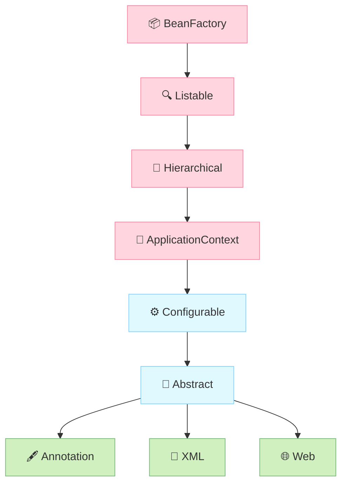
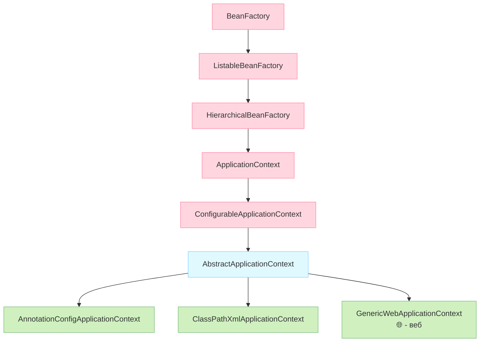

# Как `ApplicationContext` расширяет `BeanFactory` в _Spring_

---
ApplicationContext — это расширенная версия BeanFactory, которая добавляет множество enterprise-ориентированных функций. Рассмотрим ключевые дополнения:

## Упрощенная иерархия интерфейсов `ApplicationContext`


т.е. в кратце выглядит так:


## Полная иерархия интерфейсов `ApplicationContext`



<details>
        <summary>📝 пример: 🔽</summary>

---
#### описание

```java

``` 

---
</details>


<details>
        <summary>📝 Материал из методички 🔽</summary>


</details>

---
###### __

---

[🔙 _к списку вопросов по теме_ **Spring** 🔙](/ITM/ITM06_Spring/Spring.md)
