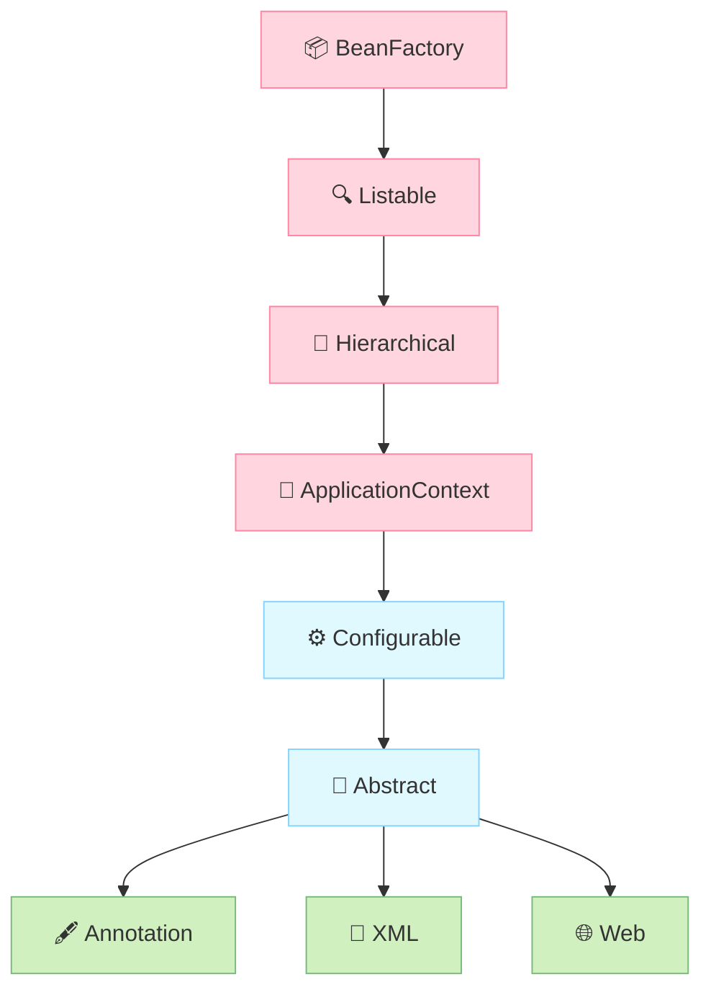
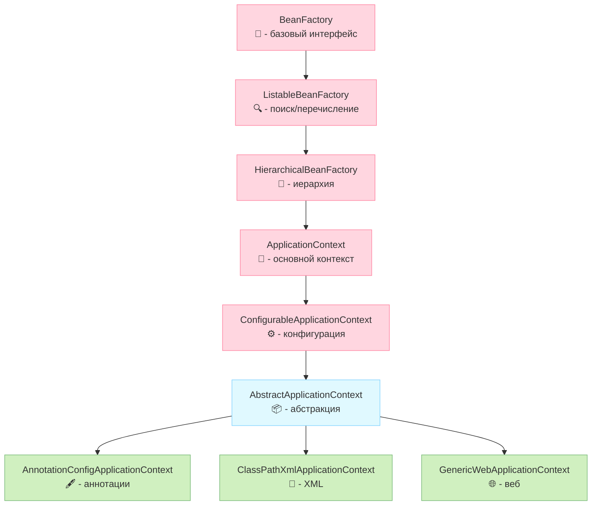

# Как `ApplicationContext` расширяет `BeanFactory` в _Spring_

---
`ApplicationContext` — это расширенная версия `BeanFactory`, 
которая добавляет множество _enterprise_-ориентированных функций. Рассмотрим ключевые дополнения:

## Упрощенная иерархия интерфейсов `ApplicationContext`


т.е. в кратце выглядит так:


---
## Ключевые дополнения `ApplicationContext`

<details>
        <summary>1. Упрощенная работа с конфигурацией 🔽</summary>

---
* **Автоматическое сканирование компонентов**  
Поддержка аннотаций (`@Component`, `@Service`, `@Repository`) через `@ComponentScan`.


* **Поддержка Java Config**  
Работа с `@Configuration` и `@Bean` **без** XML.


* **Импорт конфигураций**  
Возможность объединять конфиги через `@Import`.

---
</details>


<details>
        <summary>2. Управление жизненным циклом 🔽</summary>

---
* **Автоматическая регистрация `BeanPostProcessor` и `BeanFactoryPostProcessor`**  
В `BeanFactory` их нужно регистрировать вручную.


* **Автоматический вызов `@PostConstruct` и `@PreDestroy`**  
В `BeanFactory` эти аннотации не обрабатываются без дополнительной настройки.

---
</details>


<details>
        <summary>3. Интеграция с AOP 🔽</summary>

---
* **Автоматическое создание AOP-прокси**  
Для `@Transactional`, `@Cacheable` и других аспектов.

---
</details>


<details>
        <summary>4. Доступ к ресурсам и интернационализация 🔽</summary>

---
* Унифицированный API для ресурсов  
Методы `getResource()` для работы с файлами, URL, classpath:

```java
Resource resource = context.getResource("classpath:config.properties");
```


* **Интернационализация (_i18n_)**  
Поддержка MessageSource для локализованных сообщений:

```java
String msg = context.getMessage("greeting", null, Locale.ENGLISH);
```

---
</details>


<details>
        <summary>5. Событийная модель (Event Publishing) 🔽</summary>

---
* **Публикация и обработка событий**  
  Например, уведомления о старте/остановке контекста:

```java
// Публикация события
context.publishEvent(new MyCustomEvent());

// Обработчик
@EventListener
public void handleEvent(MyCustomEvent event) { ... }
```

---
</details>


<details>
        <summary>6. Интеграция с веб-средой 🔽</summary>

---
* **Поддержка веб-приложений**  
  Специальные реализации `WebApplicationContext` для:  

  * Доступа к `ServletContext`

  * Scope `request` и `session`

  * Загрузки ресурсов через `/WEB-INF`

---
</details>


<details>
        <summary>7. Профили и окружение 🔽</summary>

---
* **Управление профилями (`@Profile`)**  
  Активация бинов в зависимости от окружения:

```java
@Profile("prod")
@Service
public class ProdService { ... }
```

* **Доступ к переменным окружения**
  Через `Environment` API:

```java
String dbUrl = context.getEnvironment().getProperty("db.url");
```

---
</details>


---

### Сравнение BeanFactory и ApplicationContext
| Функция                        | BeanFactory | 	ApplicationContext |
|:-------------------------------|:-----------:|:-------------------:|
| Создание бинов                 |    ✅ Да     |        ✅ Да         |
| Внедрение зависимостей         |    	✅ Да    |        	✅ Да        |
| Аннотации (`@Autowired`)       |   	❌ Нет    |        	✅ Да        |
| `@PostConstruct`/`@PreDestroy` |   	❌ Нет    |        	✅ Да        |
| AOP                            |   	❌ Нет    |        	✅ Да        |
| Сканирование компонентов       |   	❌ Нет    |        	✅ Да        |
| Интернационализация            |   	❌ Нет    |        	✅ Да        |
| Публикация событий             |   	❌ Нет    |        	✅ Да        |
| Доступ к ресурсам              |   	❌ Нет    |        	✅ Да        |
| Веб-интеграция                 |   	❌ Нет    |        	✅ Да        |


<details>
        <summary>Когда использовать BeanFactory? 🔽</summary>

---
* **Для ограниченных сред** (микроконтроллеры, минимизация памяти).

* **Когда не нужны дополнительные функции** (AOP, события, i18n).

* **Пример создания**:

```java
DefaultListableBeanFactory factory = new DefaultListableBeanFactory();
XmlBeanDefinitionReader reader = new XmlBeanDefinitionReader(factory);
reader.loadBeanDefinitions(new ClassPathResource("beans.xml"));
MyBean bean = factory.getBean(MyBean.class);
```

---
</details>

---
`ApplicationContext` — это "продвинутая" версия `BeanFactory`, которая добавляет:
* **Удобные способы конфигурации** (аннотации, Java Config).
* **Enterprise-функции** (AOP, события, i18n).
* **Интеграцию с веб-средой**.
* **Автоматизацию** (регистрация `BeanPostProcessor`, обработка аннотаций).

---
## Полная иерархия интерфейсов `ApplicationContext`


---

[🔙 _к списку вопросов по теме_ **Spring** 🔙](/ITM/ITM06_Spring/Spring.md)
