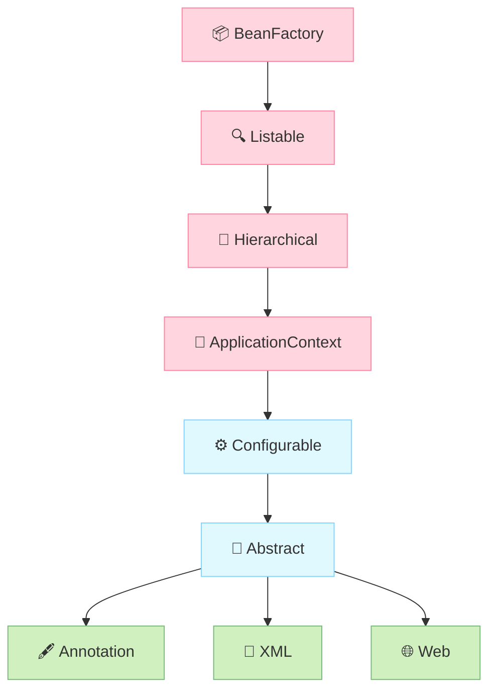
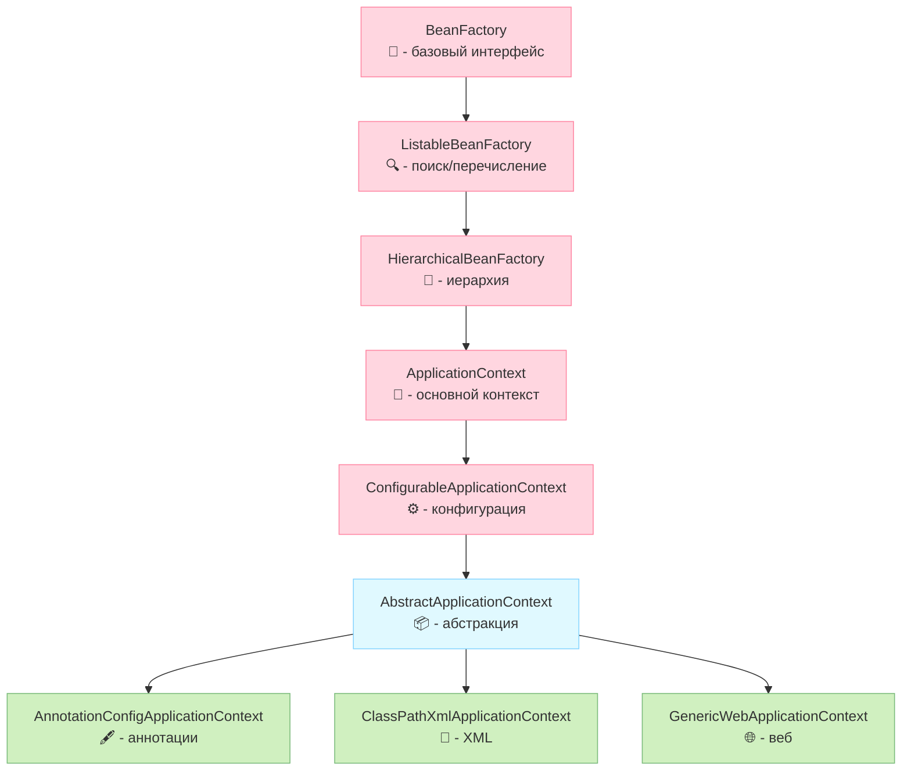

# Как `ApplicationContext` расширяет `BeanFactory` в _Spring_

---
ApplicationContext — это расширенная версия BeanFactory, которая добавляет множество enterprise-ориентированных функций. Рассмотрим ключевые дополнения:

## Упрощенная иерархия интерфейсов `ApplicationContext`

```mermaid
graph TD
    A[📦 BeanFactory] --> B[🔍 Listable]
    B --> C[🌳 Hierarchical]
    C --> D[🚀 ApplicationContext]
    D --> E[⚙️ Configurable]
    E --> F[📝 Abstract]
    F --> G[🖋️ Annotation]
    F --> H[📜 XML]
    F --> I[🌐 Web]
    
    classDef interface fill:#FFD6E0,stroke:#FF85A2;
    classDef abstract fill:#E0F9FF,stroke:#85D4FF;
    classDef impl fill:#D0F0C0,stroke:#7ABA7A;
    
    class A,B,C,D interface;
    class E,F abstract;
    class G,H,I impl;
```

т.е. в кратце выглядит так:

```mermaid
graph LR
    A[📦 Интерфейсы] --> B[📚 Абстрактные\nклассы] --> C[✨ Реализации]
    style A fill:#FFD6E0
    style B fill:#E0F9FF
    style C fill:#D0F0C0
```


## Полная иерархия интерфейсов `ApplicationContext`

```mermaid
graph TD
    A[BeanFactory<br>📜 - базовый интерфейс] --> B[ListableBeanFactory<br>🔍 - поиск/перечисление]
    B --> C[HierarchicalBeanFactory<br>🌳 - иерархия]
    C --> D[ApplicationContext<br>🚀 - основной контекст]
    D --> E[ConfigurableApplicationContext<br>⚙️ - конфигурация]
    E --> F[AbstractApplicationContext<br>📦 - абстракция]
    F --> G[AnnotationConfigApplicationContext<br>🖋️ - аннотации]
    F --> H[ClassPathXmlApplicationContext<br>📄 - XML]
    F --> I[GenericWebApplicationContext<br>🌐 - веб]
    
    classDef interface fill:#FFD6E0,stroke:#FF85A2;
    classDef abstract fill:#E0F9FF,stroke:#85D4FF;
    classDef impl fill:#D0F0C0,stroke:#7ABA7A;
    
    class A,B,C,D,E interface;
    class F abstract;
    class G,H,I impl;
```


<details>
        <summary>📝 пример: 🔽</summary>

---
#### описание

```java

``` 

---
</details>


<details>
        <summary>📝 Материал из методички 🔽</summary>


</details>

---
###### __

---

[🔙 _к списку вопросов по теме_ **Spring** 🔙](/ITM/ITM06_Spring/Spring.md)
